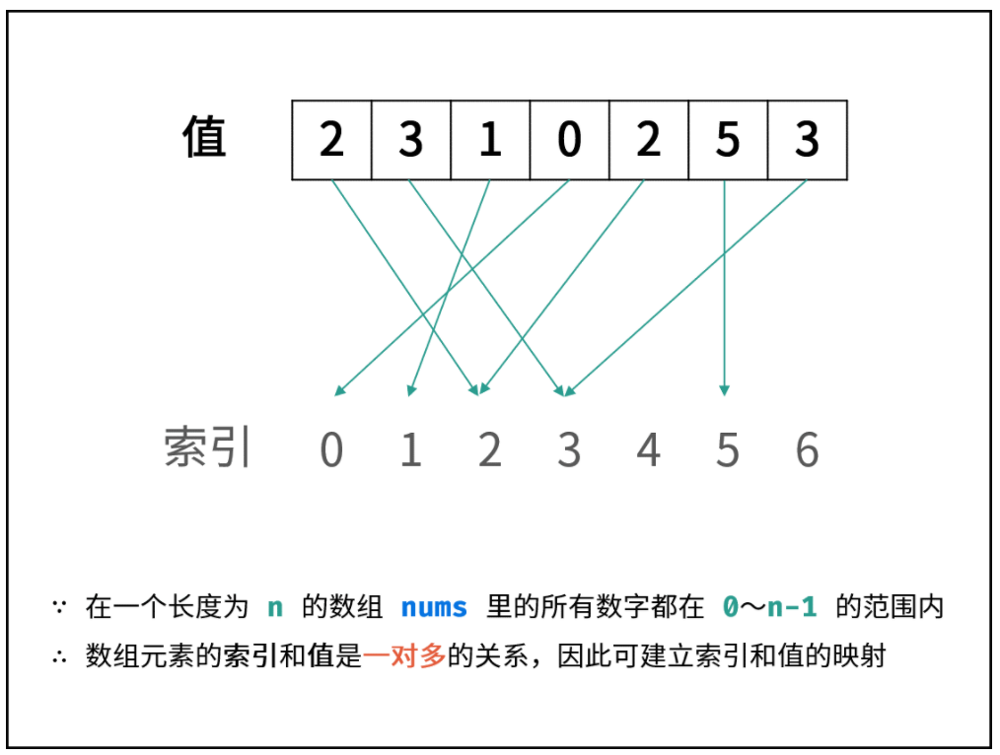
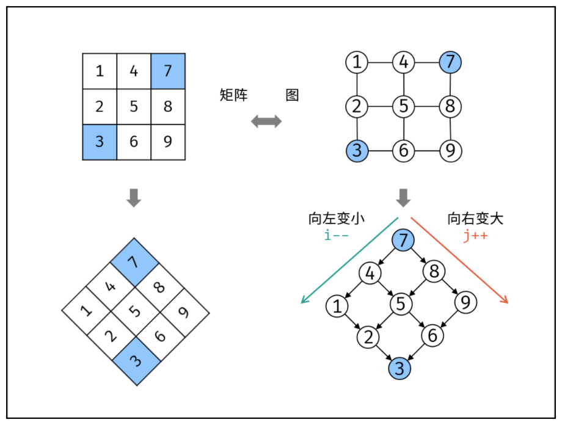

## 数组

### 1.利用题目

#### [剑指 Offer 03. 数组中重复的数字](https://leetcode-cn.com/problems/shu-zu-zhong-zhong-fu-de-shu-zi-lcof/)

> 题目说明尚未被充分使用，即 **在一个长度为 n 的数组 nums 里的所有数字都在 0 ~ n-1 的范围内 。**  此说明含义：数组元素的 **索引 和 值 是 一对多 的关系。**
> 因此，可遍历数组并通过交换操作，使元素的 索引 与 值 一一对应（即 nums[i]=i ）。因而，就能通过索引映射对应的值，起到与字典等价的作用。

<div align = center></div>

遍历中，第一次遇到数字 x 时，将其交换至索引 x 处；而当第二次遇到数字 x 时，一定有 nums[x] = x ，此时即可得到一组重复数字。

+ 算法流程：

  1. 遍历数组 nums ，设索引初始值为 i = 0 :
     + 若 nums[i] = i ： 说明此数字已在对应索引位置，无需交换，因此跳过；
     + 若 nums[nums[i]] = nums[i]： 代表索引 nums[i] 处和索引 i 处的元素值都为 nums[i] ，即找到一组重复值，返回此值 nums[i] ；
     + 否则： 交换索引为 i 和 nums[i] 的元素值，将此数字交换至对应索引位置。

  2. 若遍历完毕尚未返回，则返回 −1 。

+ 复杂度分析：

  + 时间复杂度 O(N) ： 遍历数组使用 O(N) ，每轮遍历的判断和交换操作使用 O(1) 。
  + 空间复杂度 O(1)： 使用常数复杂度的额外空间。

```c++
class Solution {
public:
    int duplicate(vector<int>& nums) {
        unsigned long i = 0;
        while(i < nums.size()) {
            if(nums[i] == i) {
                i++;
                continue;
            }
            if(nums[nums[i]] == nums[i])
                return nums[i];
            swap(nums[i],nums[nums[i]]);
        }
        return -1;
    }
};
```

#### [剑指 Offer 04. 二维数组中的查找](https://leetcode-cn.com/problems/er-wei-shu-zu-zhong-de-cha-zhao-lcof/)

> 在一个 n * m 的二维数组中，每一行都按照从左到右递增的顺序排序，每一列都按照从上到下递增的顺序排序。请完成一个高效的函数，输入这样的一个二维数组和一个整数，判断数组中是否含有该整数。
>

如下图所示，我们将矩阵逆时针旋转 45° ，并将其转化为图形式，发现其类似于 二叉搜索树 ，即对于每个元素，其左分支元素更小、右分支元素更大。因此，通过从 “根节点” 开始搜索，遇到比 target 大的元素就向左，反之向右，即可找到目标值 target 。

<div align = center></div>

“根节点” 对应的是矩阵的 “左下角” 和 “右上角” 元素，本文称之为 标志数 ，以 matrix 中的 左下角元素 为标志数 flag ，则有:

若 flag > target ，则 target 一定在 flag 所在 行的上方 ，即 flag 所在行可被消去。
若 flag < target ，则 target 一定在 flag 所在 列的右方 ，即 flag 所在列可被消去。

+ **算法流程**

  1. 从矩阵 matrix 左下角元素（索引设为 (i, j) ）开始遍历，并与目标值对比：
     + 当 matrix[i] [j] > target 时，执行 i-- ，即消去第 i 行元素；
     + 当 matrix[i] [j] < target 时，执行 j++ ，即消去第 j 列元素；
     + 当 matrix[i] [j] = target 时，返回 true ，代表找到目标值。
  2. 若行索引或列索引越界，则代表矩阵中无目标值，返回 false 。

  > 每轮 `i` 或 `j` 移动后，相当于生成了“消去一行（列）的新矩阵”， 索引`(i,j)` 指向新矩阵的左下角元素（标志数），因此可重复使用以上性质消去行（列）。

+ **复杂度分析：**

  + 时间复杂度 O(M+N) ：其中，N 和 M 分别为矩阵行数和列数，此算法最多循环 M+N 次。
  + 空间复杂度 O(1) : i, j 指针使用常数大小额外空间。

```c++
class Solution {
public:
    bool Find(int target, vector<vector<int> > array) {
        if(array.empty() || array[0].empty())
            return false;
        int row = 0;
        int line = array[0].size() - 1;
        while(row < array.size() && line >= 0) {
            if(target < array[row][line])
                --line;
            else if(target > array[row][line])
                ++row;
            else if(target == array[row][line])
                return true;
        }
        return false;
    }
};
```

### 2.双指针

> 其余见双指针专题

#### [27. 移除元素](https://leetcode-cn.com/problems/remove-element/)

> 使用双指针，左指针指向当前已经处理好的序列的尾部，右指针指向待处理序列的头部。右指针不断向右移动，每次右指针指向非val数，则将左右指针对应的数交换，同时左指针右移。(这样就把val自然而然的向后面移动了)
>
> 注意到以下性质：
>
> [0,left)为非val数，
>
> [left,right]为val。
>
> 因此每次交换，都是将左指针的零与右指针的非val数交换，且非val数的相对顺序并未改变。

```c++
class Solution {
public:
    int removeElement(vector<int>& nums, int val) {
        int n = nums.size();
        int left = 0;
        int right = 0;
        while(right < n) {
          	//如果right指向的不为val,交换
            if(nums[right] != val) {
                swap(nums[right], nums[left]);
                ++ left;
            }
          	//如果指向的是val，则向后迭代
            ++ right;
        }
        return left ;
    }
};
```

> [283. 移动零](https://leetcode-cn.com/problems/move-zeroes/)只需要把val改成0即可

#### [977. 有序数组的平方](https://leetcode-cn.com/problems/squares-of-a-sorted-array/)

> 数组其实是有序的， 只不过负数平方之后可能成为最大数了。
>
> 那么数组平方的最大值就在数组的两端，不是最左边就是最右边，不可能是中间。
>
> 此时可以考虑双指针法了，i指向起始位置，j指向终止位置。
>
> 定义一个新数组result，和A数组一样的大小，让k指向result数组终止位置。

```c++
class Solution {
public:
    vector<int> sortedSquares(vector<int>& nums) {
        int size = nums.size() -1;
        vector<int> result(nums.size(), 0);
        int i = 0 , j = nums.size() - 1;
        while(j >= i) {
            if(nums[j] * nums[j] > nums[i] * nums[i]) {
                result[size --] =  nums[j] * nums[j];
                --j;
            } else {
                result[size --] =  nums[i] * nums[i];
                ++ i;
            }
        }
        return result;
    }
};
```


### 3.数学分析

#### [56. 合并区间](https://leetcode-cn.com/problems/merge-intervals/)

```c++
class Solution {
public:
    vector<vector<int>> merge(vector<vector<int>>& intervals) {
        vector<vector<int>> merge;
        if(intervals.empty())
            return merge;
        //用区间第一个数进行排序
        sort(intervals.begin(), intervals.end());
        for(int i = 0; i < intervals.size(); ++i) {
            int left = intervals[i][0], right = intervals[i][1];
            //如果merge不为空，或者集合中最后一个元素的右元素小于待导入的左元素
            if(!merge.size() || merge.back()[1] < left) {
                merge.push_back({left,right});
            } else { //如果最后一个元素的右元素大于待导入左元素，则把右元素与待导入的右元素进行比较，替换
                merge.back()[1] = max(right,  merge.back()[1]);
            }
        }
        return merge;
    }
};
```


#### [剑指 Offer 29. 顺时针打印矩阵](https://leetcode-cn.com/problems/shun-shi-zhen-da-yin-ju-zhen-lcof/)

> 有关图形转换，这也是一道数学推导题
>
> 设置left,right,top,bottom四个变量，在遍历过程中查看四个变量的变换过程。

```c++
class Solution {
public:
    vector<int> spiralOrder(vector<vector<int>>& matrix) {
        vector<int> result {};
        if(matrix.empty()) return result;
        int left = 0;
        int right = matrix[0].size() - 1;
        int top = 0;
        int bottom = matrix.size() - 1;
        int sum = matrix.size() * matrix[0].size();
        while(sum > 0) {
            //导出最上面一行
            for(int i = left; i <= right && sum > 0; ++i) {
                result.push_back(matrix[top][i]);
                -- sum;
            }
            ++ top;
            //导出最右边一行
            for(int i = top; i <= bottom && sum > 0; ++i) {
                result.push_back(matrix[i][right]);
                -- sum;
            }
            -- right;
            //导出最下面一行
            for(int i = right; i >= left && sum > 0; --i) {
                result.push_back(matrix[bottom][i]);
                -- sum;
            }
            -- bottom;
            //导出最上面一行
            for(int i = bottom; i >= top && sum > 0; --i) {
                result.push_back(matrix[i][left]);
                -- sum;
            }
            ++ left;
        }
        return result;
    }
};
```

#### [48. 旋转图像](https://leetcode-cn.com/problems/rotate-image/)

> **有关数学推导**
>
> 可以看出需要移动四个方位的内容：
>
> int temp = matrix [ i ] [ j ];
> matrix [ i ] [ j ]  = matrix [ n - j - 1 ] [ i ];
> matrix[ n - j - 1 ] [ i ] = matrix[ n - i - 1 ] [ n - j - 1 ];
> matrix[ n - i - 1 ] [ n - j - 1 ] = matrix[ j ] [ n - i - 1 ];
> matrix[ j ] [ n - i - 1 ] = temp;

```c++
class Solution {
public:
    void rotate(vector<vector<int>>& matrix) {
        int n = matrix.size();
        for(int i = 0; i < n/2; ++i) {
            for(int j = 0; j < (n+1)/2; ++j) {
                int temp = matrix[i][j];
                matrix[i][j] = matrix[n - j - 1][i];
                matrix[n - j - 1][i] = matrix[n - i - 1][n - j - 1];
                matrix[n - i - 1][n - j - 1] = matrix[j][n - i - 1];
                matrix[j][n - i - 1] = temp;
            }
        }
    }
};
```

