# 回溯算法

## 一.回溯法概要

### 1.算法介绍

**回溯法（back tracking）**（探索与回溯法）是一种选优搜索法，又称为试探法，按选优条件向前搜索，以达到目标。但当探索到某一步时，发现原先选择并不优或达不到目标，就退回一步重新选择，这种走不通就退回再走的技术为回溯法，而满足回溯条件的某个状态的点称为“回溯点”。

> 白话：回溯法可以理解为通过选择不同的岔路口寻找目的地，一个岔路口一个岔路口的去尝试找到目的地。如果走错了路，继续返回来找到岔路口的另一条路，直到找到目的地。

**「回溯法解决的问题都可以抽象为树形结构」**，回溯法解决的都是在集合中递归查找子集，**「集合的大小就构成了树的宽度，递归的深度，都构成的树的深度」**。

递归就要有终止条件，所以必然是一颗高度有限的树（N叉树）。

### 2.算法效率

回溯法的性能如何呢，这里要和大家说清楚了，**「虽然回溯法很难，很不好理解，但是回溯法并不是什么高效的算法」**。

**「因为回溯的本质是穷举，穷举所有可能，然后选出我们想要的答案」**，如果想让回溯法高效一些，可以加一些剪枝的操作，但也改不了回溯法就是穷举的本质。

### 3.解决问题

回溯法，一般可以解决如下几种问题：

- 组合问题：N个数里面按一定规则找出k个数的集合
- 排列问题：N个数按一定规则全排列，有几种排列方式
- 切割问题：一个字符串按一定规则有几种切割方式
- 子集问题：一个N个数的集合里有多少符合条件的子集
- 棋盘问题：N皇后，解数独等等

## 二.算法框架

### 1.回溯三部曲

#### 回溯函数模板返回值以及参数

+ 在回溯算法中习惯是函数起名字为backtracking。
+ 回溯算法中函数返回值一般为void。

+ 再来看一下参数，因为回溯算法需要的参数可不像二叉树递归的时候那么容易一次性确定下来，所以一般是先写逻辑，然后需要什么参数，就填什么参数。

回溯函数伪代码如下：

```c++
void backtracking(参数) 
```

####回溯函数终止条件 

+ 既然是树形结构，那么在讲解二叉树的递归的时候，就知道遍历树形结构一定要有终止条件。所以回溯也有要终止条件。

+ 什么时候达到了终止条件，树中就可以看出，一般来说搜到叶子节点了，也就找到了满足条件的一条答案，把这个答案存放起来，并结束本层递归。

所以回溯函数终止条件伪代码如下：

```c++
if (终止条件) {
    存放结果;
    return;
}
```

####  回溯搜索的遍历过程

在上面提到了，回溯法一般是在集合中递归搜索，集合的大小构成了树的宽度，递归的深度构成的树的深度。

<div align = center>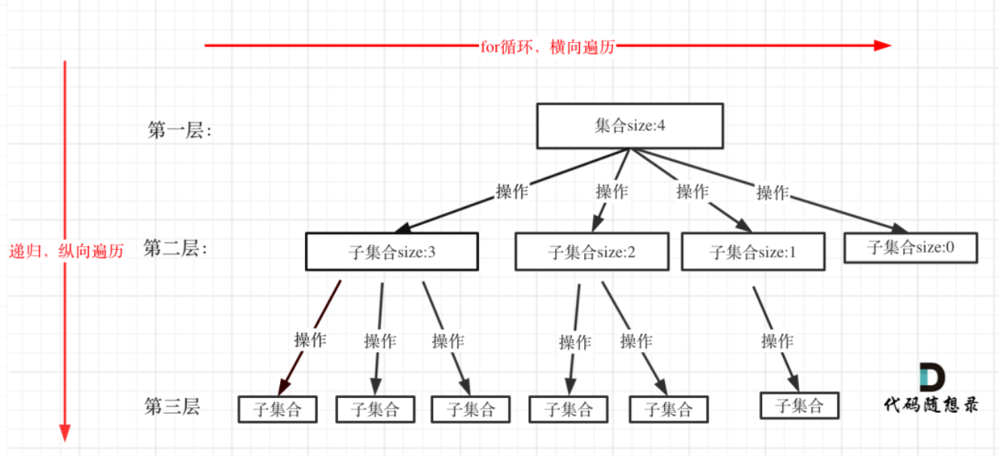</div>

注意图中，举例集合大小和孩子的数量是相等的！回溯函数遍历过程伪代码如下：

```c++
for (选择：本层集合中元素(树中节点孩子的数量就是集合的大小)) {
    处理节点;
    backtracking(路径，选择列表); // 递归
    回溯，撤销处理结果
}
```

+ **for循环就是遍历集合区间，可以理解一个节点有多少个孩子，这个for循环就执行多少次。**

+ **backtracking这里自己调用自己，实现递归。**

大家可以从图中看出**「for循环可以理解是横向遍历，backtracking（递归）就是纵向遍历」**，这样就把这棵树全遍历完了，一般来说，搜索叶子节点就是找的其中一个结果了。

分析完过程，回溯算法模板框架如下：

```c++
void backtracking(参数) {
    if (终止条件) {
        存放结果;
        return;
    }

    for (选择：本层集合中元素（树中节点孩子的数量就是集合的大小）) {
        处理节点;
        backtracking(路径，选择列表); // 递归
        回溯，撤销处理结果
    }
}
```

**「这份模板很重要，后面做回溯法的题目都靠它了！」**


## 三.刷题积累

### 1.组合(77)

> 给定两个整数 n 和 k，返回 1 ... n 中所有可能的 k 个数的组合。

+ **示例：**

  <div align = center>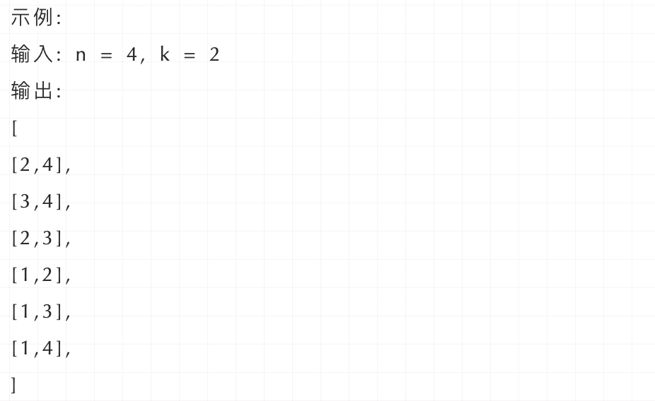</div>

+ **思路：**

  + **「在关于算法框架中说道回溯法解决的问题都可以抽象为树形结构（N叉树），用树形结构来理解回溯就容易多了」**。

  + 把组合问题抽象为如下树形结构：

    <div align = center>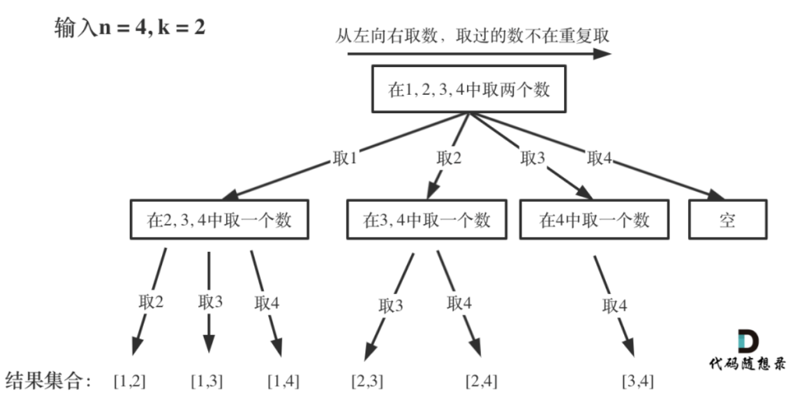</div>

    + 可以看出这个棵树，一开始集合是 1，2，3，4， 从左向右取数，取过的数，不在重复取。
    + **「每次从集合中选取元素，可选择的范围随着选择的进行而收缩，调整可选择的范围」**。
    + **「图中可以发现n相当于树的宽度，k相当于树的深度」**。

  + 那么如何在这个树上遍历，然后收集到我们要的结果集呢？

    + **「图中每次搜索到了叶子节点，我们就找到了一个结果」**。相当于只需要把达到叶子节点的结果收集起来，就可以求得 n个数中k个数的组合集合。

+ **回溯三部曲：**

  + **递归函数的返回值以及参数**

    + 在这里要定义两个全局变量，一个用来存放符合条件单一结果，一个用来存放符合条件结果的集合。

      ```c++
      vector<vector<int>> result; // 存放符合条件结果的集合
      vector<int> path; // 用来存放符合条件结果
      ```

    + 函数里一定有两个参数，既然是集合n里面取k的数，那么n和k是两个int型的参数。然后还需要一个参数，为int型变量startIndex，这个参数用来记录本层递归的中，集合从哪里开始遍历（集合就是[1,...,n] ）。

    + 为什么要有这个startIndex呢？**「每次从集合中选取元素，可选择的范围随着选择的进行而收缩，调整可选择的范围，就是要靠startIndex」**。从下图中红线部分可以看出，在集合[1,2,3,4]取1之后，下一层递归，就要在[2,3,4]中取数了，那么下一层递归如何知道从[2,3,4]中取数呢，靠的就是startIndex。

      <div align = center>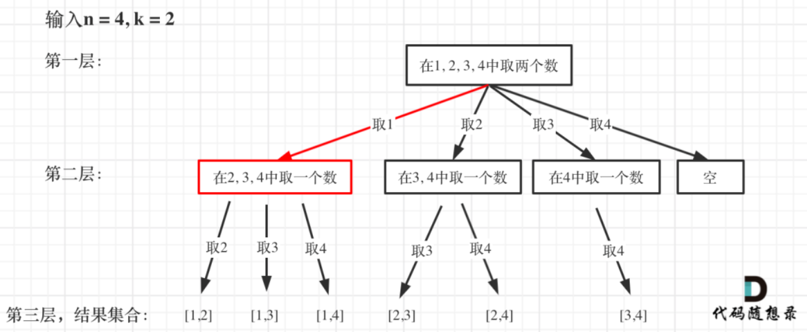</div>

    + 所以需要startIndex来记录下一层递归，搜索的起始位置。

      ```c++
      vector<vector<int>> result; // 存放符合条件结果的集合
      vector<int> path; // 用来存放符合条件单一结果
      void backtracking(int n, int k, int startIndex) 
      ```

  + **回溯函数终止条件**

    + path这个数组的大小如果达到k，说明我们找到了一个子集大小为k的组合了，在图中path存的就是根节点到叶子节点的路径。

      <div align = center>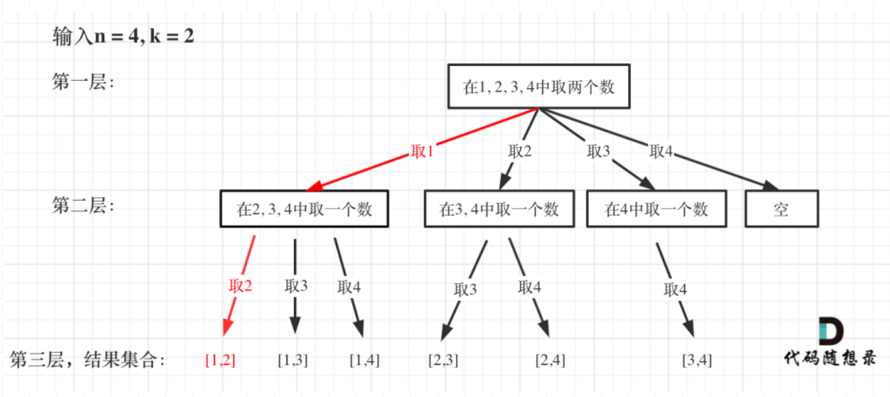</div>

    + 此时用result二维数组，把path保存起来，并终止本层递归。

      ```c++
      if (path.size() == k) {
          result.push_back(path);
          return;
      }
      ```

  + **单层搜索的过程**

    + 回溯法的搜索过程就是一个树型结构的遍历过程，在如下图中，可以看出for循环用来横向遍历，递归的过程是纵向遍历。

      <div align = center>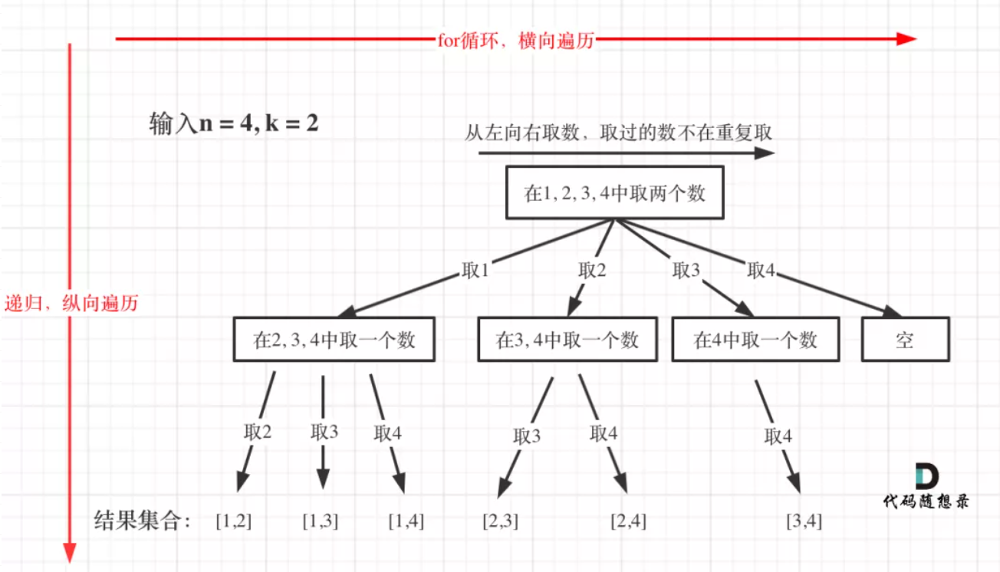</div>

    + 如此才遍历完图中的这棵树。for循环每次从startIndex开始遍历，然后用path保存取到的节点i。

      ```c++
      for (int i = startIndex; i <= n; i++) { // 控制树的横向遍历
          path.push_back(i); // 处理节点 
          backtracking(n, k, i + 1); // 递归：控制树的纵向遍历，注意下一层搜索要从i+1开始
          path.pop_back(); // 回溯，撤销处理的节点
      }
      ```

    + 可以看出backtracking（递归函数）通过不断调用自己一直往深处遍历，总会遇到叶子节点，遇到了叶子节点就要返回。backtracking的下面部分就是回溯的操作了，撤销本次处理的结果。

+ **代码实现：**

  ```c++
  class Solution {
  private:
      vector<vector<int>> result; // 存放符合条件结果的集合
      vector<int> path; // 用来存放符合条件结果
      void backtracking(int n, int k, int startIndex) {
          if (path.size() == k) {
              result.push_back(path);
              return;
          }
          for (int i = startIndex; i <= n; i++) {
              path.push_back(i); // 处理节点 
              backtracking(n, k, i + 1); // 递归
              path.pop_back(); // 回溯，撤销处理的节点
          }
      }
  public:
      vector<vector<int>> combine(int n, int k) {
          result.clear(); // 可以不写
          path.clear();   // 可以不写
          backtracking(n, k, 1);
          return result;
      }
  };
  ```

#### 剪枝优化

回溯法虽然是暴力搜索，但也有时候可以有点剪枝优化一下的。

在遍历的过程中有如下代码：

```c++
for (int i = startIndex; i <= n; i++) { 
    path.push_back(i); 
    backtracking(n, k, i + 1); 
    path.pop_back(); 
}
```

这个遍历的范围是可以剪枝优化的，怎么优化呢？来举一个例子，n = 4，k = 4的话，那么第一层for循环的时候，从元素2开始的遍历都没有意义了。在第二层for循环，从元素3开始的遍历都没有意义了。

<div align = center>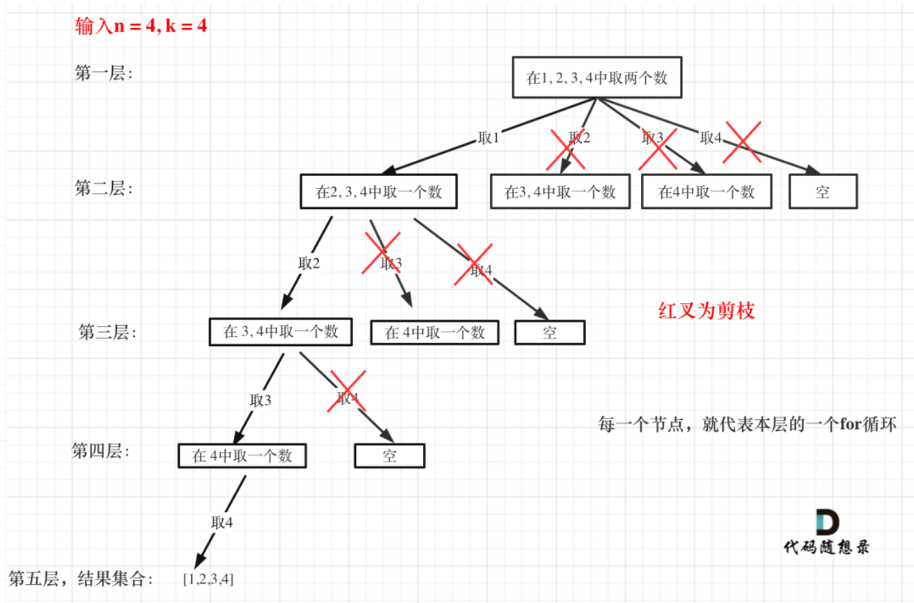</div>

图中每一个节点（图中为矩形），就代表本层的一个for循环，那么每一层的for循环从第二个数开始遍历的话，都没有意义，都是无效遍历。

**「所以，可以剪枝的地方就在递归中每一层的for循环所选择的起始位置」**。

**「如果for循环选择的起始位置之后的元素个数 已经不足 我们需要的元素个数了，那么就没有必要搜索了」**。

接下来看一下优化过程如下：

1. **已经选择的元素个数：path.size();**
2. **还需要的元素个数为: k - path.size();**
3. **在集合n中至多要从该起始位置 : n - (k - path.size()) + 1，开始遍历**

为什么有个+1呢，因为包括起始位置，我们要是一个左闭的集合。

举个例子，n = 4，k = 3， 目前已经选取的元素为0（path.size为0），n - (k - 0) + 1 即 4 - ( 3 - 0) + 1 = 2。从2开始搜索都是合理的，可以是组合[2, 3, 4]。

所以优化之后的for循环是：

```c++
for (int i = startIndex; i <= n - (k - path.size()) + 1; i++) // i为本次搜索的起始位置
```

### 2.电话号码的字母组合(17)

> 给定一个仅包含数字 2-9 的字符串，返回所有它能表示的字母组合。
>
> 给出数字到字母的映射如下（与电话按键相同）。注意 1 不对应任何字母。

+ **示例：**

  <div align = center>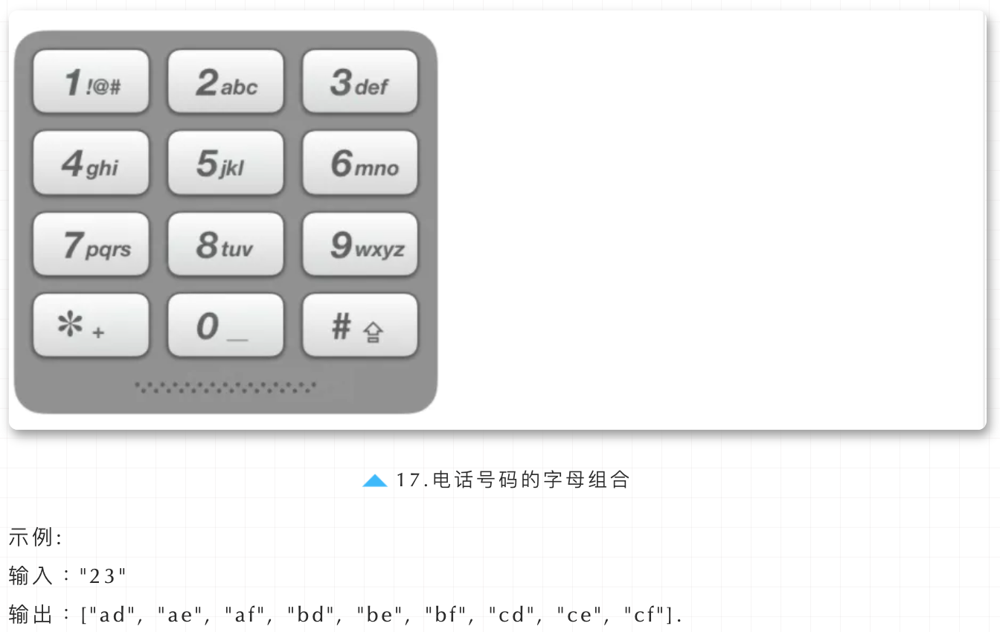</div>

+ **思路：**

  + 理解本题后，要解决如下三个问题：

    1. 数字和字母如何映射
    2. 两个字母就两个for循环，三个字符我就三个for循环，以此类推，然后发现代码根本写不出来
    3. 输入1 * #按键等等异常情况

  + 对于问题1，可以使用map或者定义一个二位数组，例如：string letterMap[10]，来做映射，我这里定义一个二维数组

    ```c++
    const string letterMap[10] = {
        "", // 0
        "", // 1
        "abc", // 2
        "def", // 3
        "ghi", // 4
        "jkl", // 5
        "mno", // 6
        "pqrs", // 7
        "tuv", // 8
        "wxyz", // 9
    };
    ```

  + 对于问题2，用 回溯法来解决n个for循环的问题。

    <div align = center>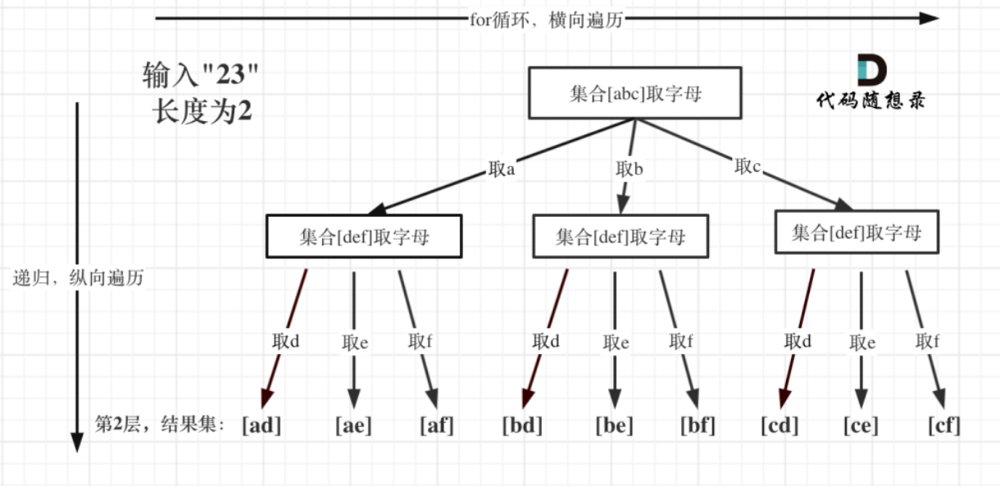</div>

  + 对于问题3，映射确保了输入0,1为空

+ **回溯三部曲：**

  + **确定回溯函数参数**
    + 首先需要一个字符串s来收集叶子节点的结果，然后用一个字符串数组result保存起来，这两个变量定义为全局。
    + 再来看参数，参数指定是有题目中给的string digits，然后还要有一个参数就是int型的index。
    + 注意这个index可不是 回溯算法：求组合问题！ 和 回溯算法：求组合总和！中的startIndex了。 **这个index是记录遍历第几个数字了，就是用来遍历digits的（题目中给出数字字符串），同时index也表示树的深度。**
  + **确定终止条件**
    + 例如输入用例"23"，两个数字，那么根节点往下递归两层就可以了，叶子节点就是要收集的结果集。那么终止条件就是如果index 等于 输入的数字个数（digits.size）了（本来index就是用来遍历digits的）。
    + 然后收集结果，结束本层递归。
  + **确定单层遍历逻辑**
    + 首先要取index指向的数字，并找到对应的字符集（手机键盘的字符集）。
    + 然后for循环来处理这个字符集。

+ **代码实现：**

  ```c++
  class Solution {
  private:
      const string letterMap[10] = {
          "", // 0
          "", // 1
          "abc", // 2
          "def", // 3
          "ghi", // 4
          "jkl", // 5
          "mno", // 6
          "pqrs", // 7
          "tuv", // 8
          "wxyz", // 9
      };
  public:
      vector<string> result;
      string s;
      void backtracking(const string& digits, int index) {
          if (index == digits.size()) {
              result.push_back(s);
              return;
          }
          int digit = digits[index] - '0';        // 将index指向的数字转为int
          string letters = letterMap[digit];      // 取数字对应的字符集
          for (int i = 0; i < letters.size(); i++) {
              s.push_back(letters[i]);            // 处理
              backtracking(digits, index + 1);    // 递归，注意index+1，一下层要处理下一个数字了
              s.pop_back();                       // 回溯
          }
      }
      vector<string> letterCombinations(string digits) {
          s.clear();
          result.clear();
          if (digits.size() == 0) {
              return result;
          }
          backtracking(digits, 0);
          return result;
      }
  };
  ```

### 3.组合总和III(216)

> 找出所有相加之和为 n 的 k 个数的组合。组合中只允许含有 1 - 9 的正整数，并且每种组合中不存在重复的数字。
>
> 说明：
>
> - 所有数字都是正整数。
> - 解集不能包含重复的组合。

+ **示例：**

  <div align = center>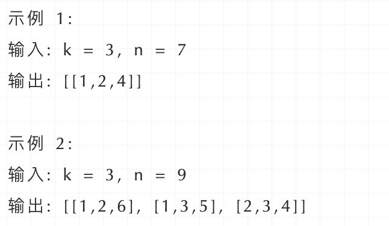</div>

+ **思路：**

  + 本题就是在[1,2,3,4,5,6,7,8,9]这个集合中找到和为n的k个数的组合。
  + 相对于 求组合问题！ ，无非就是多了一个限制，本题是要找到和为n的k个数的组合，而整个集合已经是固定的了[1,...,9]。
  + 本题k相当于了树的深度，9（因为整个集合就是9个数）就是树的宽度。

  <div align = center>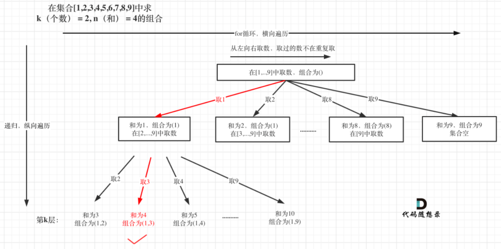</div>

+ **回溯三部曲：**

  + **「确定递归函数参数」**

    + 和 回溯算法：求组合问题！一样，依然需要一维数组path来存放符合条件的结果，二维数组result来存放结果集，定义sum存储求和结果。

    ```c++
    int sum;
    vector<int> path;
    vector<vector<int>> result;
    void backtracking(int k, int n, int startIndex)
    ```

  + **确定终止条件**

    + k其实就已经限制树的深度，因为就取k个元素，树再往下深了没有意义。所以如果path.size() 和 k相等了，就终止。
    + 如果此时path里收集到的元素和（sum） 和 n 相同了，就用result收集当前的结果

    ```c++
    if(path.size() == k) {
    		if(sum == n)
    				result.push_back(path);
    		return;
    }
    ```

  + **「单层搜索过程」**

    + 本题和 求组合问题！ 区别之一就是集合固定的就是9个数[1,...,9]，所以for循环固定i<=9

    <div align = center>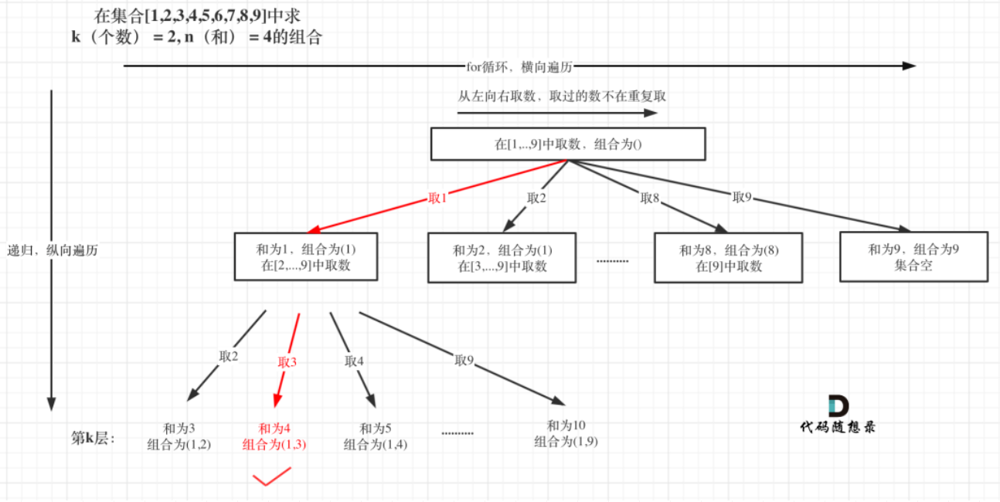</div>

    + 处理过程就是 path收集每次选取的元素，相当于树型结构里的边，sum来统计path里元素的总和。

    ```c++
    for(int i = startIndex; i <= 9; ++i) {
    		sum += i;
    		path.push_back(i);
    		backtracking(k, n, i + 1);
    		path.pop_back();
    		sum -= i;
    }
    ```

+ **代码实现：**

  ```c++
  class Solution {
  private:
      int sum;
      vector<int> path;
      vector<vector<int>> result;
      void backtracking(int k, int n, int startIndex) {
          //回溯结束条件
          if(path.size() == k) {
              if(sum == n)
                  result.push_back(path);
              return;
          }
          for(int i = startIndex; i <= 9; ++i) {
              sum += i;
              path.push_back(i);
              backtracking(k, n, i + 1);
              path.pop_back();
              sum -= i;
          }
      }
  public:
      vector<vector<int>> combinationSum3(int k, int n) {
          path.clear();
          result.clear();
          sum = 0;
          backtracking(k, n, 1);
          return result;
      }
  };
  ```

### 4.组合总和(39)

> 给定一个无重复元素的数组 candidates 和一个目标数 target ，找出 candidates 中所有可以使数字和为 target 的组合。
>
> candidates 中的数字可以无限制重复被选取。
>
> 说明：
>
> - 所有数字（包括 target）都是正整数。
> - 解集不能包含重复的组合。

+ **示例：**

  <div align = center>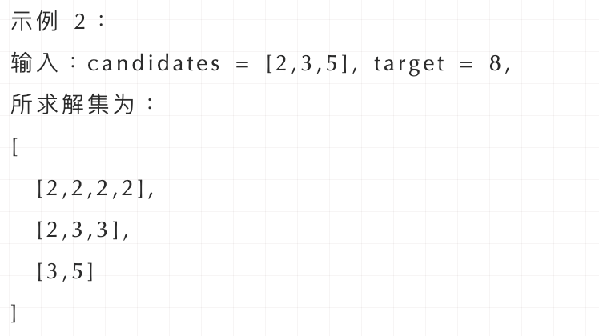</div>

+ **思路：**

  + 本题和 求组合问题！ ，回溯算法：求组合总和！区别是：本题没有数量要求，可以无限重复，但是有总和的限制，所以间接的也是有个数的限制。

    <div align = center>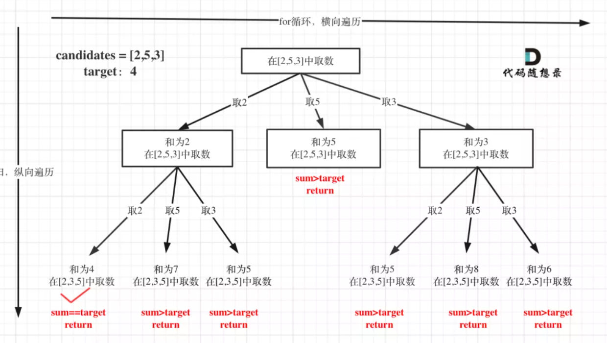</div>

  + 注意图中叶子节点的返回条件，因为本题没有组合数量要求，仅仅是总和的限制，所以递归没有层数的限制，只要选取的元素总和超过target，就返回！

+ **回溯三部曲：**

  + **递归函数参数**

    + 这里依然是定义三个全局变量，二维数组result存放结果集，数组path存放符合条件的结果，sum存放求和结果。

    ```c++
    vector<vector<int>> result;
    vector<int> path;
    int sum;
    void backtracking(vector<int>& candidates, int target, int startIndex);
    ```

    + **「本题还需要startIndex来控制for循环的起始位置，对于组合问题，什么时候需要startIndex呢？」**
    + 如果是一个集合来求组合的话，就需要startIndex，例如：求组合问题！，回溯算法：求组合总和！。
    + 如果是多个集合取组合，各个集合之间相互不影响，那么就不用startIndex，例如：电话号码的字母组合

  + **递归终止条件**

    <div align = center>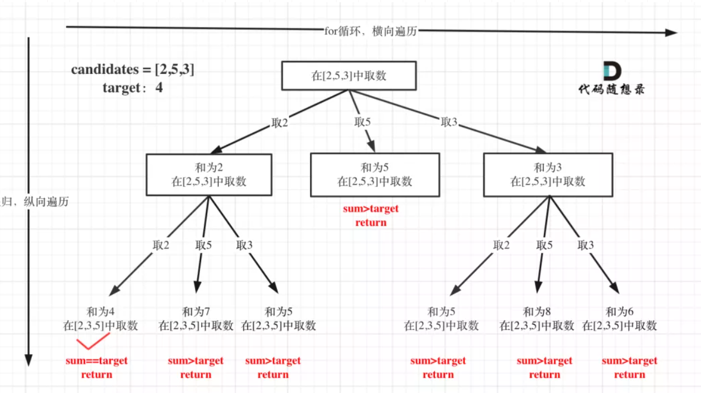</div>

    + 从叶子节点可以清晰看到，终止只有两种情况，sum大于target和sum等于target。

    ```c++
    if(sum == target) {
    		result.push_back(path);
    		return;
    }
    if(sum > target) 
    		return;
    ```

  + 单层搜索的逻辑

    + 单层for循环依然是从startIndex开始，搜索candidates集合。
    + 如何重复选取呢，看代码，注释部分：

    ```c++
    for (int i = startIndex; i < candidates.size(); i++) {
        sum += candidates[i];
        path.push_back(candidates[i]);
        backtracking(candidates, target, sum, i); // 关键点:不用i+1了，表示可以重复读取当前的数
        sum -= candidates[i];   // 回溯
        path.pop_back();        // 回溯
    }
    ```

+ **代码实现：**

  ```c++
  class Solution {
  private:
      vector<vector<int>> result;
      vector<int> path;
      int sum;
      void backtracking(vector<int>& candidates, int target, int startIndex) {
          if(sum == target) {
              result.push_back(path);
              return;
          } else if(sum > target) 
              return;
          for(int i = startIndex; i < candidates.size(); ++i) {
              path.push_back(candidates[i]);
              sum += candidates[i];
              backtracking(candidates, target, i);
              sum -= candidates[i];
              path.pop_back();
          }
      }
  public:
      vector<vector<int>> combinationSum(vector<int>& candidates, int target) {
          result.clear();
          path.clear();
          sum = 0;
          backtracking(candidates, target , 0);
          return result;
      }
  };
  ```


### .全排列问题

> **题目描述：**
>
> 无重复字符串的排列组合。编写一种方法，计算某字符串的所有排列组合，字符串每个字符均不相同。

**解题思路：**

从0下标开始，依次与自身和后面的元素交换，相当于当前位置因为交换已经固定了，接下来就去对后面元素进行全排列。之后，再回溯到当前位置元素不变。

<div align = center></div>

```c++
class Solution {
public:
    vector<string> permutation(string S) {
        int len = S.size();
        vector<string> ans;
        dsf(ans, S, 0, len);
        return ans;
    }

    void dsf(vector<string>& ans, string& S, int begin, int end) {
        if(begin == end) {
            ans.push_back(S);
            return;
        }
        for(int i = begin; i < end; ++ i) {
            swap(S[i], S[begin]);
            dsf(ans, S, begin + 1, end);
            swap(S[i], S[begin]);
        }
    }
};
```


### .有重复的全排列

> **题目描述：**
>
> [面试题 08.08. 有重复字符串的排列组合](https://leetcode-cn.com/problems/permutation-ii-lcci/)
>
> 有重复字符串的排列组合。编写一种方法，计算某字符串的所有排列组合。

这个方法不好。

```c++
class Solution {
public:
    vector<string> permutation(string S) {
        int begin = 0;
        int end = S.size();
        vector<string> ans;
        dsf(ans, S, begin, end);
        return ans;
    }
    void dsf(vector<string>& ans, string S, int begin, int end) {
        if(begin == end) {
            if(find(ans.begin(),ans.end(),S) == ans.end())
                ans.push_back(S);
            return;
        }
        for(int i = begin; i < end; ++i) {
                swap(S[i], S[begin]);
                dsf(ans, S, begin + 1, end);
                swap(S[i], S[begin]);
        }
    }
};
```


### .幂集问题

> **题目描述：**
>
> 幂集。编写一种方法，返回某集合的所有子集。集合中**不包含重复的元素**。
>
> [多种方法](https://leetcode-cn.com/problems/power-set-lcci/solution/hui-su-wei-yun-suan-deng-gong-4chong-fang-shi-jie-/)

```c++
class Solution {
public:
    vector<vector<int>> subsets(vector<int>& nums) {
        vector<vector<int>> ret;
        vector<int> tmp;
        dfs(nums, 0, tmp, ret);
        return ret;
    }
    void dfs(vector<int>& nums, int index, vector<int>& tmp,vector<vector<int>>& ret) {
        if (index >= nums.size()) {
            ret.push_back(tmp);
            return;
        }
        // 不选择
        dfs(nums, index + 1, tmp, ret);
        // 选择
        tmp.push_back(nums[index]);
        dfs(nums, index + 1, tmp, ret);
        // 去除选择
        tmp.pop_back();
    }
};
```

