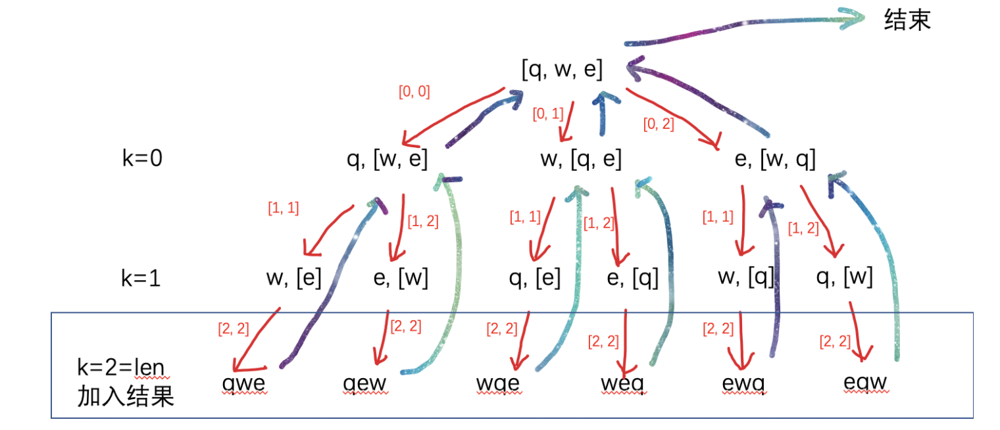

# 回溯算法

## 一.算法介绍


##二.解决思路


## 三.刷题积累

### 1.全排列问题

> **题目描述：**
>
> 无重复字符串的排列组合。编写一种方法，计算某字符串的所有排列组合，字符串每个字符均不相同。

**解题思路：**

从0下标开始，依次与自身和后面的元素交换，相当于当前位置因为交换已经固定了，接下来就去对后面元素进行全排列。之后，再回溯到当前位置元素不变。



```c++
class Solution {
public:
    vector<string> permutation(string S) {
        int len = S.size();
        vector<string> ans;
        dsf(ans, S, 0, len);
        return ans;
    }

    void dsf(vector<string>& ans, string& S, int begin, int end) {
        if(begin == end) {
            ans.push_back(S);
            return;
        }
        for(int i = begin; i < end; ++ i) {
            swap(S[i], S[begin]);
            dsf(ans, S, begin + 1, end);
            swap(S[i], S[begin]);
        }
    }
};
```


### 2.有重复的全排列

> **题目描述：**
>
> [面试题 08.08. 有重复字符串的排列组合](https://leetcode-cn.com/problems/permutation-ii-lcci/)
>
> 有重复字符串的排列组合。编写一种方法，计算某字符串的所有排列组合。

这个方法不好。

```c++
class Solution {
public:
    vector<string> permutation(string S) {
        int begin = 0;
        int end = S.size();
        vector<string> ans;
        dsf(ans, S, begin, end);
        return ans;
    }
    void dsf(vector<string>& ans, string S, int begin, int end) {
        if(begin == end) {
            if(find(ans.begin(),ans.end(),S) == ans.end())
                ans.push_back(S);
            return;
        }
        for(int i = begin; i < end; ++i) {
                swap(S[i], S[begin]);
                dsf(ans, S, begin + 1, end);
                swap(S[i], S[begin]);
        }
    }
};
```


### 3.幂集问题

> **题目描述：**
>
> 幂集。编写一种方法，返回某集合的所有子集。集合中**不包含重复的元素**。
>
> [多种方法](https://leetcode-cn.com/problems/power-set-lcci/solution/hui-su-wei-yun-suan-deng-gong-4chong-fang-shi-jie-/)

```c++
class Solution {
public:
    vector<vector<int>> subsets(vector<int>& nums) {
        vector<vector<int>> ret;
        vector<int> tmp;
        dfs(nums, 0, tmp, ret);
        return ret;
    }
    void dfs(vector<int>& nums, int index, vector<int>& tmp,vector<vector<int>>& ret) {
        if (index >= nums.size()) {
            ret.push_back(tmp);
            return;
        }
        // 不选择
        dfs(nums, index + 1, tmp, ret);
        // 选择
        tmp.push_back(nums[index]);
        dfs(nums, index + 1, tmp, ret);
        // 去除选择
        tmp.pop_back();
    }
};
```

