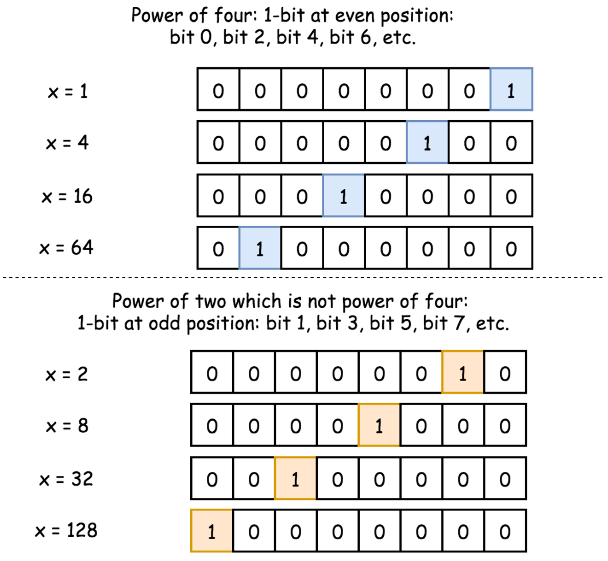
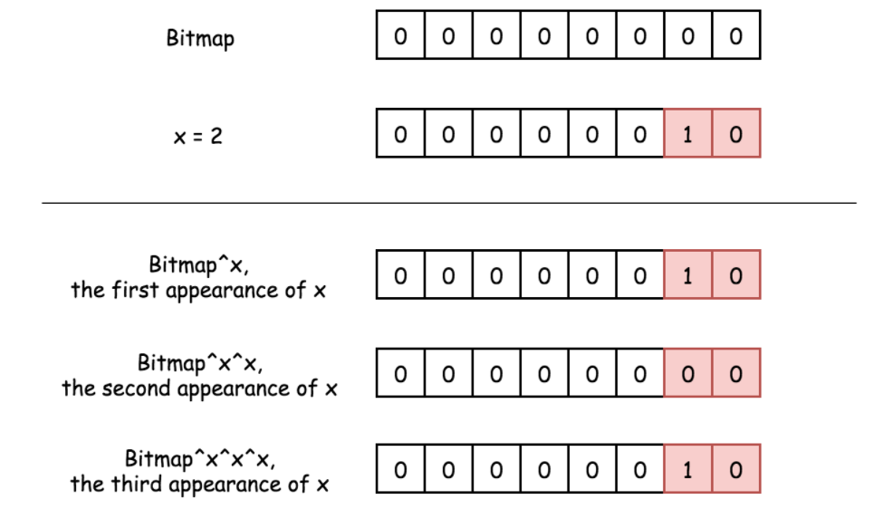
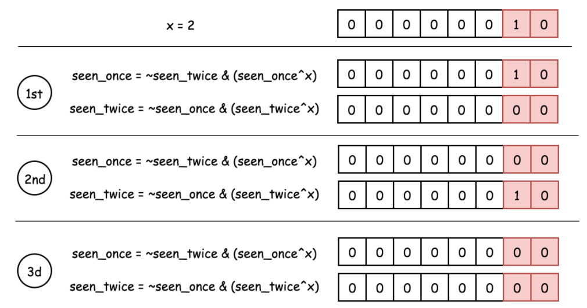
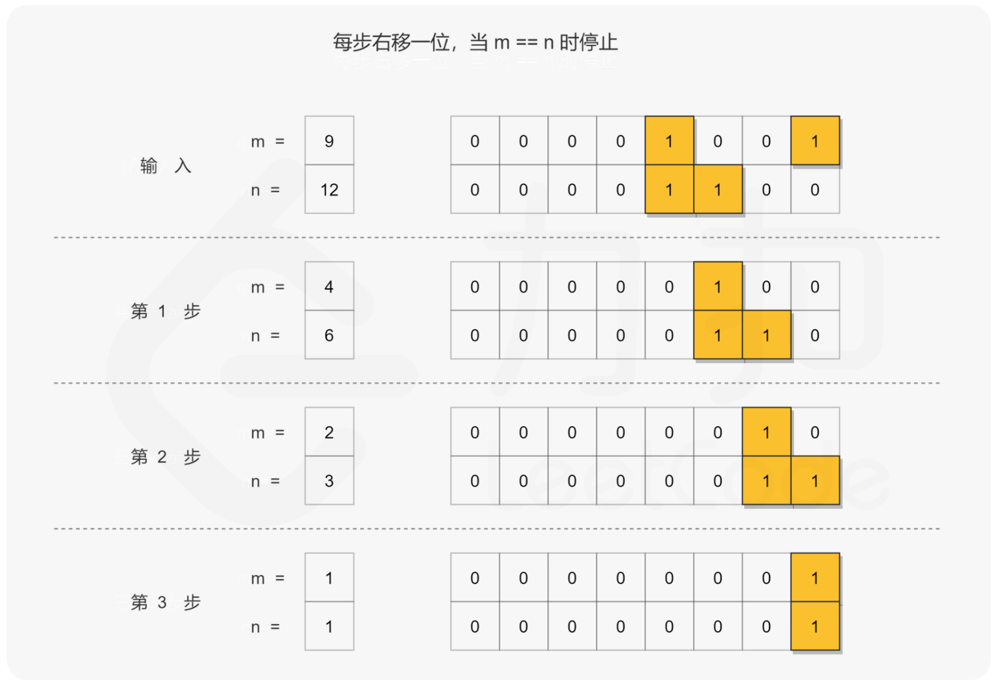
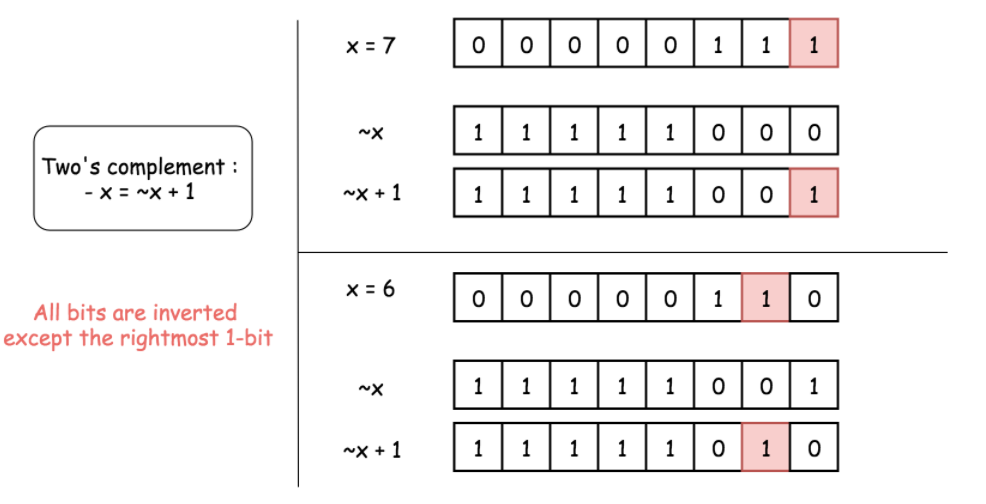
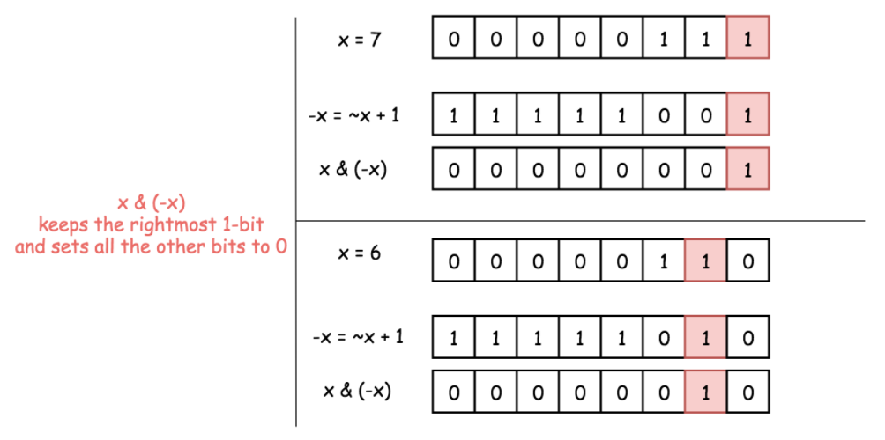
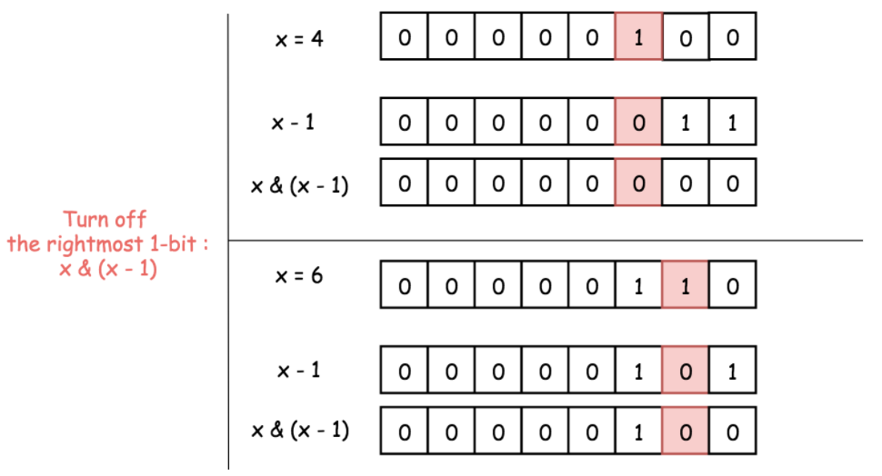
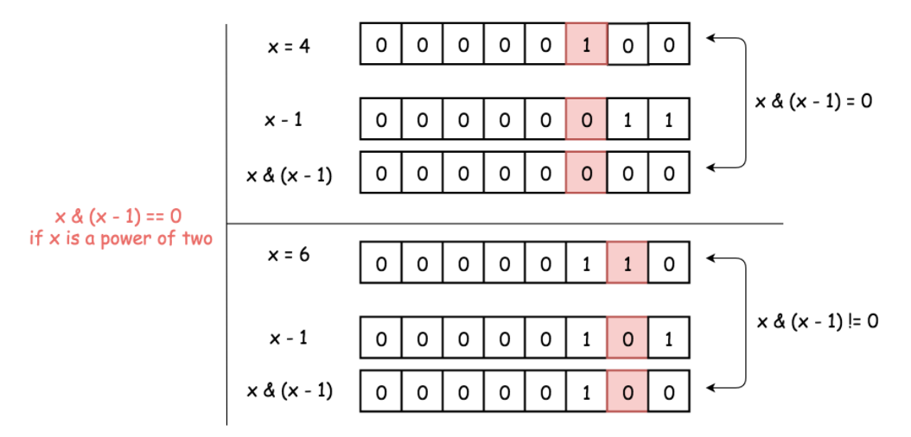

## 一.位操作符运算介绍

#### 1. 位操作实现乘除法

数 a 向右移一位，相当于将 a 除以 2；数 a 向左移一位，相当于将 a 乘以 2

```c++
int a = 2;
a >> 1; ---> 1
a << 1; ---> 4
```

#### 2. 位操作交货两数

位操作交换两数可以不需要第三个临时变量，虽然普通操作也可以做到，但是没有其效率高

```c++
//普通操作
void swap(int &a, int &b) {
  a = a + b;
  b = a - b;
  a = a - b;
}

//位与操作
void swap(int &a, int &b) {
  a ^= b;
  b ^= a;
  a ^= b;
}
```

> 位与操作解释：第一步：a ^= b ---> a = (a^b);
>
> 第二步：b ^= a ---> b = b^(a^b) ---> b = (b^b)^a = a
>
> 第三步：a ^= b ---> a = (a^b)^a = (a^a)^b = b

#### 3.位操作判断奇偶数

只要根据数的最后一位是 0 还是 1 来决定即可，为 0 就是偶数，为 1 就是奇数。

```c++
if(0 == (a & 1)) {
 //偶数
}
```

#### 4. 位操作交换符号

交换符号将正数变成负数，负数变成正数

```c++
int reversal(int a) {
  return ~a + 1;
}
```

> 整数取反加1，正好变成其对应的负数(补码表示)；负数取反加一，则变为其原码，即正数

#### 5. 位操作求绝对值

整数的绝对值是其本身，负数的绝对值正好可以对其进行取反加一求得，即我们首先判断其符号位（整数右移 31 位得到 0，负数右移 31 位得到 -1,即 0xffffffff），然后根据符号进行相应的操作

```c++
int abs(int a) {
  int i = a >> 31;
  return i == 0 ? a : (~a + 1);
}
```

上面的操作可以进行优化，可以将 i == 0 的条件判断语句去掉。我们都知道符号位 i 只有两种情况，即 i = 0 为正，i = -1 为负。对于任何数与 0 异或都会保持不变，与 -1 即 0xffffffff 进行异或就相当于对此数进行取反,因此可以将上面三目元算符转换为((a^i)-i)，即整数时 a 与 0 异或得到本身，再减去 0，负数时与 0xffffffff 异或将 a 进行取反，然后在加上 1，即减去 i(i =-1)

```c++
int abs2(int a) {
  int i = a >> 31;
  return ((a^i) - i);
}
```

#### 6. 位操作进行高低位交换

给定一个 16 位的无符号整数，将其高 8 位与低 8 位进行交换，求出交换后的值，如：

```text
34520的二进制表示：
10000110 11011000

将其高8位与低8位进行交换，得到一个新的二进制数：
11011000 10000110
其十进制为55430
```

从上面移位操作我们可以知道，只要将无符号数 a>>8 即可得到其高 8 位移到低 8 位，高位补 0；将 a<<8 即可将 低 8 位移到高 8 位，低 8 位补 0，然后将 a>>8 和 a<<8 进行或操作既可求得交换后的结果。

```c++
unsigned short a = 34520;
a = (a >> 8) | (a << 8);
```

#### 7. 位操作统计二进制中 1 的个数

统计二进制1的个数可以分别获取每个二进制位数，然后再统计其1的个数，此方法效率比较低。这里介绍另外一种高效的方法，同样以 34520 为例，我们计算其 a &= (a-1)的结果：

- 第一次：计算前：1000 0110 1101 1000 计算后：1000 0110 1101 0000
- 第二次：计算前：1000 0110 1101 0000 计算后：1000 0110 1100 0000
- 第二次：计算前：1000 0110 1100 0000 计算后：1000 0110 1000 0000 我们发现，没计算一次二进制中就少了一个 1，则我们可以通过下面方法去统计：

```c++
count = 0  
while(a){  
  a = a & (a - 1);  
  count++;  
}  
```

#### 8.求2的幂

给定一个整数，写一个函数来判断它是否是 2 的幂次方。如果是，返回 `true` ；否则，返回 `false` 。

```c++
x > 0 and x & (x - 1) == 0
```

#### 9.求4的幂

给定一个整数，写一个函数来判断它是否是 4 的幂次方。如果是，返回 `true` ；否则，返回 `false` 。

+ 我们首先检查 num 是否为 2 的幂：x > 0 and x & (x - 1) == 0。

+ 现在的问题是区分 2 的偶数幂（当 xx 是 4 的幂时）和 2 的奇数幂（当 xx 不是 4 的幂时）。在二进制表示中，这两种情况都只有一位为 1，其余为 0。

+ 有什么区别？在第一种情况下（4 的幂），1 处于偶数位置：第 0 位、第 2 位、第 4 位等；在第二种情况下，1 处于奇数位置。

<div align="center">  
   
</div>


+ 因此 4 的幂与数字 (101010...10)2向与会得到 0。即 4^a  ^  (101010...10)2 == 0。
+ (101010...10)2用十六进制表示为 ：(aaaaaaaa)16

```c++
class Solution {
public:
    bool isPowerOfFour(int n) {
        bool ret = false;
        if(n > 0 && ((n & (n - 1)) == 0)) {
            if((n & 0xaaaaaaaa) == 0) 
                ret = true;
            }
        }
        return ret;
    }
};
```

#### 10. 如果要将整数A转换为B，需要改变多少个bit位？

这个应用是上面一个应用的拓展：思考将整数A转换为B，如果A和B在第i（0 <=i < 32）个位上相等，则不需要改变这个BIT位，如果在第i位上不相等，则需要改变这个BIT位。

联想到位运算有一个`异或操作`，相同为0，相异为1，所以问题转变成了计算A异或B之后这个数中1的个数!

```c++
class Solution {
    /**
     *@param a, b: Two integer
     *return: An integer
     */
public:
    int countOnes(int num) {
        int count = 0;
        while (num != 0) {
            num = num & (num - 1);
            count++;
        }
        return count;
    }

    int bitSwapRequired(int a, int b) {
        // write your code here
        return countOnes(a ^ b);
    }
};
```


---

## 二.题目积累

#### [136. 只出现一次的数字](https://leetcode-cn.com/problems/single-number/)

> 给定一个**非空**整数数组，除了某个元素只出现一次以外，其余每个元素均出现两次。找出那个只出现了一次的元素。

```c++
class Solution {
public:
    int singleNumber(vector<int>& nums) {
        int ret = 0;
        for (auto e: nums) ret ^= e;
        return ret;
    }
};
```

#### [137. 只出现一次的数字 II](https://leetcode-cn.com/problems/single-number-ii/)

> 给你一个整数数组 `nums` ，除某个元素仅出现 **一次** 外，其余每个元素都恰出现 **三次 。**请你找出并返回那个只出现了一次的元素。

异或用于检测出现奇数次的位：1、3、5 等。

+ 0 与任何数 XOR 结果为该数。
+ 两个相同的数 XOR 结果为 0。
+ 以此类推，只有某个位置的数字出现奇数次时，该位的掩码才不为 0。

<div align="center">  
   
</div>


因此，可以检测出出现一次的位和出现三次的位，但是要注意区分这两种情况。

为了区分出现一次的数字和出现三次的数字，使用两个位掩码：seen_once 和 seen_twice。

思路是：

+ 仅当 `seen_twice` 未变时，改变 `seen_once`。

+ 仅当 `seen_once` 未变时，改变 `seen_twice`。

<div align="center">  
   
</div>


位掩码 `seen_once` 仅保留出现一次的数字，不保留出现三次的数字。

```c++
class Solution {
    public:
    int singleNumber(vector<int>& nums) {
        int seen_once = 0;
        int seen_twice = 0;

        for(auto i : nums) {
            seen_once = ~seen_twice & (seen_once ^ i);
            seen_twice = ~seen_once & (seen_twice ^ i);
        }
        return seen_once;
    }
};
```

#### [260. 只出现一次的数字 III](https://leetcode-cn.com/problems/single-number-iii/)

>  数组中，只有两个数出现一次，剩下都出现两次，找出出现一次的这两个数

让我们先来考虑一个比较简单的问题：

如果除了一个数字以外，其他数字都出现了两次，那么如何找到出现一次的数字？

答案很简单：全员进行异或操作即可。考虑异或操作的性质：对于两个操作数的每一位，相同结果为 00，不同结果为 11。那么在计算过程中，成对出现的数字的所有位会两两抵消为 00，最终得到的结果就是那个出现了一次的数字。

那么这一方法如何扩展到找出两个出现一次的数字呢？

如果我们可以把所有数字分成两组，使得：

1. 两个只出现一次的数字在不同的组中；

2. 相同的数字会被分到相同的组中。

那么对两个组分别进行异或操作，即可得到答案的两个数字。**这是解决这个问题的关键。**

那么如何实现这样的分组呢？

记这两个只出现了一次的数字为 a 和 b，那么所有数字异或的结果就等于 a 和 b 异或的结果，我们记为 x。如果我们把 x 写成二进制的形式，其中 `xk xk-1... x2x1`，其中`xi∈{0,1}`，我们考虑一下 `xi = 0` 和 `xi =1` 的含义是什么？它意味着如果我们把 a 和 b 写成二进制的形式, ai 和 bi 的关系：xi = 1表示 ai 和 bi 不等，xi = 0 表示 ai 和 bi 相等，假如我们任选一个不为 0 的 xi ，按照第 i 位给原来的序列分组，如果该位为 0 就分到第一组，否则就分到第二组，这样就能满足以上两个条件，为什么呢？

+ 首先，两个相同的数字的对应位都是相同的，所以一个被分到了某一组，另一个必然被分到这一组，所以满足了条件 2。
+ 这个方法在 xi = 1 的时候 a 和 b 不被分在同一组，因为 xi = 1 表示 ai 和 bi 不等，根据这个方法的定义「如果该位为 00 就分到第一组，否则就分到第二组」可以知道它们被分进了两组，所以满足了条件 1。

在实际操作的过程中，我们拿到序列的异或和 xx 之后，对于这个「位」是可以任取的，只要它满足 xi=1。但是为了方便，这里的代码选取的是「不为 00 的最低位」，当然你也可以选择其他不为 00 的位置。

至此，答案已经呼之欲出了。

算法

+ 先对所有数字进行一次异或，得到两个出现一次的数字的异或值。

+ 在异或结果中找到任意为 1 的位。

+ 根据这一位对所有的数字进行分组。

+ 在每个组内进行异或操作，得到两个数字。

```c++
class Solution {
public:
    vector<int> singleNumber(vector<int> &nums) {
        int diff = 0;
        for (auto num : nums) {
            diff ^= num;
        }

        int bit = 1;
        while((diff & bit) == 0) {
            bit <<= 1;
        }

        int a = 0;
        int b = 0;

        for (auto num : nums) {
            if(bit & num) {
                a ^= num;
            } else {
                b ^= num;
            }
        }
        return vector<int>{a,b};
    }
};
```


#### [371. 两整数之和](https://leetcode-cn.com/problems/sum-of-two-integers/)

>  **不使用**运算符 `+` 和 `-` ，计算两整数 `a` 、`b` 之和。

**位运算中的加法**

先来观察下位运算中的两数加法，其实来来回回就只有下面这四种：

```c++
0 + 0 = 0
0 + 1 = 1
1 + 0 = 1
1 + 1 = 0（进位 1）
```

仔细一看，这可不就是相同位为 0，不同位为 1 的异或运算结果嘛~

**异或和与运算操作**

我们知道，在位运算操作中，异或的一个重要特性是无进位加法。我们来看一个例子

```c++
a = 5 = 0101
b = 4 = 0100

a ^ b 如下：

0 1 0 1
0 1 0 0
-------
0 0 0 1
```

`a ^ b` 得到了一个**无进位加法**结果，如果要得到 `a + b` 的最终值，我们还要找到**进位**的数，把这二者相加。在位运算中，我们可以使用**与**操作获得进位：

```c++
a = 5 = 0101
b = 4 = 0100

a & b 如下：

0 1 0 1
0 1 0 0
-------
0 1 0 0
```

由计算结果可见，0100 并不是我们想要的进位，1 + 1 所获得的进位应该要放置在它的更高位，即左侧位上，因此我们还要把 0100 左移一位，才是我们所要的进位结果。

那么问题就容易了，总结一下：

+ `a + b` 的问题拆分为 `(a 和 b 的无进位结果)` + `(a 和 b 的进位结果)`
+ 无进位加法使用 **异或** 运算计算得出
+ 进位结果使用 **与运算** 和 **移位运算** 计算得出
+ 循环此过程，直到进位为 0

```c++
class Solution {
public:
int getSum(int a, int b){
    // 重复操作，直到进位值为0
    while(b!=0){
        //c++需要换成无符号数再进行与操作再左移（计算进位值），否则在leetcode平台会报runtime error: left shift of negative value
        unsigned int carry = (unsigned int) (a&b) << 1;
        // 异或操作相当于加
        a = a^b;
        b = carry;
    }
    return a;
} 
};
```

#### [201. 数字范围按位与](https://leetcode-cn.com/problems/bitwise-and-of-numbers-range/)

> 给你两个整数 `left` 和 `right` ，表示区间 `[left, right]` ，返回此区间内所有数字 **按位与** 的结果（包含 `left` 、`right` 端点）。

目的是求出两个给定数字的二进制字符串的公共前缀，这里给出的第一个方法是采用位移操作。

我们的想法是将两个数字不断向右移动，直到数字相等，即数字被缩减为它们的公共前缀。然后，通过将公共前缀向左移动，将零添加到公共前缀的右边以获得最终结果。

<div align="center">  
   
</div>


如上述所说，算法由两个步骤组成：

+ 我们通过右移，将两个数字压缩为它们的公共前缀。在迭代过程中，我们计算执行的右移操作数。
+ 将得到的公共前缀左移相同的操作数得到结果。

```c++
class Solution {
public:
    int rangeBitwiseAnd(int m, int n) {
        int shift = 0;
        // 找到公共前缀
        while (m < n) {
            m >>= 1;
            n >>= 1;
            ++shift;
        }
        return m << shift;
    }
};
```

#### [231. 2的幂](https://leetcode-cn.com/problems/power-of-two/)

> 给定一个整数，编写一个函数来判断它是否是 2 的幂次方。

**获取最右边的 1：**

首先讨论为什么` x & (-x)` 可以获取到二进制中最右边的 1，且其它位设置为 0。

在补码表示法中，`-x = ¬ x + 1`。换句话说，要计算`−x`，则要将 `x` 所有位取反再加 1。

在二进制表示中，`¬x+1` 表示将该 1 移动到 `¬x` 中最右边的 0 的位置上，并将所有较低位的位设置为 0。而 `¬x` 最右边的 0 的位置对应于 `x` 最右边的 1 的位置。

总而言之，`−x = ¬x+1`，此操作将 `x` 所有位取反，但是最右边的 1 除外。

<div align="center">  
   
</div>


因此，`x`和 `−x` 只有一个共同点：最右边的 1。这说明 `x & (-x)` 将保留最右边的 1。并将其他的位设置为 0。

<div align="center">  
   
</div>


**检测是否为 2 的幂：**

我们通过 `x & (-x)` 保留了最右边的 1，并将其他位设置为 0 若 `x` 为 2 的幂，则它的二进制表示中只包含一个 1，则有` x & (-x) = x`。

若 `x` 不是 2 的幂，则在二进制表示中存在其他 1，因此 `x & (-x) != x`。

因此判断是否为 2 的幂的关键是：判断 `x & (-x) == x`。

```c++
class Solution {
public:
    bool isPowerOfTwo(int n) {
        if(n == 0) {
            return false;
        }
        long x = n;
        return (x & (-x) == x)
    }
};
```

去除二进制中最右边的 1：

首先讨论为什么 `x & (x - 1)` 可以将最右边的 1 设置为 0。

`(x - 1)` 代表了将` x` 最右边的 1 设置为 0，并且将较低位设置为 1。

再使用与运算：则 `x` 最右边的 1 和就会被设置为 0，因为` 1 & 0 = 0`。

<div align="center">  
   
</div>


**检测是否为 2 的幂：**

1. 2 的幂二进制表示只含有一个 1。
2. `x & (x - 1)` 操作会将 2 的幂设置为 0，因此判断是否为 2 的幂是：判断 `x & (x - 1) == 0`。

<div align="center">  
   
</div>


```c++
class Solution {
public:
    bool isPowerOfTwo(int n) {
        if(n == 0) {
            return false;
        }
        long x = n;
        return (x & (x - 1) == 0)
    }
};
```

#### [268. 丢失的数字](https://leetcode-cn.com/problems/missing-number/)

> 给定一个包含 [0, n] 中 n 个数的数组 nums ，找出 [0, n] 这个范围内没有出现在数组中的那个数。
>
> 你能否实现线性时间复杂度、仅使用额外常数空间的算法解决此问题?

**分析**

由于异或运算（XOR）满足结合律，并且对一个数进行两次完全相同的异或运算会得到原来的数，因此我们可以通过异或运算找到缺失的数字。

**算法**

我们知道数组中有 nn 个数，并且缺失的数在 [0..n] 中。因此我们可以先得到 [0..n] 的异或值，再将结果对数组中的每一个数进行一次异或运算。未缺失的数在 [0..n] 和数组中各出现一次，因此异或后得到 0。而缺失的数字只在 [0..n]中出现了一次，在数组中没有出现，因此最终的异或结果即为这个缺失的数字。

```c++
class Solution {
public:
    int missingNumber(vector<int>& nums) {
        int missing = nums.size();
        for( int i = 0; i < nums.size() ; ++i) {
            missing ^= (i ^ nums[i]);
        }
        return missing;
    }
};
```

#### [405. 数字转换为十六进制数](https://leetcode-cn.com/problems/convert-a-number-to-hexadecimal/)

> 给定一个整数，编写一个算法将这个数转换为十六进制数。对于负整数，我们通常使用 [补码运算](https://baike.baidu.com/item/补码/6854613?fr=aladdin) 方法。

C++ 将num转为unsigned类型，即可进行逻辑右移，此时对于负数而言，进行右移时，左侧添加的是0，而不是int类型的符号位。

```c++
class Solution {
public:
    string toHex(int num) {
        if(num == 0)    return "0";
        string ans = "";
        unsigned num2 = num;
        string s = "0123456789abcdef";
        while(num2 != 0){
            ans = s[num2 & 15] + ans;
            num2 >>= 4;
        }
        return ans;
    }
};
```

