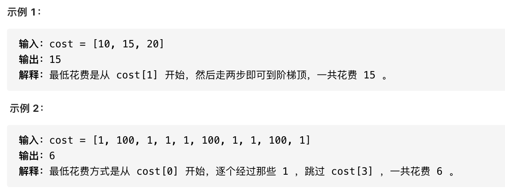
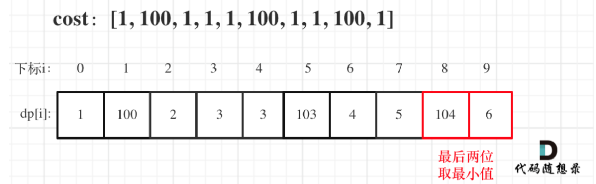
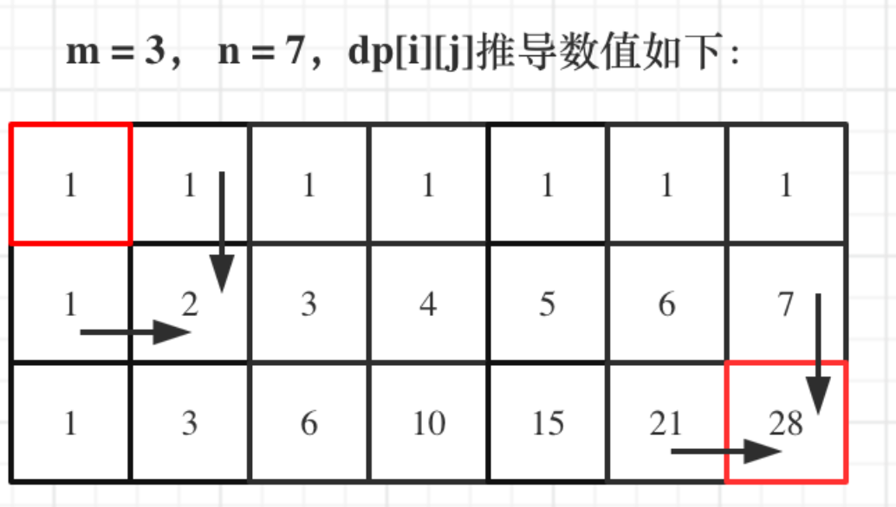
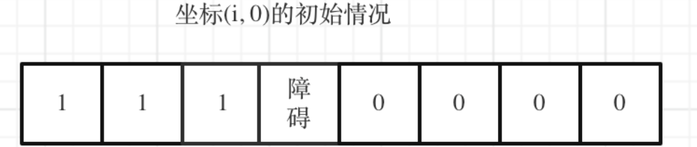
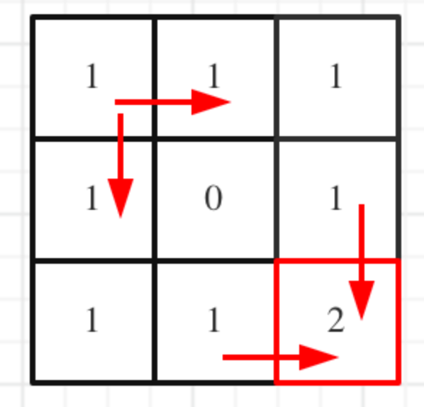
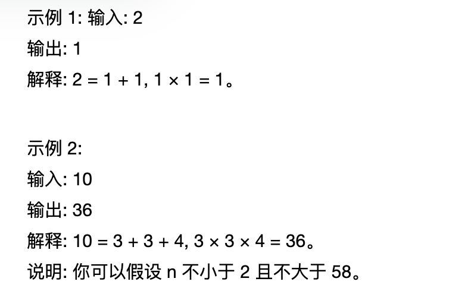
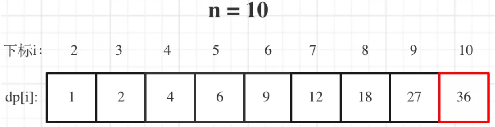
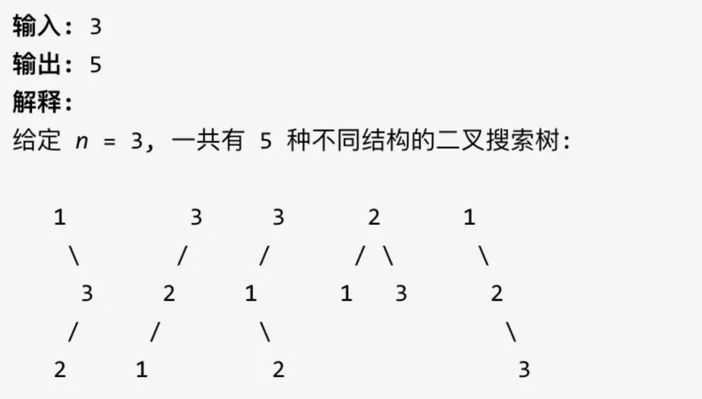
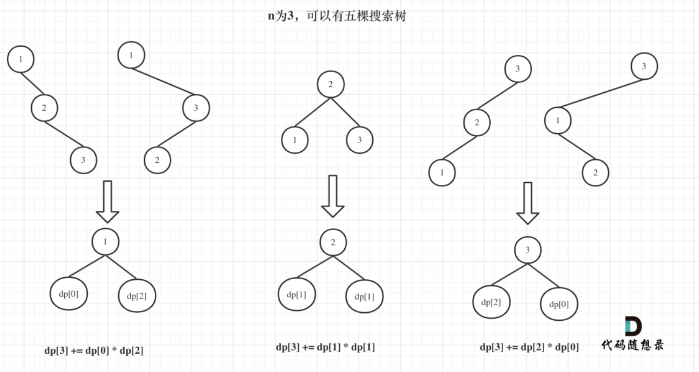
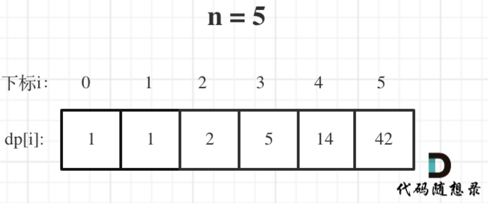

# 动态规划算法

## 一.动态规划概要

动态规划，英文：Dynamic Programming，简称DP，如果某一问题有很多重叠子问题，使用动态规划是最有效的。

所以动态规划中每一个状态一定是由上一个状态推导出来的，**这一点就区分于贪心**，贪心没有状态推导，而是从局部直接选最优的。

例如：有N件物品和一个最多能背重量为W 的背包。第i件物品的重量是weight[i]，得到的价值是value[i] 。**每件物品只能用一次**，求解将哪些物品装入背包里物品价值总和最大。

动态规划中dp[j]是由dp[j-weight[i]]推导出来的，然后取max(dp[j], dp[j - weight[i]] + value[i])。

但如果是贪心呢，每次拿物品选一个最大的或者最小的就完事了，和上一个状态没有关系。

所以贪心解决不了动态规划的问题。

## 二.动态规划解题步骤

**对于动态规划问题，拆解为如下五步曲，这五步都搞清楚了，就能动态规划真的掌握了！**

- **确定dp数组（dp table）以及下标的含义**
- **确定递推公式**
- **dp数组如何初始化**
- **确定遍历顺序**
- **举例推导dp数组**

## 三.动态规划debug方式

写动规题目时，如果代码出问题很正常！

**找问题的最好方式就是把dp数组打印出来，看看究竟是不是按照自己思路推导的！**

**做动规的题目，写代码之前一定要把状态转移在dp数组的上具体情况模拟一遍，心中有数，确定最后推出的是想要的结果**。

然后再写代码，如果代码没通过就打印dp数组，看看是不是和自己预先推导的哪里不一样。

如果打印出来和自己预先模拟推导是一样的，那么就是自己的递归公式、初始化或者遍历顺序有问题了。

如果和自己预先模拟推导的不一样，那么就是代码实现细节有问题。

**这样才是一个完整的思考过程，而不是一旦代码出问题，就毫无头绪的东改改西改改，最后过不了，或者说是稀里糊涂的过了**。

这也是为什么在动规五步曲里强调推导dp数组的重要性。

如果没有被AC，可以从这三个方面入手检查：

- **这道题目我举例推导状态转移公式了么？**
- **我打印dp数组的日志了么？**
- **打印出来了dp数组和我想的一样么？**

**如果这灵魂三问自己都做到了，基本上这道题目也就解决了**，或者更清晰的知道自己究竟是哪一点不明白，是状态转移不明白，还是实现代码不知道该怎么写，还是不理解遍历dp数组的顺序。


## 四.刷题积累

 ### 1.斐波那契数(509)

> 斐波那契数，通常用 F(n) 表示，形成的序列称为 斐波那契数列 。该数列由 0 和 1 开始，后面的每一项数字都是前面两项数字的和。也就是：
> F(0) = 0，F(1) = 1
> F(n) = F(n - 1) + F(n - 2)，其中 n > 1
> 给你n ，请计算 F(n) 。

+ **动态规划五部曲：**

  1. **确定dp数组以及下标的含义**
     + dp[i]的定义为：第i个数的斐波那契数值是dp[i]

  2. **确定递推公式**
     + 为什么这是一道非常简单的入门题目呢？
     + **因为题目已经把递推公式直接给我们了：状态转移方程 dp[i] = dp[i - 1] + dp[i - 2];**

  3. **dp数组如何初始化**

     + **题目中把如何初始化也直接给我们了，如下：**

     ```c++
     dp[0] = 0;
     dp[1] = 1;
     ```

  4. **确定遍历顺序**

     + 从递归公式`dp[i] = dp[i - 1] + dp[i - 2];`中可以看出，dp[i]是依赖 dp[i - 1] 和 dp[i - 2]，那么遍历的顺序一定是从前到后遍历的

  5. **举例推导dp数组**

     + 按照这个递推公式dp[i] = dp[i - 1] + dp[i - 2]，我们来推导一下，当N为10的时候，dp数组应该是如下的数列： 0 1 1 2 3 5 8 13 21 34 55
     + 如果代码写出来，发现结果不对，就把dp数组打印出来看看和我们推导的数列是不是一致的。

+ **代码实现：**

  ```c++
  class Solution {
  public:
      int fib(int n) {
          if(n <= 1)
              return n;
          //1.确定数组和下标意义
          int dp[2];
          //2.确定递推公式
          //dp[i] = dp[i - 1] + dp[1 - 2];
          //3.dp数组初始化
          dp[0] = 0;
          dp[1] = 1;
          //4.确定遍历顺序
          int sum = 0;
          for(int i = 2; i <= n; ++i) {
            //5.推导dp数组
              sum = dp[0] + dp[1];
              dp[0] = dp[1];
              dp[1] = sum;
          }
          return sum;
      }
  };
  ```


### 2. 使用最小花费爬楼梯(746)

> 数组的每个下标作为一个阶梯，第 i 个阶梯对应着一个非负数的体力花费值 cost[i]（下标从 0 开始）。
>
> 每当你爬上一个阶梯你都要花费对应的体力值，一旦支付了相应的体力值，你就可以选择向上爬一个阶梯或者爬两个阶梯。
>
> 请你找出达到楼层顶部的最低花费。在开始时，你可以选择从下标为 0 或 1 的元素作为初始阶梯。
>
> 提示：
>
> - cost 的长度范围是 [2, 1000]。
> - cost[i] 将会是一个整型数据，范围为 [0, 999] 。

+ **示例：**

  <div align = center></div>

+ **思路：**

  +  **注意题目描述：每当你爬上一个阶梯你都要花费对应的体力值，一旦支付了相应的体力值，你就可以选择向上爬一个阶梯或者爬两个阶梯。** 所以示例1中只花费一个15 就可以到阶梯顶，最后一步可以理解为 不用花费。

  + **动态规划五部曲：**

    + **确定dp数组以及下标的含义**

      + 使用动态规划，就要有一个数组来记录状态，本题只需要一个一维数组dp[i]就可以了。
      +  **dp[i]的定义：第i个台阶所花费的最少体力为dp[i]**。

    + **确定递推公式**

      +  **可以有两个途径得到dp[i]，一个是dp[i-1] 一个是dp[i-2]**。
      +  选dp[i-1]与dp[i-2]中更小的，所以`dp[i] = min(dp[i - 1], dp[i - 2]) + cost[i];`
      + **注意这里为什么是加cost[i]，而不是cost[i-1],cost[i-2]之类的** ，因为题目中说了：每当你爬上一个阶梯你都要花费对应的体力值

    + **dp数组如何初始化**

      + dp[i]由dp[i-1]，dp[i-2]推出，既然初始化所有的dp[i]是不可能的，那么只初始化dp[0]和dp[1]就够了，其他的最终都是dp[0]dp[1]推出。

    + **确定遍历顺序**

      + 因为是模拟台阶，而且dp[i]又dp[i-1]dp[i-2]推出，所以是从前到后遍历cost数组就可以了。

    + **举例推导dp数组**

      + 拿示例2：cost = [1, 100, 1, 1, 1, 100, 1, 1, 100, 1] ，来模拟一下dp数组的状态变化，如下：

        <div align = center></div>

+ **代码实现：**

  ```c++
  // 版本一
  class Solution {
  public:
      int minCostClimbingStairs(vector<int>& cost) {
          vector<int> dp(cost.size());
          dp[0] = cost[0];
          dp[1] = cost[1];
          for (int i = 2; i < cost.size(); i++) {
              dp[i] = min(dp[i - 1], dp[i - 2]) + cost[i];
          }
          // 注意最后一步可以理解为不用花费，所以取倒数第一步，第二步的最少值
          return min(dp[cost.size() - 1], dp[cost.size() - 2]);
      }
  };
  // 版本二
  class Solution {
  public:
      int minCostClimbingStairs(vector<int>& cost) {
          int dp0 = cost[0];
          int dp1 = cost[1];
          for (int i = 2; i < cost.size(); i++) {
              int dpi = min(dp0, dp1) + cost[i];
              dp0 = dp1; // 记录一下前两位
              dp1 = dpi;
          }
          return min(dp0, dp1);
      }
  };
  ```

  

### 3.不同路径(62)

> 一个机器人位于一个 m x n 网格的左上角 （起始点在下图中标记为 “Start” ）。
>
> 机器人每次只能向下或者向右移动一步。机器人试图达到网格的右下角（在下图中标记为 “Finish” ）。
>
> 问总共有多少条不同的路径？

+ **示例：**

  <div align = center></div>

+ **动态规划五部曲：**

  + **确定dp数组（dp table）以及下标的含义**

    + dp[i][j] ：表示从（0 ，0）出发，到(i, j) 有dp[i][j]条不同的路径。

  + **确定递推公式**

    + 想要求dp[i][j]，只能有两个方向来推导出来，即dp[ i - 1] [ j] 和 dp[i] [j - 1]。
    + dp[i - 1] [j] 表示的是从(0, 0)的位置到(i - 1, j)有几条路径，dp[i] [j - 1]同理。
    + 那么很自然，dp[i] [j] =  dp[i - 1] [j] + dp[i] [j - 1]，因为dp[i] [j]只有这两个方向过来。

  + **dp数组的初始化**

    + 首先dp[i] [0]一定都是1，因为从(0, 0)的位置到(i, 0)的路径只有一条，那么dp[0] [j]也同理。

  + **确定遍历顺序**

    + 这里要看一下递归公式dp[i] [j] =  dp[i - 1] [j] + dp[i] [j - 1]，dp[i] [j]都是从其上方和左方推导而来，那么从左到右一层一层遍历就可以了。
    + 这样就可以保证推导dp[i] [j]的时候，dp[i - 1] [j] 和 dp[i] [j - 1]一定是有数值的。

  + **举例推导dp数组**

    <div align = center></div>

+ **代码实现：**

  ```c++
  class Solution {
  public:
      int uniquePaths(int m, int n) {
          vector<vector<int>> dp(m, vector<int>(n, 0));
          for (int i = 0; i < m; i++) dp[i][0] = 1;
          for (int j = 0; j < n; j++) dp[0][j] = 1;
          for (int i = 1; i < m; i++) {
              for (int j = 1; j < n; j++) {
                  dp[i][j] = dp[i - 1][j] + dp[i][j - 1];
              }
          }
          return dp[m - 1][n - 1];
      }
  };
  ```


### 4.不同路径II (63)

> 一个机器人位于一个 m x n 网格的左上角 （起始点在下图中标记为“Start” ）。
>
> 机器人每次只能向下或者向右移动一步。机器人试图达到网格的右下角（在下图中标记为“Finish”）。
>
> 现在考虑网格中有障碍物。那么从左上角到右下角将会有多少条不同的路径？

+ **示例：**

  <div align = center></div>

+ **思路：**

  + 有障碍的话，其实就是标记对应的dp table（dp数组）保持初始值(0)就可以了。

+ **动态规划五部曲：**

  + **确定dp数组（dp table）以及下标的含义**

    + dp[i] [j] ：表示从（0 ，0）出发，到(i, j) 有dp[i] [j]条不同的路径。

  + **确定递推公式**

    + 递推公式和62.不同路径一样，dp[i] [j] =  dp[i - 1] [j] + dp[i] [j - 1]。
    + 但这里需要注意一点，因为有了障碍，(i, j) 如果就是障碍的话应该就保持初始状态（初始状态为0）。

  + **dp数组如何初始化**

    + 因为从(0, 0)的位置到(i, 0)的路径只有一条，所以dp[i] [0]一定为1，dp[0] [j]也同理。
    + 但如果(i, 0) 这条边有了障碍之后，障碍之后（包括障碍）都是走不到的位置了，所以障碍之后的dp[i][0]应该还是初始值0。

    <div align = center></div>

  + **确定遍历顺序**

    + 从递归公式dp[i] [j] =  dp[i - 1] [j] + dp[i] [j - 1] 中可以看出，一定是从左到右一层一层遍历，这样保证推导dp[i][j]的时候，dp[i - 1] [j] 和 dp[i] [j - 1]一定是有数值。

  + **举例推导dp数组**

    + 以示例为例子，dp数组如下：

      <div align = center></div>

+ **代码实现：**

  ```c++
  class Solution {
  public:
      int uniquePathsWithObstacles(vector<vector<int>>& obstacleGrid) {
          int m = obstacleGrid.size();
          int n = obstacleGrid[0].size();
          //确定dp数组及其含义
          vector<vector<int>> dp(m, vector<int>(n, 0));
          //递归递推公式
          //dp[i][j] = [i - 1][j] + dp[i][j - 1];
          //dp数组初始化
          for(int i = 0; i < m && obstacleGrid[i][0] != 1; ++i) dp[i][0] = 1;
          for(int i = 0; i < n && obstacleGrid[0][i] != 1; ++i) dp[0][i] = 1;
  
          for(int i = 1; i < m; ++i) {
              for(int j = 1; j < n; ++j) {
                  if(obstacleGrid[i][j] == 1)
                      continue;
                  else
                     dp[i][j] = dp[i - 1][j] + dp[i][j - 1];
              }
          }
  
          return dp[m-1][n-1];
      }
  };
  ```


### 5.整数拆分 (343)

> 给定一个正整数 n，将其拆分为至少两个正整数的和，并使这些整数的乘积最大化。返回你可以获得的最大乘积。

+ 示例：

  <div align = center></div>

+ **动态规划五部曲：**

  + **确定dp数组（dp table）以及下标的含义**

    + dp[i]：分拆数字i，可以得到的最大乘积为dp[i]。

  + **确定递推公式**

    + 从1遍历j，然后有两种渠道得到dp[i].
      + j * (i - j) 直接相乘。
      + j * dp[i - j]，相当于是拆分(i - j)
    + 从1遍历j，比较(i - j) * j和dp[i - j] * j 取最大的。
    + 递推公式：`dp[i] = max(dp[i], max((i - j) * j, dp[i - j] * j));`

  + **dp的初始化**

    + 严格从dp[i]的定义来说，dp[0] dp[1] 就不应该初始化，也就是没有意义的数值。
    + 直接初始化dp[2] = 1

  + **确定遍历顺序**

    + 确定遍历顺序，先来看看递归公式：`dp[i] = max(dp[i], max((i - j) * j, dp[i - j] * j));`
    + dp[i] 是依靠 dp[i - j]的状态，所以遍历i一定是从前向后遍历，先有dp[i - j]再有dp[i]。
    + 枚举j的时候，是从1开始的。i是从3开始，这样dp[i - j]就是dp[2]正好可以通过我们初始化的数值求出来。

  + **举例推导dp数组**

    + 举例当n为10 的时候，dp数组里的数值，如下：

    <div align = center></div>

+ **代码实现：**

```c++
class Solution {
public:
    int integerBreak(int n) {
        //确定dp数组及其下标含义
        vector<int> dp(n + 1);
        //递推公式
        //dp[i] = max(j * dp[i - j], j * (i - j))
        //dp数组初始化
         dp[2] = 1;
        //循环遍历
        for(int i = 3; i <= n; ++i) {
            for(int j = 1; j < i - 1; ++j) {
                dp[i] = max ( dp[i],max(j * dp[i - j], j * (i - j)));
            }
        }
        return dp[n];
    }
};
```


### 6.不同的二插搜索树 (96)

> 给定一个整数 n，求以 1 ... n 为节点组成的二叉搜索树有多少种？

+ **示例：**

  <div align = center></div>

+ **思路：**

  + n = 3时：
    + 当1为头结点的时候，其右子树有两个节点，看这两个节点的布局，和 n 为2的时候两棵树的布局是一样的！
    + 当3为头结点的时候，其左子树有两个节点，看这两个节点的布局，和n为2的时候两棵树的布局也是一样的！
    + 当2位头结点的时候，其左右子树都只有一个节点，布局和n为1的时候只有一棵树的布局也是一样的！
  + 发现到这里就找到的重叠子问题了，其实也就是发现可以通过dp[1] 和 dp[2] 来推导出来dp[3]的某种方式。
  +  dp[3]，就是 元素1为头结点搜索树的数量 + 元素2为头结点搜索树的数量 + 元素3为头结点搜索树的数量
    + 元素1为头结点搜索树的数量 = 右子树有2个元素的搜索树数量 * 左子树有0个元素的搜索树数量
    + 元素2为头结点搜索树的数量 = 右子树有1个元素的搜索树数量 * 左子树有1个元素的搜索树数量
    + 元素3为头结点搜索树的数量 = 右子树有0个元素的搜索树数量 * 左子树有2个元素的搜索树数量
  + 所以dp[3] = dp[2] * dp[0] + dp[1] * dp[1] + dp[0] * dp[2]

  <div align = center></div>

+ **动态规划五部曲：**

  + **确定dp数组（dp table）以及下标的含义**

    + **dp[i] ：1到i为节点组成的二叉搜索树的个数为dp[i]**。

  + **确定递推公式**

    + dp[i] += dp[以j为头结点左子树节点数量] * dp[以j为头结点右子树节点数量]
    + `dp[i] += dp[j - 1] * dp[i - j];`

  + **dp数组如何初始化**

    + 从递归公式上来讲，dp[以j为头结点左子树节点数量] * dp[以j为头结点右子树节点数量] 中以j为头结点左子树节点数量为0，也需要dp[以j为头结点左子树节点数量] = 1， 否则乘法的结果就都变成0了。
    + 所以初始化dp[0] = 1

  + **确定遍历顺序**

    + 首先一定是遍历节点数，从递归公式：dp[i] += dp[j - 1] * dp[i - j]可以看出，节点数为i的状态是依靠 i之前节点数的状态。
    + 那么遍历i里面每一个数作为头结点的状态，用j来遍历。

  + **举例推导dp数组**

    + n为5时候的dp数组状态如图

    <div align = center></div>

+ **代码实现：**

  ```c++
  class Solution {
  public:
      int numTrees(int n) {
          //确定dp数组及其下标含义
           vector<int> dp(n + 1);
          //确定递归表达式
  				//dp[i] += dp[j - 1] * dp[i - j];
          //dp数组初始化
          dp[0] = 1;
          //循环遍历
          for(int i = 1; i <= n; ++i) {
              for(int j = 1; j <= i; ++j) {
                  dp[i] += dp[j - 1] * dp[i - j];
              }
          }
          return dp[n];
      }
  };
  ```

  
