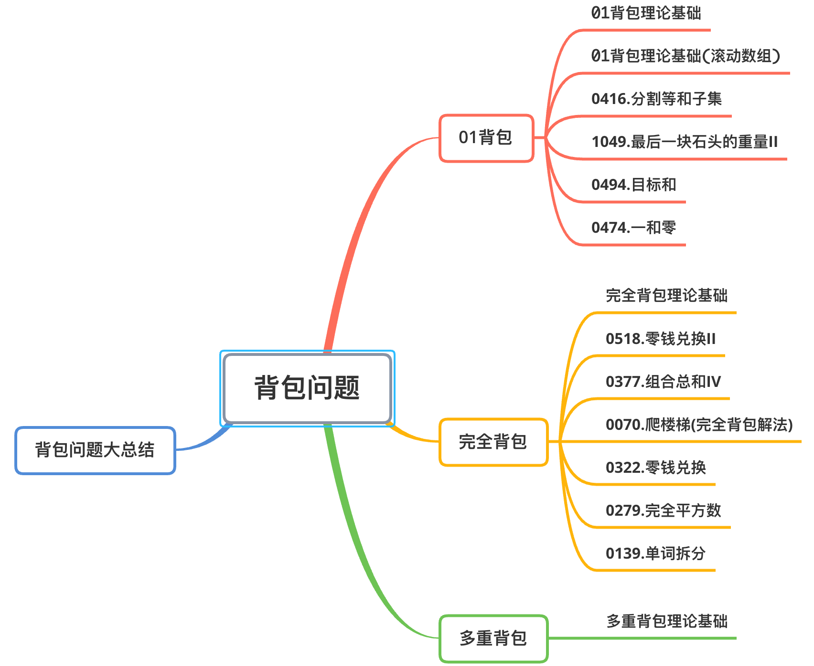
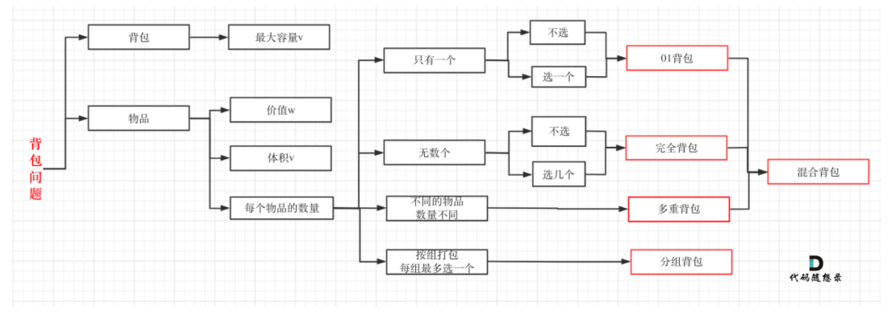
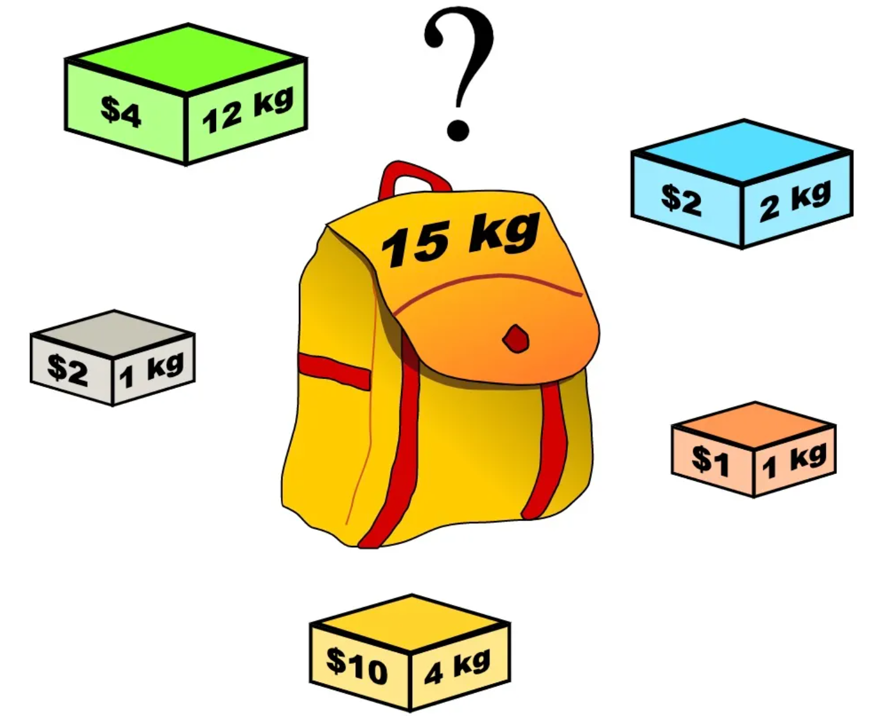
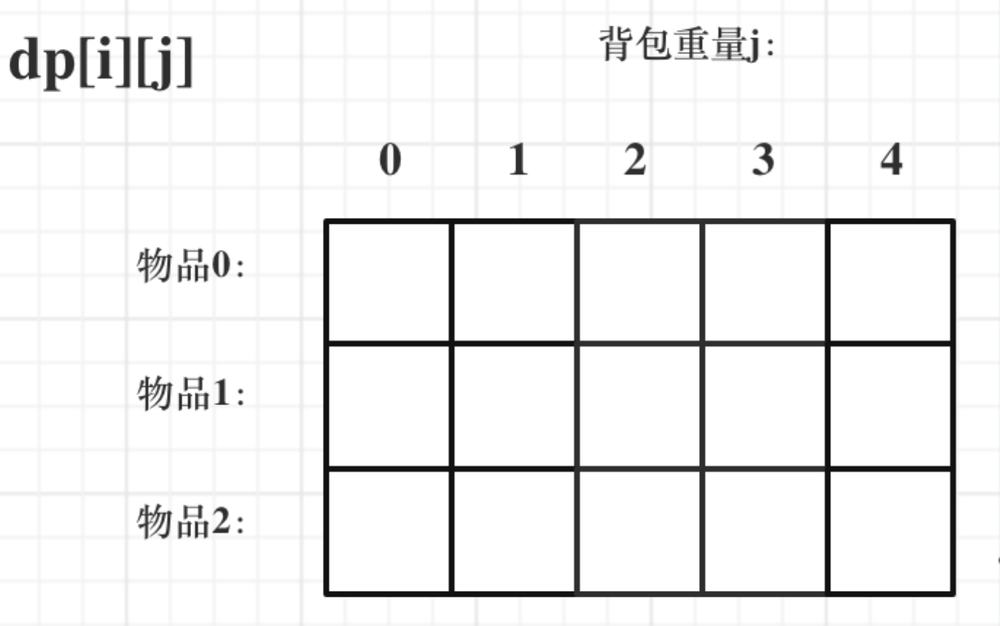
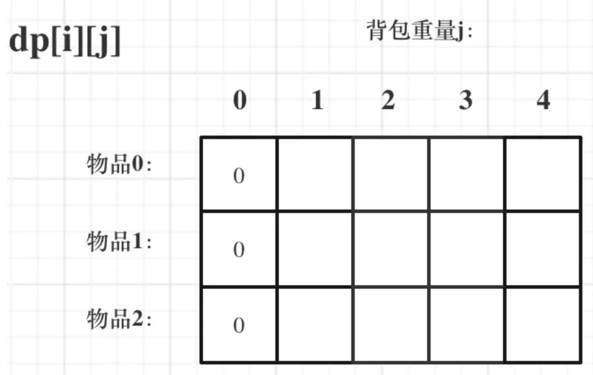
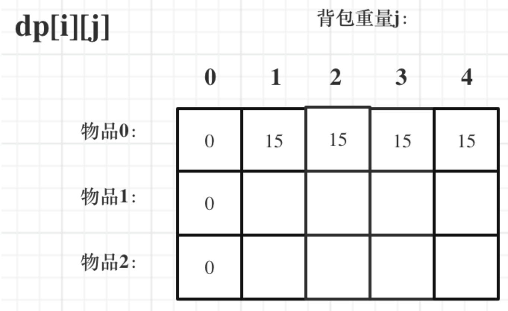
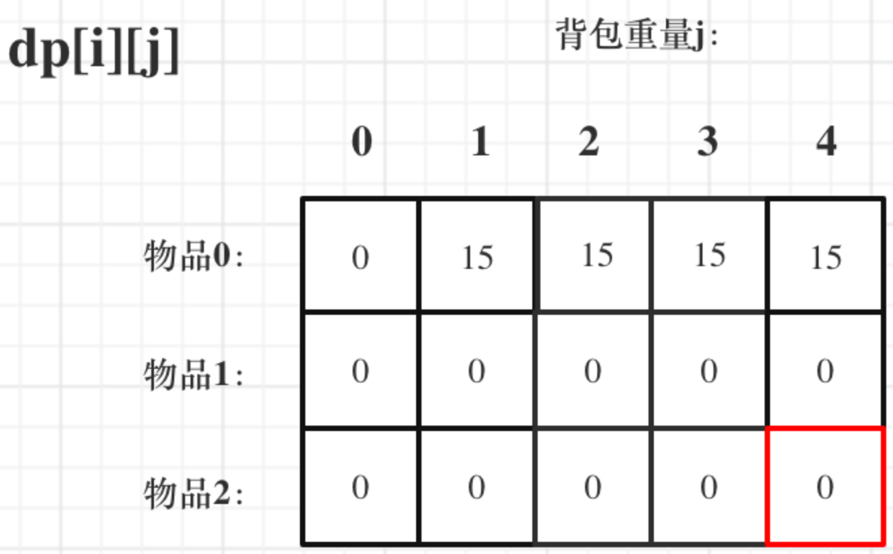
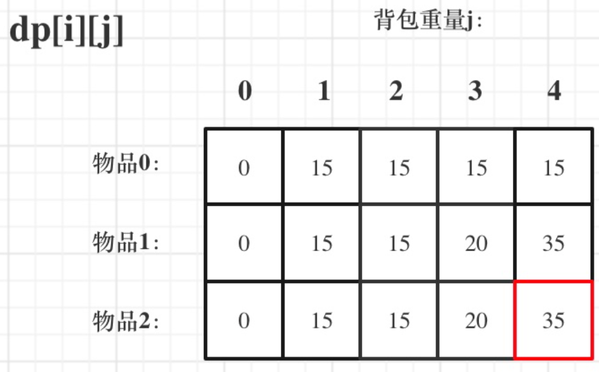
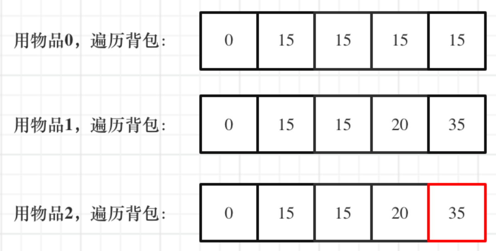

# 背包问题

<div align = center></div>


**多种背包逻辑：**

<div align = center></div>

## 一.01背包理论基础

### 01背包

> 有N件物品和一个最多能被重量为W 的背包。第i件物品的重量是weight[i]，得到的价值是value[i] 。**每件物品只能用一次**，求解将哪些物品装入背包里物品价值总和最大。

<div align = center></div>

在下面的讲解中，列举一个例子。背包最大重量为4；物品为：

|       | 重量 | 价值 |
| :---- | :--- | :--- |
| 物品0 | 1    | 15   |
| 物品1 | 3    | 20   |
| 物品2 | 4    | 30   |

问背包能背的物品最大价值是多少？

以下讲解和图示中出现的数字都是以这个例子为例。

#### 动态规划五部曲

1. **确定dp数组及其下标**

+ 对于背包问题，有一种写法， 是使用二维数组，即 **dp[i] [j] 表示从下标为[0-i]的物品里任意取，放进容量为j的背包，价值总和最大是多少** 。

  <div align = center></div>

+ **要时刻记着这个dp数组的含义，下面的一些步骤都围绕这dp数组的含义进行的** ，如果哪里看懵了，就来回顾一下i代表什么，j又代表什么。

2. **确定递推公式**

+ 再回顾一下dp[i] [j]的含义： **从下标为[0-i]的物品里任意取，放进容量为j的背包，价值总和最大是多少。**

+ 那么可以有两个方向推出来dp[i] [j]，
  + 由dp[i - 1] [j]推出，即背包容量为j，里面不放物品i的最大价值，此时dp[i] [j]就是dp[i - 1] [j]
  + 由`dp[i - 1] [j - weight[i]]`推出， **`dp[i - 1] [j - weight[i] ]`为背包容量为`j - weight[i]`的时候不放物品i 的最大价值** ，那么`dp[i - 1] [j - weight[i]] + value[i]` （物品i的价值），就是背包放物品i 得到的最大价值

+  **所以递归公式： `dp[i][j] = max(dp[i - 1][j], dp[i - 1][j - weight[i]] + value[i]);`**

3. **dp数组如何初始化**

+  **关于初始化，一定要和dp数组的定义吻合，否则到递推公式的时候就会越来越乱**。

+ 首先从dp[i][j]的定义触发，如果背包容量j为0的话，即dp[i] [0]，无论是选取哪些物品，背包价值总和一定为0。如图：

  <div align = center></div>

+ 状态转移方程 `dp[i] [j] = max(dp[i - 1] [j], dp[i - 1] [j - weight[i]] + value[i]); `可以看出i 是由 i-1 推导出来，那么i为0的时候就一定要初始化。

+ dp[0] [j]，即：i为0，存放编号0的物品的时候，各个容量的背包所能存放的最大价值。

```c++
// 倒叙遍历
for (int j = bagWeight; j >= weight[0]; j--) {
    dp[0][j] = dp[0][j - weight[0]] + value[0]; // 初始化i为0时候的情况
}
```

> 但如果一旦正序遍历了，那么物品0就会被重复加入多次！

+  **所以一定要倒叙遍历，保证物品0只被放入一次！这一点对01背包很重要，后面在讲解滚动数组的时候，还会用到倒叙遍历来保证物品使用一次！**

+ 此时dp数组初始化情况如图所示：

  <div align = center></div>

+ dp[i] [j]在推导的时候一定是取价值最大的数，如果题目给的价值都是正整数那么非0下标都初始化为0就可以了，因为0就是最小的了，不会影响取最大价值的结果。

+ 如果题目给的价值有负数，那么非0下标就要初始化为负无穷了。例如：一个物品的价值是-2，但对应的位置依然初始化为0，那么取最大值的时候，就会取0而不是-2了，所以要初始化为负无穷。

+ 初始化代码：

  ```c
  // 初始化 dp
  vector<vector<int>> dp(weight.size() + 1, vector<int>(bagWeight + 1, 0));
  for (int j = bagWeight; j >= weight[0]; j--) {
      dp[0][j] = dp[0][j - weight[0]] + value[0];
  }
  ```

4. **确定遍历顺序**

+ 在如下图中，可以看出，有两个遍历的维度：物品与背包重量

  <div align = center></div>

+ 背包和物品都可以先遍历，先给出先遍历物品，然后遍历背包重量的代码。

```c
// weight数组的大小 就是物品个数
for(int i = 1; i < weight.size(); i++) { // 遍历物品
    for(int j = 0; j <= bagWeight; j++) { // 遍历背包容量 
        if (j < weight[i]) dp[i][j] = dp[i - 1][j]; // 这个是为了展现dp数组里元素的变化
        else dp[i][j] = max(dp[i - 1][j], dp[i - 1][j - weight[i]] + value[i]);
    }
}
```

5. **举例推导dp数组**

+ 来看一下对应的dp数组的数值，如图：

  <div align = center></div>

+ 最终结果就是dp[2] [4]。

#### **代码实现：**

```c++
void test_2_wei_bag_problem1() {
    vector<int> weight = {1, 3, 4};
    vector<int> value = {15, 20, 30};
    int bagWeight = 4;

    // 二维数组
    vector<vector<int>> dp(weight.size() + 1, vector<int>(bagWeight + 1, 0));

    // 初始化 
    for (int j = bagWeight; j >= weight[0]; j--) {
        dp[0][j] = dp[0][j - weight[0]] + value[0];
    }

    // weight数组的大小 就是物品个数
    for(int i = 1; i < weight.size(); i++) { // 遍历物品
        for(int j = 0; j <= bagWeight; j++) { // 遍历背包容量
            if (j < weight[i]) dp[i][j] = dp[i - 1][j];
            else dp[i][j] = max(dp[i - 1][j], dp[i - 1][j - weight[i]] + value[i]);

        }
    }

    cout << dp[weight.size() - 1][bagWeight] << endl;
}

int main() {
    test_2_wei_bag_problem1();
}
```

---

##二.01背包理论基础(滚动数组)

> 在上述的基础上将二维数组改进为一维滚动数组。

对于背包问题其实状态都是可以压缩的。在使用二维数组的时候，递推公式：`dp[i] [j] = max(dp[i - 1] [j], dp[i - 1] [j - weight[i]] + value[i]);`

**其实可以发现如果把dp[i - 1]那一层拷贝到dp[i]上，表达式完全可以是：`dp[i][j] = max(dp[i][j], dp[i][j - weight[i]] + value[i]);` ** 

**于其把dp[i - 1]这一层拷贝到dp[i]上，不如只用一个一维数组了**，只用dp[j]（一维数组，也可以理解是一个滚动数组）。 这就是滚动数组的由来，需要满足的条件是上一层可以重复利用，直接拷贝到当前层。

#### 动态规划五部曲

1. **确定dp数组的定义**

+ 在一维dp数组中，dp[j]表示：容量为j的背包，所背的物品价值可以最大为dp[j]。

2. **一维dp数组的递推公式**

+ dp[j]为 容量为j的背包所背的最大价值，那么如何推导dp[j]呢？

+ dp[j]可以通过`dp[j - weight[j]]`推导出来，`dp[j - weight[i]]`表示容量为`j - weight[i]`的背包所背的最大价值。

+ `dp[j - weight[i]] + value[i] `表示 容量为 `j - 物品i重量` 的背包 加上 `物品i的价值` 。 **（也就是容量为j的背包，放入物品i了之后的价值即：dp[j]）**

+ **此时dp[j]有两个选择，一个是取自己dp[j]，一个是取dp[j - weight[i]] + value[i]，指定是取最大的，毕竟是求最大价值，**

+ 所以递归公式为：

  ```c++
  dp[j] = max(dp[j], dp[j - weight[i]] + value[i]);
  ```

3. **一维dp数组如何初始化**

+ **关于初始化，一定要和dp数组的定义吻合，否则到递推公式的时候就会越来越乱**。
+ dp[j]表示：容量为j的背包，所背的物品价值可以最大为dp[j]，那么dp[0]就应该是0，因为背包容量为0所背的物品的最大价值就是0。
+ dp数组在推导的时候一定是取价值最大的数，如果题目给的价值都是正整数那么非0下标都初始化为0就可以了，如果题目给的价值有负数，那么非0下标就要初始化为负无穷。
+ **这样才能让dp数组在递归公式的过程中取的最大的价值，而不是被初始值覆盖了**。
+ 假设物品价值都是大于0的，所以dp数组初始化的时候，都初始为0就可以了。

4. **一维dp数组遍历顺序**

+ 代码如下：

  ```c
  for(int i = 0; i < weight.size(); i++) { // 遍历物品
      for(int j = bagWeight; j >= weight[i]; j--) { // 遍历背包容量
          dp[j] = max(dp[j], dp[j - weight[i]] + value[i]);
  
      }
  }
  ```

+ **这里大家发现和二维dp的写法中，遍历背包的顺序是不一样的！**

+ **倒叙遍历是为了保证物品i只被放入一次！**，在上节中讲解二维dp数组初始化dp[0] [j]时候已经讲解到过一次。

+ 所以从后往前循环，每次取得状态不会和之前取得状态重合，这样每种物品就只取一次了。

5. **举例推导dp数组**

+ 一维dp，费用用物品0，物品1，物品2 来遍历背包，最终得到结果如下：

  <div align = center></div>

#### 代码实现

```c++
void test_1_wei_bag_problem() {
    vector<int> weight = {1, 3, 4};
    vector<int> value = {15, 20, 30};
    int bagWeight = 4;

    // 初始化
    vector<int> dp(bagWeight + 1, 0);
    for(int i = 0; i < weight.size(); i++) { // 遍历物品
        for(int j = bagWeight; j >= weight[i]; j--) { // 遍历背包容量
            dp[j] = max(dp[j], dp[j - weight[i]] + value[i]);
        }
    }
    cout << dp[bagWeight] << endl;
}

int main() {
    test_1_wei_bag_problem();
}
```

## 三.01背包刷题积累