# 贪心算法

## 一.贪心算法概要

### 1.什么是贪心

**「贪心的本质是选择每一阶段的局部最优，从而达到全局最优」**。

这么说有点抽象，来举一个例子：

例如，有一堆钞票，你可以拿走十张，如果想达到最大的金额，你要怎么拿？ 

指定每次拿最大的，最终结果就是拿走最大数额的钱。每次拿最大的就是局部最优，最后拿走最大数额的钱就是推出全局最优。

再举一个例子：

如果是 有一堆盒子，你有一个背包体积为n，如何把背包尽可能装满，如果还每次选最大的盒子，就不行了。这时候就需要动态规划。动态规划的问题在下一个系列会详细讲解。

### 2.贪心的套路

**「说实话贪心算法并没有固定的套路」**。

+ 所以唯一的难点就是如何通过局部最优，推出整体最优。

那么如何能看出局部最优是否能推出整体最优呢？有没有什么固定策略或者套路呢？

+  **「不好意思，也没有！」** 靠自己手动模拟，如果模拟可行，就可以试一试贪心策略，如果不可行，可能需要动态规划。

有同学问了如何验证可不可以用贪心算法呢？

+ **「最好用的策略就是举反例，如果想不到反例，那么就试一试贪心吧」**。

### 3.贪心的一般解题步骤

贪心算法一般分为如下四步：

- 将问题分解为若干个子问题
- 找出适合的贪心策略
- 求解每一个子问题的最优解
- 将局部最优解堆叠成全局最优解

其实这个分的有点细了，真正做题的时候很难分出这么详细的解题步骤，可能就是因为贪心的题目往往还和其他方面的知识混在一起。


## 二.刷题积累

### 1.分发饼干

> 假设你是一位很棒的家长，想要给你的孩子们一些小饼干。但是，每个孩子最多只能给一块饼干。
>
> 对每个孩子 i，都有一个胃口值 g[i]，这是能让孩子们满足胃口的饼干的最小尺寸；并且每块饼干 j，都有一个尺寸 s[j] 。如果 s[j] >= g[i]，我们可以将这个饼干 j 分配给孩子 i ，这个孩子会得到满足。你的目标是尽可能满足越多数量的孩子，并输出这个最大数值。

+ **示例：**

  <div align = center>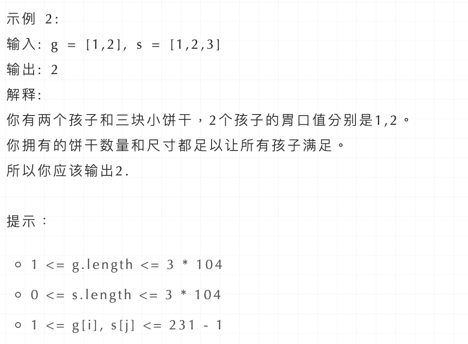</div>

+ **思路：**

  + 为了了满足更多的小孩，就不要造成饼干尺寸的浪费。大尺寸的饼干既可以满足胃口大的孩子也可以满足胃口小的孩子，那么就应该优先满足胃口大的。
  +  **「这里的局部最优就是大饼干喂给胃口大的，充分利用饼干尺寸喂饱一个，全局最优就是喂饱尽可能多的小孩」**。
  + 可以尝试使用贪心策略，先将饼干数组和小孩数组排序。
  + 然后从后向前遍历小孩数组，用大饼干优先满足胃口大的，并统计满足小孩数量。

  <div  align = center>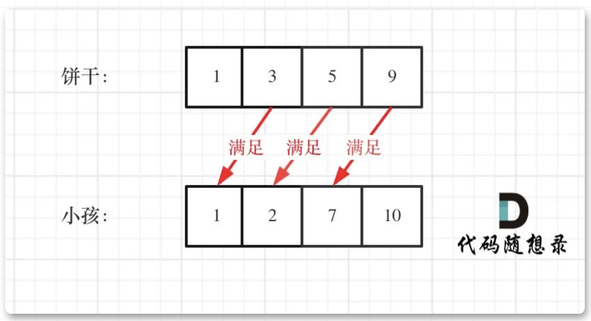</div>

+ **代码实现：**

  ```c++
  // 时间复杂度：O(nlogn)
  // 空间复杂度：O(1)
  class Solution {
  public:
      int findContentChildren(vector<int>& g, vector<int>& s) {
          sort(g.begin(), g.end());
          sort(s.begin(), s.end());
          int index = s.size() - 1; // 饼干数组的下表
          int result = 0;
          for (int i = g.size() - 1; i >= 0; i--) {
              if (index >= 0 && s[index] >= g[i]) {
                  result++;
                  index--;
              }
          }
          return result;
      }
  };
  ```

### 2.摆动序列(376)

> 如果连续数字之间的差严格地在正数和负数之间交替，则数字序列称为摆动序列。第一个差（如果存在的话）可能是正数或负数。少于两个元素的序列也是摆动序列。
>
> 例如， [1,7,4,9,2,5] 是一个摆动序列，因为差值 (6,-3,5,-7,3) 是正负交替出现的。相反, [1,4,7,2,5] 和 [1,7,4,5,5] 不是摆动序列，第一个序列是因为它的前两个差值都是正数，第二个序列是因为它的最后一个差值为零。
>
> 给定一个整数序列，返回作为摆动序列的最长子序列的长度。通过从原始序列中删除一些（也可以不删除）元素来获得子序列，剩下的元素保持其原始顺序。

+ **示例：**

  <div  align = center>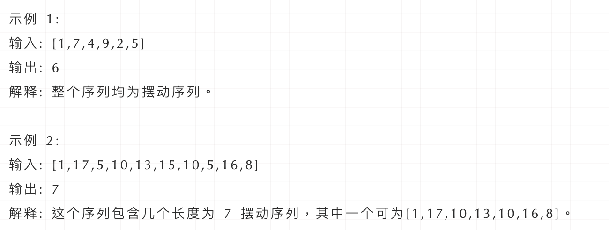</div>

+ **思路：**

  + 本题要求通过从原始序列中删除一些（也可以不删除）元素来获得子序列，剩下的元素保持其原始顺序。来分析一下，要求删除元素使其达到最大摆动序列，应该删除什么元素呢？用示例二来举例，如图所示：

    <div  align = center>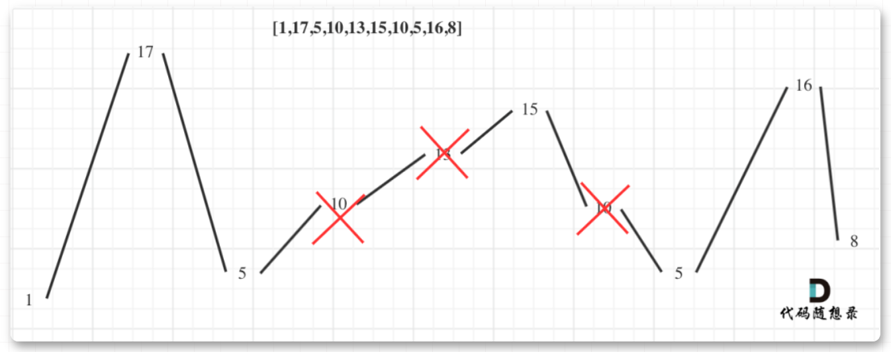</div>

  +  **「局部最优：删除单调坡度上的节点（不包括单调坡度两端的节点），那么这个坡度就可以有两个局部峰值」**。

  +  **「整体最优：整个序列有最多的局部峰值，从而达到最长摆动序列」**。

  + **「实际操作上，其实连删除的操作都不用做，因为题目要求的是最长摆动子序列的长度，所以只需要统计数组的峰值数量就可以了（相当于是删除单一坡度上的节点，然后统计长度）」** 。 **「这就是贪心所贪的地方，让峰值尽可能的保持峰值，然后删除单一坡度上的节点」**。

+ **代码实现：**

  ```c++
  class Solution {
  public:
      int wiggleMaxLength(vector<int>& nums) {
          if (nums.size() <= 1) return nums.size();
          int curDiff = 0; // 当前一对差值
          int preDiff = 0; // 前一对差值
          int result = 1;  // 记录峰值个数，序列默认序列最右边有一个峰值
          for (int i = 1; i < nums.size(); i++) {
              curDiff = nums[i] - nums[i - 1];
              // 出现峰值
              if ((curDiff > 0 && preDiff <= 0) || (preDiff >= 0 && curDiff < 0)) {
                  result++;
                  preDiff = curDiff;
              }
          }
          return result;
      }
  };
  ```

  

### 3.最大子序和(53)

> 给定一个整数数组 nums ，找到一个具有最大和的连续子数组（子数组最少包含一个元素），返回其最大和。

+ **示例：**

  <div  align = center>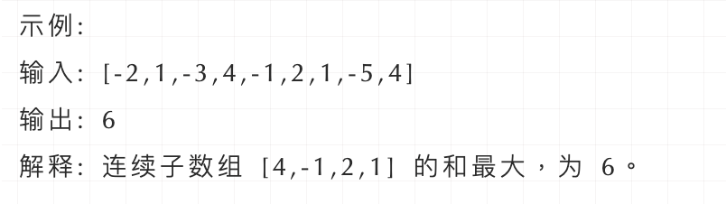</div>

+ **思路：**

  + 局部最优：当前“连续和”为负数的时候立刻放弃，从下一个元素重新计算“连续和”，因为负数加上下一个元素 “连续和”只会越来越小。
  + 全局最优：选取最大“连续和”
  + **「局部最优的情况下，并记录最大的“连续和”，可以推出全局最优」**。

  <div  align = center></div>

  + 红色的起始位置就是贪心每次取count为正数的时候，开始一个区间的统计。

+ **代码实现：**

  ```c++
  class Solution {
  public:
      int maxSubArray(vector<int>& nums) {
          int result = INT32_MIN;
          int count = 0;
          for (int i = 0; i < nums.size(); i++) {
              count += nums[i];
              if (count > result) { // 取区间累计的最大值（相当于不断确定最大子序终止位置）
                  result = count;
              }
              if (count <= 0) count = 0; // 相当于重置最大子序起始位置，因为遇到负数一定是拉低总和
          }
          return result;
      }
  };
  ```


### 4.K次取反后最大化的数组和(1005)

> 给定一个整数数组 A，我们只能用以下方法修改该数组：我们选择某个索引 i 并将 A[i] 替换为 -A[i]，然后总共重复这个过程 K 次。（我们可以多次选择同一个索引 i。）
>
> 以这种方式修改数组后，返回数组可能的最大和。

+ **示例：**

  <div align = center>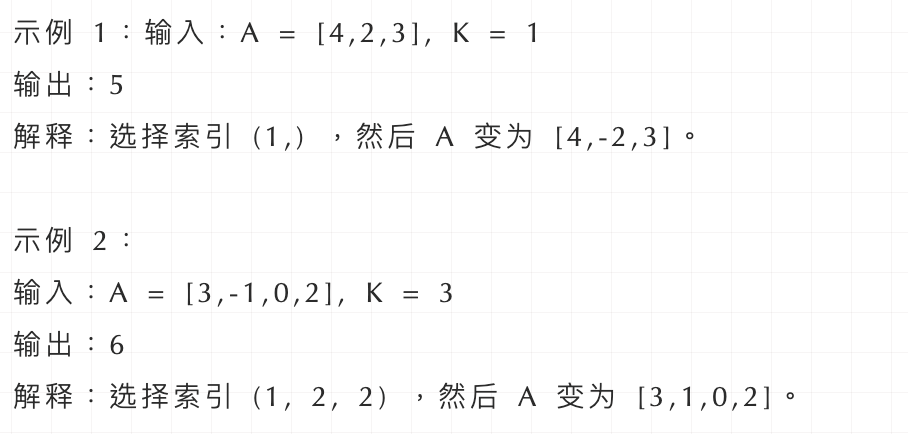</div>

+ **思路：**
  + 贪心的思路，局部最优：让绝对值大的负数变为正数，当前数值达到最大，整体最优：整个数组和达到最大。
  + 局部最优可以推出全局最优。
  + 那么本题的解题步骤为：
    - 第一步：将数组按照绝对值大小从大到小排序，**「注意要按照绝对值的大小」**
    - 第二步：从前向后遍历，遇到负数将其变为正数，同时K--
    - 第三步：如果K还大于0，那么反复转变数值最小的元素，将K用完
    - 第四步：求和

+ **代码实现：**

  ```c++
  class Solution {
  private:
      static bool cmp(int a, int b) {
          return abs(a) > abs(b);
      }
  public:
      int largestSumAfterKNegations(vector<int>& nums, int k) {
          sort(nums.begin(), nums.end(), cmp);
          for(int i = 0; i < nums.size() ; ++i) {
              if(nums[i] < 0 && k > 0) {
                  nums[i] *= -1; 
                  --k;
              }
          }
          while(k > 0) {
              nums[nums.size() - 1] *= -1;
              --k;
          }
          return accumulate(nums.begin(),nums.end(),0);
      }
  };
  ```

  

### 5.跳跃游戏(55)

> 给定一个非负整数数组，你最初位于数组的第一个位置。
>
> 数组中的每个元素代表你在该位置可以跳跃的最大长度。
>
> 判断你是否能够到达最后一个位置。

+ **示例：**

  <div align = center>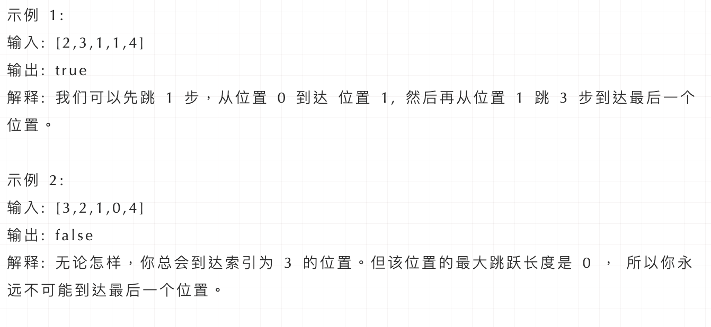</div>

+ **思路：**

  + 不一定非要明确一次究竟跳几步，每次取最大的跳跃步数，这个就是可以跳跃的覆盖范围。这个范围内，别管是怎么跳的，反正一定可以跳过来。
  + **「那么这个问题就转化为跳跃覆盖范围究竟可不可以覆盖到终点！」**

  + 每次移动取最大跳跃步数（得到最大的覆盖范围），每移动一个单位，就更新最大覆盖范围。
  + **「贪心算法局部最优解：每次取最大跳跃步数（取最大覆盖范围），整体最优解：最后得到整体最大覆盖范围，看是否能到终点」**。

  <div align = center>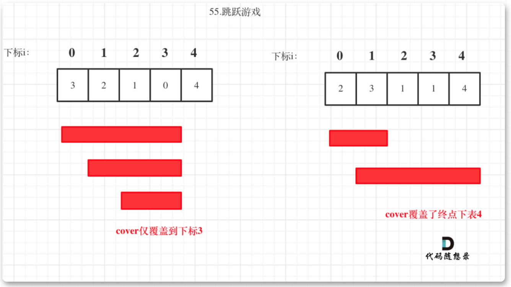</div>

+ **代码实现：**

  ```c++
  class Solution {
  public:
      bool canJump(vector<int>& nums) {
          int cover = 0;
          if (nums.size() == 1) return true; // 只有一个元素，就是能达到
          for (int i = 0; i <= cover; i++) { // 注意这里是小于等于cover
              cover = max(i + nums[i], cover);
              if (cover >= nums.size() - 1) return true; // 说明可以覆盖到终点了
          }
          return false;
      }
  };
  ```

  

### 6.跳跃游戏II(45)

> 给定一个非负整数数组，你最初位于数组的第一个位置。
>
> 数组中的每个元素代表你在该位置可以跳跃的最大长度。
>
> 你的目标是使用最少的跳跃次数到达数组的最后一个位置。

+ **示例:**

  <div align = center>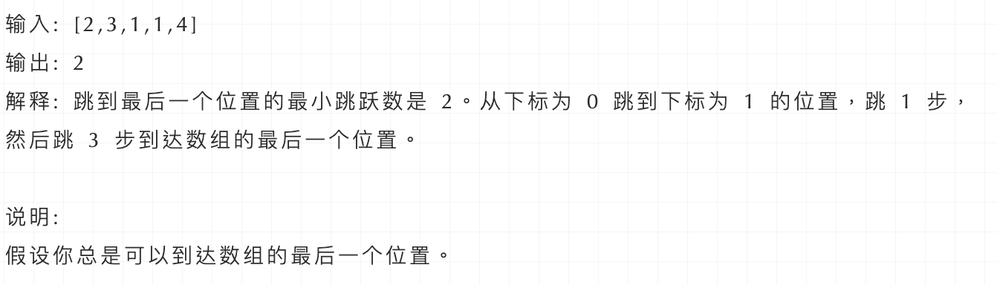</div>

+ **思路：**

  + 本题要计算最小步数，那么就要想清楚什么时候步数才一定要加一呢？
  + 贪心的思路，局部最优：当前可移动距离尽可能多走，如果还没到终点，步数再加一。整体最优：一步尽可能多走，从而达到最小步数。
  + 思路虽然是这样，但在写代码的时候还不能真的就能跳多远跳远，那样就不知道下一步最远能跳到哪里了。**「所以真正解题的时候，要从覆盖范围出发，不管怎么跳，覆盖范围内一定是可以跳到的，以最小的步数增加覆盖范围，覆盖范围一旦覆盖了终点，得到的就是最小步数！」**
  + **「这里需要统计两个覆盖范围，当前这一步的最大覆盖和下一步最大覆盖」**。
  + 如果移动下标达到了当前这一步的最大覆盖最远距离了，还没有到终点的话，那么就必须再走一步来增加覆盖范围，直到覆盖范围覆盖了终点。

  <div align = center>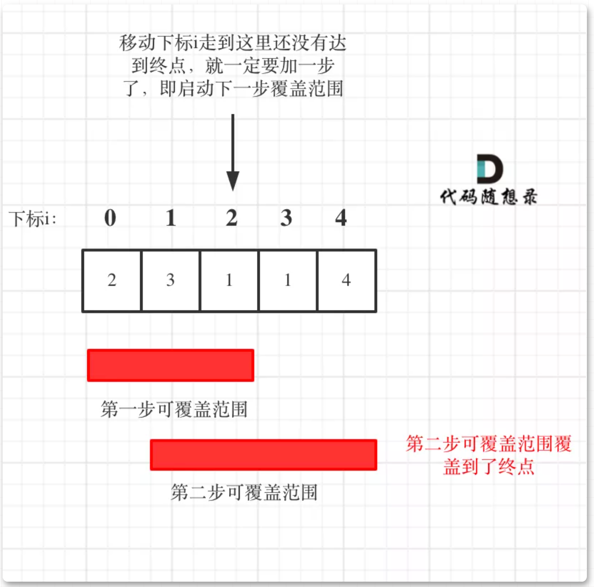</div>

  + 从图中可以看出来，就是移动下标达到了当前覆盖的最远距离下标时，步数就要加一，来增加覆盖距离。最后的步数就是最少步数。
  + 这里还是有个特殊情况需要考虑，当移动下标达到了当前覆盖的最远距离下标时
    - 如果当前覆盖最远距离下标不是是集合终点，步数就加一，还需要继续走。
    - 如果当前覆盖最远距离下标就是是集合终点，步数不用加一，因为不能再往后走了。

+ **代码实现：**

  ```c++
  class Solution {
  public:
      int jump(vector<int>& nums) {
          if (nums.size() == 1) return 0;
          int curDistance = 0;    // 当前覆盖最远距离下标
          int ans = 0;            // 记录走的最大步数
          int nextDistance = 0;   // 下一步覆盖最远距离下标
          for (int i = 0; i < nums.size(); i++) {
              nextDistance = max(nums[i] + i, nextDistance);  // 更新下一步覆盖最远距离下标
              if (i == curDistance) {                         // 遇到当前覆盖最远距离下标
                  if (curDistance != nums.size() - 1) {       // 如果当前覆盖最远距离下标不是终点
                      ans++;                                  // 需要走下一步
                      curDistance = nextDistance;             // 更新当前覆盖最远距离下标（相当于加油了）
                      if (nextDistance >= nums.size() - 1) break; // 下一步的覆盖范围已经可以达到终点，结束循环
                  } else break;                               // 当前覆盖最远距离下标是集合终点，不用做ans++操作了，直接结束
              }
          }
          return ans;
      }
  };
  ```


### 7. 加油站(134)

> 在一条环路上有 N 个加油站，其中第 i 个加油站有汽油 gas[i] 升。
>
> 你有一辆油箱容量无限的的汽车，从第 i 个加油站开往第 i+1 个加油站需要消耗汽油 cost[i] 升。你从其中的一个加油站出发，开始时油箱为空。
>
> 如果你可以绕环路行驶一周，则返回出发时加油站的编号，否则返回 -1。
>
> 说明:
>
> - 如果题目有解，该答案即为唯一答案。
> - 输入数组均为非空数组，且长度相同。
> - 输入数组中的元素均为非负数。

+ **示例：**

  <div align = center>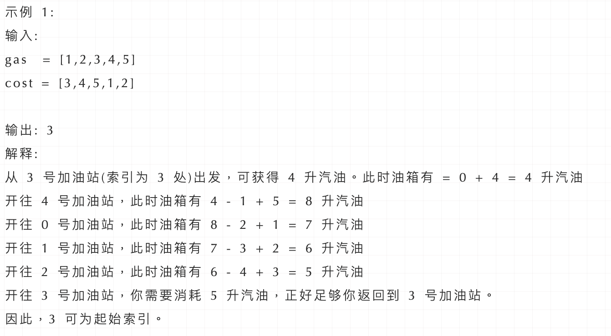</div>

+ **思路：**

  + 首先如果总油量减去总消耗大于等于零那么一定可以跑完一圈，说明 各个站点的加油站 剩油量rest[i]相加一定是大于等于零的。
  + 每个加油站的剩余量rest[i]为gas[i] - cost[i]。
  + i从0开始累加rest[i]，和记为curSum，一旦curSum小于零，说明[0, i]区间都不能作为起始位置，起始位置从i+1算起，再从0计算curSum。

+ **代码实现：**

  ```c++
  class Solution {
  public:
      int canCompleteCircuit(vector<int>& gas, vector<int>& cost) {
          int curSum = 0;
          int totalSum = 0;
          int start = 0;
          for (int i = 0; i < gas.size(); i++) {
              curSum += gas[i] - cost[i];
              totalSum += gas[i] - cost[i];
              if (curSum < 0) {   // 当前累加rest[i]和 curSum一旦小于0
                  start = i + 1;  // 起始位置更新为i+1
                  curSum = 0;     // curSum从0开始
              }
          }
          if (totalSum < 0) return -1; // 说明怎么走都不可能跑一圈了
          return start;
      }
  };
  ```


### 8.柠檬水找零(860)

> 在柠檬水摊上，每一杯柠檬水的售价为 5 美元。
>
> 顾客排队购买你的产品，（按账单 bills 支付的顺序）一次购买一杯。
>
> 每位顾客只买一杯柠檬水，然后向你付 5 美元、10 美元或 20 美元。你必须给每个顾客正确找零，也就是说净交易是每位顾客向你支付 5 美元。
>
> 注意，一开始你手头没有任何零钱。
>
> 如果你能给每位顾客正确找零，返回 true ，否则返回 false 。

+ **示例：**

  <div align = center>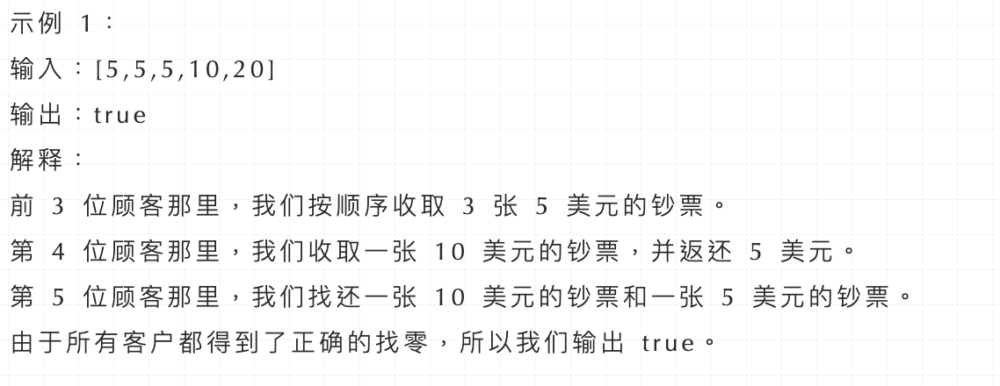</div>

+ **思路：**

  + 有如下三种情况：
    - 情况一：账单是5，直接收下。
    - 情况二：账单是10，消耗一个5，增加一个10
    - 情况三：账单是20，优先消耗一个10和一个5，如果不够，再消耗三个5
  + **「因为美元10只能给账单20找零，而美元5可以给账单10和账单20找零，美元5更万能！」**
  + 所以局部最优：遇到账单20，优先消耗美元10，完成本次找零。全局最优：完成全部账单的找零。

+ **代码实现：**

  ```c++
  class Solution {
  public:
      bool lemonadeChange(vector<int>& bills) {
          int five = 0, ten = 0, twenty = 0;
          for (int bill : bills) {
              // 情况一
              if (bill == 5) five++;
              // 情况二
              if (bill == 10) {
                  if (five <= 0) return false;
                  ten++;
                  five--;
              }
              // 情况三
              if (bill == 20) {
                  // 优先消耗10美元，因为5美元的找零用处更大，能多留着就多留着
                  if (five > 0 && ten > 0) {
                      five--;
                      ten--;
                      twenty++; // 其实这行代码可以删了，因为记录20已经没有意义了，不会用20来找零
                  } else if (five >= 3) {
                      five -= 3;
                      twenty++; // 同理，这行代码也可以删了
                  } else return false;
              }
          }
          return true;
      }
  };
  ```

### 9.分发糖果(135)

> 老师想给孩子们分发糖果，有 N 个孩子站成了一条直线，老师会根据每个孩子的表现，预先给他们评分。
>
> 你需要按照以下要求，帮助老师给这些孩子分发糖果：
>
> - 每个孩子至少分配到 1 个糖果。
> - 相邻的孩子中，评分高的孩子必须获得更多的糖果。
>
> 那么这样下来，老师至少需要准备多少颗糖果呢？

+ **示例：**

  <div align = center>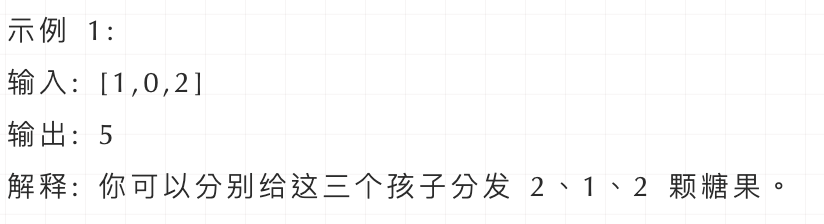</div>

+ **思路：**

  + 这道题目一定是要确定一边之后，再确定另一边，例如比较每一个孩子的左边，然后再比较右边，**「如果两边一起考虑一定会顾此失彼」**。先确定右边评分大于左边的情况（也就是从前向后遍历）

  + 此时局部最优：只要右边评分比左边大，右边的孩子就多一个糖果，全局最优：相邻的孩子中，评分高的右孩子获得比左边孩子更多的糖果

  + 局部最优可以推出全局最优。

  + 如果ratings[i] > ratings[i - 1] 那么[i]的糖 一定要比[i - 1]的糖多一个，所以贪心：candyVec[i] = candyVec[i - 1] + 1

    <div align = center>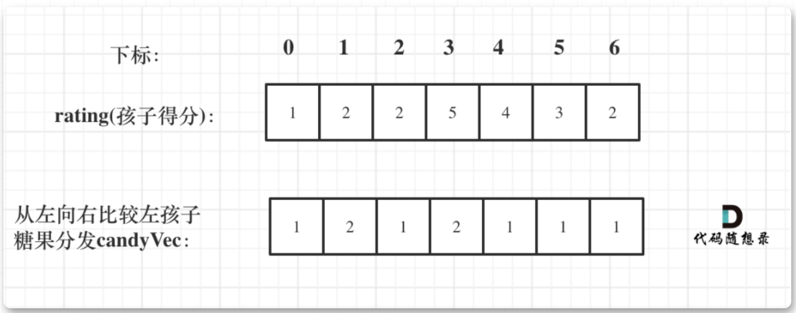</div>

  + 再确定左孩子大于右孩子的情况（从后向前遍历）：如果 ratings[i] > ratings[i + 1]，此时candyVec[i]（第i个小孩的糖果数量）就有两个选择了，一个是candyVec[i + 1] + 1（从右边这个加1得到的糖果数量），一个是candyVec[i]（之前比较右孩子大于左孩子得到的糖果数量）。

    <div align = center>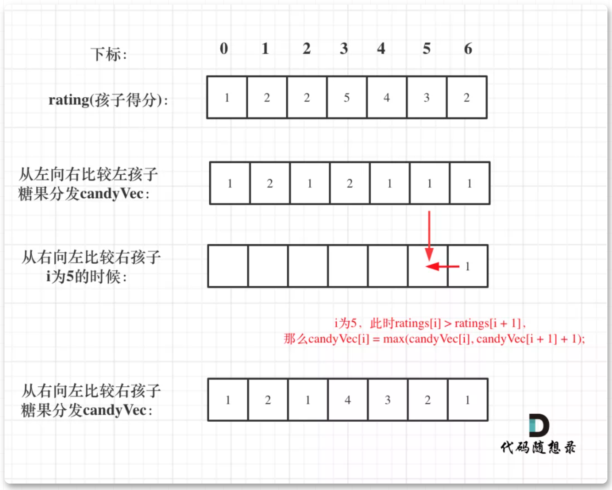</div>

+ **代码实现：**

  ```c++
  class Solution {
  public:
      int candy(vector<int>& ratings) {
          vector<int> candyVec(ratings.size(), 1);
          // 从前向后
          for (int i = 1; i < ratings.size(); i++) {
              if (ratings[i] > ratings[i - 1]) candyVec[i] = candyVec[i - 1] + 1;
          }
          // 从后向前
          for (int i = ratings.size() - 2; i >= 0; i--) {
              if (ratings[i] > ratings[i + 1] ) {
                  candyVec[i] = max(candyVec[i], candyVec[i + 1] + 1);
              }
          }
          // 统计结果
          int result = 0;
          for (int i = 0; i < candyVec.size(); i++) result += candyVec[i];
          return result;
      }
  };
  ```

  

### 10.根据身高重建队列(406)

> 假设有打乱顺序的一群人站成一个队列，数组 people 表示队列中一些人的属性（不一定按顺序）。每个 people[i] = [hi, ki] 表示第 i 个人的身高为 hi ，前面 正好 有 ki 个身高大于或等于 hi 的人。
>
> 请你重新构造并返回输入数组 people 所表示的队列。返回的队列应该格式化为数组 queue ，其中 queue[j] = [hj, kj] 是队列中第 j 个人的属性（queue[0] 是排在队列前面的人）。

+ **示例：**

  <div align = center>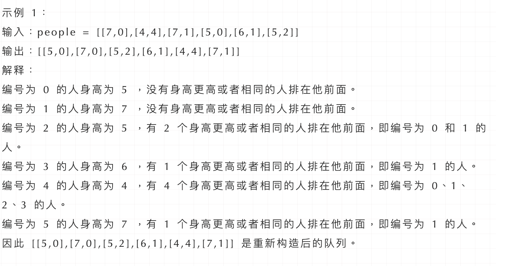</div>


+ **思路：**

  + 本题有两个维度，h和k，<span style="color:red;">  **「看到这种题目一定要想如何确定一个维度，然后在按照另一个维度重新排列。」**</span> 会发现此题和 贪心算法：分发糖果 有点点的像。

  + 按照身高h来排序，身高一定是从大到小排（身高相同的话则k小的站前面），让高个子在前面。 **「此时我们可以确定一个维度了，就是身高，前面的节点一定都比本节点高！」** 那么只需要按照k为下标重新插入队列就可以了。以图中{5,2} 为例：

    <div align = center>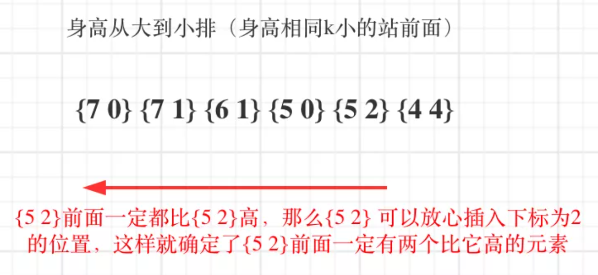</div>

  + 按照身高排序之后，优先按身高高的people的k来插入，后序插入节点也不会影响前面已经插入的节点，最终按照k的规则完成了队列。所以在按照身高从大到小排序后：

    **「局部最优：优先按身高高的people的k来插入。插入操作过后的people满足队列属性」**

    **「全局最优：最后都做完插入操作，整个队列满足题目队列属性」**

  + 局部最优可推出全局最优，找不出反例，那就试试贪心。排序完的people： [[7,0], [7,1], [6,1], [5,0], [5,2]，[4,4]]

    + 插入的过程：插入[7,0]：[[7,0]]
    + 插入[7,1]：[[7,0],[7,1]]
    + 插入[6,1]：[[7,0],[6,1],[7,1]]
    + 插入[5,0]：[[5,0],[7,0],[6,1],[7,1]]
    + 插入[5,2]：[[5,0],[7,0],[5,2],[6,1],[7,1]]
    + 插入[4,4]：[[5,0],[7,0],[5,2],[6,1],[4,4],[7,1]]

  + 此时就按照题目的要求完成了重新排列。

+ **代码实现：**

  ```c++
  // 版本一
  class Solution {
  public:
      static bool cmp(const vector<int> a, const vector<int> b) {
          if (a[0] == b[0]) return a[1] < b[1];
          return a[0] > b[0];
      }
      vector<vector<int>> reconstructQueue(vector<vector<int>>& people) {
          sort (people.begin(), people.end(), cmp);
          vector<vector<int>> que;
          for (int i = 0; i < people.size(); i++) {
              int position = people[i][1];
              que.insert(que.begin() + position, people[i]);
          }
          return que;
      }
  };
  ```

  

### 11.用最少数量的箭引爆气球(452)

> 在二维空间中有许多球形的气球。对于每个气球，提供的输入是水平方向上，气球直径的开始和结束坐标。
>
> 由于它是水平的，所以纵坐标并不重要，因此只要知道开始和结束的横坐标就足够了。开始坐标总是小于结束坐标。
>
> 一支弓箭可以沿着 x 轴从不同点完全垂直地射出。在坐标 x 处射出一支箭，若有一个气球的直径的开始和结束坐标为 xstart，xend， 且满足  xstart ≤ x ≤ xend，则该气球会被引爆。
>
> 可以射出的弓箭的数量没有限制。弓箭一旦被射出之后，可以无限地前进。我们想找到使得所有气球全部被引爆，所需的弓箭的最小数量。
>
> 给你一个数组 points ，其中 points [i] = [xstart,xend] ，返回引爆所有气球所必须射出的最小弓箭数。

+ **示例：**

  <div align = center>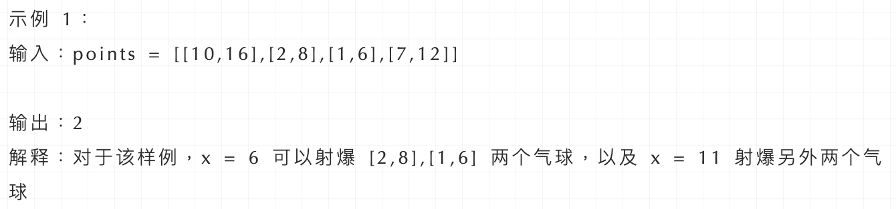</div>

+ **思路：**

  + **局部最优：当气球出现重叠，一起射，所用弓箭最少。全局最优：把所有气球射爆所用弓箭最少。**

  + **「为了让气球尽可能的重叠，需要对数组进行排序」**。按照气球的起始位置排序。

  + **「如果气球重叠了，重叠气球中右边边界的最小值 之前的区间一定需要一个弓箭」**。

  + 以题目示例：[[10,16],[2,8],[1,6],[7,12]]为例，如图：（方便起见，已经排序）

    <div align = center>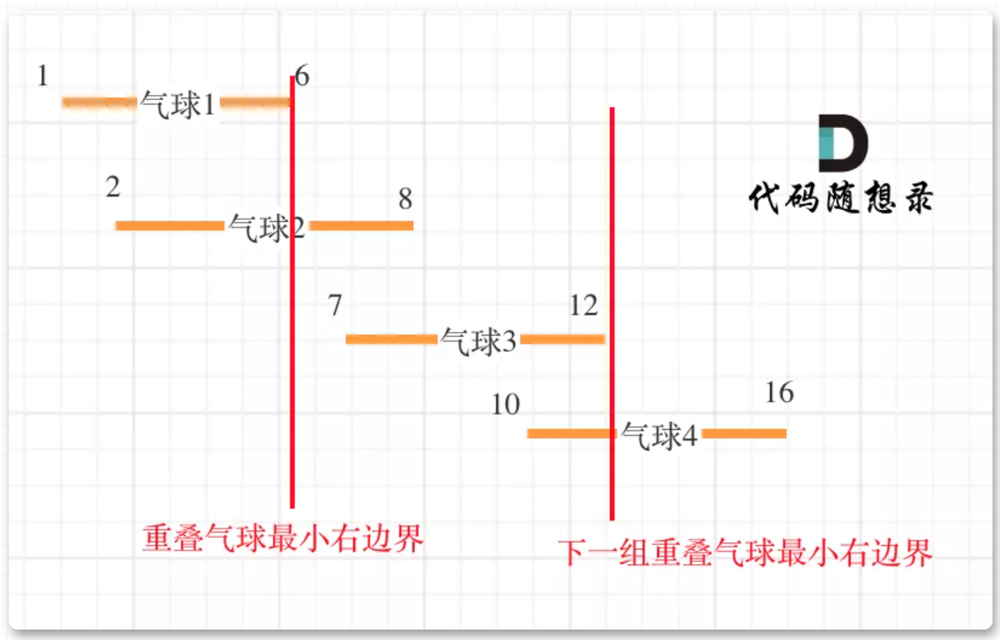</div>

  + 可以看出首先第一组重叠气球，一定是需要一个箭，气球3，的左边界大于了 第一组重叠气球的最小右边界，所以再需要一支箭来射气球3了。

+ **实现代码：**

  ```c++
  class Solution {
  private:
      static bool cmp(const vector<int>& a, const vector<int>& b) {
          return a[0] < b[0];
      }
  public:
      int findMinArrowShots(vector<vector<int>>& points) {
          if (points.size() == 0) return 0;
          sort(points.begin(), points.end(), cmp);
  
          int result = 1; // points 不为空至少需要一支箭
          for (int i = 1; i < points.size(); i++) {
              if (points[i][0] > points[i - 1][1]) {  // 气球i和气球i-1不挨着，注意这里不是>=
                  result++; // 需要一支箭
              }
              else {  // 气球i和气球i-1挨着
                  points[i][1] = min(points[i - 1][1], points[i][1]); // 更新重叠气球最小右边界
              }
          }
          return result;
      }
  };
  ```

  

