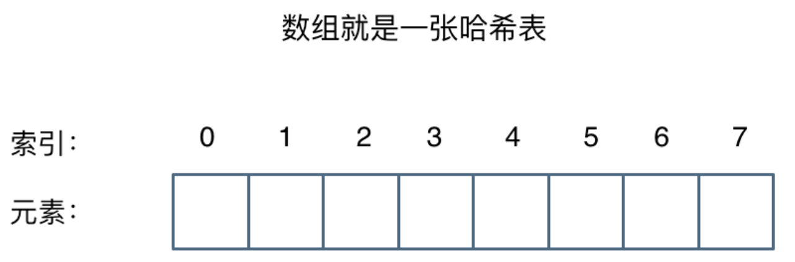
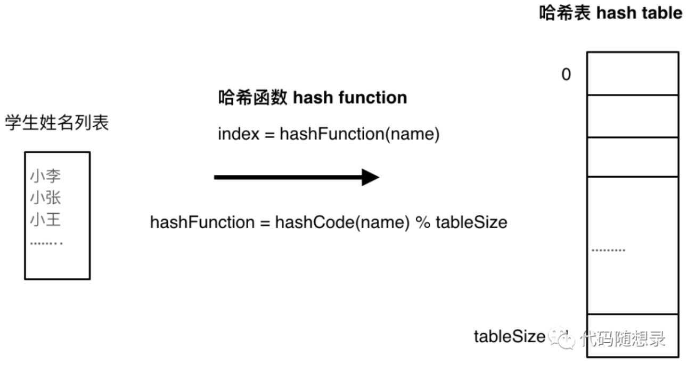
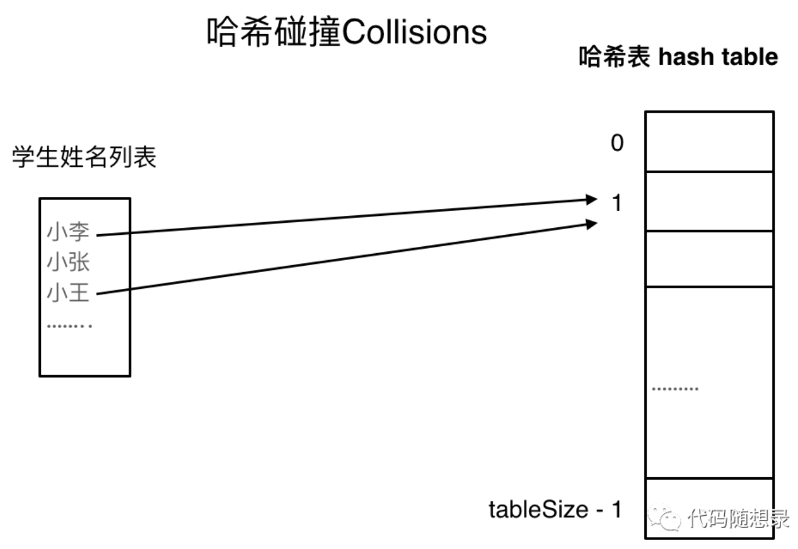
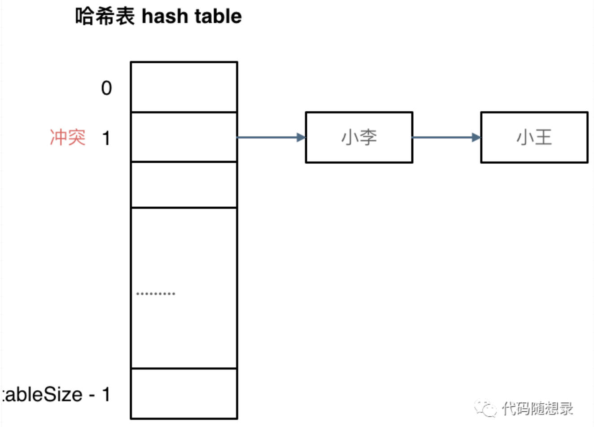
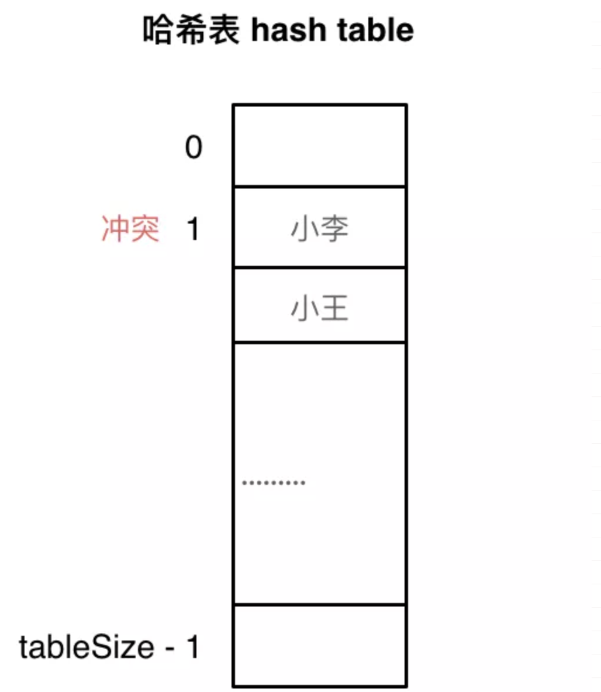

## 一.哈希表算法

### 1.哈希表

哈希表是 **根据关键码的值而直接进行访问的数据结构。**

> 哈希表（英文名字为Hash table，国内也有一些算法书籍翻译为散列表，大家看到这两个名称知道都是指hash table就可以了）

其实直白来讲其实数组就是一张哈希表。 **哈希表中关键码就是数组的索引下表，然后通过下表直接访问数组中的元素，** 如下图所示：

<div align="center">  
   
</div>


那么哈希表能解决什么问题呢，**<font color = red>「一般哈希表都是用来快速判断一个元素是否出现集合里。」</font>**

例如要查询一个名字是否在这所学校里。要枚举的话时间复杂度是O(n)，但如果使用哈希表的话， 只需要O(1) 就可以做到。

我们只需要初始化把这所学校里学生的名字都存在哈希表里，在查询的时候通过索引直接就可以知道这位同学在不在这所学校里了。将学生姓名映射到哈希表上就涉及到了**「hash function ，也就是哈希函数」**。

### 2.哈希函数

哈希函数，把学生的姓名直接映射为哈希表上的索引，然后就 **可以通过查询索引下表快速知道这位同学是否在这所学校里了。**

哈希函数如下图所示，通过hashCode把名字转化为数值，一般hashcode是通过特定编码方式，可以将其他数据格式转化为不同的数值，这样就把学生名字映射为哈希表上的索引数字了。

<div align="center">  
   
</div>


如果hashCode得到的数值大于哈希表的大小了，也就是大于tableSize了，怎么办呢？

**<font color = red>此时为了保证映射出来的索引数值都落在哈希表上，我们会在再次对数值做一个取模的操作，就要我们就保证了学生姓名一定可以映射到哈希表上了。</font>**

此时问题又来了，如果元素数量大于哈希表的大小，避免不了会有元素同时映射到同一个索引下表的位置。这就涉及到**「哈希碰撞」**。

### 3.哈希碰撞

如图所示，小李和小王都映射到了索引下表 1的位置，**「这一现象叫做哈希碰撞」**。

<div align="center">  
   
</div>


一般哈希碰撞有两种解决方法， 拉链法和线性探测法。

#### (1).拉链法

刚刚小李和小王在索引1的位置发生了冲突，发生冲突的元素都被存储在链表中。这样我们就可以通过索引找到小李和小王了

<div align="center">  
   
</div>


> （数据规模是dataSize， 哈希表的大小为tableSize）

其实拉链法就是要选择适当的哈希表的大小，这样既不会因为数组空值而浪费大量内存，也不会因为链表太长而在查找上浪费太多时间。

#### (2).线性探测法

**使用线性探测法，<font color=red>一定要保证tableSize大于dataSize</font>。我们需要依靠哈希表中的空位来解决碰撞问题。**

例如冲突的位置，放了小李，那么就向下找一个空位放置小王的信息。所以要求tableSize一定要大于dataSize ，要不然哈希表上就没有空置的位置来存放 冲突的数据了。如图所示：

<div align="center">  
   
</div>


### 4.常见的哈希结构

当我们想使用哈希法来解决问题的时候，我们一般会选择如下三种数据结构。

- 数组
- set（集合）
- map（映射）

实现在C++中，set 和 map 分别提供了以下三种数据结构，其底层实现以及优劣如下表所示：

| 集合                 | 底层实现 | 是否有序 | 数值是否可以重复 | 能否更改数值 | 查询效率   | 增删效率   |
| -------------------- | -------- | -------- | ---------------- | ------------ | ---------- | ---------- |
| `std::set`           | 红黑树   | 有序     | 否               | 否           | $O(log_n)$ | $O(log_n)$ |
| `std::multiset`      | 红黑树   | 有序     | 是               | 否           | $O(log_n)$ | $O(log_n)$ |
| `std::unordered_set` | 哈希表   | 无序     | 否               | 否           | $O(1)$     | $O(1)$     |

`std::unordered_set`底层实现为哈希表，`std::set` 和`std::multiset` 的底层实现是红黑树， **<font color = red>红黑树是一种平衡二叉搜索树，所以key值是有序的，但key不可以修改，改动key值会导致整棵树的错乱，所以只能删除和增加。</font>**

| 映射                 | 底层实现 | 是否有序 | 数值是否可以重复 | 能否更改数值 | 查询效率   | 增删效率   |
| -------------------- | -------- | -------- | ---------------- | ------------ | ---------- | ---------- |
| `std::map`           | 红黑树   | Key有序  | key不可重复      | key不可修改  | $O(log_n)$ | $O(log_n)$ |
| `std::multimap`      | 红黑树   | Key有序  | key可重复        | key不可修改  | $O(log_n)$ | $O(log_n)$ |
| `std::unordered_map` | 哈希表   | Key无序  | key不可重复      | key不可修改  | $O(1)$     | $O(1)$     |

`std::unordered_map` 底层实现为哈希表，`std::map` 和`std::multimap` 的底层实现是红黑树。同理，`std::map` 和`std::multimap` 的key也是有序的（这个问题也经常作为面试题，考察对语言容器底层的理解）。

当我们要使用集合来解决哈希问题的时候，优先使用unordered_set，因为它的查询和增删效率是最优的，如果需要集合是有序的，那么就用set，如果要求不仅有序还要有重复数据的话，那么就用multiset。

那么再来看一下map ，在map 是一个key value 的数据结构，map中，对key是有限制，对value没有限制的，因为key的存储方式使用红黑树实现的。

### 5.关联容器的方法

#### (1).map

map 是关联容器，按照特定顺序存储由 key value (键值) 和 mapped value (映射值) 组合形成的元素。

| 方法        | 含义                                                         |
| ----------- | ------------------------------------------------------------ |
| map         | 构造函数                                                     |
| begin       | 返回引用容器中第一个元素的迭代器                             |
| key_comp    | 返回容器用于比较键的比较对象的副本                           |
| value_comp  | 返回可用于比较两个元素的比较对象，以获取第一个元素的键是否在第二个元素之前 |
| find        | 在容器中搜索具有等于 k（参数）的键的元素，如果找到则返回一个迭代器，否则返回 map::end 的迭代器 |
| count       | 在容器中搜索具有等于 k（参数）的键的元素，并返回匹配的数量   |
| lower_bound | 返回一个非递减序列 `[first, last)`（参数）中的第一个大于等于值 val（参数）的位置的迭代器 |
| upper_bound | 返回一个非递减序列 `[first, last)`（参数）中第一个大于 val（参数）的位置的迭代器 |
| equal_range | 获取相同元素的范围，返回包含容器中所有具有与 k（参数）等价的键的元素的范围边界（`pair< map<char,int>::iterator, map<char,int>::iterator >`） |

### 6.总结

总结一下，**<font color = red>当我们遇到了要快速判断一个元素是否出现集合里的时候，就要考虑哈希法</font>**。

但是哈希法也是**牺牲了空间换取了时间**，因为我们要使用额外的数组，set或者是map来存放数据，才能实现快速的查找。

---

## 二.Boyer-Moore 投票算法

Boyer-Moore 算法的详细步骤：

+ 我们维护一个候选众数 candidate 和它出现的次数 count。初始时 candidate 可以为任意值，count 为 0；

+ 我们遍历数组 nums 中的所有元素，对于每个元素 x，在判断 x 之前，如果 count 的值为 0，我们先将 x 的值赋予 candidate，随后我们判断 x：
  + 如果 x 与 candidate 相等，那么计数器 count 的值增加 1；
  + 如果 x 与 candidate 不等，那么计数器 count 的值减少 1。

在遍历完成后，candidate 即为整个数组的众数。

#### [169. 多数元素](https://leetcode-cn.com/problems/majority-element/)

> 给定一个大小为 *n* 的数组，找到其中的多数元素。多数元素是指在数组中出现次数 **大于** `⌊ n/2 ⌋` 的元素。

```c++
int majorityElement(vector<int>& nums) {
    int count = 0;
    int candidate = -1;
    for(auto num : nums) {
        if(candidate == num)
            ++count;
        else if(--count < 0) {
            candidate = num;
            count = 1;
        }
    }
    return candidate;
}
```


超过n/3的数最多只能有两个。先选出两个候选人A,B。 遍历数组，分三种情况：

+ 如果投A（当前元素等于A），则A的票数++;

+ 如果投B（当前元素等于B），B的票数++；
+ 如果A,B都不投（即当前与A，B都不相等）,那么检查此时A或B的票数是否减为0：
  + 如果为0,则当前元素成为新的候选人；
  + 如果A,B两个人的票数都不为0，那么A,B两个候选人的票数均减一；

遍历结束后选出了两个候选人，但是这两个候选人是否满足>n/3，还需要再遍历一遍

```c++
vector<int> majorityElement(vector<int>& nums) {
    vector<int> res;
    //初始化：定义两个候选人及其对应的票数
    int countA = 0;
    int countB = 0;
    int candidateA = nums[0];
    int candidateB = nums[0];
    //遍历数组
    for(auto num : nums) {
        //投A
        if(candidateA == num) {
            countA ++;
            continue;
        }
        //投B
        if(candidateB == num) {
            countB ++;
            continue;
        }
        if(countA == 0) {
            countA = 1;
            candidateA = num;
            continue;
        }
        if(countB == 0) {
            countB = 1;
            candidateB = num;
            continue;
        }
        countA --;
        countB --;   
    }
    //上一轮遍历找出了两个候选人，但是这两个候选人是否均满足票数大于N/3仍然没法确定，需要重新遍历，确定票数
    countA = 0;
    countB = 0;
    for(auto num : nums) {
        if(num == candidateA)
            ++countA;
        if(num == candidateB)
            ++countB;
    }
    if(countA > nums.size() / 3)
        res.push_back(candidateA);
    if(candidateA != candidateB && countB > nums.size() / 3)
        res.push_back(candidateB);
    return res;
}
```


---

## 三.例题解剖

#### 遍历关联容器

```c++
unordered_map<char,int>::iterator iter = map.begin();
for(auto it = iter; it != map.end(); ++it) {
		cout << it->first << ":" << it->second << endl;
}
```

#### [347. 前 K 个高频元素](https://leetcode-cn.com/problems/top-k-frequent-elements/)

> 给你一个整数数组 `nums` 和一个整数 `k` ，请你返回其中出现频率前 `k` 高的元素。你可以按 **任意顺序** 返回答案。

+ 利用unordered_map进行遍历统计，创建vector存储
+ 然后将根据map的value_type将vector进行排序
+ 输出前K个key_value值

```c++
vector<int> topKFrequent(vector<int>& nums, int k) {
    unordered_map<int,int> map;
    for(auto num : nums) 
        map[num]++;
    
    vector<pair<int, int>> vtMap;
    for (auto it = map.begin(); it != map.end(); it++)
        vtMap.push_back(make_pair(it->first, it->second));
  
    sort(vtMap.begin(), vtMap.end(),
        [](const pair<int, int> &x, const pair<int, int> &y) -> int {
            return x.second > y.second;
        });

    vector<int> res;
    for(int i = 0; i < k; ++i) {
        auto it = (vtMap.begin() + i);
        res.push_back(it->first);
    }

    return res;
}
```


#### [1002. 查找常用字符](https://leetcode-cn.com/problems/find-common-characters/)

> 给定仅有小写字母组成的字符串数组 A，返回列表中的每个字符串中都显示的全部字符（包括重复字符）组成的列表。例如，如果一个字符在每个字符串中出现 3 次，但不是 4 次，则需要在最终答案中包含该字符 3 次。

+ 如果字符 c 在所有字符串中均出现了 k 次及以上，那么最终答案中需要包含 k 个 c。因此，我们可以使用 minfreq[c] 存储字符 c 在所有字符串中出现次数的最小值。

+ 依次遍历每一个字符串。当遍历到字符串 s 时，使用 freq[c] 统计 s 中每一个字符 c 出现的次数。在统计完成之后，再将每一个 minfreq[c] 更新为其本身与 freq[c] 的较小值。这样一来，当遍历完所有字符串后，minfreq[c] 就存储了字符 c 在所有字符串中出现次数的最小值。


```c++
vector<string> commonChars(vector<string>& words) {
    vector<int> minfreq(26, INT_MAX);
    vector<int> freq(26);
    for(auto word : words) {
      	//遍历之前都让freq重新赋为0
        fill(freq.begin(), freq.end(), 0);
        for(auto c : word) 
            freq[c - 'a']++;
        for(int i = 0; i< 26; ++i) 
          	//每次遍历都更新minfreq，保证结束后是每个字符串中都存在的字符
            minfreq[i] = min(freq[i], minfreq[i] );
    }
    vector<string> res;
  	//将结果转换为字符串
    for(int i = 0; i < 26; ++i) {
        for(int j = 0; j < minfreq[i]; ++j) 
            res.emplace_back(1,'a' + i);
    }
    return res;
}
```

#### :large_orange_diamond:set[349. 两个数组的交集](https://leetcode-cn.com/problems/intersection-of-two-arrays/)

> 给定两个数组，编写一个函数来计算它们的交集。

+ 注意题目特意说明：**输出结果中的每个元素一定是唯一的，也就是说输出的结果的去重的， 同时可以不考虑输出结果的顺序**
+ `std::set`和`std::multiset`底层实现都是红黑树，`std::unordered_set`的底层实现是哈希表， 使用`unordered_set `读写效率是最高的，并不需要对数据进行排序，而且还不要让数据重复，所以选择`unordered_set`。

```c++
vector<int> intersection(vector<int>& nums1, vector<int>& nums2) {
    unordered_set<int> res_set;
    //将数组1中的元素导入nums_set中
    unordered_set<int> nums_set (nums1.begin(), nums1.end());
    //将nums2中的每个元素在nums_set中进行查找，如果存在，则导入res_set中
    for(auto num : nums2) {
        if(nums_set.find(num) != nums_set.end())
            res_set.insert(num);
    }
    return vector<int> (res_set.begin(), res_set.end());
}
```

#### :large_orange_diamond: [202. 快乐数](https://leetcode-cn.com/problems/happy-number/)

> 编写一个算法来判断一个数 n 是不是快乐数。
>
> + 对于一个正整数，每一次将该数替换为它每个位置上的数字的平方和。
> + 然后重复这个过程直到这个数变为 1，也可能是 无限循环 但始终变不到 1。
> + 如果 可以变为  1，那么这个数就是快乐数。

+ **当遇到了要快速判断一个元素是否出现集合里的时候，就要考虑哈希法了。**
+ 所以这道题目使用哈希法，来判断这个sum是否重复出现，如果重复了就是return false， 否则一直找到sum为1为止。
+ 判断sum是否重复出现就可以使用unordered_set。

```c++
int getsum(int n) {
    int sum = 0;
    while(n) {
        sum += (n%10) * (n%10);
        n = n / 10;
    }
    return sum;
}
bool isHappy(int n) {
    unordered_set<int> set;
    int sum;
    while(1) {
        sum = getsum(n);
        if(sum == 1) 
            return true;
        if(set.find(sum) != set.end()) 
            return false;
        else
            set.insert(sum);
        n = sum;
    }
}
```

#### [剑指 Offer 03. 数组中重复的数字](https://leetcode-cn.com/problems/shu-zu-zhong-zhong-fu-de-shu-zi-lcof/)

+  **算法流程**
   1. 初始化： 新建无序哈希表maps ；

   2. 遍历数组 nums 中的每个数字 num ：
      + 当 num 在 maps 中，说明重复，直接返回 num ；
      + 不在 maps ，则将 num 添加至 maps 中；

   3. 返回 -1 。本题中一定有重复数字，因此这里返回多少都可以。

+  **复杂度分析：**

   + 时间复杂度 O(N) ： 遍历数组使用 O(N) ，maps 添加与查找元素皆为 O(1) 。
   + 空间复杂度 O(N) ： maps 占用 O(N) 大小的额外空间。

```c++
class Solution {
public:
    int findRepeatNumber(vector<int>& nums) {
        unordered_map<int, int> maps;
        for(auto num : nums) {
            if(maps[num] < 1)
                maps[num] ++;
            else
                return num;
        }
        return -1;
    }
};
```

#### [454. 四数相加 II](https://leetcode-cn.com/problems/4sum-ii/)

> 给定四个包含整数的数组列表 A , B , C , D ,计算有多少个元组 (i, j, k, l) ，使得 A[i] + B[j] + C[k] + D[l] = 0。

1. 首先定义 一个unordered_map，key放a和b两数之和，value 放a和b两数之和出现的次数。
2. 遍历大A和大B数组，统计两个数组元素之和，和出现的次数，放到map中。
3. 定义int变量count，用来统计a+b+c+d = 0 出现的次数。
4. 在遍历大C和大D数组，找到如果 0-(c+d) 在map中出现过的话，就用count把map中key对应的value也就是出现次数统计出来。
5. 最后返回统计值 count 就可以了

```c++
int fourSumCount(vector<int>& nums1, vector<int>& nums2, vector<int>& nums3, vector<int>& nums4) {
    unordered_map<int,int> map;
    for(auto a : nums1) 
        for(auto b : nums2) 
            map[a+b]++;
  
    int count = 0;
    for(auto c : nums3)
        for(auto d : nums4) 
            if(map.find(0-c-d) != map.end())
                count += map[0-c-d];
    return count;
}
```

#### :diamond_shape_with_a_dot_inside: [73. 矩阵置零](https://leetcode-cn.com/problems/set-matrix-zeroes/)

> 给定一个 `m * n` 的矩阵，如果一个元素为 **0** ，则将其所在行和列的所有元素都设为 **0** 。请使用 原地 算法**。**

+ 只使用一个标记变量记录第一列是否原本存在 0。
+ 这样，第一列的第一个元素即可以标记第一行是否出现 0。
+ 但为了防止每一列的第一个元素被提前更新，我们需要从最后一行开始，倒序地处理矩阵元素。

```c++
void setZeroes(vector<vector<int>>& matrix) {
    int m = matrix.size();
    int n = matrix[0].size();
    int flag_col0 = false;
    //遍历行数
    for (int i = 0; i < m; i++) {
        //如果第一列没有0，则flag_col0为真
        if (!matrix[i][0]) {
            flag_col0 = true;
        }
        //从第二列开始，如果出现0，则对应的行与列都为0
        for (int j = 1; j < n; j++) {
            if (!matrix[i][j]) {
                matrix[i][0] = matrix[0][j] = 0;
            }
        }
    }
    //从最后一行开始遍历
    for (int i = m - 1; i >= 0; i--) {
        //还是从第一列开始遍历
        for (int j = 1; j < n; j++) {
            //如果出现 行首 或者 列首 出现0，该行和列每个成员都为0
            if (!matrix[i][0] || !matrix[0][j]) {
                matrix[i][j] = 0;
            }
        }
        //如果第一列出现0，则该列都为0
        if (flag_col0) {
            matrix[i][0] = 0;
        }
    }
}
```

#### [面试题 17.05.  字母与数字](https://leetcode-cn.com/problems/find-longest-subarray-lcci/)
