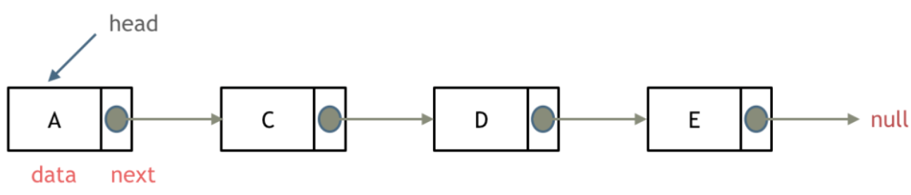
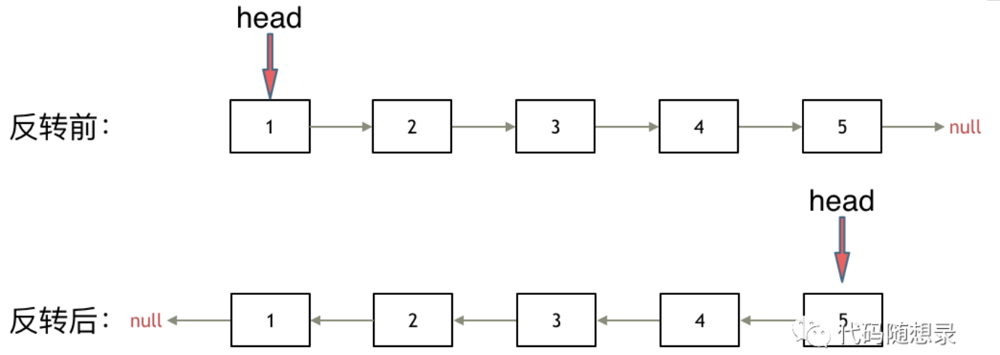
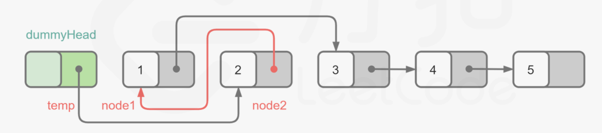
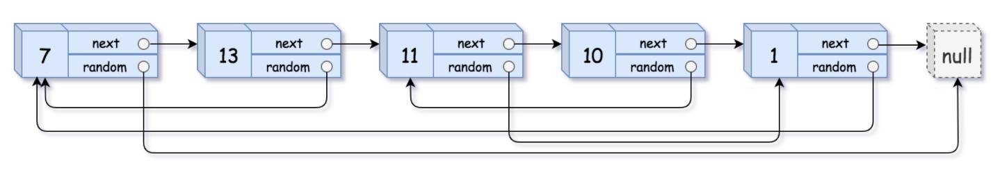

## 一.单链表操作

### 1.单链表结构

<div align = center></div>

### 2.单链表创建与实现

```c++
//List_LeetCode.h
// Created by 张永斌 on 2021/4/22.
//
#ifndef DATASTRUCTURE_LIST_LEETCODE_H
#define DATASTRUCTURE_LIST_LEETCODE_H

#include <iostream>

class ListNode {
public:
    int value;
    ListNode* next;
    ListNode() : value(0), next(nullptr) {}
    ListNode(int val) : value(val), next(nullptr) {}
    ListNode(int val, ListNode* node) : value(val), next(node) {}
};

//创建链表
ListNode* CreateList(std::vector<int> nums);
//打印链表
void PrintList(ListNode* head);
//插入结点
bool InsertNode(ListNode* head, ListNode* node, const int& index);
//插入数据元素
bool InsertNode(ListNode* head, const int& val, const int& index);
//删除数据元素
bool DeleteNode(ListNode* head, const int& val);
//查找数据元素
int FindNode(ListNode* head, const int& val);
//返回链表长度
int ListLength(ListNode* head);
//清除链表
void clear(ListNode* head);

#endif //DATASTRUCTURE_LIST_LEETCODE_H
```

```c++
//List_LeetCode.cpp
//
// Created by 张永斌 on 2021/4/22.
//

#include "List_LeetCode.h"
#include <vector>

//创建链表
ListNode* CreateList(std::vector<int> nums) {
    ListNode* dummeryNode = new ListNode(0);
    ListNode* p = dummeryNode;
    for (auto num : nums) {
        ListNode* temp = new ListNode(num);
        p->next = temp;
        p = temp;
    }
    return dummeryNode->next;
}

//打印链表
void PrintList(ListNode* head) {
    ListNode* p = head;
    while(p != nullptr) {
        std::cout << p->value << " ";
        p = p->next;
    }
    std::cout << std::endl;
}

//插入结点
bool InsertNode(ListNode* head, ListNode* node, const int& index) {
    bool ret = true;
    if (head == nullptr)
    {
        std::cout << "list is null.." << std::endl;
        ret = false;
    }
    else if(index < 0 && index >= ListLength(head))
    {
        std::cout << "insert index is invalid.." << std::endl;
        ret = false;
    }
    else
    {
        auto dummeryNode = new ListNode(0);
        dummeryNode->next = head;
        ListNode* p = dummeryNode;

        for (int i = 0; i < index - 1; ++i) {
            p = p->next;
        }
        node->next = p->next;
        p->next = node;

    }
    return ret;
}

//插入数据元素
bool InsertNode(ListNode* head, const int& val, const int& index) {
    auto node = new ListNode(val);
    return InsertNode(head, node, index);
}

//删除数据元素
bool DeleteNode(ListNode* head, const int& val) {
    bool ret = false;

    auto dummeryNode = new ListNode(0);
    dummeryNode->next = head;
    ListNode* p = dummeryNode;

    for (int i = 0; i < ListLength(head) && p->next != nullptr; ++i) {
        if(p->next->value != val)
            p = p->next;
        else
        {
            ret = true;
            break;
        }
    }

    if(ret) {
        ListNode* temp = p->next;
        p->next = temp->next;
        free(temp);
    } else {
        std::cout << "Error ! No value = " << val << " in this list.." << std::endl;
    }
    return ret;
}

//搜索结点
int FindNode(ListNode* head, const int& val) {
    int index = 0;
    bool ret = false;
    auto dummeryNode = new ListNode(0);
    dummeryNode->next = head;
    ListNode* p = dummeryNode;

    for (int i = 0; i < ListLength(head) && p->next != nullptr; ++i) {
        if(p->next->value != val) {
            p = p->next;
            ++ index;
        } else {
            ret = true;
            break;
        }
    }
    if(!ret) {
        std::cout << "Error ! Cannot find value = " << val << " in this list.." << std::endl;
    }
    return index;
}

//链表长度
int ListLength(ListNode * head) {
    ListNode* p = head;
    int len = 0;
    while(p != nullptr) {
        ++ len;
        p = p->next;
    }
    return len;
}

//清除结点
void clear(ListNode* head) {
    ListNode* p = head;
    while(p != nullptr) {
        DeleteNode(head,p->value);
        p = p->next;
    }
}
```

---

## 二.LeetCode积累

#### [206. 反转链表](https://leetcode-cn.com/problems/reverse-linked-list/)

> 给你单链表的头节点 `head` ，请你反转链表，并返回反转后的链表。

如果再定义一个新的链表，实现链表元素的反转，其实这是对内存空间的浪费。

其实只需要改变链表的next指针的指向，直接将链表反转 ，而不用重新定义一个新的链表，如图所示:

<div align = center></div>

+ 双指针方法：

  ```c++
  ListNode* reverseList(ListNode* head) {
      ListNode* pre = nullptr;
      ListNode* cur = head;
      ListNode* temp;
      while(cur != nullptr) {
          temp = cur->next;
          cur->next = pre;
          pre = cur;
          cur = temp;
      }
      return pre;
  }
  ```
  
+ 递归方法：

  ```c++
  ListNode* reverse(ListNode* pre, ListNode* cur) {
      if(cur == nullptr) 
          return pre;
      ListNode* temp = cur->next;
      cur->next = pre;
      pre = cur;
      cur = temp;
      return reverse(pre, cur);
  }
  ListNode* reverseList(ListNode* head) {
      return reverse(nullptr, head);
  }
  ```

#### [92. 反转链表 II](https://leetcode-cn.com/problems/reverse-linked-list-ii/)

> 给你单链表的头指针 head 和两个整数 left 和 right ，其中 left <= right 。请你反转从位置 left 到位置 right 的链表节点，返回 反转后的链表 。

+ 定义leftnode指针和rightnode指针分别指向需要反转链表的两端结点
+ 定义pre,cur,temp指针，将left与right的链表进行反转
+ 最后反转完的链表重新指回leftnode与rightnode

```c++
ListNode* reverseBetween(ListNode* head, int left, int right) {
    if(head->next == nullptr) return head;
    ListNode* dummyNode = new ListNode(0);
    dummyNode->next = head;
		//定义左右结点
    ListNode* leftNode = dummyNode;
    ListNode* rightNode = head;
		//指向反转链表的；两端
    while(--left) 
        leftNode = leftNode->next;
    while(right--)
        rightNode = rightNode->next;
    
  	//定义结点进行反转
  	//最开始的pre指向rightNode
    ListNode* pre = rightNode ;
    ListNode* Cur = leftNode->next;
    ListNode* temp ;
    while(Cur != rightNode) {
      temp = Cur->next;
      Cur->next = pre;
      pre = Cur;
      Cur = temp;
    }
  	//反转完指回
    leftNode->next = pre;
    return dummyNode->next;
}
```

#### [141. 环形链表](https://leetcode-cn.com/problems/linked-list-cycle/)

> 给定一个链表，判断链表中是否有环。
>
> 如果链表中有某个节点，可以通过连续跟踪 next 指针再次到达，则链表中存在环。 为了表示给定链表中的环，我们使用整数 pos 来表示链表尾连接到链表中的位置（索引从 0 开始）。 如果 pos 是 -1，则在该链表中没有环。注意：pos 不作为参数进行传递，仅仅是为了标识链表的实际情况。
>
> 如果链表中存在环，则返回 true 。 否则，返回 false 。

定义两个指针，一快一满。慢指针每次只移动一步，而快指针每次移动两步。初始时，慢指针在位置 head，而快指针在位置 head.next。这样一来，如果在移动的过程中，快指针反过来追上慢指针，就说明该链表为环形链表。否则快指针将到达链表尾部，该链表不为环形链表。

+ 快慢指针

  ```c++
  bool hasCycle(ListNode *head) {
      ListNode *slow = head;
      ListNode *fast = head;
      while(fast != nullptr) {
          fast = fast->next;
          if(fast != nullptr) {
              fast = fast->next;
          }
          if(fast == slow) {
              return true;
          }
          slow = slow->next;
      }
      return false;
  }
  ```

#### [142. 环形链表 II](https://leetcode-cn.com/problems/linked-list-cycle-ii/)

> 给定一个链表，返回链表开始入环的第一个节点。 如果链表无环，则返回 null。
>
> 为了表示给定链表中的环，我们使用整数 pos 来表示链表尾连接到链表中的位置（索引从 0 开始）。 如果 pos 是 -1，则在该链表中没有环。注意，pos 仅仅是用于标识环的情况，并不会作为参数传递到函数中。

使用两个指针，fast 和 slow，它们起始都位于链表的头部。随后，slow 指针每次向后移动一个位置，而 fast 指针向后移动两个位置。如果链表中存在环，则 fast 指针最终将再次与 slow 指针在环中相遇。

当发现 slow 与 fast 相遇时，我们再额外使用一个指针 ptr。起始，它指向链表头部；随后，它和 slow 每次向后移动一个位置。最终，它们会在入环点相遇。

+ 快慢指针

```c++
ListNode *detectCycle(ListNode *head) {
    ListNode* fast = head;
    ListNode* slow = head;
    while(fast != NULL && fast->next != NULL) {
        slow = slow->next;
        fast = fast->next->next;
        // 快慢指针相遇，此时从head 和 相遇点，同时查找直至相遇
        if (slow == fast) {
            ListNode* index1 = fast;
            ListNode* index2 = head;
            while (index1 != index2) {
                index1 = index1->next;
                index2 = index2->next;
            }
            return index2; // 返回环的入口
        }
    }
    return NULL;
}
```

#### [234. 回文链表](https://leetcode-cn.com/problems/palindrome-linked-list/)

> 请判断一个链表是否为回文链表。

+ 首先找到中心结点，将链表等分为二
+ 右半链表进行反转操作
+ 左链表与反转后的右链表进行比较

```c++
bool isPalindrome(ListNode* head) {
    if(!head) return true;
    
    int count = 0;
    bool ret = true;
    
    ListNode* firstNode = head;
    ListNode* secondNode = head;
    while(firstNode!= nullptr && firstNode->next != nullptr ) {
        ++ count;
        firstNode = firstNode->next->next;
        secondNode = secondNode->next;
    }
    if(firstNode) {
        count++;
    }
        
    //找到右半链表
    //first链表为需要反转的链表
    ListNode* secondEnd = secondNode;
    ListNode* pre = secondNode;
    ListNode* cur = secondNode->next;
    ListNode* temp;
    while(cur != nullptr) {
        temp = cur->next;
        cur->next = pre;
        pre = cur;
        cur = temp;
    }
    secondEnd->next = nullptr;
    
    //比较左半链表与右半链表
    while(count -- ) {
        if(pre->val == head->val) {
            head = head->next;
            pre = pre->next;
        } else {
            ret = false;
            break;
        }
    }
    return ret;
}  
```


#### [328. 奇偶链表](https://leetcode-cn.com/problems/odd-even-linked-list/)

> 给定一个单链表，把所有的奇数节点和偶数节点分别排在一起。请注意，这里的奇数节点和偶数节点指的是节点编号的奇偶性，而不是节点的值的奇偶性。

+ 定义Even，Odd指针指向第一个奇偶结点，定义EvenNext结点指向第一个Odd，方便之后奇数链表指向
+ 进行遍历
  + Even指向Odd的next指针，然后Even进行更新
  + Odd指向Even的next指针，然后Odd进行更新
  + 知道有一方的next为空

```c++
ListNode* oddEvenList(ListNode* head) {
    if(!head) return head;
    ListNode* even = head;
    ListNode* odd = head->next;
    ListNode* evenNext = odd;

    while(even->next != nullptr && odd->next != nullptr) {
        even->next = odd->next;
        even = even->next;
        odd->next = even->next;
        odd = odd->next;
    }
    even->next = evenNext;
    return head;
}
```

#### [面试题 02.07. 链表相交](https://leetcode-cn.com/problems/intersection-of-two-linked-lists-lcci/)

> 给定两个（单向）链表，判定它们是否相交并返回交点。请注意相交的定义基于节点的引用，而不是基于节点的值。换句话说，如果一个链表的第k个节点与另一个链表的第j个节点是同一节点（引用完全相同），则这两个链表相交。

+ 设长链表A长度为LA，短链表长度LB；
+ 由于速度相同，则在长链表A走完LA长度时，短链表B已经反过头在A上走了LA-LB的长度，剩余要走的长度为LA-(LA-LB) = LB；
+ 之后长链表A要反过头在B上走，剩余要走的长度也是LB；
+ 也就是说目前两个链表“对齐”了。因此，接下来遇到的第一个相同节点便是两个链表的交点。

```c++
ListNode *getIntersectionNode(ListNode *headA, ListNode *headB) {
    ListNode* list1 = headA;
    ListNode* list2 = headB;

    while(list1 != list2) {
        list1 = (list1 != nullptr ? list1->next : headB);
        list2 = (list2 != nullptr ? list2->next : headA);
    }
    return list1;
}
```

#### [19. 删除链表的倒数第 N 个结点](https://leetcode-cn.com/problems/remove-nth-node-from-end-of-list/)

> 给你一个链表，删除链表的倒数第 `n` 个结点，并且返回链表的头结点。

由于我们需要找到倒数第 n 个节点，因此我们可以使用两个指针 first 和 second 同时对链表进行遍历，并且 first 比 second 超前 n 个节点。当 first 遍历到链表的末尾时，second 就恰好处于倒数第 n 个节点。

+ 快慢指针

  ```c++
  ListNode* removeNthFromEnd(ListNode* head, int n) {
      ListNode* dummyHead = new ListNode(0);
      dummyHead->next = head;
      ListNode* slow = dummyHead;
      ListNode* fast = dummyHead;
      while(n-- && fast != NULL) {
          fast = fast->next;
      }
      fast = fast->next; // fast再提前走一步，因为需要让slow指向删除节点的上一个节点
      while (fast != NULL) {
          fast = fast->next;
          slow = slow->next;
      }
      slow->next = slow->next->next;
      return dummyHead->next;
  }
  ```

#### [143. 重排链表](https://leetcode-cn.com/problems/reorder-list/)

> 给定一个单链表 *L*：*L*0→*L*1→…→*L**n*-1→*L*n ，
> 将其重新排列后变为： *L*0→*L**n*→*L*1→*L**n*-1→*L*2→*L**n*-2→…

注意到目标链表即为将原链表的左半端和反转后的右半端合并后的结果。

这样我们的任务即可划分为三步：

+ 找到原链表的中点（参考「876. 链表的中间结点」）。
  + 我们可以使用快慢指针来 O(N)地找到链表的中间节点。

+ 将原链表的右半端反转（参考「206. 反转链表」）。
  + 我们可以使用迭代法实现链表的反转。将原链表的两端合并。

+ 因为两链表长度相差不超过 1，因此直接合并即可。

```c++
class Solution {
public:
    //找到中心节点
    //分成两个链表
    //链表合成重排
    void reorderList(ListNode* head) {
        if(!head) return;
        
       ListNode* firstNode = head;
       ListNode* secondNode = head;
       while(secondNode != nullptr && secondNode->next != nullptr) {
           firstNode = firstNode->next;
           secondNode = secondNode->next->next;
       }
      // cout << firstNode->val << endl;
    
        ListNode* firstEnd = firstNode;
        ListNode* pre = firstNode;
        ListNode* cur = firstNode->next;
        firstNode = nullptr;
        while(cur) {
            ListNode* temp = cur->next;
            cur->next = pre;
            pre = cur;
            cur = temp;
        }
        firstEnd->next = nullptr;

        Merge(head, pre);

    }
  	//head:1->2->3
  	//pre: 4->3
  	//所以head中的3不能使用，等到p->next = null就截止，最后补上nullptr就行
    void Merge(ListNode* head, ListNode*pre) {
        ListNode* p = head;
        while(p->next != nullptr && pre != nullptr) {
            ListNode* temp = p->next;
            p->next = pre;
            pre = pre->next;
            p = p->next;
            p->next = temp;
            p = temp;
        }
        p->next = nullptr;
    }
};
```

#### [面试题 02.04. 分割链表](https://leetcode-cn.com/problems/partition-list-lcci/)

> 编写程序以 x 为基准分割链表，使得所有小于 x 的节点排在大于或等于 x 的节点之前。如果链表中包含 x，x 只需出现在小于 x 的元素之后(如下所示)。分割元素 x 只需处于“右半部分”即可，其不需要被置于左右两部分之间。

:diamond_shape_with_a_dot_inside: **利用双指针来解决**

:large_blue_diamond: left指针指向小于 x 的最后一个元素

:large_blue_diamond: right指针不断遍历链表，找到小于 x 的元素，插入至 left 区域

```c++
ListNode* partition(ListNode* head, int x) {
    if(!head) return nullptr;
    ListNode* dummyNode = new ListNode(0);
    dummyNode->next = head;
    ListNode* left = dummyNode;
    ListNode* right = left->next;

    while(left->next != nullptr && left->next->val < x) {
        //左指针指向最后一个小于x的元素
        left = left->next;   
    }     
    //右指针指向左指针右边
    right = left->next;
    while(right != nullptr && right->next != nullptr) {
        if(right->next->val >= x)
            right = right->next;
        else {
            ListNode* temp = right->next;
            right->next = temp->next;

            temp->next = left->next;
            left->next = temp;
            left = temp;
        }
    }
    return dummyNode->next;
}
```

#### [2. 两数相加](https://leetcode-cn.com/problems/add-two-numbers/)

:diamond_shape_with_a_dot_inside: 将长度较短的链表在末尾补零使得两个连表长度相等，再一个一个元素对其相加（考虑进位）

1. 获取两个链表所对应的长度
2. 在较短的链表末尾补零
3. 对齐相加考虑进位

```c++
ListNode* addTwoNumbers(ListNode* l1, ListNode* l2) {
    ListNode *list1 = l1;
    ListNode *list2 = l2;
    ListNode *dummyNode = new ListNode(0);
    dummyNode->next = list2;
  	//设定前指针是为了方便增加结点的
    ListNode* pre = dummyNode;
    int carry = 0;
    while(list1 || list2 || carry) {
        int n1 = list1 != nullptr ? list1->val : 0;
        int n2 = list2 != nullptr ? list2->val : 0;
        //cout << n1 << n2 << endl;
        if(list2 == nullptr) {
            ListNode* node = new ListNode((n1 + n2 + carry) % 10);
            pre->next = node;
            node->next = nullptr;
            pre = node;
        } else 
            list2->val = (n1 + n2 + carry) % 10;

        if((n1 + n2 + carry) > 9)
            carry = 1;
        else 
            carry = 0;

        if(list1)
            list1 = list1->next;
        if(list2) {
            list2 = list2->next;
            pre = pre->next;
        }
            
    }
    return l2;
}
```

#### [21. 合并两个有序链表](https://leetcode-cn.com/problems/merge-two-sorted-lists/)

:diamond_shape_with_a_dot_inside: 将链表2插入到链表1上

+ 定义list1,list2指针指向l1与l2的头结点，pre指向list1的上一个结点(为了好插入)
+ 在遍历结点都不为空的情况下进行比较
  + 如果list1 <= list2，list1继续迭代
  + 如果list1 > list2，则将list2结点插入到list1前面

+ 遍历结束后，有一个不为空
  + list1不为空则不用管
  + list2不为空，将list2后面的结点直接移到list1后面

```c++
ListNode* mergeTwoLists(ListNode* l1, ListNode* l2) {
    ListNode* dummyNode = new ListNode(0);
    dummyNode->next = l1;
    ListNode* pre = dummyNode;

    ListNode* list1 = l1;
    ListNode* list2 = l2;

    while(list1 && list2) {
        if(list1->val <= list2->val) {
            list1 = list1->next;
            pre = pre->next;
        } else {
            ListNode* temp = list2;
            list2 = list2->next;

            pre->next = temp;
            temp->next = list1;
            pre = temp;
        }
    }
    if(list2) 
      	//此时list1已经为空
        pre->next = list2;
    return dummyNode->next;
}
```

#### :large_orange_diamond: [24. 两两交换链表中的节点](https://leetcode-cn.com/problems/swap-nodes-in-pairs/)

> 给定一个链表，两两交换其中相邻的节点，并返回交换后的链表。
>
> **你不能只是单纯的改变节点内部的值**，而是需要实际的进行节点交换。

<div align = center></div>

+ 创建哑结点 dummyHead，令 dummyHead.next = head。令 temp 表示当前到达的节点，初始时 temp = dummyHead。每次需要交换 temp 后面的两个节点。
+ 如果 temp 的后面没有节点或者只有一个节点，则没有更多的节点需要交换，因此结束交换。否则，获得 temp 后面的两个节点 node1 和 node2，通过更新节点的指针关系实现两两交换节点。

```c++
ListNode* swapPairs(ListNode* head) {
    if(!head) return head;
    ListNode* dummyNode = new ListNode(0);
    dummyNode->next = head;
    ListNode* Pre = dummyNode;

    while(Pre->next != nullptr && Pre->next->next != nullptr) {
        ListNode* node1 = Pre->next;
        ListNode* node2 = Pre->next->next;
				//进行交换 
        Pre->next = node2;
        node1->next = node2->next;
        node2->next = node1;
        Pre = node1;
    }
    return dummyNode->next;
}
```

#### :large_orange_diamond: [82. 删除排序链表中的重复元素 II](https://leetcode-cn.com/problems/remove-duplicates-from-sorted-list-ii/)

> 存在一个按升序排列的链表，给你这个链表的头节点 `head` ，请你删除链表中所有存在数字重复情况的节点，只保留原始链表中 **没有重复出现** 的数字。

+ **一边遍历、一边统计相邻节点的值是否相等，如果值相等就继续后移找到值不等的位置，然后删除值相等的这个区间**。
+ 设置 Pre 与 Cur指针，比较Pre->next 与 Cur->next 的值，如果相等，则删除Cur->next的值，这样会出现第一个相等的值删不掉
+ 解决上述问题，可以设置flag标志，只要有相等就让flag=1，这样最后剩下的元素也能被删除，之后再重新设置为0

```c++
ListNode* deleteDuplicates(ListNode* head) {
    if(!head) return head;
    ListNode* dummyNode = new ListNode(0);
    dummyNode->next = head;
    ListNode* Cur = head;
    ListNode* Pre = dummyNode;
    //设置标志
    int flag = 0;
    while(Cur != nullptr && Cur->next != nullptr) {
        while(Cur->next != nullptr && Pre->next->val == Cur->next->val ) {
            ListNode* temp = Cur->next;
            Cur->next = temp->next;
            delete temp;
            flag = 1;
        } 
            
        //删除最后一个相等的值
        if(flag) {
            ListNode* temp = Cur;
            Cur = Cur->next;
            Pre->next = Cur;
            delete temp;
            flag = 0;
        } else {
            Cur = Cur->next;
            Pre = Pre->next;
        }
    
    }
    return dummyNode->next;
}
```

#### :diamond_shape_with_a_dot_inside: [138. 复制带随机指针的链表](https://leetcode-cn.com/problems/copy-list-with-random-pointer/)

> 请实现 copyRandomList 函数，复制一个复杂链表。在复杂链表中，每个节点除了有一个 next 指针指向下一个节点，还有一个 random 指针指向链表中的任意节点或者 null。
>

<div align = center></div>

:large_orange_diamond: 利用哈希表的查询特点，考虑构建 原链表节点 和 新链表对应节点 的键值对映射关系，再遍历构建新链表各节点的 next 和 random 引用指向即可。

算法流程：

1. 若头节点 head 为空节点，直接返回 null ；
2. 初始化： 哈希表 dic ， 节点 cur 指向头节点；
3. 复制链表：
   + 建立新节点，并向 dic 添加键值对 (原 cur 节点, 新 cur 节点） ；
   + cur 遍历至原链表下一节点；
4. 构建新链表的引用指向：
   + 构建新节点的 next 和 random 引用指向；
   + cur 遍历至原链表下一节点；

5. 返回值： 新链表的头节点 dic[cur] ；

```c++
Node* copyRandomList(Node* head) {
    if(head == nullptr) return nullptr;
    Node* cur = head;
    unordered_map<Node*, Node*> map;
    // 3. 复制各节点，并建立 “原节点 -> 新节点” 的 Map 映射
    while(cur != nullptr) {
        map[cur] = new Node(cur->val);
        cur = cur->next;
    }
    cur = head;
    // 4. 构建新链表的 next 和 random 指向
    while(cur != nullptr) {
        map[cur]->next = map[cur->next];
        map[cur]->random = map[cur->random];
        cur = cur->next;
    }
    // 5. 返回新链表的头节点
    return map[head];
}
```


#### :diamond_shape_with_a_dot_inside: [146. LRU 缓存机制](https://leetcode-cn.com/problems/lru-cache/)

[题解](https://leetcode-cn.com/problems/lru-cache/solution/lru-ce-lue-xiang-jie-he-shi-xian-by-labuladong/)
