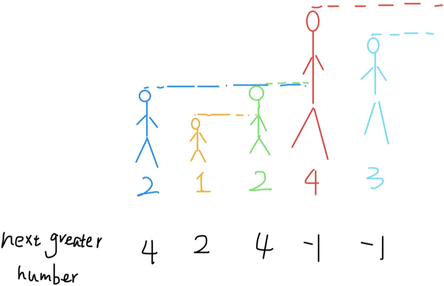

## 一.单调栈的基本概念

栈（stack）是很简单的一种数据结构，先进后出的逻辑顺序，符合某些问题的特点，比如说函数调用栈。

单调栈实际上就是栈，只是利用了一些巧妙的逻辑，使得每次新元素入栈后，栈内的元素都保持有序（单调递增或单调递减）。

听起来有点像堆（heap）？不是的，单调栈用途不太广泛，只处理一种典型的问题，叫做 Next Greater Element。

## 二.解题思路

> 以[496. 下一个更大元素 I](https://leetcode-cn.com/problems/next-greater-element-i/) 为例进行说明：
>
> 给你一个数组 [2,1,2,4,3]，你返回数组 [4,2,4,-1,-1]。
>
> 解释:第一个 2 后面比 2 大的数是 4; 1 后面比 1 大的数是 2;第二个 2 后面 比 2 大的数是 4; 4 后面没有比 4 大的数，填 -1;3 后面没有比 3 大的数，填 -1。

+ 暴力解法很好想到，就是对每个元素后面都进行扫描，找到第一个 更大的元素就行了。但是暴力解法的时间复杂度是 O(n^2)。

+ 可以这样抽象思考:把数组的元素想象成并列站立的人，元素大小 想象成人的身高。这些人面对你站成一列，如何求元素「2」的 Next Greater Number 呢?

  + 很简单，如果能够看到元素「2」，那么他后面可⻅的第一个 人就是「2」的 Next Greater Number，因为比「2」小的元素身高不够，都被 「2」挡住了，第一个露出来的就是答案。

    <div align = center></div>

+ for 循环要从后往前扫描元素，因为借助的是栈的结构，倒着入栈，其实是正着出栈。while 循环是把两个“高个”元素之间的元素排除，因为他们的存在没有意义，前面挡着个“更高”的 元素，所以他们不可能被作为后续进来的元素的 Next Great Number 了。

```c++
vector<int> nextGreaterElement(vector<int>& nums) { 
    vector<int> ans(nums.size()); // 存放答案的数组
    stack<int> s;
    for (int i = nums.size() - 1; i >= 0; i--) {// 倒着往栈里放
        while (!s.empty() && s.top() <= nums[i]) {// 判定个子高矮 
            s.pop(); // 矮个起开，反正也被挡着了。。。
        }
        ans[i] = s.empty() ? -1 : s.top(); // 这个元素身后的第一个高个 
        s.push(nums[i]); // 进队，接受之后的身高判定吧!
    }
    return ans; 
}
```

