# 排序积累与总结


## 七.堆排序

### 1.基本概念

堆排序是利用**堆**这种数据结构而设计的一种排序算法，堆排序是一种**选择排序，**它的最坏，最好，平均时间复杂度均为O(nlogn)，它也是不稳定排序。首先简单了解下堆结构。

**堆是具有以下性质的完全二叉树：每个结点的值都大于或等于其左右孩子结点的值，称为大顶堆；或者每个结点的值都小于或等于其左右孩子结点的值，称为小顶堆。如下图：**

<div align = center>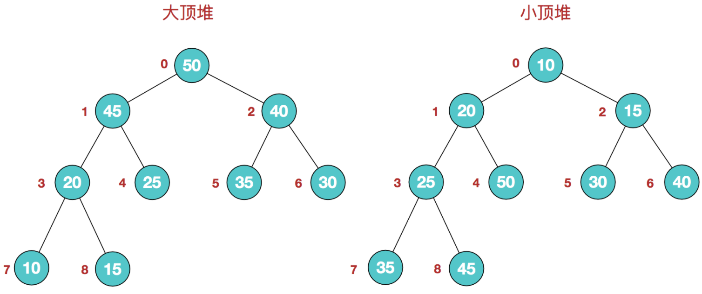</div>

同时，我们对堆中的结点按层进行编号，将这种逻辑结构映射到数组中就是下面这个样子

<div align = center>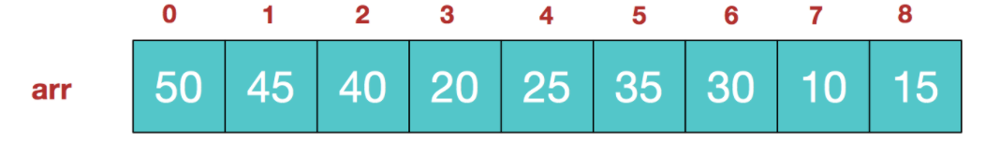</div>

该数组从逻辑上讲就是一个堆结构，我们用简单的公式来描述一下堆的定义就是：

**大顶堆：arr[i] >= arr[2i+1] && arr[i] >= arr[2i+2]**  

**小顶堆：arr[i] <= arr[2i+1] && arr[i] <= arr[2i+2]**  

了解了这些定义。接下来看看堆排序的基本思想及基本步骤：

### 2.堆排序基本思想及步骤

**堆排序的基本思想：**

+ **将待排序序列构造成一个大顶堆，此时，整个序列的最大值就是堆顶的根节点。将其与末尾元素进行交换，此时末尾就为最大值。然后将剩余n-1个元素重新构造成一个堆，这样会得到n个元素的次小值。如此反复执行，便能得到一个有序序列了**

**步骤一 构造初始堆。将给定无序序列构造成一个大顶堆（一般升序采用大顶堆，降序采用小顶堆)。**

+ 假设给定无序序列结构如下

  <div align = center>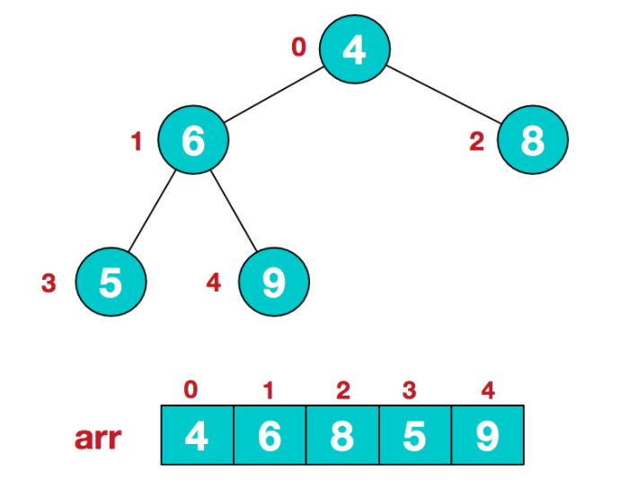</div>

+ 此时我们从最后一个非叶子结点开始（叶结点自然不用调整，第一个非叶子结点 arr.size()/2 - 1=5/2-1=1，也就是下面的6结点），从左至右，从下至上进行调整。

  <div align = center>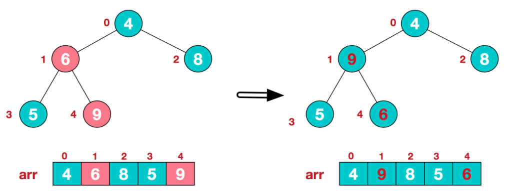</div>

+ 找到第二个非叶节点4，由于[4,9,8]中9元素最大，4和9交换。

  <div align = center>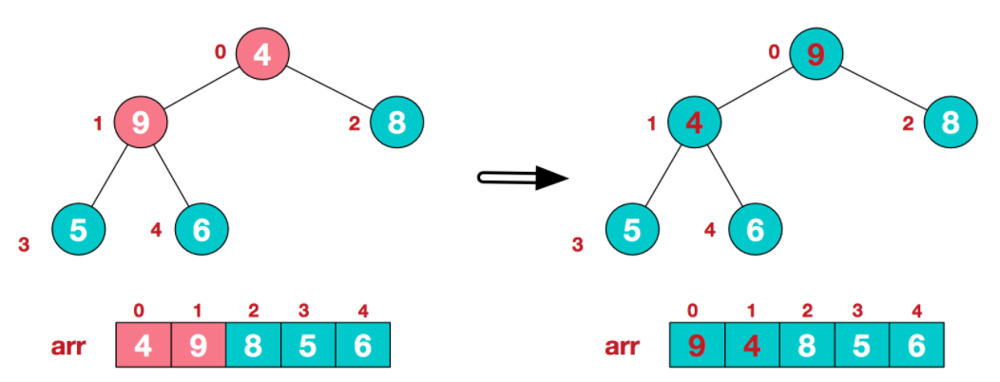</div>

+ 这时，交换导致了子根[4,5,6]结构混乱，继续调整，[4,5,6]中6最大，交换4和6。

  <div align = center>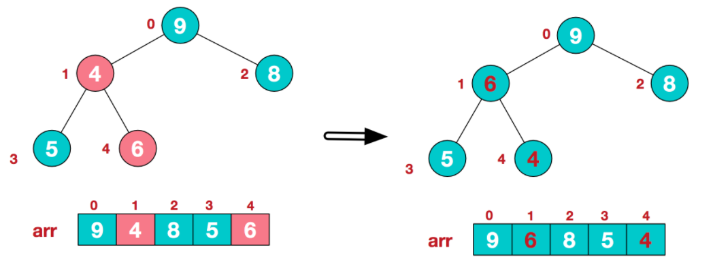</div>

+ 此时，我们就将一个无需序列构造成了一个大顶堆。

**步骤二 将堆顶元素与末尾元素进行交换，使末尾元素最大。然后继续调整堆，再将堆顶元素与末尾元素交换，得到第二大元素。如此反复进行交换、重建、交换。**

+ 将堆顶元素9和末尾元素4进行交换

  <div align = center>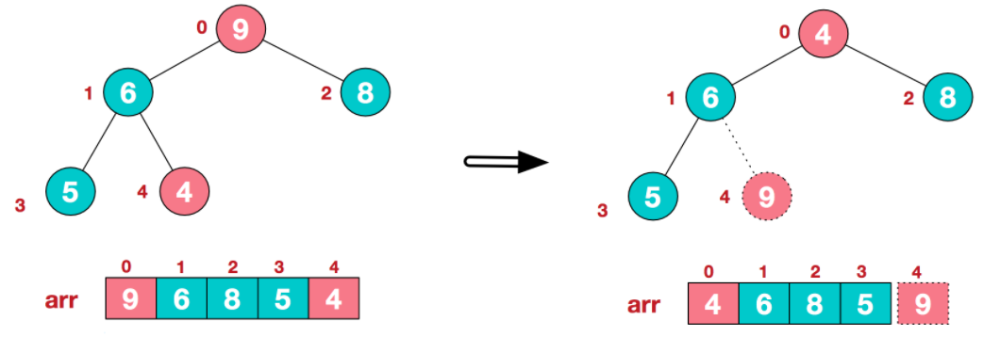</div>

+ 重新调整结构，使其继续满足堆定义

  <div align = center>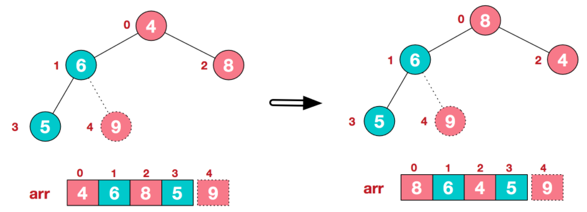</div>

+ 再将堆顶元素8与末尾元素5进行交换，得到第二大元素8.

  <div align = center>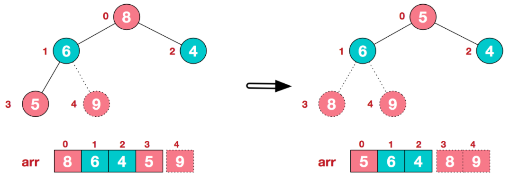</div>

+ 后续过程，继续进行调整，交换，如此反复进行，最终使得整个序列有序

  <div align = center>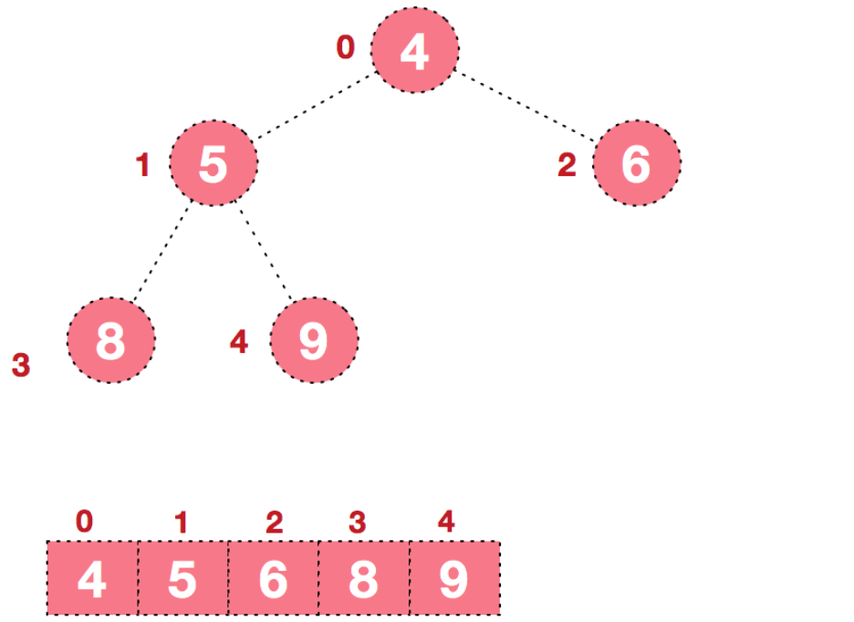</div>

再简单总结下堆排序的基本思路：

　　**a.将无需序列构建成一个堆，根据升序降序需求选择大顶堆或小顶堆;**

　　**b.将堆顶元素与末尾元素交换，将最大元素"沉"到数组末端;**

　　**c.重新调整结构，使其满足堆定义，然后继续交换堆顶元素与当前末尾元素，反复执行调整+交换步骤，直到整个序列有序。**

**代码实现：**

```c++
template<typename T>
class MaxHeap {
private:
    T *data;
    int count;
    int capacity;

    //向下进行移动
    void shiftDown(int k) {
        //只要有左孩子，那就肯定还有孩子
        while(2 * k <= count) {
            //在此轮循环中，data[k]和data[j]交换位置
            int j = 2 * k;
            //如果有右孩子而且右孩子的值比左孩子大，那就和右孩子进行交换
            if(j + 1 <= count && data[j + 1] > data[j]) 
                j += 1;
            //如果比自己的孩子大，那就不需要进行交换
            if(data[k] >= data[j]) 
                break;
            //否则进行交换
            swap(data[k], data[j]);
            k = j;
        }
    }
public:
    //初始化构建最大堆
    MaxHeap(vector<T>& nums) {
        data = new T[nums.size() + 1];
        capacity = nums.size();
        for(int i = 0; i < nums.size(); ++i) {
            data[i + 1] = nums[i];
        }
        count = nums.size();
        //将非叶子结点进行重构，构建最大堆
        //其中，非叶子结点的下标就是1 - count/2
        for (int i = count / 2; i >= 1 ; --i) {
            shiftDown(i);
        }
    }
    //取出最大值的元素,然后进行重构
    T extractMax() {
        assert(count > 0);
        T item = data[1];
        //将第一个元素和最后一个元素进行交换
        swap(data[1], data[count]);
        --count;
        //进行重构最大堆，将第一个元素向下移
        shiftDown(1);
        return item;
    }
    ~MaxHeap() {
        delete[] data;
    }
};

template<typename T>
void HeapSort(vector<T>& nums) {
    //步骤一：无需序列构建成一个最大堆
    MaxHeap<T> maxHeap = MaxHeap<T>(nums);
    //步骤二：
    //将堆顶元素与末尾元素交换，将最大元素"沉"到数组末端。
    //重新调整结构，使其满足堆定义，然后继续交换堆顶元素与当前末尾元素
    //反复执行调整+交换步骤，直到整个序列有序
    for (int i = nums.size() - 1; i >= 0 ; --i) 
        nums[i] = maxHeap.extractMax();
    for (auto i : nums) 
        cout << i << " ";
    cout << endl;
}
```


## 八.计数排序

### 1.基本概念

像快排、堆排、归并等排序算法都是基于比较的排序算法，时间复杂度最好情况也只能降到O(nlogn)。而计数排序是一种线性排序算法，不需要进行比较，时间复杂度为O(n)。

**计数排序的核心在于将输入的数据值转化为键存储在额外开辟的数组空间中。作为一种线性时间复杂度的排序，计数排序要求输入的数据必须是有确定范围的整数。**

### 2.计数排序基本思想及其步骤

当输入的元素是 n 个 0 到 k 之间的整数时，它的运行时间是 Θ(n + k)。 **计数排序不是比较排序，排序的速度快于任何比较排序算法。**

由于用来计数的数组C的长度取决于待排序数组中数据的范围（等于待排序数组的最大值与最小值的差加上1），这使得计数排序对于数据范围很大的数组，需要大量时间和内存。例如：计数排序是用来排序0到100之间的数字的最好的算法，但是它不适合按字母顺序排序人名。但是，计数排序可以用在基数排序中的算法来排序数据范围很大的数组。

通俗地理解，例如有 10 个年龄不同的人，统计出有 8 个人的年龄比 A 小，那 A 的年龄就排在第 9 位,用这个方法可以得到其他每个人的位置,也就排好了序。当然，年龄有重复时需要特殊处理（保证稳定性），这就是为什么最后要反向填充目标数组，以及将每个数字的统计减去 1 的原因。

**算法的步骤如下：**

1. 找出待排序的数组中最大和最小的元素
2. 统计数组中每个值为 i 的元素出现的次数，存入数组 C 的第 i 项
3. 对所有的计数累加（从C中的第一个元素开始，每一项和前一项相加）
4. 反向填充目标数组：将每个元素i放在新数组的第C(i)项，每放一个元素就将C(i)减去1

<div align = center></div>

```C++
void CountSort(vector<int>& nums) {
    int n = nums.size();
    if (!n) return ;

    //1.找出待排序的数组中最大和最小的元素
    int min_num = *min_element(nums.begin(), nums.end());
    int max_num = *max_element(nums.begin(), nums.end());

    int length = max_num - min_num + 1;

    //2.统计数组中每个值为 i 的元素出现的次数，存入数组 C 的第 i 项
    vector<int> count(length, 0);

    //3.对所有的计数累加（从C中的第一个元素开始，每一项和前一项相加）
    for (int i = 0; i < n; ++i) {
        ++ count[nums[i] - min_num];
    }

    //反向填充目标数组：将每个元素i放在新数组的第C(i)项，每放一个元素就将C(i)减去1
    for (int i = 0; i < length; ++i) {
        for (int j = 0; j < count[i]; ++j) {
            cout << i + min_num << " ";
        }
    }

    cout << endl;
}
```


## 九.桶排序

### 1.基本概念

桶排序是计数排序的升级版。它利用了函数的映射关系，高效与否的关键就在于这个映射函数的确定。为了使桶排序更加高效，我们需要做到这两点：

1. 在额外空间充足的情况下，尽量增大桶的数量
2. 使用的映射函数能够将输入的 N 个数据均匀的分配到 K 个桶中

同时，对于桶中元素的排序，选择何种比较排序算法对于性能的影响至关重要。

**什么时候最快**

当输入的数据可以均匀的分配到每一个桶中。

**什么时候最慢**

当输入的数据被分配到了同一个桶中。

**示意图**

元素分布在桶中：

<div align = center>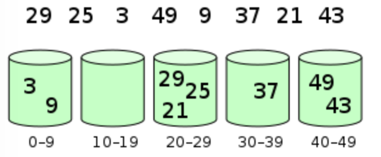</div>

然后，元素在每个桶中排序：

<div align = center>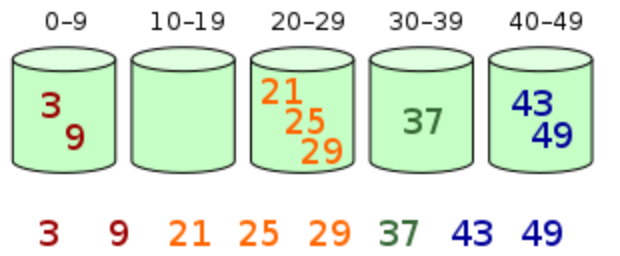</div>

### 2.算法实现

```c++
void BucketSort(vector<int>& nums ){

    //设置桶的个数
    int count = (int)sqrt(nums.size()) + 1;
    vector<int> Bucket[count] ;
    memset(Bucket, 0, sizeof (Bucket));

    // 将每个元素插入到相应的桶中
    int pos;
    for (auto temp : nums) {
        pos = temp / 10 ;  // 求出该元素在哪个桶
        Bucket[pos].push_back(temp);  // 把该元素放入某个桶中
    }

    for (int i = 0; i < count; ++i) {
        sort(Bucket[i].begin(), Bucket[i].end());
    }

    for( auto  bucket : Bucket) {
        for (auto temp : bucket) {
            cout << temp << " ";
        }
    }
    cout << endl;
}

```

### 3.应用场景

例题1：一年的全国高考考生人数为500 万，分数使用标准分，最低100 ，最高900 ，没有小数，你把这500 万元素的数组排个序。

> 如果对500W数据排序，如果基于比较的先进排序，平均比较次数为O(5000000*log5000000)≈1.112亿。
>
> 创建801(900-100)个桶。将每个考生的分数丢进f(score)=score-100的桶中。这个过程从头到尾遍历一遍数据只需要500W次。然后根据桶号大小依次将桶中数值输出，即可以得到一个有序的序列。

例题2：在一个文件中有 10G 个整数，乱序排列，要求找出中位数。内存限制为 2G。只写出思路即可（内存限制为 2G的意思就是，可以使用2G的空间来运行程序，而不考虑这台机器上的其他软件的占用内存）。

> 思想：将整型的每1byte作为一个关键字，也就是说一个整形可以拆成4个keys，而且最高位的keys越大，整数越大。如果高位keys相同，则比较次高位的keys。整个比较过程类似于字符串的字典序。按以下步骤实施：
>
> 1. 把10G整数每2G读入一次内存，然后一次遍历这536,870,912即（1024 * 1024 * 1024）* 2 /4个数据。每个数据用位运算">>"取出最高8位(31-24)。这8bits(0-255)最多表示255个桶，那么可以根据8bit的值来确定丢入第几个桶。最后把每个桶写入一个磁盘文件中，同时在内存中统计每个桶内数据的数量，自然这个数量只需要255个整形空间即可。
> 2. 根据内存中255个桶内的数量，计算中位数在第几个桶中。**很显然，2,684,354,560个数中位数是第1,342,177,280个。**  假设前127个桶的数据量相加，发现少于1,342,177,280，把第128个桶数据量加上，大于1,342,177,280。说明，中位数必在磁盘的第128个桶中。而且在这个桶的第1,342,177,280-N(0-127)个数位上。N(0-127)表示前127个桶的数据量之和。然后把第128个文件中的整数读入内存。
>
> > 注意，变态的情况下，这个需要读入的第128号文件仍然大于2G，那么整个读入仍然可以按照第一步分批来进行读取。 
>
> 3. 继续以内存中的整数的次高8bit进行桶排序(23-16)。过程和第一步相同，也是255个桶。
>
> 4. 一直下去，直到最低字节(7-0bit)的桶排序结束。我相信这个时候完全可以在内存中使用一次快排就可以了。

例题3：给定n个实数x1,x2,...,xn,求这n个实数在实轴上相邻2个数之间的最大差值M,要求设计线性的时间算法

> 要求线性时间算法。需要使用桶排序。桶排序的平均时间复发度是O(N).如果桶排序的数据分布不均匀，假设都分配到同一个桶中，最坏情况下的时间复杂度将变为O(N^2)。桶排序: 最关键的建桶，如果桶设计得不好的话桶排序是几乎没有作用的。
>
> 通常情况下，上下界有两种取法：
>
> + 第一种是取一个10^n或者是2^n的数，方便实现。
> + 另一种是取数列的最大值和最小值然后均分作桶。
>
> 对于这个题，最关键的一步是：由抽屉原理知：最大差值M>= (Max(V[n])-Min(V[n]))/(n-1)！所以，假如以(Max(V[n])-Min(V[n]))/(n-1)为桶宽的话，答案一定不是属于同一个桶的两元素之差。
>
> 因此，这样建桶，每次只保留桶里面的最大值和最小值即可。


## 十.基数排序

### 1.基本概念

基数排序是一种非比较型整数排序算法，其原理是将整数按位数切割成不同的数字，然后按每个位数分别比较。由于整数也可以表达字符串（比如名字或日期）和特定格式的浮点数，所以基数排序也不是只能使用于整数。

### 2.基数排序基本思想及其步骤

<div align = center>

在上图中，首先将所有待比较树脂统一为统一位数长度，接着从最低位开始，依次进行排序。

1. **按照个位数进行排序。**
2. **按照十位数进行排序。**
3. **按照百位数进行排序。**

排序后，数列就变成了一个有序序列。

```c++
#include<iostream>
#include<vector>
 
using namespace std;
 
void countSort(vector<int>& vec,int exp)
{//计数排序
	vector<int> range(10,0);
 
	int length=vec.size();
	vector<int> tmpVec(length,0);
 
	for(int i=0;i<length;++i)
	{
		range[(vec[i]/exp)%10]++;
	}
 
	for(int i=1;i<range.size();++i)
	{
		range[i]+=range[i-1];//统计本应该出现的位置
	}
 
	for(int i=length-1;i>=0;--i)
	{
		tmpVec[range[(vec[i]/exp)%10]-1]=vec[i];
		range[(vec[i]/exp)%10]--;
	}
	vec=tmpVec;
}
 
void radixSort(vector<int>& vec)
{
	int length=vec.size();
	int max=-1;
	for(int i=0;i<length;++i)
	{//提取出最大值
		if(vec[i]>max)
			max=vec[i];
	}
	
	//提取每一位并进行比较，位数不足的高位补0
	for(int exp=1;max/exp>0;exp*=10)
		countSort(vec,exp);
}
 
int main()
{
	int a[10]={53,3,542,748,14,214,154,63,616,589};
 
	vector<int> vec(a,a+10);
	radixSort(vec);
 
	for(int i=0;i<vec.size();++i)
	{
		cout<<vec[i]<<"   ";
	}
	
	cout<<endl;
	return 0;

}
```


### 3. 基数排序 vs 计数排序 vs 桶排序

基数排序有两种方法：

这三种排序算法都利用了桶的概念，但对桶的使用方法上有明显差异：

- 基数排序：根据键值的每位数字来分配桶；
- 计数排序：每个桶只存储单一键值；
- 桶排序：每个桶存储一定范围的数值；


