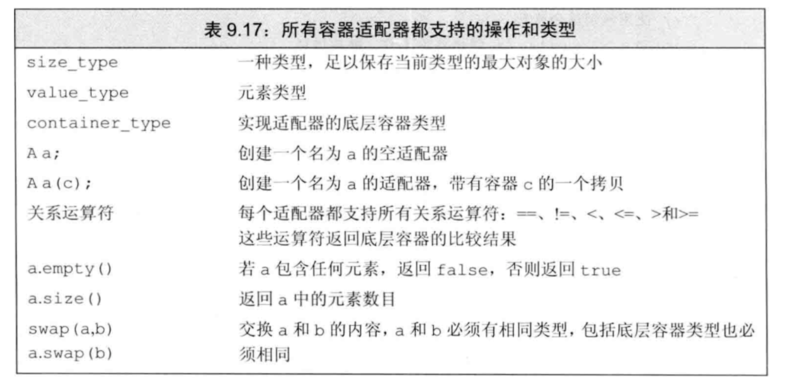
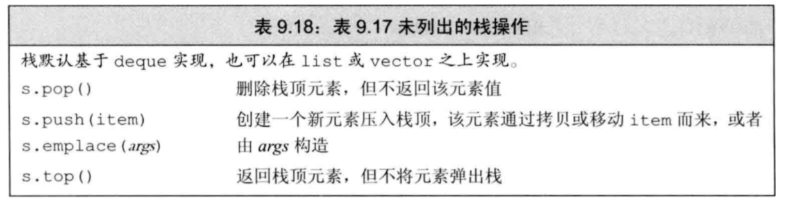
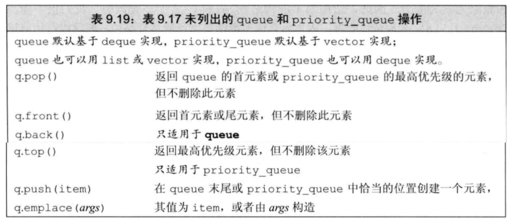

# 栈与队列

> 栈和队列都是用C++提供的适配器来进行操作

- `适配器`是一种机制，能使某种事物的行为看起来像另一种事物。一个`容器适配器`接受一种已有的容器类型，使其看起来像另一种不同类型
- 定义了3个`顺序容器适配器`：`stack`、`queue`、`priority_queue`
- 下表定义了所有容器适配器都支持的操作和类型

<div align  =  center></div>

## 一.栈的基本操作

`stack`定义于`stack头文件`中，其特有操作如表9.18

<div align  =  center></div>

## 二.队列的基本操作

`queue`和`priority_queue`定义于`queue头文件`中，其特有操作如表9.19

<div align  =  center></div>

`priority_queue`允许为队列中的元素建立优先级，新加入的元素会排在所有优先级比它低的已有元素之前。默认情况下使用元素类型的`<`运算符来确定优先

## 三.例题解剖

#### 1.栈与队列的相互转换操作

##### 两个队列实现栈操作

```c++
class MyStack {
    queue<int> q1;
    queue<int> q2;
public:
    /** Initialize your data structure here. */
    MyStack() { }
    /** Push element x onto stack. */
    //此时q2为空，作为中介，先将元素导入到q2
    //将q1中的元素全部导入q2，这样就模拟出了先进后出的栈
    void push(int x) {
        q2.push(x);
        while(!q1.empty()) {
            q2.push(q1.front());
            q1.pop();
        }
        swap(q1,q2);
    }
    /** Removes the element on top of the stack and returns that element. */
    int pop() {
        int temp = q1.front();
        q1.pop();
        return temp;
    }
    /** Get the top element. */
    int top() {
        return q1.front();
    }
    /** Returns whether the stack is empty. */
    bool empty() {
        return q1.empty();
    }
};
```

##### 一个队列实现栈操作

```c++
class MyStack {
    queue<int> q1;
public:
    /** Initialize your data structure here. */
    MyStack() { }
    /** Push element x onto stack. */
    //将压入，然后将后面的元素重新弹出，压在元素后面
    void push(int x) {
        q1.push(x);
        int size = q1.size();
        while(--size) {
            q1.push(q1.front());
            q1.pop();
        }
    }
    /** Removes the element on top of the stack and returns that element. */
    int pop() {
        int temp = q1.front();
        q1.pop();
        return temp;
    }
    /** Get the top element. */
    int top() {
        return q1.front();
    }
    /** Returns whether the stack is empty. */
    bool empty() {
        return q1.empty();
    }
};
```

##### 两个栈实现队列操作

+ 将一个栈当作输入栈，用于压入 push 传入的数据；另一个栈当作输出栈，用于 pop 和 peek 操作。

+ 每次pop 或 peek 时，若输出栈为空则将输入栈的全部数据依次弹出并压入输出栈，这样输出栈从栈顶往栈底的顺序就是队列从队首往队尾的顺序。

```c++
class MyQueue {
    stack<int> stackin;
    stack<int> stackout;
public:
    /** Initialize your data structure here. */
    MyQueue() {}
    /** Push element x to the back of queue. */
    void push(int x) {
        stackin.push(x);
    }
    /** Removes the element from in front of queue and returns that element. */
    int pop() {
        //如果输出栈为空，则将输入栈中的所有元素弹出，压栈至输出栈，这样就以队列的方式进行弹出了
        while(stackout.empty()) {
            while(!stackin.empty()) {
                stackout.push(stackin.top());
                stackin.pop();
            }
        }
        //如果输出栈不为空，则直接弹出
        int temp = stackout.top();
        stackout.pop();
        return temp;
    }
    /** Get the front element. */
    int peek() {
        while(stackout.empty()) {
            while(!stackin.empty()) {
            stackout.push(stackin.top());
            stackin.pop();
            }
        }
        int temp = stackout.top();
        return temp;
    }
    /** Returns whether the queue is empty. */
    bool empty() {
        return (stackin.empty() && stackout.empty());
    }
};
```

##### 一个栈实现队列操作

```c++
class MyQueue {
    stack<int> s;
public:
    /** Initialize your data structure here. */
    MyQueue() {}
    /** Push element x to the back of queue. */
    void push(int x) {
        pushHelper(x);
    }
    //利用递归，将栈重新从底向上弹压一遍，实现队列的顺序
    void pushHelper(int x) {
        if(s.empty()){
            s.push(x);
            return;
        }
        int data = s.top();
        s.pop();
        pushHelper(x);
        s.push(data);
    }
    /** Removes the element from in front of queue and returns that element. */
    int pop() {
        int tmp = s.top();
        s.pop();
        return tmp;
    }
    /** Get the front element. */
    int peek() {
        return s.top();
    }
    /** Returns whether the queue is empty. */
    bool empty() {
        return s.empty();
    }
};
```


