二叉树

## 一.二叉树的种类

### 1.满二叉树

满二叉树：如果一棵二叉树只有度为0的结点和度为2的结点，并且度为0的结点在同一层上，则这棵二叉树为满二叉树。

### 2.完全二叉树

完全二叉树：在完全二叉树中，除了最底层节点可能没填满外，其余每层节点数都达到最大值，并且最下面一层的节点都集中在该层最左边的若干位置。若最底层为第 h 层，则该层包含 1~ 2h 个节点。

<div align="center">
    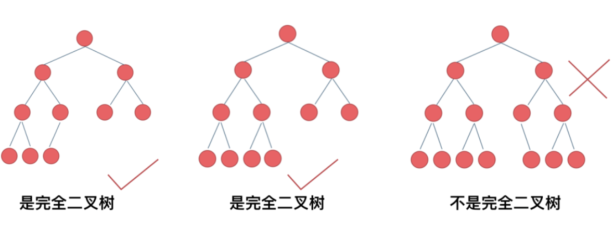
</div>


### 3.二叉搜索树

前面介绍的书，都没有数值的，而二叉搜索树是有数值的了，**「二叉搜索树是一个有序树」**。

- 若它的左子树不空，则左子树上所有结点的值均小于它的根结点的值；
- 若它的右子树不空，则右子树上所有结点的值均大于它的根结点的值；
- 它的左、右子树也分别为二叉排序树

下面这两棵树都是搜索树

<div align="center">
  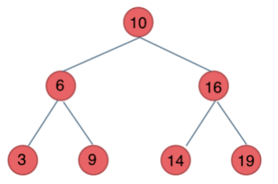
</div>


### 4.平衡二叉搜索树

#### 简介

平衡二叉搜索树：又被称为AVL（Adelson-Velsky and Landis）树，且具有以下性质：它是一棵空树或它的左右两个子树的高度差的绝对值不超过1，并且左右两个子树都是一棵平衡二叉树。

<div align="center">
  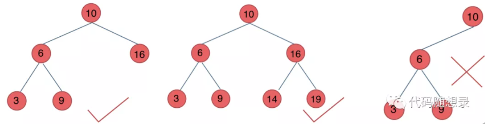
</div>


和红黑树相比，AVL树是**严格的平衡二叉树**，平衡条件必须满足（**所有节点的左右子树高度差的绝对值不超过1**）。不管我们是执行插入还是删除操作，只要不满足上面的条件，就要通过旋转来保持平衡，而旋转是非常**耗时**的，由此我们可以知道 **<font color = red>AVL树适合用于插入与删除次数比较少，但查找多的情况</font>**

#### 局限性

由于维护这种高度平衡所付出的代价比从中获得的效率收益还大，故而实际的应用不多，更多的地方是用追求局部而不是非常严格整体平衡的红黑树。当然， **如果应用场景中对插入删除不频繁，只是对查找要求较高，那么AVL还是较优于红黑树。**

#### 应用

**Windows NT内核中广泛存在**


### 5.红黑树

#### 简介

R-B Tree，全称是Red-Black Tree，又称为“红黑树”，它一种特殊的二叉查找树。红黑树的每个节点上都有存储位表示节点的颜色，可以是红(Red)或黑(Black)。

#### 特性

**（1）每个节点或者是黑色，或者是红色。**
**（2）根节点是黑色。**
**（3）每个叶子节点（NIL）是黑色。 [注意：这里叶子节点，是指为空(NIL或NULL)的叶子节点！]**
**（4）如果一个节点是红色的，则它的子节点必须是黑色的。**
**（5）从一个节点到该节点的子孙节点的所有路径上包含相同数目的黑节点。**

**注意**：
(01) 特性(3)中的叶子节点，是只为空(NIL或null)的节点。
(02) 特性(5)，确保没有一条路径会比其他路径长出俩倍。因而，红黑树是相对是接**衡的二叉树。

<div align="center">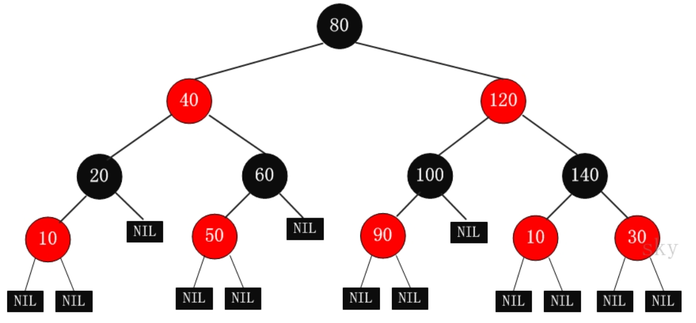 </div>

#### 应用

+ 广泛用于C ++的STL中，地图和集都是用红黑树实现的;

+ 著名的Linux的的进程调度完全公平调度程序，用红黑树管理进程控制块，进程的虚拟内存区域都存储在一颗红黑树上，每个虚拟地址区域都对应红黑树的一个节点，左指针指向相邻的地址虚拟存储区域，右指针指向相邻的高地址虚拟地址空间;

+ IO多路复用的epoll的的的实现采用红黑树组织管理的的的sockfd，以支持快速的增删改查;

+ Nginx的的的中用红黑树管理定时器，因为红黑树是有序的，可以很快的得到距离当前最小的定时器;

---

## 二.二叉树的创建与操作

### 1.二叉树的存储方式

二叉树可以链式存储，也可以顺序存储。链式存储方式就用指针， 顺序存储的方式就是用数组。顾名思义就是顺序存储的元素在内存是连续分布的，而链式存储则是通过指针把分布在散落在各个地址的节点串联一起。

链式存储如下图所示：

<div align="center">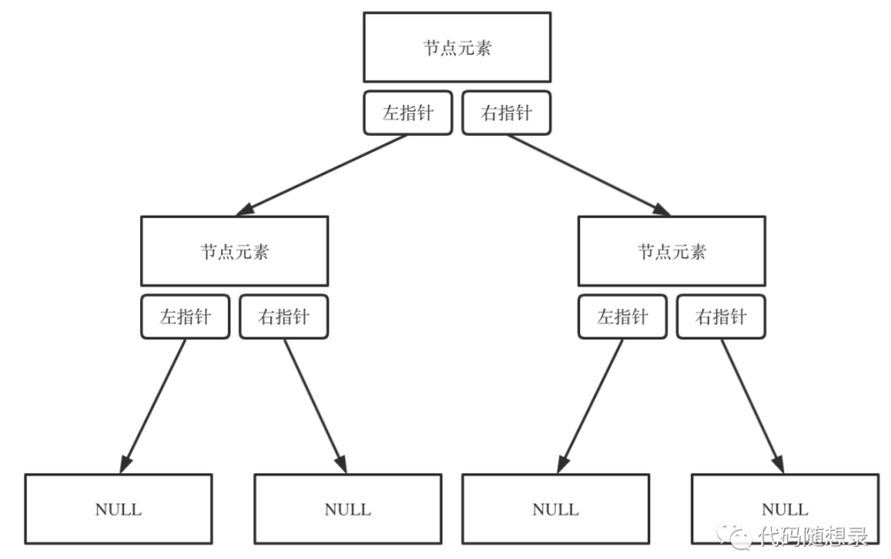</div>

### 2.创建二叉树

二叉树类结构：

```c++
class TreeNode {
public:
  	//只有结点元素与左右子树的指针
    int val;
    TreeNode *left;
    TreeNode *right;
    TreeNode() : val(0), left(nullptr), right(nullptr) {}
    TreeNode(char value) : val(value), left(nullptr), right(nullptr) {}
    TreeNode(char value, TreeNode* left, TreeNode* right) : val(value), left(left), right(right) {}
};
```

目前只是通过先序遍历的方式来创建二叉树

```c++
TreeNode* CreatTree()
{
    TreeNode *root;
    int value;
    std::cin>>value;
		//当输入的结点元素为0时认为为空
    if(value == 0)
        return nullptr;
		//创建新结点进行存储
    root = new TreeNode();
    root->val = value;
		//递归进行创建
    root->left = CreatTree();
    root->right = CreatTree();

    return root;
}
```

### 3.二叉树的遍历方式

二叉树主要有两种遍历方式：

1. 深度优先遍历：先往深走，遇到叶子节点再往回走。
2. 广度优先遍历：一层一层的去遍历。

从深度优先遍历和广度优先遍历进一步拓展，才有如下遍历方式：

- 深度优先遍历

- - 前序遍历（递归法，迭代法）
  - 中序遍历（递归法，迭代法）
  - 后序遍历（递归法，迭代法）

- > **这里前中后，其实指的就是中间节点的遍历顺序**

- <div align="center">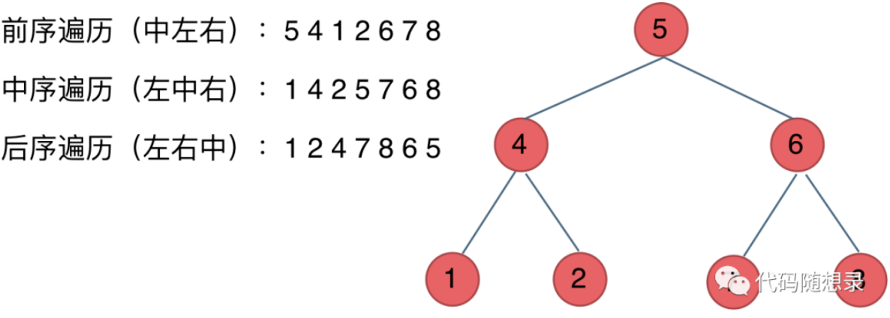</div>

- 广度优先遍历

- - 层次遍历（迭代法）

#### 前序遍历

前序遍历是中左右，每次先处理的是中间节点，那么先将跟节点放入栈中，然后将右孩子加入栈，再加入左孩子。

<div align = "center"> 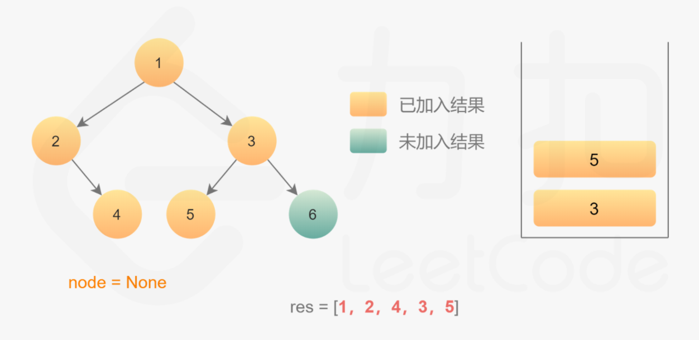 </div>

+ 递归实现：

  ```c++
  void PreOrderTraversal(TreeNode* root) {
      if(root != nullptr) {
          std::cout << (root->val) << " ";
          PreOrderTraversal(root->left);
          PreOrderTraversal(root->right);
      }
  }
  ```

+ 迭代实现：

  ```c++
  void PreOrderTraversal2(TreeNode* root)  {
  
      if(!root) return;
  
      std::stack<TreeNode*> stack;
      TreeNode* node = root;
  
      //栈为空且结点为空时结束遍历
      while((!stack.empty()) || (node != nullptr)) {
          //压栈
          while(node != nullptr) {
              std::cout << node->val << " ";
              stack.emplace(node);
              //左结点压栈
              node = node->left;
          }
  
          //出栈
          node = stack.top();
          stack.pop();
          //遍历又结点
          node = node->right;
      }
  }
  ```

#### 中序遍历

中序遍历是左中右，先访问的是二叉树顶部的节点，然后一层一层向下访问，直到到达树左面的最底部，再开始处理节点（也就是在把节点的数值放进result数组中），这就造成了**「处理顺序和访问顺序是不一致的。」**

<div align = "center"> 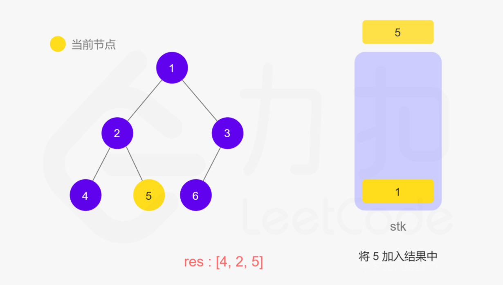 </div>

+ 递归实现

  ```c++
  void InOrderTraversal(TreeNode* root) {
      if(root != nullptr) {
          InOrderTraversal(root->left);
          std::cout << (root->val) << " ";
          InOrderTraversal(root->right);
      }
  }
  ```

+ 迭代实现

  ```c++
  void InOrderTraversal2(TreeNode* root) {
      if(!root) return;
      std::stack<TreeNode*> stack;
      TreeNode* node = root;
      while (!stack.empty() || node != nullptr) {
          while (node != nullptr) {
              stack.emplace(node);
              node = node->left;
          }
          std::cout << (stack.top())->val << " ";
          node =  stack.top();
          stack.pop();
          node = node->right;
      }
  }
  ```

#### 后序遍历

按照访问左子树——右子树——根节点的方式遍历这棵树，而在访问左子树或者右子树的时候，我们按照同样的方式遍历，直到遍历完整棵树。

<div align = "center"> 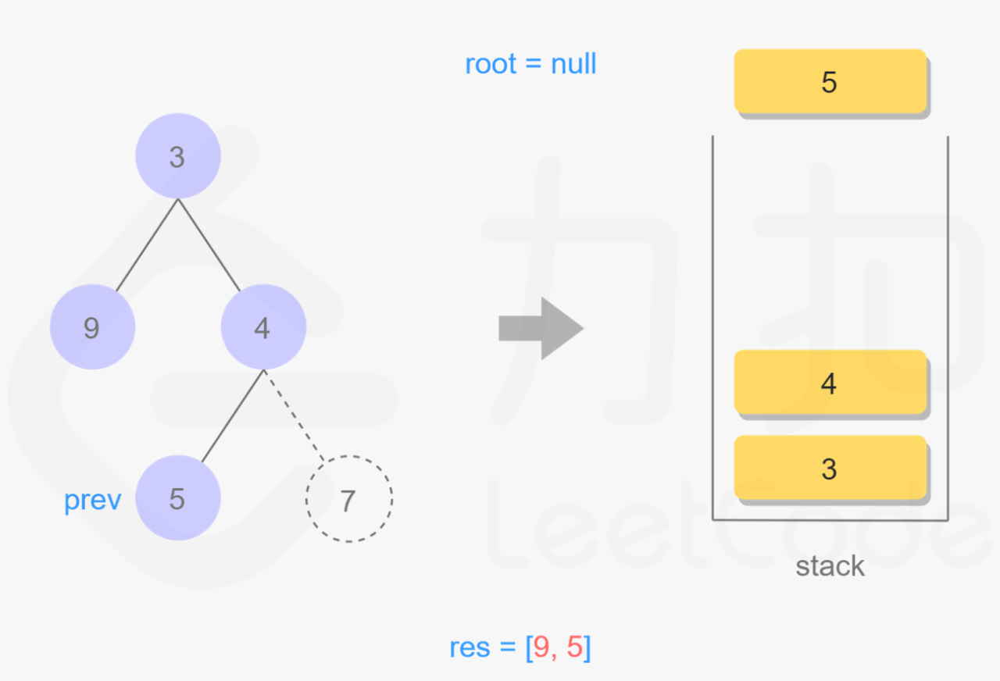</div>

+ 递归实现：

  ```c++
  void PostOrderTraversal(TreeNode* root) {
      if(root != nullptr) {
          PostOrderTraversal(root->left);
          PostOrderTraversal(root->right);
          std::cout << (root->val) << " ";
      }
  }
  ```

+ 迭代实现

  ```c++
  vector<int> postorderTraversal(TreeNode* root) {
          vector<int> result;
          stack<TreeNode*> st;
          if (root != NULL) st.push(root);
          while (!st.empty()) {
              TreeNode* node = st.top();
              if (node != NULL) {
                  st.pop();
                  st.push(node);                          // 中
                  st.push(NULL);
  
                  if (node->right) st.push(node->right);  // 右
                  if (node->left) st.push(node->left);    // 左
  
              } else {
                  st.pop();
                  node = st.top();
                  st.pop();
                  result.push_back(node->val);
              }
          }
          return result;
      }
  ```

#### 层序遍历

层序遍历一个二叉树。就是从左到右一层一层的去遍历二叉树。

需要借用一个辅助数据结构即队列来实现，**「队列先进先出，符合一层一层遍历的逻辑，而是用栈先进后出适合模拟深度优先遍历也就是递归的逻辑。」**

<div align = "center">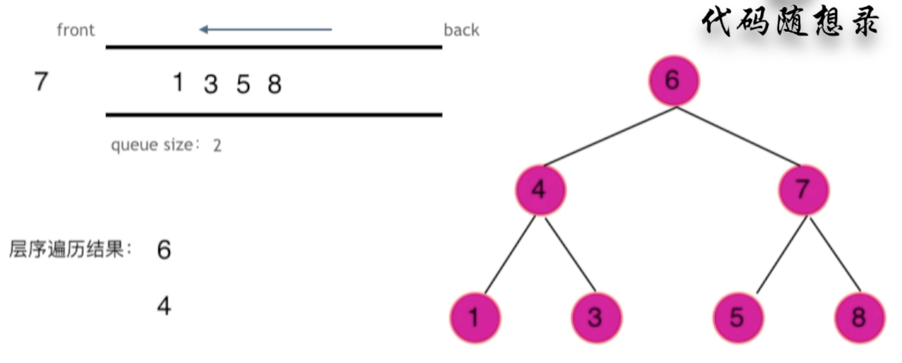</div>

+ 实现：

  ```c++
  vector<vector<int>> levelOrder(TreeNode* root) {
      vector<vector<int>> result {};    
      if(!root) return result;    
      queue<TreeNode*> queue;    
      queue.push(root);        
      while(!queue.empty()) {
          int size = queue.size();
          vector<int> res;
          for(int i = 0; i < size; ++i) {
              TreeNode* node = queue.front();
              queue.pop();
              res.push_back(node->val);
              if(node->left)
                	queue.push(node->left);
              if(node->right)
                	queue.push(node->right);
          }            
          result.push_back(res);      
      }      
      return result;
  }
  ```

### [4. 对称二叉树](https://leetcode-cn.com/problems/symmetric-tree/)

>  给定一个二叉树，检查它是否是镜像对称的。

#### 递归实现

+ 根据题目的描述，镜像对称，就是左右两边相等，也就是左子树和右子树是相等的。也就是说要递归的比较左子树和右子树。

+ 将根节点的左子树记做 left，右子树记做 right。比较 left 是否等于 right，不等的话直接返回就可以了。如果相等，比较 left 的左节点和 right 的右节点，再比较 left 的右节点和 right 的左节点。

+ 根据上面信息可以总结出递归函数的两个条件：

  + 终止条件：
  + left 和 right 不等，或者 left 和 right 都为空
  + 递归的比较 ltree->left 和 rtree->right，递归比较 ltree->right 和 tree->left

+ 实现：

  ```c++
  bool isMirror(TreeNode* left, TreeNode* right) {
      //返回情况
      //先判断空节点的情况
      if(left == nullptr && right != nullptr)
          return false;
      else if(left != nullptr && right == nullptr)
          return false;
      else if(left == nullptr && right == nullptr)
          return true;
      //再排除数值不想同的情况
      else if(left->val != right->val)
          return false; 
      // 此时就是：左右节点都不为空，且数值相同的情况
      // 此时才做递归，做下一层的判断
      bool compareoutside = isMirror(left->left, right->right);
      bool compareinside = isMirror(left->right, right->left);
      return compareinside && compareoutside;
  }
  bool isSymmetric(TreeNode* root) {
      if(!root) return true;
      return isMirror(root->left, root->right);
  }
  ```

#### 迭代实现

改用队列来实现，思路如下：

+ 引入一个队列，这是把递归程序改写成迭代程序的常用方法。初始化时我们把根节点入队两次。每次提取两个结点并比较它们的值（队列中每两个连续的结点应该是相等的，而且它们的子树互为镜像），然后将两个结点的左右子结点按相反的顺序插入队列中。当队列为空时，或者我们检测到树不对称（即从队列中取出两个不相等的连续结点）时，该算法结束。


+ 实现：

  ```c++
  bool isSymmetric(TreeNode* root) {
      queue<TreeNode*> queue;
    	// 将左子树头结点加入队列
      queue.push(root->left);
    	// 将右子树头结点加入队列
      queue.push(root->right);
    	// 接下来就要判断这这两个树是否相互翻转
      while(!queue.empty()) {
          TreeNode* ltree = queue.front();
          queue.pop();
          TreeNode* rtree = queue.front();
          queue.pop();
          // 左节点为空、右节点为空，此时说明是对称的,进行下一轮
          if(ltree==nullptr && rtree==nullptr)
              continue;
          if(ltree==nullptr || rtree==nullptr)
              return false;
          if(ltree->val != rtree->val)
              return false;
        	
          queue.push(ltree->left);// 加入左节点左孩子
          queue.push(rtree->right);// 加入右节点右孩子	
          queue.push(ltree->right);// 加入左节点右孩子
          queue.push(rtree->left);// 加入右节点左孩子
      }
      return true;
  }   
  ```

### [5. 二叉树的最大深度](https://leetcode-cn.com/problems/maximum-depth-of-binary-tree/)

>  给定一个二叉树，找出其最大深度。

#### 递归

+ 确定递归函数的参数和返回值：参数就是传入树的根节点，返回就返回这棵树的深度，所以返回值为int类型。

+ 确定终止条件：如果为空节点的话，就返回0，表示高度为0。

+ 确定单层递归的逻辑：先求它的左子树的深度，再求的右子树的深度，最后取左右深度最大的数值 再+1 （加1是因为算上当前中间节点）就是目前节点为根节点的树的深度。

+ 实现：

  ```c++
  int getDepth(TreeNode* node) {
      if (node == NULL) return 0;
      int leftDepth = getDepth(node->left);       // 左
      int rightDepth = getDepth(node->right);     // 右
      int depth = 1 + max(leftDepth, rightDepth); // 中
      return depth;
  }
  int maxDepth(TreeNode* root) {
      return getDepth(root);
  }
  ```

#### 迭代

+ 利用层次遍历的方法：

+ 实现

  ```c++
  int maxDepth(TreeNode* root) {
      if(!root) return 0;
      queue<TreeNode*> queue;
      queue.push(root);
      int count = 0;
      while(!queue.empty()) {
          int size = queue.size();
          for(int i = 0; i < size; ++i) {
              TreeNode* node = queue.front();
              queue.pop();
              if(node->left)
                  queue.push(node->left);
              if(node->right)
                  queue.push(node->right);
          }
          ++ count;
      }
      return count;
  }
  ```

### [6. 二叉树的最小深度](https://leetcode-cn.com/problems/minimum-depth-of-binary-tree/)

> 给定一个二叉树，找出其最小深度。

+ 注意事项：**「最小深度是从根节点到最近叶子节点的最短路径上的节点数量。」**，注意是 **「叶子节点」** 。什么是叶子节点，左右孩子都为空的节点才是叶子节点！

<div align = "center">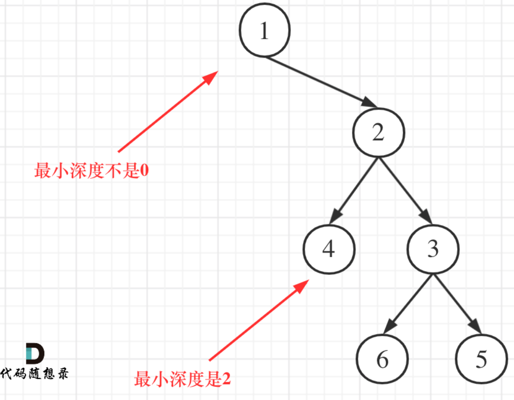</div>

#### 递归

+ 参数为要传入的二叉树根节点，返回的是int类型的深度。
+ 终止条件也是遇到空节点返回0，表示当前节点的高度为0。
+ 这块和求最大深度不一样
  + 如果左子树为空，右子树不为空，说明最小深度是 1 + 右子树的深度。
  + 反之，右子树为空，左子树不为空，最小深度是 1 + 左子树的深度。
  + 最后如果左右子树都不为空，返回左右子树深度最小值 + 1 。
+ 实现：

```c++
int getDepth(TreeNode* node) {
    if(node == nullptr) return 0;
    int leftDepth = getDepth(node->left);    // 左
    int rightDepth = getDepth(node->right);  // 右
        // 当一个左子树为空，右不为空，这时并不是最低点
    if(node->left == nullptr && node->right != nullptr)
        return 1 + rightDepth;
    // 当一个右子树为空，左不为空，这时并不是最低点
    if(node->left != nullptr && node->right == nullptr)
        return 1 + leftDepth;
    return 1 + min(leftDepth, rightDepth);
}
int minDepth(TreeNode* root) {
    return getDepth(root);
}
```

#### 迭代

+ 使用层序遍历的方式来解决，思路是一样的。

+ **需要注意的是，只有当左右孩子都为空的时候，才说明遍历的最低点了。如果其中一个孩子为空则不是最低点**

+ 实现：

  ```c++
  int minDepth(TreeNode* root) {
      if(root == nullptr) return 0;
      queue<TreeNode*> queue;
      queue.push(root);
      int depth = 0;
      int flag = 1;
      while(!queue.empty() && flag) {
          int size = queue.size();
          for(int i = 0; i < size; i++) {
              TreeNode* node = queue.front();
              queue.pop();
            	//左右子树都为空，则已经到达最底层
              if(node->left == nullptr && node->right == nullptr) {
                  flag = 0;
                  break;
              }
              if(node->left)
                  queue.push(node->left);
              if(node->right)
                  queue.push(node->right);
          }
          ++ depth;
      }
      return depth;
  }
  ```

### [7. 完全二叉树的节点个数](https://leetcode-cn.com/problems/count-complete-tree-nodes/)

> 求二叉树的结点个数

#### 递归

+ 确定递归函数的参数和返回值：参数就是传入树的根节点，返回就返回以该节点为根节点二叉树的节点数量，所以返回值为int类型。

+ 确定终止条件：如果为空节点的话，就返回0，表示节点数为0。

+ 确定单层递归的逻辑：先求它的左子树的节点数量，再求的右子树的节点数量，最后取总和再加一 （加1是因为算上当前中间节点）就是目前节点为根节点的节点数量。

+ 实现

  ```c++
  int TreeNodes(TreeNode* node) {
      if(node == nullptr)
          return 0;
      int leftNodes = TreeNodes(node->left);
      int rightNodes = TreeNodes(node->right);
      return 1 + leftNodes + rightNodes; 
  }
  int countNodes(TreeNode* root) {
      return TreeNodes(root);
  }
  ```

#### 迭代

+ 根据层序遍历，加一个变量result，统计节点数量就可以了

+ 实现：

  ```c++
  int countNodes(TreeNode* root) {
      if(root == nullptr) return 0;
      queue<TreeNode*> queue;
      queue.push(root);
      int count = 0;
      while(!queue.empty()) {
          int size = queue.size();
          for(int i = 0; i < size; ++i) {
              TreeNode* node = queue.front();
              queue.pop();
              ++count;
              if(node->left)
                  queue.push(node->left);
              if(node->right)
                  queue.push(node->right);
          }
      }
      return count;
  }
  ```

### 8.平衡二叉树

> 给定一个二叉树，判断它是否是高度平衡的二叉树。

+ 明确递归函数的参数和返回值

  > 参数的话为传入的节点指针，就没有其他参数需要传递了，返回值要返回传入节点为根节点树的深度。
  >
  > 那么如何标记左右子树是否差值大于1呢。
  >
  > 如果当前传入节点为根节点的二叉树已经不是二叉平衡树了，还返回高度的话就没有意义了。
  >
  > 所以如果已经不是二叉平衡树了，可以返回-1 来标记已经不符合平衡树的规则了。

+ 明确终止条件：递归的过程中依然是遇到空节点了为终止，返回0，表示当前节点为根节点的高度为0

+ 明确单层递归的逻辑：

  > 如何判断当前传入节点为根节点的二叉树是否是平衡二叉树呢，当然是左子树高度和右子树高度相差。
  >
  > 分别求出左右子树的高度，然后如果差值小于等于1，则返回当前二叉树的高度，否则则返回-1，表示已经不是二叉树了。

+ 实现

  ```c++
  // -1 表示已经不是平衡二叉树了，否则返回值是以该节点为根节点树的高度
  int getDepth(TreeNode* node) {
      if(node == nullptr)
          return 0;
      int leftNodes = getDepth(node->left);   // 左
      if(leftNodes == -1)
          return -1;
      int rightNodes = getDepth(node->right); // 右
      if(rightNodes == -1)    
          return -1;
  
      int result;
      if(abs(leftNodes - rightNodes) > 1)      // 中
          result = -1;
      else
          // 以当前节点为根节点的最大高度
          result = 1 + max(leftNodes , rightNodes);
      return result;
  }
  bool isBalanced(TreeNode* root) {
      return getDepth(root) == -1 ? false : true;
  }
  ```

### 9.二叉树所有路径

> 给定一个二叉树，返回所有从根节点到叶子节点的路径。

+ 示例：

  <div align = "center">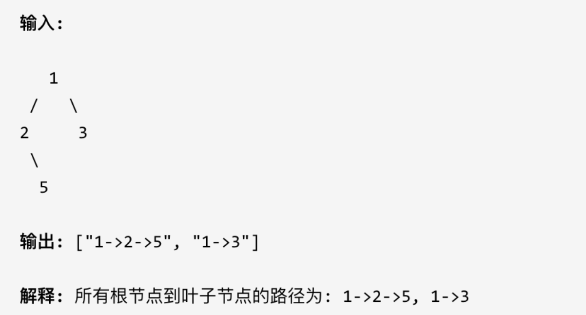</div>

+ 思路：

  + 题目要求从根节点到叶子的路径，所以需要前序遍历，这样才方便让父节点指向孩子节点，找到对应的路径。
  + 题目将涉及到回溯，要把路径记录下来，需要回溯来回退一一个路径在进入另一个路径。
  + 前序遍历以及回溯的过程如图：

  <div align = "center">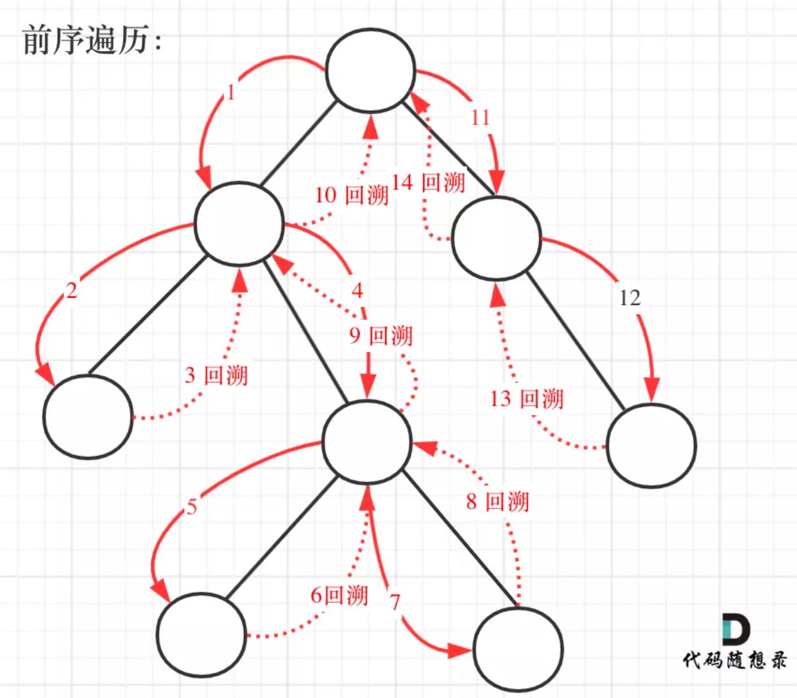</div>

+ **递归函数函数参数以及返回值:**

  > 要传入根节点，记录每一条路径的path，和存放结果集的result，这里递归不需要返回值，代码如下：
  >
  > ```c++
  > void traversal(TreeNode* cur, vector<int>& path, vector<string>& result) 
  > ```

+ **确定递归终止条件:**

  > 本题要找到叶子节点，就开始结束的处理逻辑了（把路径放进result里）。
  >
  > + 这里使用vector结构path来记录路径，所以要把vector结构的path转为string格式，在把这个string 放进 result里。
  >
  > + **「那么为什么使用了vector结构来记录路径呢？」**  因为在下面处理单层递归逻辑的时候，要做回溯，使用vector方便来做回溯。
  >
  > + 终止条件：
  >
  >   ```c++
  >   if (cur->left == NULL && cur->right == NULL) {    
  >     终止处理逻辑
  >   }
  >   ```

+ **确定单层递归逻辑：**

  > + 因为是前序遍历，需要先处理中间节点，中间节点就是我们要记录路径上的节点，先放进path中：`path.push_back(cur->val);`。
  >
  > + 然后是递归和回溯的过程，上面说过没有判断cur是否为空，那么在这里递归的时候，如果为空就不进行下一层递归了。
  >
  > + 所以递归前要加上判断语句，下面要递归的节点是否为空，如下：
  >
  >   ```c++
  >   if (cur->left)     
  >     	traversal(cur->left, path, result);
  >   if (cur->right)    
  >     	traversal(cur->right, path, result);
  >   ```
  >
  > + 递归完，要做回溯，因为path 不能一直加入节点，它还要删节点，然后才能加入新的节点。
  >
  > + **<font color = Oxffffff>「回溯和递归是一一对应的，有一个递归，就要有一个回溯」</font>**，这么写的话相当于把递归和回溯拆开了， 一个在花括号里，一个在花括号外。 **<font color = Oxffffff>「所以回溯要和递归永远在一起，世界上最遥远的距离是你在花括号里，而我在花括号外！」</font>**
  >
  >   ```c++
  >   if (cur->left) {    
  >     	traversal(cur->left, path, result);    
  >     	path.pop_back(); 
  >     // 回溯
  >   }if (cur->right) {    
  >     	traversal(cur->right, path, result);    
  >     	path.pop_back(); // 回溯
  >   }
  >   ```

+ 代码实现：

  ```c++
  void traversal(TreeNode* root, vector<int>&path, vector<string>& res) {
      path.push_back(root->val);
      //结束条件
      if(root->left == nullptr && root->right == nullptr) {
          string rootpath;
          for(int i = 0; i < path.size()-1; ++i) {
              rootpath += to_string(path[i]);
              rootpath += "->";
          }
          rootpath += to_string(path[path.size() - 1]);
          res.push_back(rootpath);
          return;
      }
      if(root->left) {
          traversal(root->left, path, res);
          path.pop_back();    // 回溯
      }
      if(root->right) {
          traversal(root->right, path, res);
          path.pop_back();    // 回溯
      }
  }
  vector<string> binaryTreePaths(TreeNode* root) {
      vector<string> res;
      vector<int> path;
      if(root == nullptr)
          return res;
      traversal(root, path, res);
      return res;
  }
  ```

### 10.左叶子之和

>  计算给定二叉树的所有左叶子之和。

+ **示例：**

  <div align = center>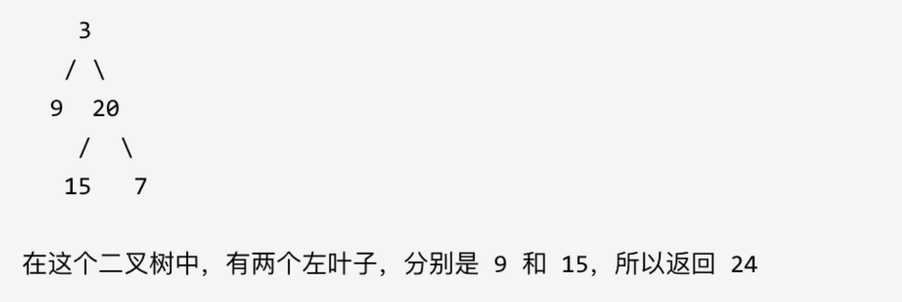</div>

+ **思路：**

  + **首先要注意是判断左叶子，不是二叉树左侧节点，所以不要上来想着层序遍历**

  + 左叶子的明确定义：**「如果左节点不为空，且左节点没有左右孩子，那么这个节点就是左叶子」**

    <div align = center>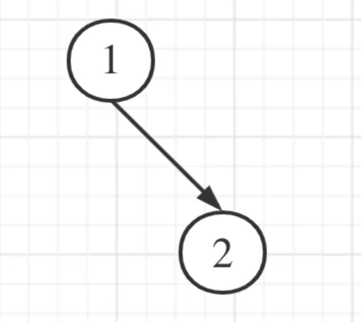</div>

    > 上图中左叶子结点之和为0

  + 所以， **「判断当前节点是不是左叶子是无法判断的，必须要通过节点的父节点来判断其左孩子是不是左叶子。」**

  + **如果该节点的左节点不为空，该节点的左节点的左节点为空，该节点的左节点的右节点为空，** 则找到了一个左叶子，判断代码如下：

    ```c++
    if (node->left != NULL && node->left->left == NULL && node->left->right == NULL) {    
      //左叶子节点处理逻辑
    }
    ```

+ **递归三部曲：**

  + **确定递归函数的参数和返回值**

    > 判断一个树的左叶子节点之和，那么一定要传入树的根节点，递归函数的返回值为数值之和，所以为int

  + **确定终止条件**

    > 依然是：`if (root == NULL) return 0;`

  + **确定单层递归条件**

    > 当遇到左叶子节点的时候，记录数值，然后通过递归求取左子树左叶子之和，和 右子树左叶子之和，相加便是整个树的左叶子之和。

    ```c++
    int leftValue = sumOfLeftLeaves(root->left);    // 左
    int rightValue = sumOfLeftLeaves(root->right);  // 右                                                
    int midValue = 0;
    if (root->left && !root->left->left && !root->left->right) {     
    		midValue = root->left->val;
    }
    int sum = midValue + leftValue + rightValue;
    return sum;
    ```

+ **实现代码：**

  ```c++
  int sumOfLeftLeaves(TreeNode* root) {
      if(root == nullptr) return 0;
      int leftLeaves = sumOfLeftLeaves(root->left);
      int rightLeaves = sumOfLeftLeaves(root->right);
      int minLeaves = 0;
      if(root->left != nullptr && root->left->left == nullptr && root->left->right == nullptr)
          minLeaves = root->left->val;
      int sum = leftLeaves + rightLeaves + minLeaves
      return sum;
  }
  ```


### 11.找树左下角的值

>  给定一个二叉树，在树的最后一行找到最左边的值。

+ **示例：**

  <div align = center>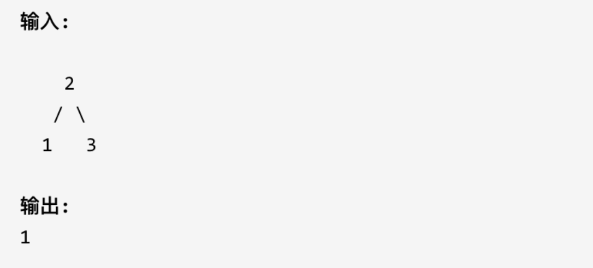</div>

+ **思路：**

  + 找出树的最后一行找到最左边的值。利用层序遍历是非常简单的了，反而用递归的话会比较难一点。

#### 递归方法

+ **思路：**

  + 使用递归法，判断最后一行，其实就是深度最大的叶子节点一定是最后一行。
  + 找最左边的节点，可以使用前序遍历，这样才先优先左边搜索，然后记录深度最大的叶子节点，此时就是树的最后一行最左边的值。

+ **递归三部曲：**

  + **确定递归函数的参数和返回值**

    + 参数必须有要遍历的树的根节点，还有就是一个int型的变量用来记录最长深度。这里就不需要返回值了，所以递归函数的返回类型为void。
    + 本题还需要类里的两个全局变量，maxLen用来记录最大深度，maxleftValue记录最大深度最左节点的数值。

    ```c++
    int maxLen = INT_MIN;   // 全局变量 记录最大深度
    int maxleftValue;       // 全局变量 最大深度最左节点的数值
    void traversal(TreeNode* root, int leftLen)
    ```

  + **确定终止条件**

    + 当遇到叶子节点的时候，就需要统计一下最大的深度了，所以需要遇到叶子节点来更新最大深度。

    ```c++
    if (root->left == NULL && root->right == NULL) {
        if (leftLen > maxLen) {
            maxLen = leftLen;           // 更新最大深度
            maxleftValue = root->val;   // 最大深度最左面的数值 
        }
        return;
    }
    ```

  + **确定单层递归的逻辑**

    + 在找最大深度的时候，递归的过程中依然要使用回溯，代码如下：

    ```c++
    if (root->left) {   // 左
        leftLen++; // 深度加一     
        traversal(root->left, leftLen);
        leftLen--; // 回溯，深度减一
    }
    if (root->right) { // 右
        leftLen++; // 深度加一
        traversal(root->right, leftLen);
        leftLen--; // 回溯，深度减一
    }
    return;
    ```

+ **实现代码：**

  ```c++
  int maxLen = INT_MIN;
  int maxleftValue;
  
  void traversal(TreeNode* node, int leftLen) {
      if(node->left == nullptr && node->right == nullptr) {
          if(leftLen > maxLen) {
              maxLen = leftLen;
              maxleftValue = node->val;
          }
          return; 
      }
      if(node->left) {
          leftLen++;
          traversal(node->left, leftLen);
          leftLen--;
      } 
      if(node->right) {
          leftLen++;
          traversal(node->right, leftLen);
          leftLen--;
      }
      return ;
  }
  int findBottomLeftValue(TreeNode* root) {
      traversal(root, 0);
      return maxleftValue;
  }
  ```

+ 递归时是否需要返回值的技巧： **「如果需要遍历整颗树，递归函数就不能有返回值。如果需要遍历某一条固定路线，递归函数就一定要有返回值！」**

#### 层序遍历方法

+ **思路：**

  + 利用层序遍历，只需要记录最后一行第一个节点的数值就可以了。

+ **实现代码：**

  ```c++
  int findBottomLeftValue(TreeNode* root) {
      queue<TreeNode*> que;
      if (root != NULL) ]
        	que.push(root);
      int result = 0;
      while (!que.empty()) {
          int size = que.size();
          for (int i = 0; i < size; i++) {
              TreeNode* node = que.front();
              que.pop();
              if (i == 0) result = node->val; // 记录最后一行第一个元素
              if (node->left) que.push(node->left);
              if (node->right) que.push(node->right);
          }å
      }
      return result;
  }
  ```


### 12.路径总和

> 给定一个二叉树和一个目标和，判断该树中是否存在根节点到叶子节点的路径，这条路径上所有节点值相加等于目标和。

+ **示例：**

  <div align = center>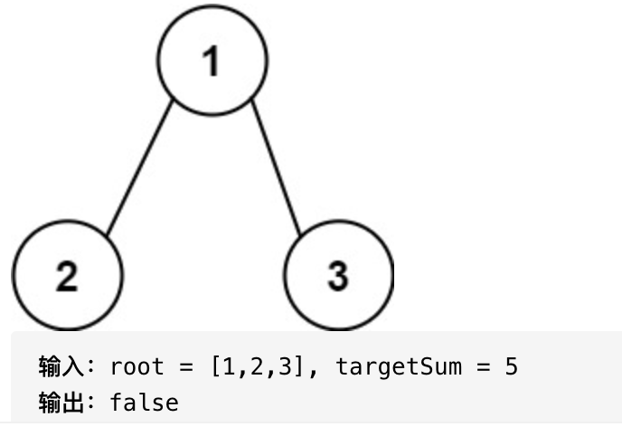</div>

#### 递归方法

+ **思路：**

  + 可以使用深度优先遍历的方式（本题前中后序都可以，无所谓，因为中节点也没有处理逻辑）来遍历二叉树

+ **递归三部曲：**

  + **确定递归函数的参数和返回类型**

    + 参数：需要二叉树的根节点，还需要一个计数器，这个计数器用来计算二叉树的一条边之和是否正好是目标和，计数器为int型。
    + 本题要找一条符合条件的路径，所以递归函数需要返回值，及时返回，那么返回类型可以用bool类型表示。

    <div align = center>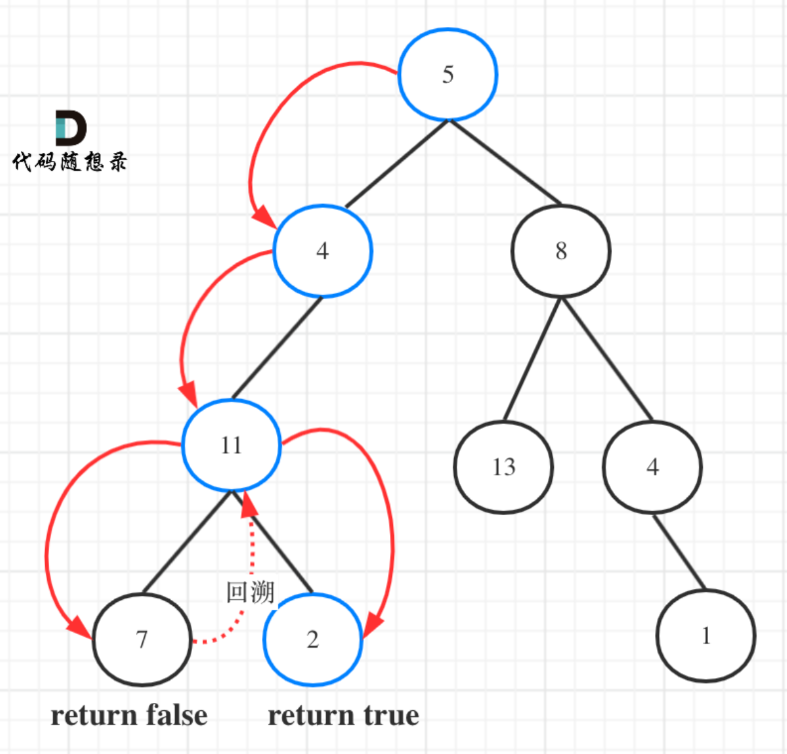</div>

    + 代码如下：

      ```c++
      bool traversal(TreeNode* cur, int count)   // 注意函数的返回类型
      ```

  + **确定终止条件**

    + 不要去累加然后判断是否等于目标和，那么代码比较麻烦，可以用递减，让计数器count初始为目标和，然后每次减去遍历路径节点上的数值。
    + 如果最后count == 0，同时到了叶子节点的话，说明找到了目标和。
    + 如果遍历到了叶子节点，count不为0，就是没找到。
    + 递归终止条件代码如下：

    ```c++
    if (!cur->left && !cur->right && count == 0) return true; // 遇到叶子节点，并且计数为0
    if (!cur->left && !cur->right) return false; // 遇到叶子节点而没有找到合适的边，直接返回
    ```

  + **确定单层递归的逻辑**

    + 因为终止条件是判断叶子节点，所以递归的过程中就不要让空节点进入递归了。
    + 递归函数是有返回值的，如果递归函数返回true，说明找到了合适的路径，应该立刻返回。

    + 代码如下：

    ```c++
    if (cur->left) { // 左    
        count -= cur->left->val; // 递归，处理节点;    
        if (traversal(cur->left, count)) return true;    
        count += cur->left->val; // 回溯，撤销处理结果
    }
    if (cur->right) { // 右     
      	count -= cur->right->val;    
      	if (traversal(cur->right, count - cur->right->val)) return true;     
      	count += cur->right->val;
    }
    return false;
    ```

+ 实现代码：

  ```c++
  bool traversal(TreeNode* cur, int count) {        
      if (!cur->left && !cur->right && count == 0) return true; // 遇到叶子节点，并且计数为0        
      if (!cur->left && !cur->right) return false; // 遇到叶子节点直接返回        
      if (cur->left) { // 左            
          count -= cur->left->val; // 递归，处理节点;            
          if (traversal(cur->left, count)) return true;            
          count += cur->left->val; // 回溯，撤销处理结果        
      }        
      if (cur->right) { // 右            
          count -= cur->right->val; // 递归，处理节点;            
          if (traversal(cur->right, count)) return true;            
          count += cur->right->val; // 回溯，撤销处理结果        
      }        
      return false;    
  }    
  bool hasPathSum(TreeNode* root, int sum) {        
      if (root == NULL) 
        	return false;        
      return traversal(root, sum - root->val);    
  }
  ```

#### 迭代方法

+ **思路：**

  + **「此时栈里一个元素不仅要记录该节点指针，还要记录从头结点到该节点的路径数值总和。」**
  + C++就我们用pair结构来存放这个栈里的元素。
  + 定义为：`pair<TreeNode*, int>` pair<节点指针，路径数值>
  + 这个为栈里的一个元素。

+ **如下代码是使用栈模拟的前序遍历，如下：（详细注释）**

  ```c++
  bool hasPathSum(TreeNode* root, int sum) {        
      if (root == NULL) return false;        // 此时栈里要放的是pair<节点指针，路径数值>       
      stack<pair<TreeNode*, int>> st;        
      st.push(pair<TreeNode*, int>(root, root->val));        
      while (!st.empty()) {            
        	pair<TreeNode*, int> node = st.top();            
        	st.pop();            
        	// 如果该节点是叶子节点了，同时该节点的路径数值等于sum，那么就返回true            
        	if (!node.first->left && !node.first->right && sum == node.second) 
          		return true;            
        	// 右节点，压进去一个节点的时候，将该节点的路径数值也记录下来            
        	if (node.first->right) {                
          		st.push(pair<TreeNode*, int>(node.first->right, node.second + node.first->right->val));            
        	}            
        	// 左节点，压进去一个节点的时候，将该节点的路径数值也记录下来            
        	if (node.first->left) {                
          		st.push(pair<TreeNode*, int>(node.first->left, node.second + node.first->left->val));            
        	}        
      }        
      return false;    
   
  ```
  

### 13.路径总和2

> 给定一个二叉树和一个目标和，找到所有从根节点到叶子节点路径总和等于给定目标和的路径。

<div align = center>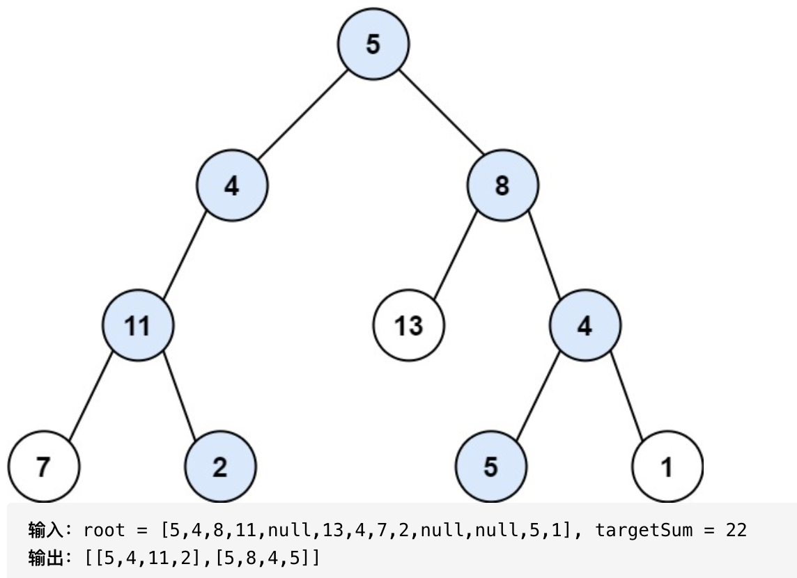</div>

+ **思路：**

  + 路径总和II要遍历整个树，找到所有路径，**「所以递归函数不要返回值！」**

  <div align = center> 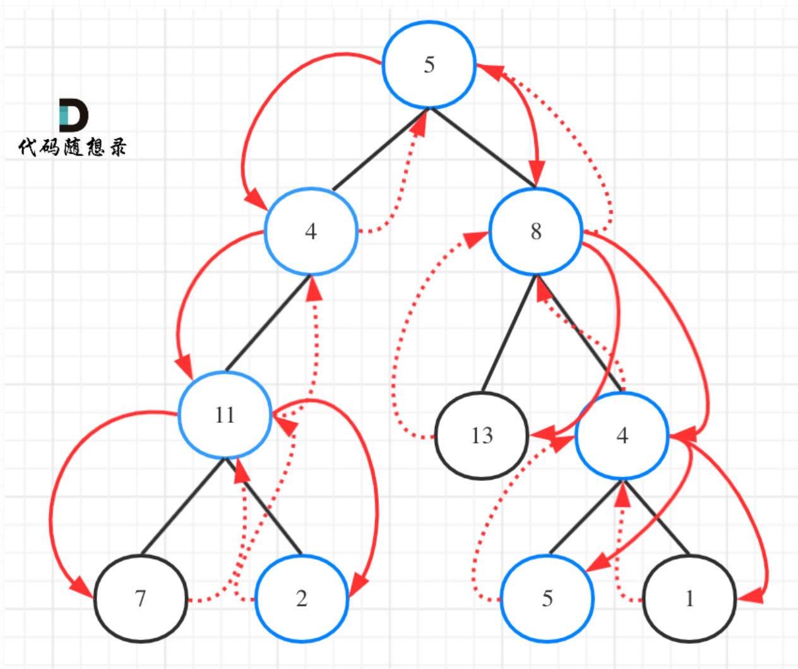< /div>

+ 递归思路与上图一致，代码实现如下：

  ```c++
  vector<vector<int>> result;    
  vector<int> path;    
  // 递归函数不需要返回值，因为我们要遍历整个树    
  void traversal(TreeNode* cur, int count) {        
    	if (!cur->left && !cur->right && count == 0) { 
        // 遇到了叶子节点切找到了和为sum的路径            
        result.push_back(path);            
        return;       
    	}        
      if (!cur->left && !cur->right) 
        	return ; 
      // 遇到叶子节点而没有找到合适的边，直接返回        
      if (cur->left) { // 左 （空节点不遍历）            
          path.push_back(cur->left->val);            
          count -= cur->left->val;            
          traversal(cur->left, count);    // 递归            
          count += cur->left->val;        // 回溯            
          path.pop_back();                // 回溯        
      }        
      if (cur->right) { // 右 （空节点不遍历）            
          path.push_back(cur->right->val);            
          count -= cur->right->val;            
          traversal(cur->right, count);   // 递归            
          count += cur->right->val;       // 回溯            
          path.pop_back();                // 回溯        
      }        
      	return ;    
  }
  vector<vector<int>> pathSum(TreeNode* root, int sum) {        
      result.clear();        
      path.clear();        
      if (root == NULL) return result;       
      path.push_back(root->val); // 把根节点放进路径        
      traversal(root, sum - root->val);        
      return result;    
  
  ```

###  :diamond_shape_with_a_dot_inside: 14. 从中序与后序遍历序列构造二叉树

> 根据一棵树的中序遍历与后序遍历构造二叉树。

+ 示例：

  <div align = center >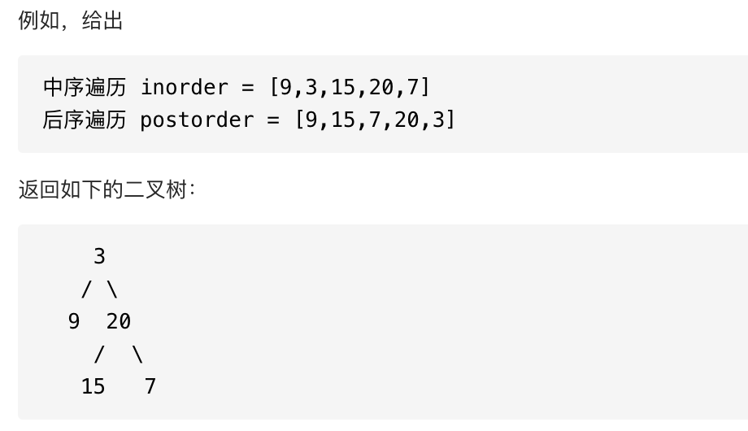</div>

+ **思路：**

  + 以 后序数组的最后一个元素为切割点，先切中序数组，根据中序数组，反过来在切后序数组。一层一层切下去，每次后序数组最后一个元素就是节点元素。

    <div align = center >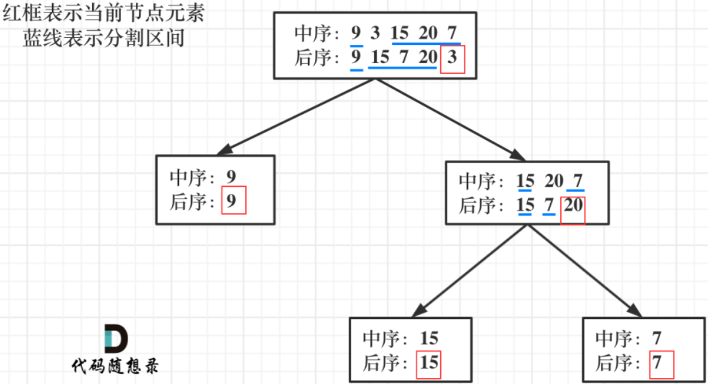</div>

  + 说到一层一层切割，就应该想到了递归。

    - 第一步：如果数组大小为零的话，说明是空节点了。
    - 第二步：如果不为空，那么取后序数组最后一个元素作为节点元素。
    - 第三步：找到后序数组最后一个元素在中序数组的位置，作为切割点
    - 第四步：切割中序数组，切成中序左数组和中序右数组 （顺序别搞反了，一定是先切中序数组）
    - 第五步：切割后序数组，切成后序左数组和后序右数组
    - 第六步：递归处理左区间和右区间

  + 代码

    ```c++
    TreeNode* traversal (vector<int>& inorder, vector<int>& postorder) {
        // 第一步
        if (postorder.size() == 0) return NULL;
        // 第二步：后序遍历数组最后一个元素，就是当前的中间节点
        int rootValue = postorder[postorder.size() - 1];
        TreeNode* root = new TreeNode(rootValue);
        // 叶子节点
        if (postorder.size() == 1) return root;
        // 第三步：找切割点
        int delimiterIndex;
        for (delimiterIndex = 0; delimiterIndex < inorder.size(); delimiterIndex++) {
          	if (inorder[delimiterIndex] == rootValue) break;
        }
        // 第四步：切割中序数组，得到 中序左数组和中序右数组 
        // 第五步：切割后序数组，得到 后序左数组和后序右数组
        // 第六步
        root->left = traversal(中序左数组, 后序左数组);
        root->right = traversal(中序右数组, 后序右数组);
        return root;
    }
    ```

+ 实现代码：

  ```c++
  TreeNode* traversal(vector<int>& inorder, vector<int>& postorder) {
      //第一步，如果后序遍历的长度为0，直接返回空
      if(postorder.size() == 0)
          return nullptr;
      //第二步，将后序数组中的最后一个数组作为切割点
      int rootValue = postorder[postorder.size() - 1];
      TreeNode* root = new TreeNode(rootValue);
      //叶子结点
      if(postorder.size() == 1) return root;
      //第三步，找到切割点
      int delimiterIndex;
      for(delimiterIndex = 0; delimiterIndex < inorder.size(); ++delimiterIndex)
          if(inorder[delimiterIndex] == rootValue)
              break;
      //第四步：切割中序数组，得到 中序左数组和中序右数组 
      vector<int> leftInorder(inorder.begin(), inorder.begin() + delimiterIndex);
      vector<int> rightInorder(inorder.begin() + delimiterIndex + 1, inorder.end());
      //第五步：切割后序数组，得到 后序左数组和后序右数组
      // postorder 舍弃末尾元素，因为这个元素就是中间节点，已经用过了
      postorder.resize(postorder.size() - 1);
      vector<int> leftPost(postorder.begin(), postorder.begin() + leftInorder.size());
      vector<int> rightPost(postorder.begin() + leftInorder.size(), postorder.end());
      //第六步：递归处理左区间和右区间
      root->left = traversal(leftInorder, leftPost);
      root->right = traversal(rightInorder, rightPost);
      return root;
  }
  TreeNode* buildTree(vector<int>& inorder, vector<int>& postorder) {
      if(inorder.size() == 0 || postorder.size() == 0)
          return nullptr;
      return traversal(inorder, postorder);
  }
  ```
  

###  :diamond_shape_with_a_dot_inside: 15.从前序与中序遍历序列构造二叉树

> 根据一棵树的前序遍历与中序遍历构造二叉树。

+ 示例：

  <div = align = center>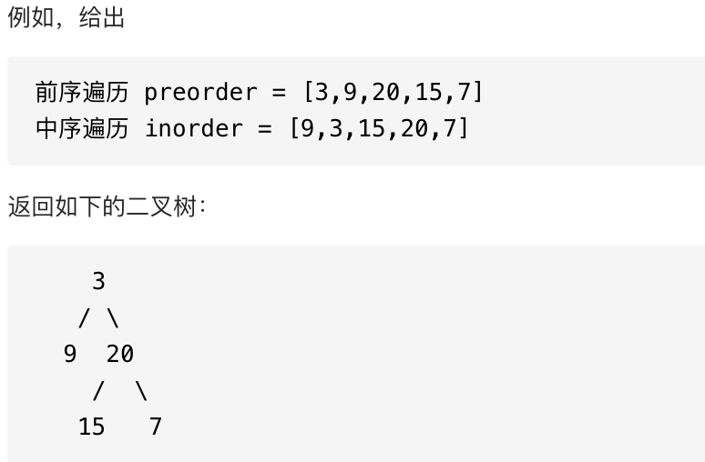</div>

+ 实现代码

  ```c++
  TreeNode* traversal(vector<int>& preorder, vector<int>& inorder) {
      //第一步，如果先序遍历的长度为0，直接返回空
      if(preorder.size() == 0)
          return nullptr;
      //第二步：将先序遍历的第一个元素作为切割点
      int rootValue = preorder[0];
      TreeNode* root = new TreeNode(rootValue);
      //如果是元素为1，直接作为叶子结点
      if(preorder.size() == 1) return root;
      //第三步： 找到在中序数组中切割点的位置
      int delimitIndex;
      for(delimitIndex = 0; delimitIndex < inorder.size(); ++delimitIndex) 
          if(inorder[delimitIndex] == rootValue)
              break;
      //第四步：切割中序数组，得到中序左数组与中序右数组
      vector<int> leftInder(inorder.begin(), inorder.begin() + delimitIndex);
      vector<int> rightInder(inorder.begin() + delimitIndex + 1, inorder.end());
      //第五步：切割先序数组，得到先序左数组与先序右数组
      preorder.erase(preorder.begin(), preorder.begin() + 1);
      vector<int> leftPreorder(preorder.begin(), preorder.begin() + leftInder.size());
      vector<int> rightPreorder(preorder.begin() + leftInder.size(), preorder.end());
      //第六步：递归处理左区间和右区间
      root->left = traversal(leftPreorder, leftInder);
      root->right = traversal(rightPreorder, rightInder);
      return root;
  }
  TreeNode* buildTree(vector<int>& preorder, vector<int>& inorder) {
      if(preorder.size() == 0 || inorder.size() == 0)
          return nullptr;
      return traversal(preorder, inorder);
  }
  ```
  
  

### 16.构造最大的二叉树

> 给定一个不含重复元素的整数数组。一个以此数组构建的最大二叉树定义如下：
>
> - 二叉树的根是数组中的最大元素。
> - 左子树是通过数组中最大值左边部分构造出的最大二叉树。
> - 右子树是通过数组中最大值右边部分构造出的最大二叉树。
>
> 通过给定的数组构建最大二叉树，并且输出这个树的根节点。
>
> 给定的数组的大小在 [1, 1000] 之间。

+ 示例：

  <div align = center>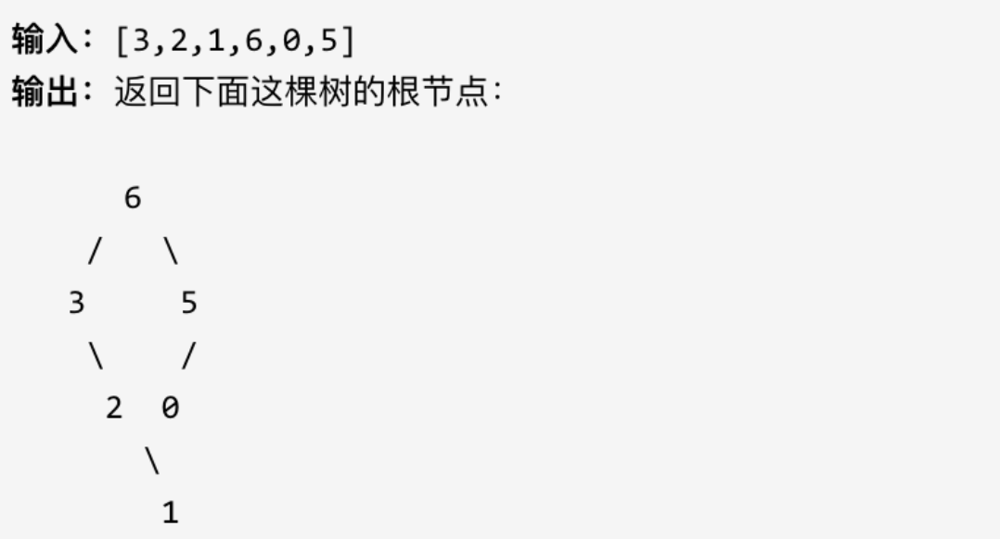</div>

+ **思路：**

  + 构造树一般采用的是前序遍历，因为先构造中间节点，然后递归构造左子树和右子树。
    - 确定递归函数的参数和返回值
  + 参数就是传入的是存放元素的数组，返回该数组构造的二叉树的头结点，返回类型是指向节点的指针。

+ **递归三步曲：**

  + **确定终止条件**

    + 题目中说了输入的数组大小一定是大于等于1的，所以我们不用考虑小于1的情况，那么当递归遍历的时候，如果传入的数组大小为1，说明遍历到了叶子节点了。
    + 那么应该定义一个新的节点，并把这个数组的数值赋给新的节点，然后返回这个节点。这表示一个数组大小是1的时候，构造了一个新的节点，并返回。

    ```c++
    TreeNode* root = new TreeNode(*rootVal);
    if(nums.size() == 1)
      	return root;
    ```

  + **确定单层递归的逻辑**

    > 这里有三步工作

    + **先要找到数组中最大的值和对应的下表， 最大的值构造根节点，下表用来下一步分割数组。**

      ```c++
      auto rootVal = max_element(nums.begin(), nums.end());
      int delimit = 0;
      for(delimit = 0; delimit < nums.size() - 1; ++delimit) {
        	if(nums[delimit] == *rootVal)
         		 break;
      }
      ```
    
    + **最大值所在的下表左区间 构造左子树**
    
      ```c++
      vector<int> leftTree(nums.begin(), nums.begin() + delimit);
      root->left = traversal(leftTree);
      ```

    + **最大值所在的下表右区间 构造右子树**
    
      ```c++
      vector<int> rightTree(nums.begin() + delimit + 1, nums.end());
      root->right = traversal(rightTree);
      ```

+ **实现代码：**

  ```c++
  TreeNode* traversal(vector<int>& nums) {
      //第一步：如果大小为0，直接返回空
      if(nums.size() == 0)
          return nullptr;
      //第二步：找到最大值作为结点
      auto rootVal = max_element(nums.begin(), nums.end());
      int delimit = 0;
    	//第三步： 找到切割点的位置
      for(delimit = 0; delimit < nums.size() - 1; ++delimit) {
          if(nums[delimit] == *rootVal)
              break;
      }
      TreeNode* root = new TreeNode(*rootVal);
      if(nums.size() == 1)
          return root;
      //第四步：切割数组，得到左数组与右数组
      vector<int> leftTree(nums.begin(), nums.begin() + delimit);
      vector<int> rightTree(nums.begin() + delimit + 1, nums.end());
    	//第五步：递归处理左区间和右区间
      root->left = traversal(leftTree);
      root->right = traversal(rightTree);
      return root;
  }
  TreeNode* constructMaximumBinaryTree(vector<int>& nums) {
      return traversal(nums);
  }
  ```


### 17.合并二叉树

> 给定两个二叉树，想象当你将它们中的一个覆盖到另一个上时，两个二叉树的一些节点便会重叠。
>
> 你需要将他们合并为一个新的二叉树。合并的规则是如果两个节点重叠，那么将他们的值相加作为节点合并后的新值，否则不为 NULL 的节点将直接作为新二叉树的节点。

+ **示例：**

  <div align = center>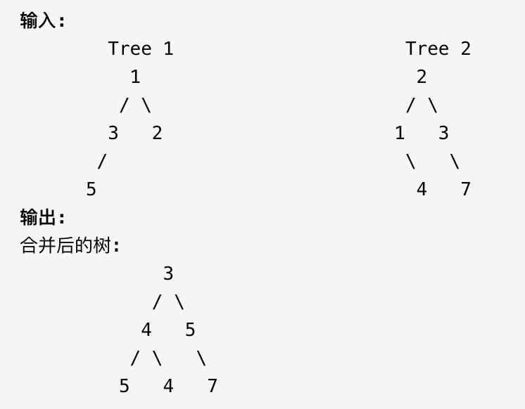</div>

+ **思路：**

  + 遍历两个二叉树的操作和遍历一个树逻辑是一样的，只不过传入两个树的节点，同时操作。

+ **递归三部曲：**

  + **确定递归函数的参数和返回值：**

    + 首先那么要合入两个二叉树，那么参数至少是要传入两个二叉树的根节点，返回值就是合并之后二叉树的根节点。

      ```c++
      TreeNode* mergeTrees(TreeNode* t1, TreeNode* t2) {
      ```

  + **确定终止条件：**

    + 因为是传入了两个树，那么就有两个树遍历的节点t1 和 t2，如果t1 == NULL 了，两个树合并就应该是 t2 了啊（如果t2也为NULL也无所谓，合并之后就是NULL）。

    + 反过来如果t2 == NULL，那么两个数合并就是t1（如果t1也为NULL也无所谓，合并之后就是NULL）。

      ```C++
      if (t1 == NULL) return t2; // 如果t1为空，合并之后就应该是t2
      if (t2 == NULL) return t1; // 如果t2为空，合并之后就应该是t1
      ```

  + **确定单层递归的逻辑：**

    + 单层递归的逻辑就比较好些了，这里我们用重复利用一下t1这个树，t1就是合并之后树的根节点（就是修改了原来树的结构）。

    + 那么单层递归中，就要把两棵树的元素加到一起。

      ```c++
      t1->val += t2->val;
      ```

    + 接下来t1 的左子树是：合并 t1左子树 t2左子树之后的左子树。t1 的右子树：是 合并 t1右子树 t2右子树之后的右子树。最终t1就是合并之后的根节点。

      ```C++
      t1->left = mergeTrees(t1->left, t2->left);
      t1->right = mergeTrees(t1->right, t2->right);
      return t1
      ```

+ **实现代码：**

  ```c++
  class Solution {
  public:    
    TreeNode* mergeTrees(TreeNode* t1, TreeNode* t2) {        
      if (t1 == NULL) return t2; // 如果t1为空，合并之后就应该是t2        
      if (t2 == NULL) return t1; // 如果t2为空，合并之后就应该是t1        
      // 修改了t1的数值和结构        
      t1->val += t2->val;                             // 中        
      t1->left = mergeTrees(t1->left, t2->left);      // 左        
      t1->right = mergeTrees(t1->right, t2->right);   // 右        
      return t1;    
    }
  };
  ```


### 18.叶子相似的树

> 请考虑一棵二叉树上所有的叶子，这些叶子的值按从左到右的顺序排列形成一个 *叶值序列* 。
>
> 举个例子，如上图所示，给定一棵叶值序列为 (6, 7, 4, 9, 8) 的树。
>
> 如果有两棵二叉树的叶值序列是相同，那么我们就认为它们是 叶相似 的。
>
> 如果给定的两个根结点分别为 root1 和 root2 的树是叶相似的，则返回 true；否则返回 false 。

+ **示例：**

  <div align = center>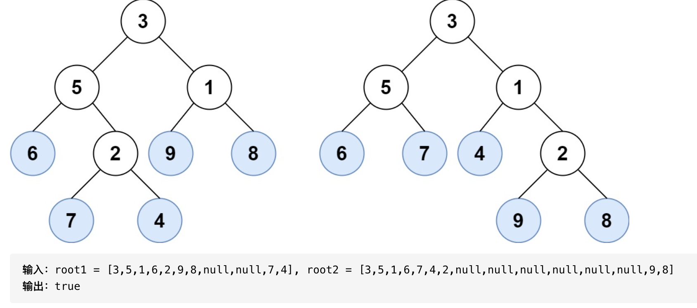</div>

+ **思路：**

  + 利用递归遍历所有叶子结点，将叶子结点值导入vector数组中，最后比较两个vector是否相同。

+ **递归三部曲：**

  + **确定递归函数的参数和返回值：**

    + 将二叉树结点和vector数组的引用作为参数，因为遍历的是一整棵树，所以不需要返回值

      ```c++
       void traversal (TreeNode* node, vector<int>&nums) ;
      ```

  + **确定终止条件：**

    + 当遍历到叶子结点时，压入到vector数组中，返回。

      ```c++
      //结束条件if(node->left == nullptr && node->right == nullptr)  {		nums.push_back(node->val);		return;}
      ```

  + **确定单层递归的逻辑：**

    + 单层递归的逻辑就比较好些了，直接找目前结点的左子树与右子树。

      ```c++
      //单层递归if(node->left) 		traversal(node->left, nums);if(node->right)		traversal(node->right, nums);return; 
      ```

+ **实现代码：**

  ```c++
  void traversal (TreeNode* node, vector<int>&nums) {
      //结束条件
      if(node->left == nullptr && node->right == nullptr)  {
          nums.push_back(node->val);
          return;
      }
      //单层递归
      if(node->left) 
        	traversal(node->left, nums);
      if(node->right)
        	traversal(node->right, nums);
      return; 
  }
  bool leafSimilar(TreeNode* root1, TreeNode* root2) {
      vector<int> root1num;  
      vector<int> root2num;
      traversal(root1,root1num);
      traversal(root2,root2num);
      bool flag = true;
      if(root1num != root2num)
        	flag = false;
      return flag;
  }
  ```

### 19.公共祖先问题

> 给定一个二叉树, 找到该树中两个指定节点的最近公共祖先。
>
> 百度百科中最近公共祖先的定义为：“对于有根树 T 的两个结点 p、q，最近公共祖先表示为一个结点 x，满足 x 是 p、q 的祖先且 x 的深度尽可能大（一个节点也可以是它自己的祖先）。”

+ **示例：**

  <div align = center>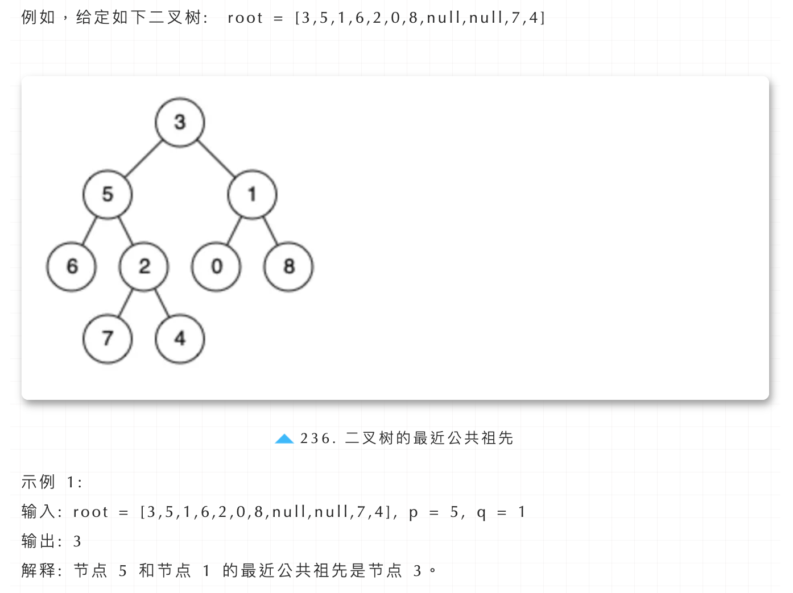</center>

+ **思路：**

  + 遇到这个题目首先想的是要是能自底向上查找就好了，这样就可以找到公共祖先了。那么二叉树如何可以自底向上查找呢？ **首先应该想到回溯，** 二叉树回溯的过程就是从低到上。而后序遍历就是天然的回溯过程，最先处理的一定是叶子节点。
  + 接下来就看如何判断一个节点是节点q和节点p的公共公共祖先呢。 **「如果找到一个节点，发现左子树出现结点p，右子树出现节点q，或者 左子树出现结点q，右子树出现节点p，那么该节点就是节点p和q的最近公共祖先。」**
  + 使用后序遍历，回溯的过程，就是从低向上遍历节点，一旦发现如何这个条件的节点，就是最近公共节点了。

+ **递归三步曲：**

  + **确定递归函数返回值以及参数**

    + 需要递归函数返回值，来告诉我们是否找到节点q或者p，那么返回值为bool类型就可以了。
    + 但我们还要返回最近公共节点，可以利用上题目中返回值是TreeNode * ，那么如果遇到p或者q，就把q或者p返回，返回值不为空，就说明找到了q或者p。

    ```c++
    TreeNode* lowestCommonAncestor(TreeNode* root, TreeNode* p, TreeNode* q) 
    ```

  + 确定终止条件

    + 如果找到了 节点p或者q，或者遇到空节点，就返回。

    ```c++
    if (root == q || root == p || root == NULL) return root;
    ```

  + 处理单层递归逻辑

    + 遍历根节点右子树（即使此时已经找到了目标节点了），在后序遍历中，如果想利用left和right做逻辑处理， 不能立刻返回，而是要等left与right逻辑处理完之后才能返回。

    + **「如果left 和 right都不为空，说明此时root就是最近公共节点。这个比较好理解」**
    + **「如果left为空，right不为空，就返回right，说明目标节点是通过right返回的，反之依然」**。

    ```c++
    TreeNode* left = lowestCommonAncestor(root->left, p, q);
    TreeNode* right = lowestCommonAncestor(root->right, p, q);
    if (left != NULL && right != NULL) 
    		return root;
    
    if (left == NULL && right != NULL) 
    		return right;
    else if (left != NULL && right == NULL) 
    		return left;
    else  { //  (left == NULL && right == NULL)
    		return NULL;
    }
    ```

+ **代码实现：**

  ```c++
  class Solution {
  public:
      TreeNode* lowestCommonAncestor(TreeNode* root, TreeNode* p, TreeNode* q) {
          if (root == q || root == p || root == NULL) return root;
          TreeNode* left = lowestCommonAncestor(root->left, p, q);
          TreeNode* right = lowestCommonAncestor(root->right, p, q);
          if (left != NULL && right != NULL) return root;
          if (left == NULL && right != NULL) return right;
          else if (left != NULL && right == NULL) return left;
          else  { //  (left == NULL && right == NULL)
              return NULL;
          }
      }
  };
  ```
  
  

### 树的递归总结

+ **有关递归的返回值问题：**

  + **「如果需要搜索整颗二叉树，那么递归函数就不要返回值，如果要搜索其中一条符合条件的路径，递归函数就需要返回值，因为遇到符合条件的路径了就要及时返回。」**

  + 第19题中遍历整棵树，但还是有返回值。 **是因为回溯的过程需要递归函数的返回值做判断，但本题我们依然要遍历树的所有节点。**

+ **如果递归函数有返回值，如何区分要搜索一条边，还是搜索整个树呢？**

  + 搜索一条边的写法：

    ```c++
    if (递归函数(root->left)) return ;
    if (递归函数(root->right)) return ;
    ```
  
    搜索整个树写法：
  
    ```c++
    left = 递归函数(root->left);
    right = 递归函数(root->right);left与right的逻辑处理;
    ```

  + **在递归函数有返回值的情况下：**
  
    + **「 如果要搜索一条边，递归函数返回值不为空的时候，立刻返回**
    + **如果搜索整个树，直接用一个变量left、right接住返回值，这个left、right后序还有逻辑处理的需要，也就是后序遍历中处理中间节点的逻辑（也是回溯）」**。


---

## 三.二叉搜索树的创建与操作

### 1.二叉搜索树的创建

```c++
void CreatBSTree(BSTreeNode* &root) {    
  int value;    
  while(std::cin >> value) {        //声明临时节点并把数据放进去，注意不能delete        
    auto newNode = new BSTreeNode(value);        //树没有根结点的情况        
    if (root == nullptr)            
      root = newNode;        //树存在根节点        
    else        {            //声明移动指针            
      BSTreeNode* pTemp = root;            //找到插入的位置才退出            
      while (true)            {                //输入的数小于该节点的值                
        if (value < pTemp->val) {                    //左孩子为空，则新的节点为左孩子                    
          if (pTemp->left == nullptr){                        
            pTemp->left = newNode;                       
            break;                    
          } else { //左孩子不为空，p指针移动为左孩子                               
            	pTemp = pTemp->left;                   
          	}                
        } else {//右孩子为空，则新的节点为右孩子                    
          if (pTemp->right == nullptr){                        
            pTemp->right = newNode;                        
            break;                    
          } else {  //右孩子不为空，p指针移动为右孩子                      
            pTemp = pTemp->right;                    
          }                
        }            
      }        
    }        
    //判断是否输入结束        
    if (std::cin.get() == '\n')           
      break;    
  }
}
```

### 2.二插搜索树的遍历

#### 递归进行先序遍历

```c++
void PreOrderTraversalBSTree(BSTreeNode* root) {    
  if(root != nullptr) {        
    std::cout << (root->val) << " ";        
    PreOrderTraversalBSTree(root->left);        
    PreOrderTraversalBSTree(root->right);    
  }
}
```

#### 递归进行中序遍历

```c++
void InOrderTraversalBSTree(BSTreeNode* root) {    
  if(root != nullptr) {        
    InOrderTraversalBSTree(root->left);        
    std::cout << (root->val) << " ";        
    InOrderTraversalBSTree(root->right);    
  }
}
```

#### 递归进行后序遍历

```c++
void PostOrderTraversalBSTree(BSTreeNode* root) {    
  if(root != nullptr) {        
    PostOrderTraversalBSTree(root->left);        
    PostOrderTraversalBSTree(root->right);        
    std::cout << (root->val) << " ";    
  }
}
```

### 3.二叉搜索树中的搜索

> 给定二叉搜索树（BST）的根节点和一个值。你需要在BST中找到节点值等于给定值的节点。返回以该节点为根的子树。如果节点不存在，则返回 NULL。

+ **示例：**

  <div align = center>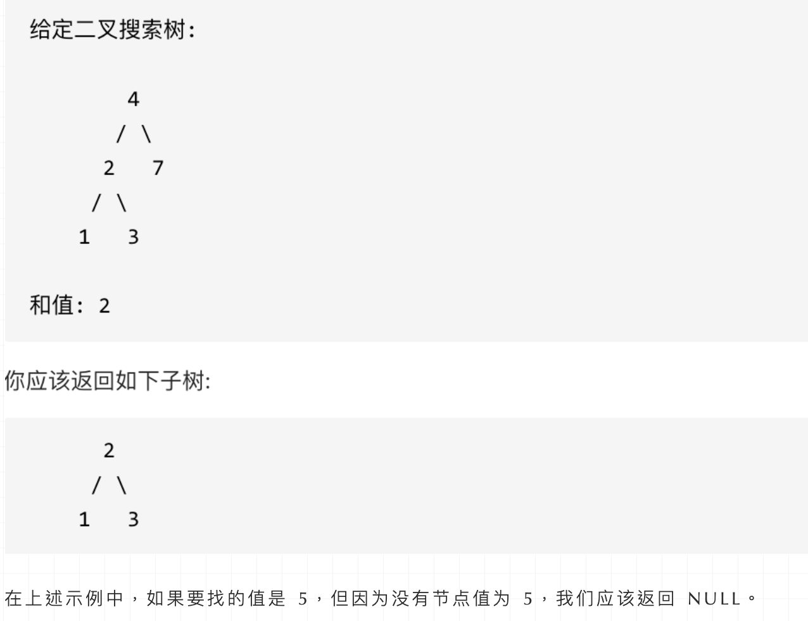</div>

+ **思路：**

  + 本题其实就是在二叉搜索树中搜索一个节点。

#### 递归方案

+ **递归三步曲：**

  + **确定递归函数的参数和返回值**

    + 递归函数的参数传入的就是根节点和要搜索的数值，返回的就是以这个搜索数值所在的节点。

    ```c++
    TreeNode* searchBST(TreeNode* root, int val)
    ```

  + **确定终止条件**

    + 如果root为空，或者找到这个数值了，就返回root节点。

    ```c++
    if (root == NULL || root->val == val) return root;
    ```

  + **确定单层递归的逻辑**

    + 因为二叉搜索树的节点是有序的，所以可以有方向的去搜索。
    + 如果root->val > val，搜索左子树，如果root->val < val，就搜索右子树，最后如果都没有搜索到，就返回NULL。

    ```c++
    if (root->val > val) 
      	return searchBST(root->left, val); // 注意这里加了return 
    if (root->val < val) 
    		return searchBST(root->right, val);
    return NULL;
    ```

+ **代码实现**

  ```c++
  TreeNode* searchBST(TreeNode* root, int val) {
      if (root == NULL || root->val == val) return root;
      if (root->val > val) return searchBST(root->left, val);
      if (root->val < val) return searchBST(root->right, val);
      return NULL;
  }
  ```

#### 迭代方案

提到二叉树遍历的迭代法，可能立刻想起使用栈来模拟深度遍历，使用队列来模拟广度遍历。对于二叉搜索树可就不一样了，因为二叉搜索树的特殊性，也就是节点的有序性，可以不使用辅助栈或者队列就可以写出迭代法。

对于一般二叉树，递归过程中还有回溯的过程，例如走一个左方向的分支走到头了，那么要调头，在走右分支。而**「对于二叉搜索树，不需要回溯的过程，因为节点的有序性就帮我们确定了搜索的方向。」**

例如要搜索元素为3的节点，**「我们不需要搜索其他节点，也不需要做回溯，查找的路径已经规划好了。」**

中间节点如果大于3就向左走，如果小于3就向右走，如图：

<div align = center>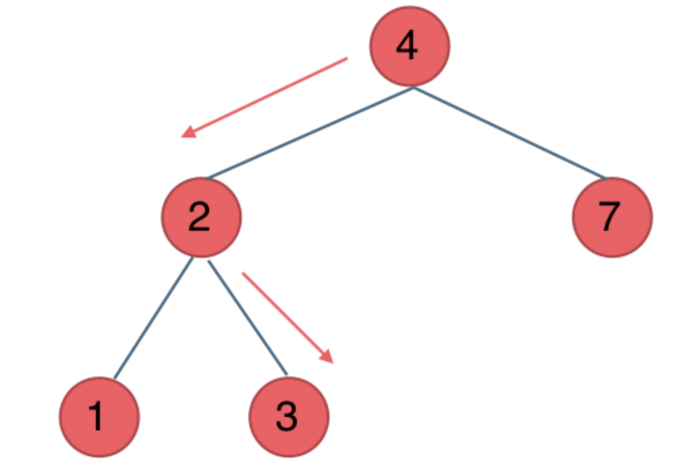</div>

+ **实现代码：**

  ```c++
  TreeNode* searchBST(TreeNode* root, int val) {
      while (root != NULL) {
          if (root->val > val) root = root->left;
          else if (root->val < val) root = root->right;
          else return root;
      }
      return NULL;
  }
  ```


### 4.验证二叉搜索树

> 给定一个二叉树，判断其是否是一个有效的二叉搜索树。

+ **示例：**

  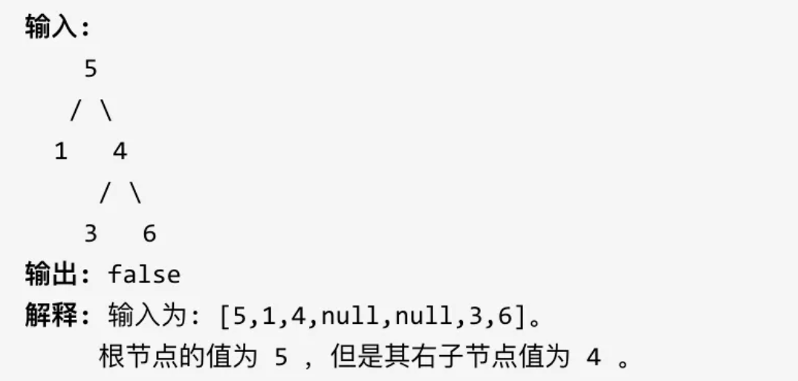

+ **思路：**

  + 二叉搜索树在中序遍历下，输出的二叉搜索树节点的数值是有序序列。有了这个特性，**「验证二叉搜索树，就相当于变成了判断一个序列是不是递增的了。」**

#### 递归方案

可以递归中序遍历将二叉搜索树转变成一个数组，代码如下：

```c++
vector<int> vec;
void traversal(TreeNode* root) {
    if (root == NULL) return;
    traversal(root->left);
    vec.push_back(root->val); // 将二叉搜索树转换为有序数组
    traversal(root->right);
}
```

然后只要比较一下，这个数组是否是有序的，**「注意二叉搜索树中不能有重复元素」**。

```c++
traversal(root);
for (int i = 1; i < vec.size(); i++) {
    // 注意要小于等于，搜索树里不能有相同元素
    if (vec[i] <= vec[i - 1]) return false;
}
return true;
```

整体代码如下：

```c++
vector<int> vec;
void traversal(TreeNode* root) {
    if (root == NULL) return;
    traversal(root->left);
    vec.push_back(root->val); // 将二叉搜索树转换为有序数组
    traversal(root->right);
}

bool isValidBST(TreeNode* root) {
    vec.clear(); // 不加这句在leetcode上也可以过，但最好加上
    traversal(root);
    for (int i = 1; i < vec.size(); i++) {
        // 注意要小于等于，搜索树里不能有相同元素
        if (vec[i] <= vec[i - 1]) return false;
    }
    return true;
}
```

#### 迭代方案

可以用迭代法模拟二叉树中序遍历，迭代法中序遍历稍加改动就可以了，代码如下：

```c++
bool isValidBST(TreeNode* root) {
    stack<TreeNode*> st;
    TreeNode* cur = root;
    TreeNode* pre = NULL; // 记录前一个节点
    while (cur != NULL || !st.empty()) {
      if (cur != NULL) {
        st.push(cur);
        cur = cur->left;                // 左
      } else {
        cur = st.top();                 // 中
        st.pop();
        if (pre != NULL && cur->val <= pre->val)
          return false;
        pre = cur; //保存前一个访问的结点

        cur = cur->right;               // 右
      }
    }
    return true;
}
```

### 5.二叉搜索树中的众数

> 给定一个有相同值的二叉搜索树（BST），找出 BST 中的所有众数（出现频率最高的元素）。

+ 示例：

  <div align = center>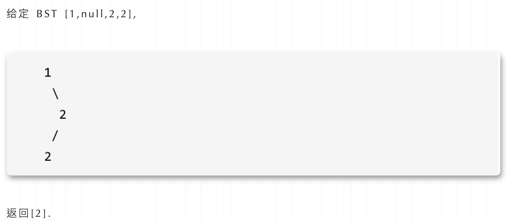</div>

+ **思路：**

  + 首先如果不是二叉搜索树的话，应该怎么解题？如果不是二叉搜索树，最直观的方法一定是把这个树都遍历了，用map统计频率，把频率排个序，最后取前面高频的元素的集合。
  + **「既然是搜索树，它中序遍历就是有序的」**。遍历有序数组的元素出现频率，从头遍历，那么一定是相邻两个元素作比较，然后就把出现频率最高的元素输出就可以了。
  + 使用pre指针和cur指针的技巧，定义一个指针指向前一个节点，这样每次cur（当前节点）才能和pre（前一个节点）作比较。而且初始化的时候pre = NULL，这样当pre为NULL时候，我们就知道这是比较的第一个元素。
  + 遍历一遍数组，找出最大频率（maxCount），然后再重新遍历一遍数组把出现频率为maxCount的元素放进集合。频率count 大于 maxCount的时候，不仅要更新maxCount，而且要清空结果集（以下代码为result数组），因为结果集之前的元素都失效了。

+ **递归遍历实现：**

  ```c++
  int maxCount;
  int count;
  TreeNode* pre;
  vector<int> result;
  void traversal(TreeNode* cur) {
      if(cur == nullptr) return;
      traversal(cur->left);//左；
      //中间逻辑
      if(pre == nullptr)  // 第一个节点
          count = 1;
      else if(pre->val == cur->val) //与上一个结点相同
          ++ count;
      else    //与上一个结点不同
          count = 1;
      pre = cur;//更新结点
      if(count == maxCount) //如果数目和最大数相同，则进入数组
          result.push_back(cur->val);
      if(count > maxCount) {//如果大于最大数，则进行更新
          maxCount = count;   // 更新最大频率
          result.clear();     //清空原来的数组
          result.push_back(cur->val);
      }
      traversal(cur->right);//右
  }
  vector<int> findMode(TreeNode* root) {
      maxCount = 0;
      count = 0;
      pre = nullptr;
      result.clear();
      traversal(root);
      return result;
  }
  ```

+ **迭代遍历代码实现：**

  ```c++
  vector<int> findMode(TreeNode* root) {
    stack<TreeNode*> st;
    TreeNode* cur = root;
    TreeNode* pre = NULL;
    int maxCount = 0; // 最大频率
    int count = 0; // 统计频率
    vector<int> result;
    while (cur != NULL || !st.empty()) {
      if (cur != NULL) { // 指针来访问节点，访问到最底层
        st.push(cur); // 将访问的节点放进栈
        cur = cur->left;                // 左
      } else {
        cur = st.top();
        st.pop();                       // 中
        if (pre == NULL) { // 第一个节点
          count = 1;
        } else if (pre->val == cur->val) { // 与前一个节点数值相同
          count++;
        } else { // 与前一个节点数值不同
          count = 1;
        }
        if (count == maxCount) { // 如果和最大值相同，放进result中
          result.push_back(cur->val);
        }
  
        if (count > maxCount) { // 如果计数大于最大值频率
          maxCount = count;   // 更新最大频率
          result.clear();     // 很关键的一步，不要忘记清空result，之前result里的元素都失效了
          result.push_back(cur->val);
        }
        pre = cur;
        cur = cur->right;               // 右
      }
    }
    return result;
  }
  ```


### 6.二叉搜索树的最近公共祖先

> 给定一个二叉搜索树, 找到该树中两个指定节点的最近公共祖先。

+ **示例**

  <div align = center>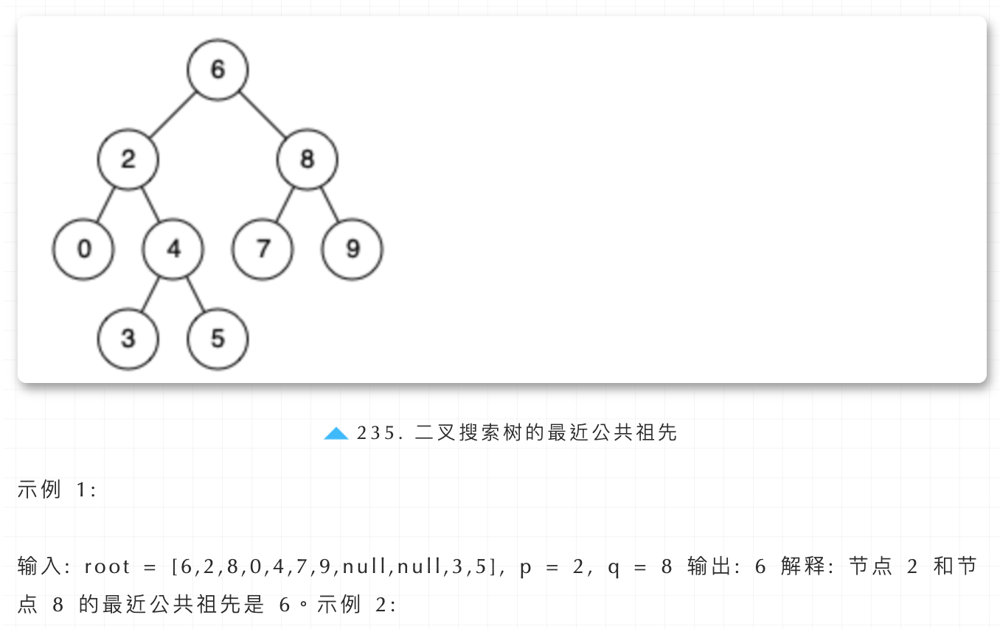</div>

+ **思路：**

  + 通过 二叉树：公共祖先问题 利用回溯从底向上搜索，遇到一个节点的左子树里有p，右子树里有q，那么当前节点就是最近公共祖先。而本题是二叉搜索树，二叉搜索树是有序的，那得好好利用一下这个特点。
  + 在有序树里，如果判断一个节点的左子树里有p，右子树里有q呢？其实只要从上到下遍历的时候，cur节点是数值在[p, q]区间中则说明该节点cur就是最近公共祖先了。

#### 递归思路

+ **递归三部曲：**

  + **确定递归函数返回值以及参数**

    + 参数就是 当前节点，以及两个结点 p、q。返回值是要返回最近公共祖先，所以是TreeNode *  。

    ```c++
    TreeNode* traversal(TreeNode* cur, TreeNode* p, TreeNode* q) 
    ```

  + **确定终止条件**

    + 遇到空返回就可以了，代码如下：

      ```c++
      if (cur == NULL) return cur;
      ```

      其实都不需要这个终止条件，因为题目中说了p、q 为不同节点且均存在于给定的二叉搜索树中。也就是说一定会找到公共祖先的，所以并不存在遇到空的情况。

  + **确定单层递归的逻辑**

    + 在遍历二叉搜索树的时候就是寻找区间[p->val, q->val]（注意这里是左闭又闭）。那么如果 cur->val 大于 p->val，同时 cur->val 大于q->val，那么就应该向左遍历（说明目标区间在左子树上）。**「需要注意的是此时不知道p和q谁大，所以两个都要判断」**

      ```c++
      if (cur->val > p->val && cur->val > q->val) {    
        TreeNode* left = traversal(cur->left, p, q);    
        if (left != NULL) {        
          return left;    
        }
      }
      ```
    
    + 在二叉树：公共祖先问题中，如果递归函数有返回值，如何区分要搜索一条边，还是搜索整个树。
    
      搜索一条边的写法：
    
      ```c++
      if (递归函数(root->left)) return ;
      if (递归函数(root->right)) return ;
      ```
      
      搜索整个树写法：
      
      ```c++
      left = 递归函数(root->left);
      right = 递归函数(root->right);
      left与right的逻辑处理;
      ```
      
      本题就是标准的搜索一条边的写法，遇到递归函数的返回值，如果不为空，立刻返回。
      
      如果 cur->val 小于 p->val，同时 cur->val 小于 q->val，那么就应该向右遍历（目标区间在右子树）。
      
      ```c++
      if (cur->val < p->val && cur->val < q->val) {
        TreeNode* right = traversal(cur->right, p, q);    
        if (right != NULL) { 
          return right;    
        }
      }
      ```
      
      剩下的情况，就是cur节点在区间（p->val <=  cur->val && cur->val <= q->val）或者 （q->val <=  cur->val && cur->val <= p->val）中，那么cur就是最近公共祖先了，直接返回cur。

+ 代码实现：

  ```c++
  TreeNode* lowestCommonAncestor(TreeNode* cur, TreeNode* p, TreeNode* q) {
      if (cur == NULL) return cur;
      // 中
      if (cur->val > p->val && cur->val > q->val) {   // 左
          TreeNode* left = lowestCommonAncestor(cur->left, p, q);
          if (left != NULL) {
            	return left;
          }
      }
      if (cur->val < p->val && cur->val < q->val) {   // 右
          TreeNode* right = lowestCommonAncestor(cur->right, p, q);
          if (right != NULL) {
            	return right;
          }
      }
      return cur;
  }
  ```

#### 迭代方案

+ 实现代码：

  ```c++
  TreeNode* lowestCommonAncestor(TreeNode* root, TreeNode* p, TreeNode* q) {
      if (root->val > p->val && root->val > q->val) 
          return lowestCommonAncestor(root->left, p, q);
      else if (root->val < p->val && root->val < q->val) 
          return lowestCommonAncestor(root->right, p, q);
      else 
          return root;
  }   
  ```
  
  

### 7.二叉搜索树中的插入操作

> 给定二叉搜索树（BST）的根节点和要插入树中的值，将值插入二叉搜索树。返回插入后二叉搜索树的根节点。输入数据保证，新值和原始二叉搜索树中的任意节点值都不同。
>
> 注意，可能存在多种有效的插入方式，只要树在插入后仍保持为二叉搜索树即可。你可以返回任意有效的结果。

+ **示例：**

  <div align = center>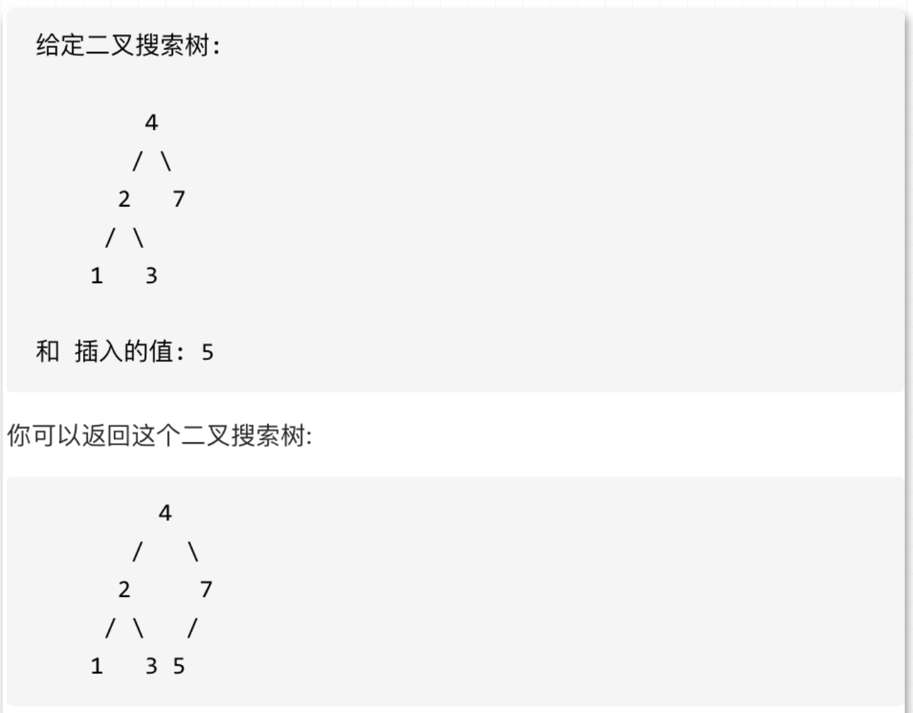</div>

+ **思路：**

  + 只要按照二叉搜索树的规则去遍历，遇到空节点就插入节点就可以了。

#### 递归方案

+ **递归三部曲：**

  + **确定递归函数参数以及返回值**

    + 参数就是根节点指针，以及要插入元素，这里递归函数要不要有返回值呢？
    + 可以有，也可以没有，但递归函数如果没有返回值的话，实现是比较麻烦的。
    + **「有返回值的话，可以利用返回值完成新加入的节点与其父节点的赋值操作」**。
    + 递归函数的返回类型为节点类型TreeNode * 。

    ```c++
    TreeNode* insertIntoBST(TreeNode* root, int val) 
    ```

  + **确定终止条件**

    + 终止条件就是找到遍历的节点为null的时候，就是要插入节点的位置了，并把插入的节点返回。

    ```c++
    if (root == NULL) {    TreeNode* node = new TreeNode(val);    return node;}
    ```

    + 这里把添加的节点返回给上一层，就完成了父子节点的赋值操作了，详细再往下看。

  + **确定单层递归的逻辑**

    + 此时要明确，需要遍历整棵树么？别忘了这是搜索树，遍历整颗搜索树简直是对搜索树的侮辱，哈哈。搜索树是有方向了，可以根据插入元素的数值，决定递归方向。

      代码如下：

      ```c++
      if (root->val > val) root->left = insertIntoBST(root->left, val);if (root->val < val) root->right = insertIntoBST(root->right, val);return root;
      ```

      **「到这里，大家应该能感受到，如何通过递归函数返回值完成了新加入节点的父子关系赋值操作了，下一层将加入节点返回，本层用root->left或者root->right将其接住」**。

+ **代码实现：**

  ```c++
  class Solution {public:    TreeNode* insertIntoBST(TreeNode* root, int val) {        if (root == NULL) {            TreeNode* node = new TreeNode(val);            return node;        }        if (root->val > val) root->left = insertIntoBST(root->left, val);        if (root->val < val) root->right = insertIntoBST(root->right, val);        return root;    }};
  ```


#### 迭代方案

+ 在迭代法遍历的过程中，需要记录一下当前遍历的节点的父节点，这样才能做插入节点的操作。

+ **实现代码：**

  ```c++
  class Solution {public:    TreeNode* insertIntoBST(TreeNode* root, int val) {        if (root == NULL) {            TreeNode* node = new TreeNode(val);            return node;        }        TreeNode* cur = root;        TreeNode* parent = root; // 这个很重要，需要记录上一个节点，否则无法赋值新节点        while (cur != NULL) {            parent = cur;            if (cur->val > val) cur = cur->left;            else cur = cur->right;        }        TreeNode* node = new TreeNode(val);        if (val < parent->val) parent->left = node;// 此时是用parent节点的进行赋值        else parent->right = node;        return root;    }};
  ```


### 8.删除二叉搜索树中的节点

> 给定一个二叉搜索树的根节点 root 和一个值 key，删除二叉搜索树中的 key 对应的节点，并保证二叉搜索树的性质不变。返回二叉搜索树（有可能被更新）的根节点的引用。
>
> 一般来说，删除节点可分为两个步骤：
>
> 首先找到需要删除的节点；如果找到了，删除它。说明：要求算法时间复杂度为 O(h)，h 为树的高度。

+ **示例：**

  <div align = center>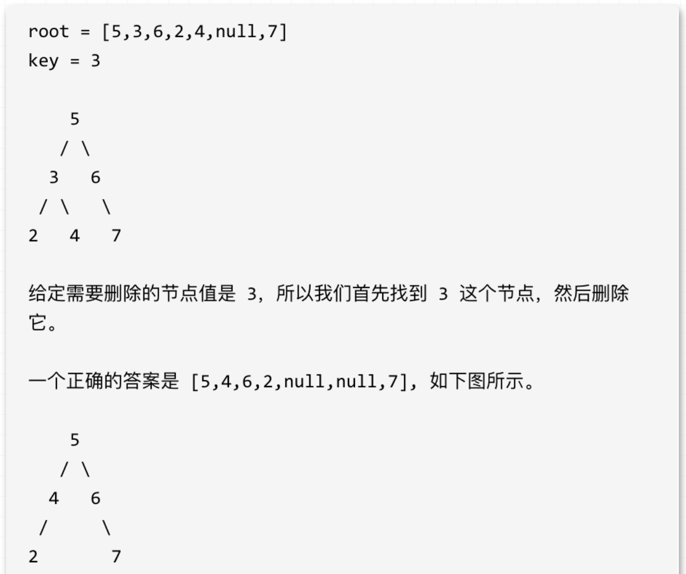</div>

+ **思路：**

  + 搜索树的节点删除要比节点增加复杂的多，有很多情况需要考虑

#### 递归方案

+ **递归三部曲：**

  + **确定递归函数参数以及返回值**

    + 说道递归函数的返回值，在二叉树：搜索树中的插入操作中通过递归返回值来加入新节点， 这里也可以通过递归返回值删除节点。

    ```c++
    TreeNode* deleteNode(TreeNode* root, int key) 
    ```

  + **确定终止条件**

    + 遇到空返回，其实这也说明没找到删除的节点，遍历到空节点直接返回了

      ```c++
      if (root == nullptr) return root; 
      ```

  + **确定单层递归的逻辑**

    + 这里就把平衡二叉树中删除节点遇到的情况都搞清楚。有以下五种情况：

      - 第一种情况：没找到删除的节点，遍历到空节点直接返回了

      - 找到删除的节点

      - - 第二种情况：左右孩子都为空（叶子节点），直接删除节点， 返回NULL为根节点
        - 第三种情况：删除节点的左孩子为空，右孩子不为空，删除节点，右孩子补位，返回右孩子为根节点
        - 第四种情况：删除节点的右孩子为空，左孩子不为空，删除节点，左孩子补位，返回左孩子为根节点
        - 第五种情况：左右孩子节点都不为空，则将删除节点的左子树头结点（左孩子）放到删除节点的右子树的最左面节点的左孩子上，返回删除节点右孩子为新的根节点。

      - <div align = center>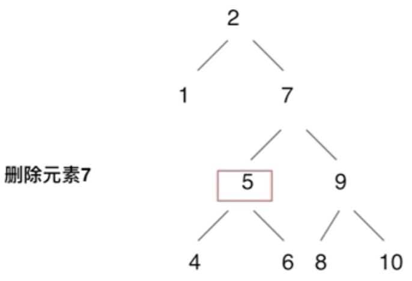 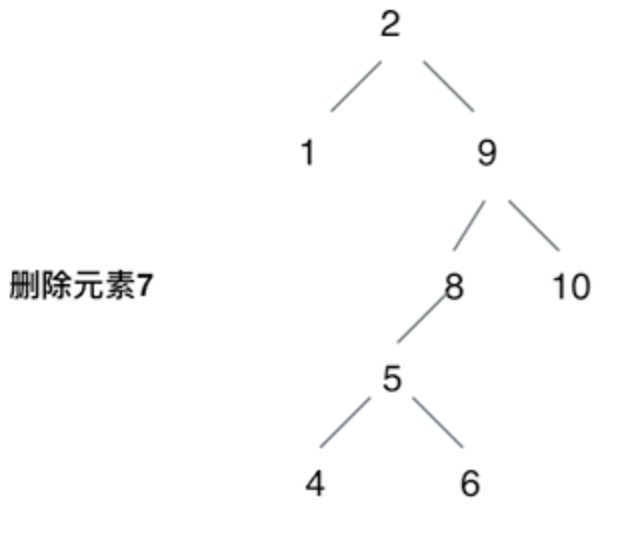</div>

      > 删除元素7， 那么删除节点（元素7）的左孩子就是5，删除节点（元素7）的右子树的最左面节点是元素8。
      >
      > 将删除节点（元素7）的左孩子放到删除节点（元素7）的右子树的最左面节点（元素8）的左孩子上，就是把5为根节点的子树移到了8的左孩子的位置。
      >
      > 要删除的节点（元素7）的右孩子（元素9）为新的根节点。.

    ```c++
    if (root->val == key) {
        // 第二种情况：左右孩子都为空（叶子节点），直接删除节点， 返回NULL为根节点
        // 第三种情况：其左孩子为空，右孩子不为空，删除节点，右孩子补位 ，返回右孩子为根节点
        if (root->left == nullptr) return root->right; 
        // 第四种情况：其右孩子为空，左孩子不为空，删除节点，左孩子补位，返回左孩子为根节点
        else if (root->right == nullptr) return root->left; 
        // 第五种情况：左右孩子节点都不为空，则将删除节点的左子树放到删除节点的右子树的最左面节点的左孩子的位置
        // 并返回删除节点右孩子为新的根节点。
        else {  
            TreeNode* cur = root->right; // 找右子树最左面的节点
            while(cur->left != nullptr) { 
                cur = cur->left;
            }
            cur->left = root->left; // 把要删除的节点（root）左子树放在cur的左孩子的位置
            TreeNode* tmp = root;   // 把root节点保存一下，下面来删除
            root = root->right;     // 返回旧root的右孩子作为新root
            delete tmp;             // 释放节点内存（这里不写也可以，但C++最好手动释放一下吧）
            return root;
        }
    }
    ```

    > 这里相当于把新的节点返回给上一层，上一层就要用 root->left 或者 root->right接住，代码如下：
    >
    > ```c++
    > if (root->val > key) root->left = deleteNode(root->left, key);
    > if (root->val < key) root->right = deleteNode(root->right, key);
    > return root;
    > ```

    + **实现代码：**

      ```c++
      class Solution {
      public:
          TreeNode* deleteNode(TreeNode* root, int key) {
              if (root == nullptr) return root; // 第一种情况：没找到删除的节点，遍历到空节点直接返回了
              if (root->val == key) {
                  // 第二种情况：左右孩子都为空（叶子节点），直接删除节点， 返回NULL为根节点
                  // 第三种情况：其左孩子为空，右孩子不为空，删除节点，右孩子补位 ，返回右孩子为根节点
                  if (root->left == nullptr) return root->right; 
                  // 第四种情况：其右孩子为空，左孩子不为空，删除节点，左孩子补位，返回左孩子为根节点
                  else if (root->right == nullptr) return root->left; 
                  // 第五种情况：左右孩子节点都不为空，则将删除节点的左子树放到删除节点的右子树的最左面节点的左孩子的位置
                  // 并返回删除节点右孩子为新的根节点。
                  else {  
                      TreeNode* cur = root->right; // 找右子树最左面的节点
                      while(cur->left != nullptr) { 
                          cur = cur->left;
                      }
                      cur->left = root->left; // 把要删除的节点（root）左子树放在cur的左孩子的位置
                      TreeNode* tmp = root;   // 把root节点保存一下，下面来删除
                      root = root->right;     // 返回旧root的右孩子作为新root
                      delete tmp;             // 释放节点内存（这里不写也可以，但C++最好手动释放一下吧）
                      return root;
                  }
              }
              if (root->val > key) root->left = deleteNode(root->left, key);
              if (root->val < key) root->right = deleteNode(root->right, key);
              return root;
          }
      };
      ```


#### 迭代实现

+ 删除节点的迭代法还是复杂一些的，但其本质我在递归法里都介绍了，最关键就是删除节点的操作

+ **代码实现：**

```c++
class Solution {private:    // 将目标节点（删除节点）的左子树放到 目标节点的右子树的最左面节点的左孩子位置上    // 并返回目标节点右孩子为新的根节点    // 是动画里模拟的过程    TreeNode* deleteOneNode(TreeNode* target) {        if (target == nullptr) return target;        if (target->right == nullptr) return target->left;        TreeNode* cur = target->right;        while (cur->left) {            cur = cur->left;        }        cur->left = target->left;        return target->right;    }public:    TreeNode* deleteNode(TreeNode* root, int key) {        if (root == nullptr) return root;        TreeNode* cur = root;        TreeNode* pre = nullptr; // 记录cur的父节点，用来删除cur        while (cur) {            if (cur->val == key) break;            pre = cur;            if (cur->val > key) cur = cur->left;            else cur = cur->right;        }        if (pre == nullptr) { // 如果搜索树只有头结点            return deleteOneNode(cur);        }        // pre 要知道是删左孩子还是右孩子        if (pre->left && pre->left->val == key) {            pre->left = deleteOneNode(cur);        }        if (pre->right && pre->right->val == key) {            pre->right = deleteOneNode(cur);        }        return root;    }};
```


### 9.将有序数组转换为二叉搜索树

> 将一个按照升序排列的有序数组，转换为一棵高度平衡二叉搜索树。
>
> 本题中，一个高度平衡二叉树是指一个二叉树每个节点 的左右两个子树的高度差的绝对值不超过 1。

+ **示例：**

  <div align = center></div>

+ **思路：**

  + 其实这里不用强调平衡二叉搜索树，数组构造二叉树，构成平衡树是自然而然的事情，因为大家默认都是从数组中间位置取值作为节点元素，一般不会随机取，**「所以想构成不平衡的二叉树是自找麻烦」**。
  + 在二叉树：构造二叉树登场！和 二叉树：构造一棵最大的二叉树 中其实已经讲过了，如果根据数组构造一颗二叉树。**「本质就是寻找分割点，分割点作为当前节点，然后递归左区间和右区间」**。
  + 本题其实要比 二叉树：构造二叉树登场！ 和 二叉树：构造一棵最大的二叉树 简单一些，因为有序数组构造二叉搜索树，寻找分割点就比较容易了。分割点就是数组中间位置的节点。

#### 递归方案

+ **递归三部曲：**

  + **确定递归函数返回值及其参数**

    + 删除二叉树节点，增加二叉树节点，都是用递归函数的返回值来完成，这样是比较方便的。仔细看了 二叉树：搜索树中的插入操作 和 二叉树：搜索树中的删除操作 ，一定会对递归函数返回值的作用深有感触。那么本题要构造二叉树，依然用递归函数的返回值来构造中节点的左右孩子。
    + 再来看参数，首先是传入数组，然后就是左下表left和右下表right，我们在 二叉树：构造二叉树登场！ 中提过，在构造二叉树的时候尽量不要重新定义左右区间数组，而是用下表来操作原数组。

    ```c++
    // 左闭右闭区间[left, right]
    TreeNode* traversal(vector<int>& nums, int left, int right) 
    ```

  + **确定递归终止条件**

    + 这里定义的是左闭右闭的区间，所以当区间 left > right的时候，就是空节点了。

    ```c++
    if (left > right) return nullptr;
    ```

  + **确定单层递归的逻辑**

    + 首先取数组中间元素的位置，不难写出`int mid = (left + right) / 2;`，**「这么写其实有一个问题，就是数值越界，例如left和right都是最大int，这么操作就越界了，在二分法中尤其需要注意！」** 所以可以这么写：`int mid = left + ((right - left) / 2);`
    + 但本题leetcode的测试数据并不会越界，所以怎么写都可以。但需要有这个意识！取了中间位置，就开始以中间位置的元素构造节点，代码：`TreeNode* root = new TreeNode(nums[mid]);`。
    + 接着划分区间，root的左孩子接住下一层左区间的构造节点，右孩子接住下一层右区间构造的节点。最后返回root节点

    ```c++
    int mid = left + ((right - left) / 2); 
    TreeNode* root = new TreeNode(nums[mid]);
    root->left = traversal(nums, left, mid - 1);
    root->right = traversal(nums, mid + 1, right);
    return root;
    ```

+ 实现代码：

  ```c++
  class Solution {
  private:
      TreeNode* traversal(vector<int>& nums, int left, int right) {
          if (left > right) return nullptr;
          int mid = left + ((right - left) / 2); 
          TreeNode* root = new TreeNode(nums[mid]);
          root->left = traversal(nums, left, mid - 1);
          root->right = traversal(nums, mid + 1, right);
          return root;
      }
  public:
      TreeNode* sortedArrayToBST(vector<int>& nums) {
          TreeNode* root = traversal(nums, 0, nums.size() - 1);
          return root;
      }
  };
  ```

#### 迭代方案

+ 迭代法可以通过三个队列来模拟，一个队列放遍历的节点，一个队列放左区间下表，一个队列放右区间下表。模拟的就是不断分割的过程。

+ 实现代码：

  ```c++
  class Solution {
  public:
      TreeNode* sortedArrayToBST(vector<int>& nums) {
          if (nums.size() == 0) return nullptr;
  
          TreeNode* root = new TreeNode(0);   // 初始根节点
          queue<TreeNode*> nodeQue;           // 放遍历的节点
          queue<int> leftQue;                 // 保存左区间下表
          queue<int> rightQue;                // 保存右区间下表
          nodeQue.push(root);                 // 根节点入队列
          leftQue.push(0);                    // 0为左区间下表初始位置
          rightQue.push(nums.size() - 1);     // nums.size() - 1为右区间下表初始位置
  
          while (!nodeQue.empty()) {
              TreeNode* curNode = nodeQue.front();
              nodeQue.pop();
              int left = leftQue.front(); leftQue.pop();
              int right = rightQue.front(); rightQue.pop();
              int mid = left + ((right - left) / 2);
  
              curNode->val = nums[mid];       // 将mid对应的元素给中间节点
  
              if (left <= mid - 1) {          // 处理左区间
                  curNode->left = new TreeNode(0);
                  nodeQue.push(curNode->left);
                  leftQue.push(left);
                  rightQue.push(mid - 1);
              }
  
              if (right >= mid + 1) {         // 处理右区间
                  curNode->right = new TreeNode(0);
                  nodeQue.push(curNode->right);
                  leftQue.push(mid + 1);
                  rightQue.push(right);
              }
          }
          return root;
      }
  };
  ```


### 10.修剪二叉搜索树

> 给定一个二叉搜索树，同时给定最小边界L 和最大边界 R。通过修剪二叉搜索树，使得所有节点的值在[L, R]中 (R>=L) 。你可能需要改变树的根节点，所以结果应当返回修剪好的二叉搜索树的新的根节点。

+ **示例：**

  <div align = center>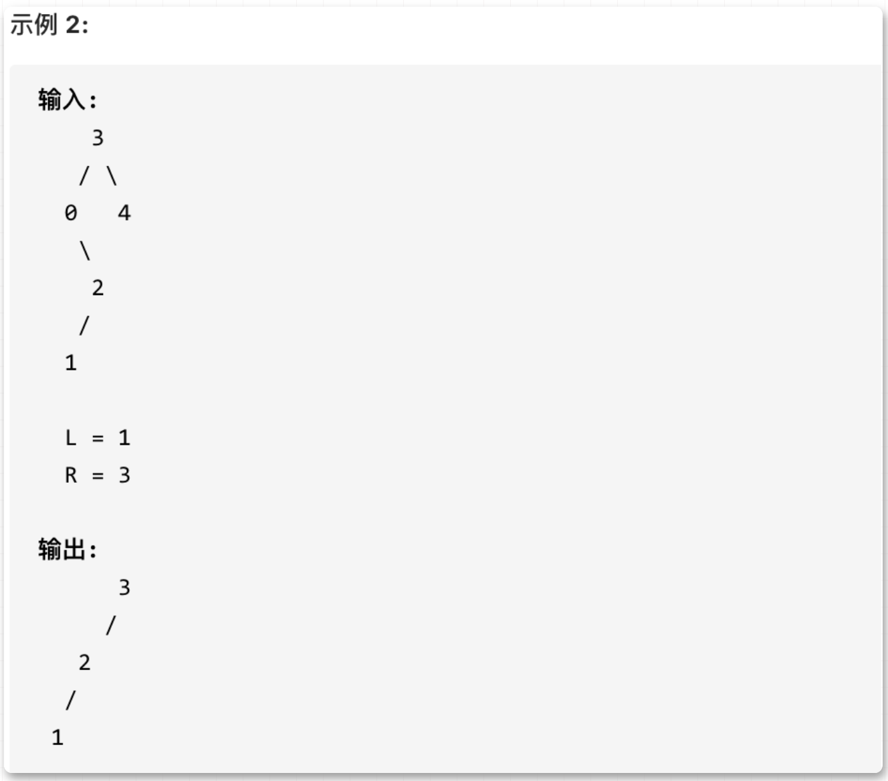</div>

#### 递归方案

+ **递归三部曲：**

  + **确定递归函数的参数以及返回值**

    + 这里我们为什么需要返回值呢？因为是要遍历整棵树，做修改，其实不需要返回值也可以，我们也可以完成修剪（其实就是从二叉树中移除节点）的操作。但是有返回值，更方便，可以通过递归函数的返回值来移除节点。

    ```c++
    TreeNode* trimBST(TreeNode* root, int low, int high)
    ```

  + **确定终止条件**

    + 修剪的操作并不是在终止条件上进行的，所以就是遇到空节点返回就可以了。

    ```c++
    if (root == nullptr ) return nullptr;
    ```

  + **确定单层递归的逻辑**

    + 如果root（当前节点）的元素小于low的数值，那么应该递归右子树，并返回右子树符合条件的头结点。

    ```c++
    if (root->val < low) {
        TreeNode* right = trimBST(root->right, low, high); // 寻找符合区间[low, high]的节点
        return right;
    }
    ```
    
    + 如果root(当前节点)的元素大于high的，那么应该递归左子树，并返回左子树符合条件的头结点。
    
    ```c++
    if (root->val > high) {
        TreeNode* left = trimBST(root->left, low, high); // 寻找符合区间[low, high]的节点
        return left;
    }
    ```
    
    + 接下来要将下一层处理完左子树的结果赋给root->left，处理完右子树的结果赋给root->right。
    
    ```c++
    root->left = trimBST(root->left, low, high); // root->left接入符合条件的左孩子
    root->right = trimBST(root->right, low, high); // root->right接入符合条件的右孩子
    return root;
    ```
    
    + 多余的节点从二叉树中移除
    
      <div align = center>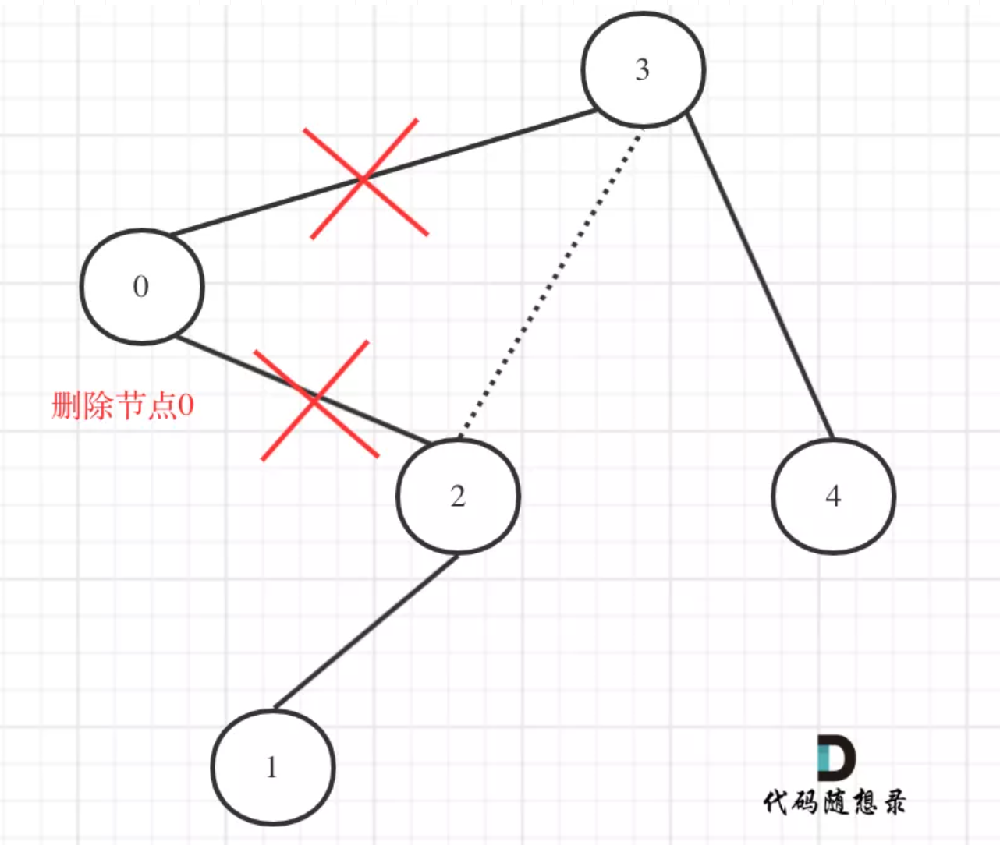</div>
    
    + 如下代码相当于把节点0的右孩子（节点2）返回给上一层，
    
    ```c++
    if (root->val < low) {
        TreeNode* right = trimBST(root->right, low, high); // 寻找符合区间[low, high]的节点
        return right;
    }
    ```
    
    + 然后如下代码相当于用节点3的左孩子 把下一层返回的 节点0的右孩子（节点2） 接住。
    
    ```c++
    root->left = trimBST(root->left, low, high);
    ```
    
    + 此时节点3的右孩子就变成了节点2，将节点0从二叉树中移除了。


+ 代码实现

  ```c++
  class Solution {
  public:
      TreeNode* trimBST(TreeNode* root, int low, int high) {
          if (root == nullptr ) return nullptr;
          if (root->val < low) {
              TreeNode* right = trimBST(root->right, low, high); // 寻找符合区间[low, high]的节点
              return right;
          }
          if (root->val > high) {
              TreeNode* left = trimBST(root->left, low, high); // 寻找符合区间[low, high]的节点
              return left;
          }
          root->left = trimBST(root->left, low, high); // root->left接入符合条件的左孩子
          root->right = trimBST(root->right, low, high); // root->right接入符合条件的右孩子
          return root;
      }
  };
  ```

#### 迭代实现

+ 因为二叉搜索树的有序性，不需要使用栈模拟递归的过程。

+ 在剪枝的时候，可以分为三步：

  - 将root移动到[L, R] 范围内，注意是左闭右闭区间
  - 剪枝左子树
  - 剪枝右子树

+ 代码如下：

  ```c++
  class Solution {
  public:
      TreeNode* trimBST(TreeNode* root, int L, int R) {
          if (!root) return nullptr;
  
          // 处理头结点，让root移动到[L, R] 范围内，注意是左闭右闭
          while (root->val < L || root->val > R) {
              if (root->val < L) root = root->right; // 小于L往右走
              else root = root->left; // 大于R往左走
          }
          TreeNode *cur = root;
          // 此时root已经在[L, R] 范围内，处理左孩子元素小于L的情况
          while (cur != nullptr) {
              while (cur->left && cur->left->val < L) {
                  cur->left = cur->left->right;
              }
              cur = cur->left;
          }
          cur = root;
  
          // 此时root已经在[L, R] 范围内，处理右孩子大于R的情况
          while (cur != nullptr) {
              while (cur->right && cur->right->val > R) {
                  cur->right = cur->right->left;
              }
              cur = cur->right;
          }
          return root;
      }
  };
  ```


### 11.把二叉搜索树转换为累加树

> 给出二叉 搜索 树的根节点，该树的节点值各不相同，请你将其转换为累加树（Greater Sum Tree），使每个节点 node 的新值等于原树中大于或等于 node.val 的值之和。

+ **示例：**

  <div align = center>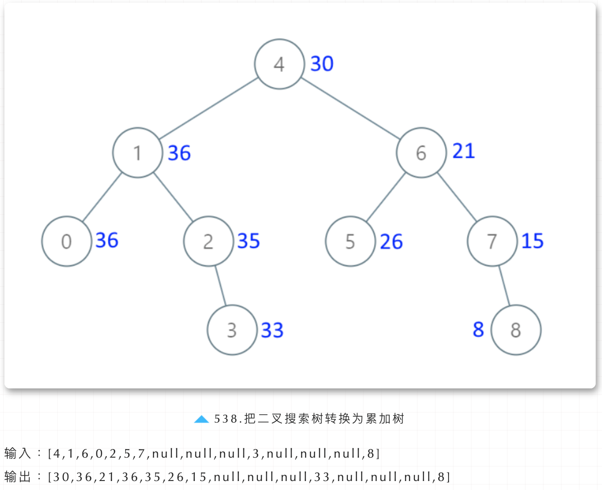</div>

+ **思路：**
  + **「其实这就是一棵树，大家可能看起来有点别扭，换一个角度来看，这就是一个有序数组[2, 5, 13]，求从后到前的累加数组，也就是[20, 18, 13]，是不是感觉这就简单了。」**
  + **「从树中可以看出累加的顺序是右中左，所以我们需要反中序遍历这个二叉树，然后顺序累加就可以了」**。

#### 递归方案

+ **递归三部曲：**

  + **递归函数参数以及返回值**

    + 这里很明确了，不需要递归函数的返回值做什么操作了，要遍历整棵树。同时需要定义一个全局变量pre，用来保存cur节点的前一个节点的数值，定义为int型就可以了。

    ```c++
    int pre; // 记录前一个节点的数值
    void traversal(TreeNode* cur) 
    ```

  + **确定终止条件**

    + 遇空就终止。

    ```c++
    if (cur == NULL) return;
    ```

  + **确定单层递归的逻辑**

    + 注意**「要右中左来遍历二叉树」**， 中节点的处理逻辑就是让cur的数值加上前一个节点的数值。

    ```c++
    traversal(cur->right);  // 右
    cur->val += pre;        // 中
    pre = cur->val;
    traversal(cur->left);   // 左
    ```


+ **实现代码：**

  ```c++
  class Solution {
  private:
      int pre; // 记录前一个节点的数值
      void traversal(TreeNode* cur) { // 右中左遍历
          if (cur == NULL) return;
          traversal(cur->right);
          cur->val += pre;
          pre = cur->val;
          traversal(cur->left);
      }
  public:
      TreeNode* convertBST(TreeNode* root) {
          pre = 0;
          traversal(root);
          return root;
      }
  };
  ```

  

#### 迭代方案

+ 实现代码：

  ```c++
  class Solution {
  private:
      int pre; // 记录前一个节点的数值
      void traversal(TreeNode* root) {
          stack<TreeNode*> st;
          TreeNode* cur = root;
          while (cur != NULL || !st.empty()) {
              if (cur != NULL) {
                  st.push(cur);
                  cur = cur->right;   // 右
              } else {
                  cur = st.top();     // 中
                  st.pop();
                  cur->val += pre;
                  pre = cur->val;
                  cur = cur->left;    // 左
              }
          }
      }
  public:
      TreeNode* convertBST(TreeNode* root) {
          pre = 0;
          traversal(root);
          return root;
      }
  };
  ```

  

