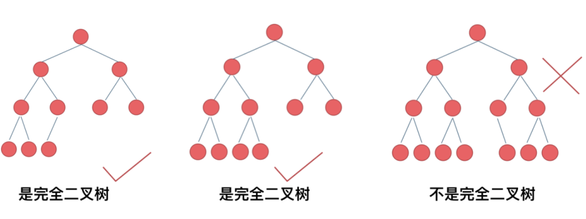
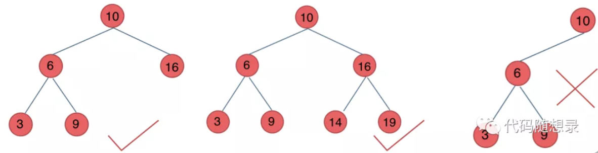
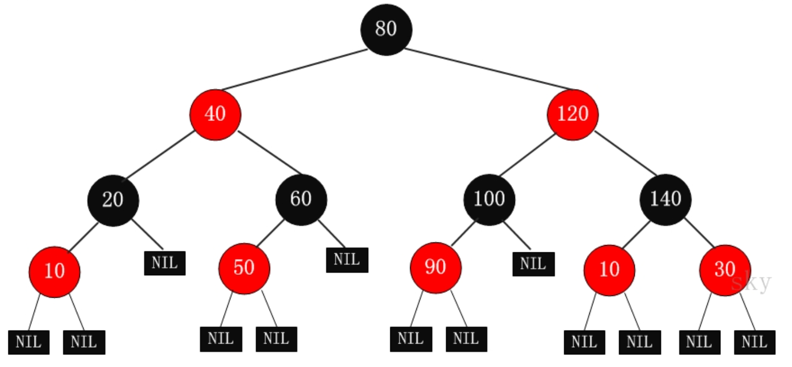
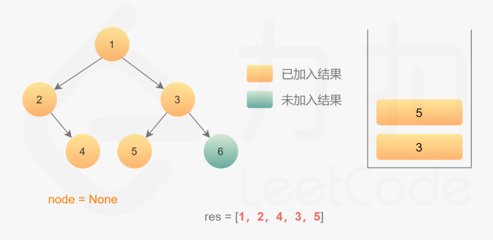
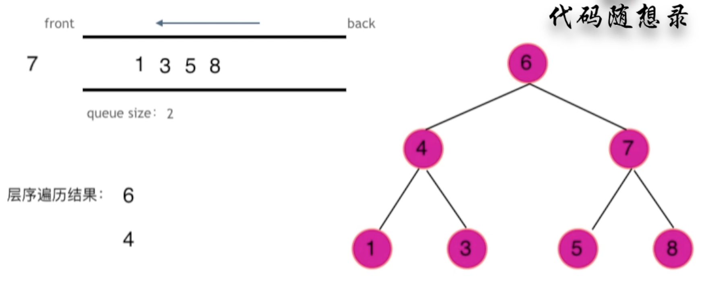

二叉树

## 一.二叉树的种类

### 1.满二叉树

满二叉树：如果一棵二叉树只有度为0的结点和度为2的结点，并且度为0的结点在同一层上，则这棵二叉树为满二叉树。

### 2.完全二叉树

完全二叉树：在完全二叉树中，除了最底层节点可能没填满外，其余每层节点数都达到最大值，并且最下面一层的节点都集中在该层最左边的若干位置。若最底层为第 h 层，则该层包含 1~ 2h 个节点。

<div align="center">
    
</div>

### 3.二叉搜索树

前面介绍的书，都没有数值的，而二叉搜索树是有数值的了，**「二叉搜索树是一个有序树」**。

- 若它的左子树不空，则左子树上所有结点的值均小于它的根结点的值；
- 若它的右子树不空，则右子树上所有结点的值均大于它的根结点的值；
- 它的左、右子树也分别为二叉排序树

下面这两棵树都是搜索树

<div align="center">
  
</div>

### 4.平衡二叉搜索树

#### 简介

平衡二叉搜索树：又被称为AVL（Adelson-Velsky and Landis）树，且具有以下性质：它是一棵空树或它的左右两个子树的高度差的绝对值不超过1，并且左右两个子树都是一棵平衡二叉树。

<div align="center">
  
</div>

和红黑树相比，AVL树是**严格的平衡二叉树**，平衡条件必须满足（**所有节点的左右子树高度差的绝对值不超过1**）。不管我们是执行插入还是删除操作，只要不满足上面的条件，就要通过旋转来保持平衡，而旋转是非常**耗时**的，由此我们可以知道 **<font color = red>AVL树适合用于插入与删除次数比较少，但查找多的情况</font>**

#### 局限性

由于维护这种高度平衡所付出的代价比从中获得的效率收益还大，故而实际的应用不多，更多的地方是用追求局部而不是非常严格整体平衡的红黑树。当然， **如果应用场景中对插入删除不频繁，只是对查找要求较高，那么AVL还是较优于红黑树。**

#### 应用

**Windows NT内核中广泛存在**


### 5.红黑树

#### 简介

R-B Tree，全称是Red-Black Tree，又称为“红黑树”，它一种特殊的二叉查找树。红黑树的每个节点上都有存储位表示节点的颜色，可以是红(Red)或黑(Black)。

#### 特性

**（1）每个节点或者是黑色，或者是红色。**
**（2）根节点是黑色。**
**（3）每个叶子节点（NIL）是黑色。 [注意：这里叶子节点，是指为空(NIL或NULL)的叶子节点！]**
**（4）如果一个节点是红色的，则它的子节点必须是黑色的。**
**（5）从一个节点到该节点的子孙节点的所有路径上包含相同数目的黑节点。**

**注意**：
(01) 特性(3)中的叶子节点，是只为空(NIL或null)的节点。
(02) 特性(5)，确保没有一条路径会比其他路径长出俩倍。因而，红黑树是相对是接**衡的二叉树。

<div align="center"> </div>

#### 应用

+ 广泛用于C ++的STL中，地图和集都是用红黑树实现的;

+ 著名的Linux的的进程调度完全公平调度程序，用红黑树管理进程控制块，进程的虚拟内存区域都存储在一颗红黑树上，每个虚拟地址区域都对应红黑树的一个节点，左指针指向相邻的地址虚拟存储区域，右指针指向相邻的高地址虚拟地址空间;

+ IO多路复用的epoll的的的实现采用红黑树组织管理的的的sockfd，以支持快速的增删改查;

+ Nginx的的的中用红黑树管理定时器，因为红黑树是有序的，可以很快的得到距离当前最小的定时器;

---

## 二.二叉树的创建与操作

### 1.二叉树的存储方式

二叉树可以链式存储，也可以顺序存储。链式存储方式就用指针， 顺序存储的方式就是用数组。顾名思义就是顺序存储的元素在内存是连续分布的，而链式存储则是通过指针把分布在散落在各个地址的节点串联一起。

链式存储如下图所示：

<div align="center"></div>

### 2.创建二叉树

二叉树类结构：

```c++
class TreeNode {
public:
  	//只有结点元素与左右子树的指针
    int val;
    TreeNode *left;
    TreeNode *right;
    TreeNode() : val(0), left(nullptr), right(nullptr) {}
    TreeNode(char value) : val(value), left(nullptr), right(nullptr) {}
    TreeNode(char value, TreeNode* left, TreeNode* right) : val(value), left(left), right(right) {}
};
```

目前只是通过先序遍历的方式来创建二叉树

```c++
TreeNode* CreatTree()
{
    TreeNode *root;
    int value;
    std::cin>>value;
		//当输入的结点元素为0时认为为空
    if(value == 0)
        return nullptr;
		//创建新结点进行存储
    root = new TreeNode();
    root->val = value;
		//递归进行创建
    root->left = CreatTree();
    root->right = CreatTree();

    return root;
}
```

### 3.二叉树的遍历方式

二叉树主要有两种遍历方式：

1. 深度优先遍历：先往深走，遇到叶子节点再往回走。
2. 广度优先遍历：一层一层的去遍历。

从深度优先遍历和广度优先遍历进一步拓展，才有如下遍历方式：

- 深度优先遍历

- - 前序遍历（递归法，迭代法）
  - 中序遍历（递归法，迭代法）
  - 后序遍历（递归法，迭代法）

- > **这里前中后，其实指的就是中间节点的遍历顺序**

- <div align="center"></div>

- 广度优先遍历

- - 层次遍历（迭代法）

#### 前序遍历

前序遍历是中左右，每次先处理的是中间节点，那么先将跟节点放入栈中，然后将右孩子加入栈，再加入左孩子。

<div align = "center">  </div>

+ 递归实现：

  ```c++
  void PreOrderTraversal(TreeNode* root) {
      if(root != nullptr) {
          std::cout << (root->val) << " ";
          PreOrderTraversal(root->left);
          PreOrderTraversal(root->right);
      }
  }
  ```

+ 迭代实现：

  ```c++
  void PreOrderTraversal2(TreeNode* root)  {
  
      if(!root) return;
  
      std::stack<TreeNode*> stack;
      TreeNode* node = root;
  
      //栈为空且结点为空时结束遍历
      while((!stack.empty()) || (node != nullptr)) {
          //压栈
          while(node != nullptr) {
              std::cout << node->val << " ";
              stack.emplace(node);
              //左结点压栈
              node = node->left;
          }
  
          //出栈
          node = stack.top();
          stack.pop();
          //遍历又结点
          node = node->right;
      }
  }
  ```

#### 中序遍历

中序遍历是左中右，先访问的是二叉树顶部的节点，然后一层一层向下访问，直到到达树左面的最底部，再开始处理节点（也就是在把节点的数值放进result数组中），这就造成了**「处理顺序和访问顺序是不一致的。」**

<div align = "center">  </div>

+ 递归实现

  ```c++
  void InOrderTraversal(TreeNode* root) {
      if(root != nullptr) {
          InOrderTraversal(root->left);
          std::cout << (root->val) << " ";
          InOrderTraversal(root->right);
      }
  }
  ```

+ 迭代实现

  ```c++
  void InOrderTraversal2(TreeNode* root) {
      if(!root) return;
      std::stack<TreeNode*> stack;
      TreeNode* node = root;
      while (!stack.empty() || node != nullptr) {
          while (node != nullptr) {
              stack.emplace(node);
              node = node->left;
          }
          std::cout << (stack.top())->val << " ";
          node =  stack.top();
          stack.pop();
          node = node->right;
      }
  }
  ```

#### 后序遍历

按照访问左子树——右子树——根节点的方式遍历这棵树，而在访问左子树或者右子树的时候，我们按照同样的方式遍历，直到遍历完整棵树。

<div align = "center"> </div>

+ 递归实现：

  ```c++
  void PostOrderTraversal(TreeNode* root) {
      if(root != nullptr) {
          PostOrderTraversal(root->left);
          PostOrderTraversal(root->right);
          std::cout << (root->val) << " ";
      }
  }
  ```

+ 迭代实现

  ```c++
  void PostOrderTraversal2(TreeNode* root) {
      if(!root) return;
      std::stack<TreeNode*> stack;
      TreeNode* node = root;
      //标记是否访问过
      TreeNode *prev = nullptr;
      while (!stack.empty() || node != nullptr) {
          while (node != nullptr) {
              //左子树一直入栈
              stack.emplace(node);
              node = node->left;
          }
          //左子树为空时遍历最左子树的右子树
          node = stack.top();
          //弹出栈
          stack.pop();
          //如果右子树还为空，或者右子树被访问过
          if (node->right == nullptr || node->right == prev) {
              //输出结点
              std::cout << node->val << " ";
              //标记已访问过该结点
              prev = node;
              node = nullptr;
          }
          //如果存在右节点，则再次入栈
          else {
              //遍历它的右子树
              stack.emplace(node);
              node = node->right;
          }
      }
  }
  ```

#### 层序遍历

层序遍历一个二叉树。就是从左到右一层一层的去遍历二叉树。

需要借用一个辅助数据结构即队列来实现，**「队列先进先出，符合一层一层遍历的逻辑，而是用栈先进后出适合模拟深度优先遍历也就是递归的逻辑。」**

<div align = "center"></div>

+ 实现：

  ```c++
  vector<vector<int>> levelOrder(TreeNode* root) {
      vector<vector<int>> result {};
      if(!root) return result;
      queue<TreeNode*> queue;
      queue.push(root);
          while(!queue.empty()) {
              int size = queue.size();
              vector<int> res;
              for(int i = 0; i < size; ++i) {
                  TreeNode* node = queue.front();
                  queue.pop();
                  res.push_back(node->val);
                  if(node->left)
                      queue.push(node->left);
                  if(node->right)
                      queue.push(node->right);
              }
              result.push_back(res);
        }
        return result;
  }
  ```

### 4.对称二叉树

>  给定一个二叉树，检查它是否是镜像对称的。

#### 递归实现

+ 根据题目的描述，镜像对称，就是左右两边相等，也就是左子树和右子树是相等的。也就是说要递归的比较左子树和右子树。

+ 将根节点的左子树记做 left，右子树记做 right。比较 left 是否等于 right，不等的话直接返回就可以了。如果相等，比较 left 的左节点和 right 的右节点，再比较 left 的右节点和 right 的左节点。

+ 根据上面信息可以总结出递归函数的两个条件：

  + 终止条件：
  + left 和 right 不等，或者 left 和 right 都为空
  + 递归的比较 ltree->left 和 rtree->right，递归比较 ltree->right 和 tree->left

+ 实现：

  ```c++
  bool isSymmetric(TreeNode* root) {
       return isMirror(root,root);
  }
  bool isMirror(TreeNode* lt, TreeNode* rt) {
    	if(!lt && !rt)
      		return true;
    	if(!lt || !rt)
      		return false;
    	return (lt->val == rt->val) && (isMirror(lt->left,rt->right) && (isMirror(lt->right, rt->left)));
  }
  ```

#### 迭代实现

改用队列来实现，思路如下：

+ 引入一个队列，这是把递归程序改写成迭代程序的常用方法。初始化时我们把根节点入队两次。每次提取两个结点并比较它们的值（队列中每两个连续的结点应该是相等的，而且它们的子树互为镜像），然后将两个结点的左右子结点按相反的顺序插入队列中。当队列为空时，或者我们检测到树不对称（即从队列中取出两个不相等的连续结点）时，该算法结束。


+ 实现：

  ```c++
  bool isSymmetric(TreeNode* root) {
      queue<TreeNode*> queue;
      queue.push(root->left);
      queue.push(root->right);
      while(!queue.empty()) {
          TreeNode* ltree = queue.front();
          queue.pop();
          TreeNode* rtree = queue.front();
          queue.pop();
          
          if(ltree==nullptr && rtree==nullptr)
              continue;
          if(ltree==nullptr || rtree==nullptr)
              return false;
          if(ltree->val != rtree->val)
              return false;
          queue.push(ltree->left);
          queue.push(rtree->right);
          queue.push(ltree->right);
          queue.push(rtree->left);
      }
      return true;
  }   
  ```

### 5.二叉树的最大深度

>  给定一个二叉树，找出其最大深度。

#### 递归

+ 确定递归函数的参数和返回值：参数就是传入树的根节点，返回就返回这棵树的深度，所以返回值为int类型。

+ 确定终止条件：如果为空节点的话，就返回0，表示高度为0。

+ 确定单层递归的逻辑：先求它的左子树的深度，再求的右子树的深度，最后取左右深度最大的数值 再+1 （加1是因为算上当前中间节点）就是目前节点为根节点的树的深度。

+ 实现：

  ```c++
  int getDepth(TreeNode* node) {
      if (node == NULL) return 0;
      int leftDepth = getDepth(node->left);       // 左
      int rightDepth = getDepth(node->right);     // 右
      int depth = 1 + max(leftDepth, rightDepth); // 中
      return depth;
  }
  int maxDepth(TreeNode* root) {
      return getDepth(root);
  }
  ```

#### 迭代

+ 利用层次遍历的方法：

+ 实现

  ```c++
  int maxDepth(TreeNode* root) {
      int Depth = 0;
      if(!root) return Depth;
      queue<TreeNode*> queue;
      queue.push(root);
      while(!queue.empty()) {
          int size = queue.size();
          ++Depth;
          for(int i = 0; i < size; ++ i) {
              TreeNode* node = queue.front();
              queue.pop();
              if(node->left)
                  queue.push(node->left);
              if(node->right)
                  queue.push(node->right);
      
          }
              
      }
      return Depth;
  }
  ```

### 6.二叉树的最小深度

> 给定一个二叉树，找出其最小深度。

+ 注意事项：**「最小深度是从根节点到最近叶子节点的最短路径上的节点数量。」**，注意是**「叶子节点」**。什么是叶子节点，左右孩子都为空的节点才是叶子节点！

#### 递归

+ 参数为要传入的二叉树根节点，返回的是int类型的深度。
+ 终止条件也是遇到空节点返回0，表示当前节点的高度为0。
+ 这块和求最大深度不一样
  + 如果左子树为空，右子树不为空，说明最小深度是 1 + 右子树的深度。
  + 反之，右子树为空，左子树不为空，最小深度是 1 + 左子树的深度。
  + 最后如果左右子树都不为空，返回左右子树深度最小值 + 1 。
+ 实现：

```c++
int minDepth(TreeNode* root) {
    return  getMinDepth(root);
}
int getMinDepth(TreeNode* root) {
    if(!root) return 0;
    int leftDepth = getMinDepth(root->left);
    int rightDepth = getMinDepth(root->right);

    if(root->left == nullptr && root->right != nullptr) 
        return 1 + rightDepth;
    if(root->right == nullptr && root->left != nullptr) 
        return 1 + leftDepth;
    return 1 + min(rightDepth, leftDepth);
}
```

#### 迭代

+ 使用层序遍历的方式来解决，思路是一样的。
+ **需要注意的是，只有当左右孩子都为空的时候，才说明遍历的最低点了。如果其中一个孩子为空则不是最低点**

+ 实现：

  ```c++
  int minDepth(TreeNode* root) {
      int Depth = 0;
      if(!root) return Depth;
      queue<TreeNode*> queue;
      queue.push(root);
      while(!queue.empty()) {
          int size = queue.size();
          ++ Depth;
          int flag = 0;
          for(int i = 0; i <size; ++i) {
              TreeNode* node = queue.front();
              queue.pop();
              if(node->left != nullptr)
                  queue.push(node->left);
              if(node->right != nullptr)
                  queue.push(node->right);
            	//左右子树皆为空时则找到最小深度的层，结束循环
              if(node->left == nullptr && node->right == nullptr) {
                  flag = 1;
                  break;
              }
          }
          if(flag)
              break;
      }
      return Depth;
  }
  ```


### 7.二叉树的结点个数

> 求二叉树的结点个数

#### 递归

+ 确定递归函数的参数和返回值：参数就是传入树的根节点，返回就返回以该节点为根节点二叉树的节点数量，所以返回值为int类型。

+ 确定终止条件：如果为空节点的话，就返回0，表示节点数为0。

+ 确定单层递归的逻辑：先求它的左子树的节点数量，再求的右子树的节点数量，最后取总和再加一 （加1是因为算上当前中间节点）就是目前节点为根节点的节点数量。

+ 实现

  ```c++
  int TreeNodes(TreeNode* root) {
      if(root == nullptr)
          return 0;
      int leftNodes = TreeNodes(root->left);
      int rightNodes = TreeNodes(root->right);
      return 1 + leftNodes + rightNodes;
  }
  int countNodes(TreeNode* root) {
      return TreeNodes(root);
  }
  ```

#### 迭代

+ 根据层序遍历，加一个变量result，统计节点数量就可以了

+ 实现：

  ```c++
  int countNodes(TreeNode* root) {
      int result = 0;
      if(!root) return result;
      queue<TreeNode*> queue;
      queue.push(root);
      while(!queue.empty()) {
          int size = queue.size();
          for(int i = 0; i < size; ++ i) {
              TreeNode* node = queue.front();
              queue.pop();
              ++ result;
              if(node->left)
                  queue.push(node->left);
              if(node->right)
                  queue.push(node->right);
          }
      }
      return result;
  }
  ```

### 8.平衡二叉树

> 给定一个二叉树，判断它是否是高度平衡的二叉树。

+ 明确递归函数的参数和返回值

  > 参数的话为传入的节点指针，就没有其他参数需要传递了，返回值要返回传入节点为根节点树的深度。
  >
  > 那么如何标记左右子树是否差值大于1呢。
  >
  > 如果当前传入节点为根节点的二叉树已经不是二叉平衡树了，还返回高度的话就没有意义了。
  >
  > 所以如果已经不是二叉平衡树了，可以返回-1 来标记已经不符合平衡树的规则了。

+ 明确终止条件：递归的过程中依然是遇到空节点了为终止，返回0，表示当前节点为根节点的高度为0

+ 明确单层递归的逻辑：

  > 如何判断当前传入节点为根节点的二叉树是否是平衡二叉树呢，当然是左子树高度和右子树高度相差。
  >
  > 分别求出左右子树的高度，然后如果差值小于等于1，则返回当前二叉树的高度，否则则返回-1，表示已经不是二叉树了。

+ 实现

  ```c++
  /**
   * Definition for a binary tree node.
   * struct TreeNode {
   *     int val;
   *     TreeNode *left;
   *     TreeNode *right;
   *     TreeNode() : val(0), left(nullptr), right(nullptr) {}
   *     TreeNode(int x) : val(x), left(nullptr), right(nullptr) {}
   *     TreeNode(int x, TreeNode *left, TreeNode *right) : val(x), left(left), right(right) {}
   * };
   */
  class Solution {
  public:
    	//返回类型是int
      int getHeight(TreeNode* root) {
      
          //============
          if(root == nullptr)
              return 0;
          
          int leftHeight = getHeight(root->left);
        	//// 说明左子树已经不是二叉平衡树
          if(leftHeight == -1) 
              return -1;
  				// 说明右子树已经不是二叉平衡树
          int rightHeight = getHeight(root->right);
          if(rightHeight == -1);
              return -1;
  
          int result;
          if(abs(leftHeight - rightHeight) > 1)
              result = -1;
          else {
              result = 1 + max(leftHeight, rightHeight);
          }
          return result;
      }
      bool isBalanced(TreeNode* root) {
          //return (getHeight(root)== -1) ? false : true;
           return getHeight(root) == -1 ? false : true; 
      }
  };
  ```

### 9.二叉树所有路径

> 给定一个二叉树，返回所有从根节点到叶子节点的路径。

+ 示例：

  <div align = "center"></div>

+ 思路：

  + 题目要求从根节点到叶子的路径，所以需要前序遍历，这样才方便让父节点指向孩子节点，找到对应的路径。
  + 题目将涉及到回溯，要把路径记录下来，需要回溯来回退一一个路径在进入另一个路径。
  + 前序遍历以及回溯的过程如图：

  <div align = "center"></div>

+  **递归函数函数参数以及返回值:**

  > 要传入根节点，记录每一条路径的path，和存放结果集的result，这里递归不需要返回值，代码如下：
  >
  > ```c++
  > void traversal(TreeNode* cur, vector<int>& path, vector<string>& result) 
  > ```

+  **确定递归终止条件:**

  > 本题要找到叶子节点，就开始结束的处理逻辑了（把路径放进result里）。
  >
  > + 这里使用vector结构path来记录路径，所以要把vector结构的path转为string格式，在把这个string 放进 result里。
  >
  > +  **「那么为什么使用了vector结构来记录路径呢？」**  因为在下面处理单层递归逻辑的时候，要做回溯，使用vector方便来做回溯。
  >
  > + 终止条件：
  >
  >   ```c++
  >   if (cur->left == NULL && cur->right == NULL) {
  >       终止处理逻辑
  >   }
  >   ```

+  **确定单层递归逻辑：**

  > + 因为是前序遍历，需要先处理中间节点，中间节点就是我们要记录路径上的节点，先放进path中：`path.push_back(cur->val);`。
  >
  > + 然后是递归和回溯的过程，上面说过没有判断cur是否为空，那么在这里递归的时候，如果为空就不进行下一层递归了。
  >
  > + 所以递归前要加上判断语句，下面要递归的节点是否为空，如下：
  >
  >   ```c++
  >   if (cur->left) {
  >       traversal(cur->left, path, result);
  >   }
  >   if (cur->right) {
  >       traversal(cur->right, path, result);
  >   }
  >   ```
  >
  > + 递归完，要做回溯，因为path 不能一直加入节点，它还要删节点，然后才能加入新的节点。
  >
  > +  **<font color = Oxffffff>「回溯和递归是一一对应的，有一个递归，就要有一个回溯」</font>**，这么写的话相当于把递归和回溯拆开了， 一个在花括号里，一个在花括号外。 **<font color = Oxffffff>「所以回溯要和递归永远在一起，世界上最遥远的距离是你在花括号里，而我在花括号外！」</font>**
  >
  >   ```c++
  >   if (cur->left) {
  >       traversal(cur->left, path, result);
  >       path.pop_back(); // 回溯
  >   }
  >   if (cur->right) {
  >       traversal(cur->right, path, result);
  >       path.pop_back(); // 回溯
  >   }
  >   ```

+ 代码实现：

  ```c++
  class Solution {
  public:
      vector<string> binaryTreePaths(TreeNode* root) {
          vector<string> result;
          vector<int> path;
          if(root == nullptr) return result;
          traversal(root, path, result);
          return result;
      }
      void traversal(TreeNode* cur, vector<int>& path, vector<string>& result) {
          path.push_back(cur->val);
          //结束条件
          if(cur->left == nullptr && cur->right == nullptr) {
              string temp;
              for(auto i : path) {
                  temp += to_string(i);
                  temp += "->";
              }
              result.emplace_back(temp.begin(), (temp.end()-2));
          }
          if(cur->left) {
              traversal(cur->left,path,result);
               path.pop_back();
  
          }  
          if(cur->right) {
              traversal(cur->right,path,result);
               path.pop_back();
          }
      }
  };
  ```

  

