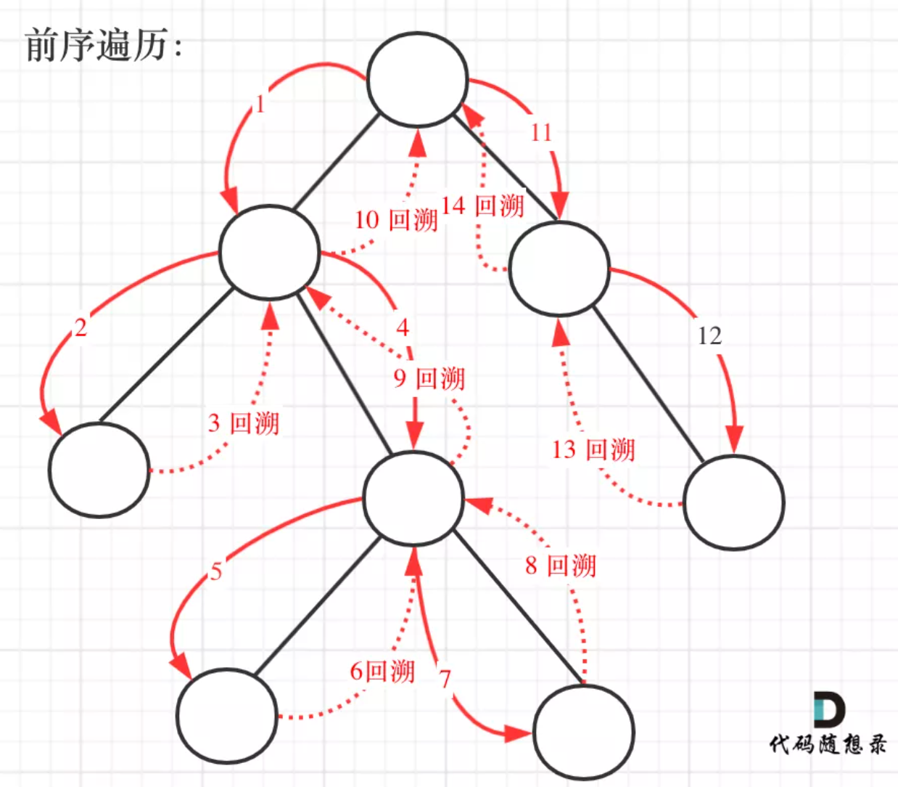

#### [对称二叉树](https://leetcode-cn.com/problems/symmetric-tree/)

+ 根据题目的描述，镜像对称，就是左右两边相等，也就是左子树和右子树是相等的。也就是说要递归的比较左子树和右子树。

+ 将根节点的左子树记做 left，右子树记做 right。比较 left 是否等于 right，不等的话直接返回就可以了。如果相等，比较 left 的左节点和 right 的右节点，再比较 left 的右节点和 right 的左节点。

+ 根据上面信息可以总结出递归函数的两个条件：

  + 终止条件：
  + left 和 right 不等，或者 left 和 right 都为空
  + 递归的比较 ltree->left 和 rtree->right，递归比较 ltree->right 和 rtree->left

  ```c++
  bool isMirror(TreeNode* left, TreeNode* right) {
      if(left == nullptr && right != nullptr)//先判断空节点的情况
          return false;
      else if(left != nullptr && right == nullptr)
          return false;
      else if(left == nullptr && right == nullptr)
          return true;
      else if(left->val != right->val)//再排除数值不相同的情况
          return false; 
      bool compareoutside = isMirror(left->left, right->right);
      bool compareinside = isMirror(left->right, right->left);
      return compareinside && compareoutside;
  }
  bool isSymmetric(TreeNode* root) {
      if(!root) return true;
      return isMirror(root->left, root->right);
  }
  ```


改用队列来实现，思路如下：

+ 引入一个队列进行操作，初始化把根节点入队两次。每次提取两个结点并比较它们的值（队列中每两个连续的结点应该是相等的，而且它们的子树互为镜像），然后将两个结点的左右子结点按相反的顺序插入队列中。当队列为空时，或者检测到树不对称（即从队列中取出两个不相等的连续结点）时，该算法结束。

```c++
bool isSymmetric(TreeNode* root) {
    queue<TreeNode*> queue;
    queue.push(root->left);// 将左子树头结点加入队列
    queue.push(root->right);// 将右子树头结点加入队列
    while(!queue.empty()) {// 接下来就要判断这这两个树是否相互翻转
        TreeNode* ltree = queue.front();
        queue.pop();
        TreeNode* rtree = queue.front();
        queue.pop();
        if(ltree==nullptr && rtree==nullptr) // 左节点为空、右节点为空，此时说明是对称的,进行下一轮
            continue;
        if(ltree==nullptr || rtree==nullptr)
            return false;
        if(ltree->val != rtree->val)
            return false;
        queue.push(ltree->left);// 加入左节点左孩子
        queue.push(rtree->right);// 加入右节点右孩子	
        queue.push(ltree->right);// 加入左节点右孩子
        queue.push(rtree->left);// 加入右节点左孩子
    }
    return true;}   
```

#### [二叉树的最大深度](https://leetcode-cn.com/problems/maximum-depth-of-binary-tree/)

##### 递归

+ 确定递归函数的参数和返回值：参数就是传入树的根节点，返回就返回这棵树的深度，所以返回值为int类型。

+ 确定终止条件：如果为空节点的话，就返回0，表示高度为0。

+ 确定单层递归的逻辑：先求它的左子树的深度，再求的右子树的深度，最后取左右深度最大的数值 再+1 （加1是因为算上当前中间节点）就是目前节点为根节点的树的深度。

+ 实现：

  ```c++
  int getDepth(TreeNode* node) {
      if (node == NULL) return 0;
      int leftDepth = getDepth(node->left);       // 左
      int rightDepth = getDepth(node->right);     // 右
      int depth = 1 + max(leftDepth, rightDepth); // 中
      return depth;
  }
  int maxDepth(TreeNode* root) {
      return getDepth(root);
  }
  ```

##### 迭代

+ 利用层次遍历的方法：

+ 实现

  ```c++
  int maxDepth(TreeNode* root) {
      if(!root) return 0;
      queue<TreeNode*> queue;
      queue.push(root);
      int count = 0;
      while(!queue.empty()) {
          int size = queue.size();
          for(int i = 0; i < size; ++i) {
              TreeNode* node = queue.front();
              queue.pop();
              if(node->left)
                  queue.push(node->left);
              if(node->right)
                  queue.push(node->right);
          }
          ++ count;
      }
      return count;
  }
  ```


#### [二叉树的最小深度](https://leetcode-cn.com/problems/minimum-depth-of-binary-tree/)

> 注意事项：**「最小深度是从根节点到最近叶子节点的最短路径上的节点数量。」**，注意是 **「叶子节点」** 。什么是叶子节点，左右孩子都为空的节点才是叶子节点！

+ 参数为要传入的二叉树根节点，返回的是int类型的深度。
+ 终止条件也是遇到空节点返回0，表示当前节点的高度为0。
+ 这块和求最大深度不一样
  + 如果左子树为空，右子树不为空，说明最小深度是 1 + 右子树的深度。
  + 反之，右子树为空，左子树不为空，最小深度是 1 + 左子树的深度。
  + 最后如果左右子树都不为空，返回左右子树深度最小值 + 1 。

```c++
int getDepth(TreeNode* node) {
    if(node == nullptr) return 0;
    int leftDepth = getDepth(node->left);    // 左
    int rightDepth = getDepth(node->right);  // 右
    if(node->left == nullptr && node->right != nullptr)// 当一个左子树为空，右不为空，这时并不是最低点
        return 1 + rightDepth;
    if(node->left != nullptr && node->right == nullptr)// 当一个右子树为空，左不为空，这时并不是最低点
        return 1 + leftDepth;
    return 1 + min(leftDepth, rightDepth);
}
int minDepth(TreeNode* root) {
    return getDepth(root);
}
```

+ 使用层序遍历的方式来解决，思路是一样的。

+ **需要注意的是，只有当左右孩子都为空的时候，才说明遍历的最低点了。如果其中一个孩子为空则不是最低点**

  ```c++
  int minDepth(TreeNode* root) {
      if(root == nullptr) return 0;
      queue<TreeNode*> queue;
      queue.push(root);
      int depth = 0;
      int flag = 1;
      while(!queue.empty() && flag) {
          int size = queue.size();
          for(int i = 0; i < size; i++) {
              TreeNode* node = queue.front();
              queue.pop();
            	//左右子树都为空，则已经到达最底层
              if(node->left == nullptr && node->right == nullptr) {
                  flag = 0;
                  break;
              }
              if(node->left)
                  queue.push(node->left);
              if(node->right)
                  queue.push(node->right);
          }
          ++ depth;
      }
      return depth;
  }
  ```


#### [完全二叉树的节点个数](https://leetcode-cn.com/problems/count-complete-tree-nodes/)

> 求二叉树的结点个数

##### 递归

+ 确定递归函数的参数和返回值：参数就是传入树的根节点，返回就返回以该节点为根节点二叉树的节点数量，所以返回值为int类型。

+ 确定终止条件：如果为空节点的话，就返回0，表示节点数为0。

+ 确定单层递归的逻辑：先求它的左子树的节点数量，再求的右子树的节点数量，最后取总和再加一 （加1是因为算上当前中间节点）就是目前节点为根节点的节点数量。

+ 实现

  ```c++
  int TreeNodes(TreeNode* node) {
      if(node == nullptr)
          return 0;
      int leftNodes = TreeNodes(node->left);
      int rightNodes = TreeNodes(node->right);
      return 1 + leftNodes + rightNodes; 
  }
  int countNodes(TreeNode* root) {
      return TreeNodes(root);
  }
  ```

##### 迭代

+ 根据层序遍历，加一个变量result，统计节点数量就可以了

+ 实现：

  ```c++
  int countNodes(TreeNode* root) {
      if(root == nullptr) return 0;
      queue<TreeNode*> queue;
      queue.push(root);
      int count = 0;
      while(!queue.empty()) {
          int size = queue.size();
          for(int i = 0; i < size; ++i) {
              TreeNode* node = queue.front();
              queue.pop();
              ++count;
              if(node->left)
                  queue.push(node->left);
              if(node->right)
                  queue.push(node->right);
          }
      }
      return count;
  }
  ```

#### 平衡二叉树

> 给定一个二叉树，判断它是否是高度平衡的二叉树。

+ 明确递归函数的参数和返回值

  > 参数的话为传入的节点指针，就没有其他参数需要传递了，返回值要返回传入节点为根节点树的深度。
  >
  > 那么如何标记左右子树是否差值大于1呢。
  >
  > 如果当前传入节点为根节点的二叉树已经不是二叉平衡树了，还返回高度的话就没有意义了。
  >
  > 所以如果已经不是二叉平衡树了，可以返回-1 来标记已经不符合平衡树的规则了。

+ 明确终止条件：递归的过程中依然是遇到空节点了为终止，返回0，表示当前节点为根节点的高度为0

+ 明确单层递归的逻辑：

  > 如何判断当前传入节点为根节点的二叉树是否是平衡二叉树呢，当然是左子树高度和右子树高度相差。
  >
  > 分别求出左右子树的高度，然后如果差值小于等于1，则返回当前二叉树的高度，否则则返回-1，表示已经不是二叉树了。

+ 实现

  ```c++
  // -1 表示已经不是平衡二叉树了，否则返回值是以该节点为根节点树的高度
  int getDepth(TreeNode* node) {
      if(node == nullptr)
          return 0;
      int leftNodes = getDepth(node->left);   // 左
      if(leftNodes == -1)
          return -1;
      int rightNodes = getDepth(node->right); // 右
      if(rightNodes == -1)    
          return -1;
  
      int result;
      if(abs(leftNodes - rightNodes) > 1)      // 中
          result = -1;
      else
          // 以当前节点为根节点的最大高度
          result = 1 + max(leftNodes , rightNodes);
      return result;
  }
  bool isBalanced(TreeNode* root) {
      return getDepth(root) == -1 ? false : true;
  }
  ```


#### 二叉树所有路径

+ 思路：

  + 题目要求从根节点到叶子的路径，所以需要前序遍历，这样才方便让父节点指向孩子节点，找到对应的路径。
  + 题目将涉及到回溯，要把路径记录下来，需要回溯来回退一一个路径在进入另一个路径。
  + 前序遍历以及回溯的过程如图：

  <div align = "center"></div>

+ **递归函数函数参数以及返回值:**

  > 要传入根节点，记录每一条路径的path，和存放结果集的result，这里递归不需要返回值，代码如下：
  >
  > ```c++
  > void traversal(TreeNode* cur, vector<int>& path, vector<string>& result) 
  > ```

+ **确定递归终止条件:**

  > 本题要找到叶子节点，就开始结束的处理逻辑了（把路径放进result里）。
  >
  > + 这里使用vector结构path来记录路径，所以要把vector结构的path转为string格式，在把这个string 放进 result里。
  >
  > + **「那么为什么使用了vector结构来记录路径呢？」**  因为在下面处理单层递归逻辑的时候，要做回溯，使用vector方便来做回溯。
  >
  > + 终止条件：
  >
  >   ```c++
  >   if (cur->left == NULL && cur->right == NULL) {    
  >     终止处理逻辑
  >   }
  >   ```

+ **确定单层递归逻辑：**

  > + 因为是前序遍历，需要先处理中间节点，中间节点就是我们要记录路径上的节点，先放进path中：`path.push_back(cur->val);`。
  >
  > + 然后是递归和回溯的过程，上面说过没有判断cur是否为空，那么在这里递归的时候，如果为空就不进行下一层递归了。
  >
  > + 所以递归前要加上判断语句，下面要递归的节点是否为空，如下：
  >
  >   ```c++
  >   if (cur->left)     
  >     	traversal(cur->left, path, result);
  >   if (cur->right)    
  >     	traversal(cur->right, path, result);
  >   ```
  >
  > + 递归完，要做回溯，因为path 不能一直加入节点，它还要删节点，然后才能加入新的节点。
  >
  > + **<font color = Oxffffff>「回溯和递归是一一对应的，有一个递归，就要有一个回溯」</font>**，这么写的话相当于把递归和回溯拆开了， 一个在花括号里，一个在花括号外。 **<font color = Oxffffff>「所以回溯要和递归永远在一起，世界上最遥远的距离是你在花括号里，而我在花括号外！」</font>**
  >
  >   ```c++
  >   if (cur->left) {    
  >     	traversal(cur->left, path, result);    
  >     	path.pop_back(); 
  >     // 回溯
  >   }if (cur->right) {    
  >     	traversal(cur->right, path, result);    
  >     	path.pop_back(); // 回溯
  >   }
  >   ```

+ 代码实现：

  ```c++
  void traversal(TreeNode* root, vector<int>&path, vector<string>& res) {
      path.push_back(root->val);
      //结束条件
      if(root->left == nullptr && root->right == nullptr) {
          string rootpath;
          for(int i = 0; i < path.size()-1; ++i) {
              rootpath += to_string(path[i]);
              rootpath += "->";
          }
          rootpath += to_string(path[path.size() - 1]);
          res.push_back(rootpath);
          return;
      }
      if(root->left) {
          traversal(root->left, path, res);
          path.pop_back();    // 回溯
      }
      if(root->right) {
          traversal(root->right, path, res);
          path.pop_back();    // 回溯
      }
  }
  vector<string> binaryTreePaths(TreeNode* root) {
      vector<string> res;
      vector<int> path;
      if(root == nullptr)
          return res;
      traversal(root, path, res);
      return res;
  }
  ```


#### 左叶子之和

+ **思路：**

  + **首先要注意是判断左叶子，不是二叉树左侧节点，所以不要上来想着层序遍历**

  + 左叶子的明确定义：**「如果左节点不为空，且左节点没有左右孩子，那么这个节点就是左叶子」**

    <div align = center></div>

    > 上图中左叶子结点之和为0

  + 所以， **「判断当前节点是不是左叶子是无法判断的，必须要通过节点的父节点来判断其左孩子是不是左叶子。」**

  + **如果该节点的左节点不为空，该节点的左节点的左节点为空，该节点的左节点的右节点为空，** 则找到了一个左叶子，判断代码如下：

    ```c++
    if (node->left != NULL && node->left->left == NULL && node->left->right == NULL)  
      //左叶子节点处理逻辑
    ```
  
+ **递归三部曲：**

  + **确定递归函数的参数和返回值**

    > 判断一个树的左叶子节点之和，那么一定要传入树的根节点，递归函数的返回值为数值之和，所以为int

  + **确定终止条件**

    > 依然是：`if (root == NULL) return 0;`

  + **确定单层递归条件**

    > 当遇到左叶子节点的时候，记录数值，然后通过递归求取左子树左叶子之和，和 右子树左叶子之和，相加便是整个树的左叶子之和。

    ```c++
    int leftValue = sumOfLeftLeaves(root->left);    // 左
    int rightValue = sumOfLeftLeaves(root->right);  // 右                                                
    int midValue = 0;
    if (root->left && !root->left->left && !root->left->right)  
    		midValue = root->left->val;
    int sum = midValue + leftValue + rightValue;
    return sum;
    ```
  
+ **实现代码：**

  ```c++
  int sumOfLeftLeaves(TreeNode* root) {
      if(root == nullptr) return 0;
      int leftLeaves = sumOfLeftLeaves(root->left);
      int rightLeaves = sumOfLeftLeaves(root->right);
      int minLeaves = 0;
      if(root->left != nullptr && root->left->left == nullptr && root->left->right == nullptr)
          minLeaves = root->left->val;
      int sum = leftLeaves + rightLeaves + minLeaves
      return sum;
  }
  ```


#### 找树左下角的值

+ **思路：**

  + 找出树的最后一行找到最左边的值。利用层序遍历是非常简单的了，反而用递归的话会比较难一点。

##### 递归方法

+ **思路：**

  + 使用递归法，判断最后一行，其实就是深度最大的叶子节点一定是最后一行。
  + 找最左边的节点，可以使用前序遍历，这样才先优先左边搜索，然后记录深度最大的叶子节点，此时就是树的最后一行最左边的值。

+ **递归三部曲：**

  + **确定递归函数的参数和返回值**

    + 参数必须有要遍历的树的根节点，还有就是一个int型的变量用来记录最长深度。这里就不需要返回值了，所以递归函数的返回类型为void。
    + 本题还需要类里的两个全局变量，maxLen用来记录最大深度，maxleftValue记录最大深度最左节点的数值。

    ```c++
    int maxLen = INT_MIN;   // 全局变量 记录最大深度
    int maxleftValue;       // 全局变量 最大深度最左节点的数值
    void traversal(TreeNode* root, int leftLen)
    ```

  + **确定终止条件**

    + 当遇到叶子节点的时候，就需要统计一下最大的深度了，所以需要遇到叶子节点来更新最大深度。

    ```c++
    if (root->left == NULL && root->right == NULL) {
        if (leftLen > maxLen) {
            maxLen = leftLen;           // 更新最大深度
            maxleftValue = root->val;   // 最大深度最左面的数值 
        }
        return;
    }
    ```

  + **确定单层递归的逻辑**

    + 在找最大深度的时候，递归的过程中依然要使用回溯，代码如下：

    ```c++
    if (root->left) {   // 左
        leftLen++; // 深度加一     
        traversal(root->left, leftLen);
        leftLen--; // 回溯，深度减一
    }
    if (root->right) { // 右
        leftLen++; // 深度加一
        traversal(root->right, leftLen);
        leftLen--; // 回溯，深度减一
    }
    return;
    ```


+ **实现代码：**

  ```c++
  int maxLen = INT_MIN;
  int maxleftValue;
  
  void traversal(TreeNode* node, int leftLen) {
      if(node->left == nullptr && node->right == nullptr) {
          if(leftLen > maxLen) {
              maxLen = leftLen;
              maxleftValue = node->val;
          }
          return; 
      }
      if(node->left) {
          leftLen++;
          traversal(node->left, leftLen);
          leftLen--;
      } 
      if(node->right) {
          leftLen++;
          traversal(node->right, leftLen);
          leftLen--;
      }
      return ;
  }
  int findBottomLeftValue(TreeNode* root) {
      traversal(root, 0);
      return maxleftValue;
  }
  ```

+ 递归时是否需要返回值的技巧： **「如果需要遍历整颗树，递归函数就不能有返回值。如果需要遍历某一条固定路线，递归函数就一定要有返回值！」**

##### 层序遍历方法

+ **思路：**

  + 利用层序遍历，只需要记录最后一行第一个节点的数值就可以了。

+ **实现代码：**

  ```c++
  int findBottomLeftValue(TreeNode* root) {
      queue<TreeNode*> que;
      if (root != NULL) ]
        	que.push(root);
      int result = 0;
      while (!que.empty()) {
          int size = que.size();
          for (int i = 0; i < size; i++) {
              TreeNode* node = que.front();
              que.pop();
              if (i == 0) result = node->val; // 记录最后一行第一个元素
              if (node->left) que.push(node->left);
              if (node->right) que.push(node->right);
          }å
      }
      return result;
  }
  ```

#### 树的递归总结

+ **有关递归的返回值问题：**

  + **「如果需要搜索整颗二叉树，那么递归函数就不要返回值，如果要搜索其中一条符合条件的路径，递归函数就需要返回值，因为遇到符合条件的路径了就要及时返回。」**

  + 第19题中遍历整棵树，但还是有返回值。 **是因为回溯的过程需要递归函数的返回值做判断，但本题我们依然要遍历树的所有节点。**

+ **如果递归函数有返回值，如何区分要搜索一条边，还是搜索整个树呢？**

  + 搜索一条边的写法：

    ```c++
    if (递归函数(root->left)) return ;
    if (递归函数(root->right)) return ;
    ```
  
    搜索整个树写法：
  
    ```c++
    left = 递归函数(root->left);
    right = 递归函数(root->right);left与right的逻辑处理;
    ```

  + **在递归函数有返回值的情况下：**
  
    + **「 如果要搜索一条边，递归函数返回值不为空的时候，立刻返回**
    + **如果搜索整个树，直接用一个变量left、right接住返回值，这个left、right后序还有逻辑处理的需要，也就是后序遍历中处理中间节点的逻辑（也是回溯）」**。

