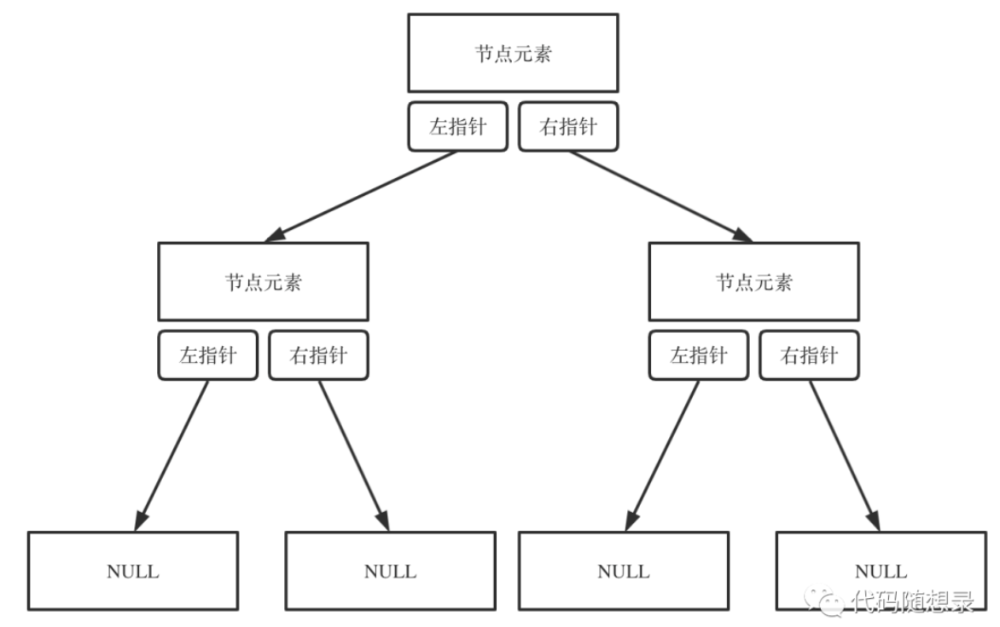

### 一.二叉树的种类

#### 1.满二叉树

如果一棵二叉树只有度为0的结点和度为2的结点，并且度为0的结点在同一层上，则这棵二叉树为满二叉树。

#### 2.完全二叉树

完全二叉树：在完全二叉树中，除了最底层节点可能没填满外，其余每层节点数都达到最大值，并且最下面一层的节点都集中在该层最左边的若干位置。若最底层为第 h 层，则该层包含 1~ 2h 个节点。

<div align="center">
    
</div>

#### 3.二叉搜索树

前面介绍的书，都没有数值的，而二叉搜索树是有数值的了，**「二叉搜索树是一个有序树」**。

- 若它的左子树不空，则左子树上所有结点的值均小于它的根结点的值；
- 若它的右子树不空，则右子树上所有结点的值均大于它的根结点的值；
- 它的左、右子树也分别为二叉排序树

下面这两棵树都是搜索树

<div align="center">
    
</div>

#### 4.平衡二叉搜索树

**简介**

平衡二叉搜索树：又被称为AVL（Adelson-Velsky and Landis）树，且具有以下性质：它是一棵空树或它的左右两个子树的高度差的绝对值不超过1，并且左右两个子树都是一棵平衡二叉树。

和红黑树相比，AVL树是**严格的平衡二叉树**，平衡条件必须满足（**所有节点的左右子树高度差的绝对值不超过1**）。不管我们是执行插入还是删除操作，只要不满足上面的条件，就要通过旋转来保持平衡，而旋转是非常**耗时**的，由此我们可以知道 **<font color = red>AVL树适合用于插入与删除次数比较少，但查找多的情况</font>**

**局限性**

由于维护这种高度平衡所付出的代价比从中获得的效率收益还大，故而实际的应用不多，更多的地方是用追求局部而不是非常严格整体平衡的红黑树。当然， **如果应用场景中对插入删除不频繁，只是对查找要求较高，那么AVL还是较优于红黑树。**

**应用**

**Windows NT内核中广泛存在**

#### 5.红黑树

##### 简介

R-B Tree，全称是Red-Black Tree，又称为“红黑树”，它一种特殊的二叉查找树。红黑树的每个节点上都有存储位表示节点的颜色，可以是红(Red)或黑(Black)。

##### 特性

**（1）每个节点或者是黑色，或者是红色。**
**（2）根节点是黑色。**
**（3）每个叶子节点（NIL）是黑色。 [注意：这里叶子节点，是指为空(NIL或NULL)的叶子节点！]**
**（4）如果一个节点是红色的，则它的子节点必须是黑色的。**
**（5）从一个节点到该节点的子孙节点的所有路径上包含相同数目的黑节点。**

**注意**：
(01) 特性(3)中的叶子节点，是只为空(NIL或null)的节点。
(02) 特性(5)，确保没有一条路径会比其他路径长出俩倍。因而，红黑树是相对是接**衡的二叉树。

<div align="center"> </div>

#### 应用

+ 广泛用于C ++的STL中，地图和集都是用红黑树实现的;

+ 著名的Linux的的进程调度完全公平调度程序，用红黑树管理进程控制块，进程的虚拟内存区域都存储在一颗红黑树上，每个虚拟地址区域都对应红黑树的一个节点，左指针指向相邻的地址虚拟存储区域，右指针指向相邻的高地址虚拟地址空间;

+ IO多路复用的epoll的的的实现采用红黑树组织管理的的的sockfd，以支持快速的增删改查;

+ Nginx的的的中用红黑树管理定时器，因为红黑树是有序的，可以很快的得到距离当前最小的定时器;


### 二.二叉树的创建与操作

#### 1.二叉树的存储方式

二叉树可以链式存储，也可以顺序存储。链式存储方式就用指针， 顺序存储的方式就是用数组。顾名思义就是顺序存储的元素在内存是连续分布的，而链式存储则是通过指针把分布在散落在各个地址的节点串联一起。

链式存储如下图所示：

<div align="center"></div>

#### 2.创建二叉树

二叉树类结构：

```c++
class TreeNode {
public:
  	//只有结点元素与左右子树的指针
    int val;
    TreeNode *left;
    TreeNode *right;
    TreeNode() : val(0), left(nullptr), right(nullptr) {}
    TreeNode(char value) : val(value), left(nullptr), right(nullptr) {}
    TreeNode(char value, TreeNode* left, TreeNode* right) : val(value), left(left), right(right) {}
};
```

目前只是通过先序遍历的方式来创建二叉树

```c++
TreeNode* CreatTree(){
    TreeNode *root;
    int value;
    std::cin>>value;
    if(value == 0)					//当输入的结点元素为0时认为为空
        return nullptr;
    root = new TreeNode();	//创建新结点进行存储
    root->val = value;
    root->left = CreatTree();//递归进行创建
    root->right = CreatTree();
    return root;
}
```

#### 3.二叉树的遍历方式

二叉树主要有两种遍历方式：

1. 深度优先遍历：先往深走，遇到叶子节点再往回走。
2. 广度优先遍历：一层一层的去遍历。

从深度优先遍历和广度优先遍历进一步拓展，才有如下遍历方式：

- 深度优先遍历

  - 前序遍历（递归法，迭代法）
  - 中序遍历（递归法，迭代法）
  - 后序遍历（递归法，迭代法）

  > **这里前中后，其实指的就是中间节点的遍历顺序**

  <div align="center"></div>

- 广度优先遍历

  - 层次遍历（迭代法）

##### 前序遍历

前序遍历是中左右，每次先处理的是中间节点，那么先将跟节点放入栈中，然后将右孩子加入栈，再加入左孩子。

<div align = "center">  </div>

+ 递归实现：

  ```c++
  void PreOrderTraversal(TreeNode* root) {
      if(root != nullptr) {
          std::cout << (root->val) << " ";
          PreOrderTraversal(root->left);
          PreOrderTraversal(root->right);
      }
  }
  ```


+ 迭代实现：

  ```c++
  void PreOrderTraversal2(TreeNode* root)  {
      if(!root) return;
      std::stack<TreeNode*> stack;
      TreeNode* node = root;
      //栈为空且结点为空时结束遍历
      while((!stack.empty()) || (node != nullptr)) {
          while(node != nullptr) {
              std::cout << node->val << " ";
              stack.emplace(node);
              node = node->left; //左结点压栈
          }
          node = stack.top();//出栈
          stack.pop();
          node = node->right; //遍历右结点
      }
  }
  ```

+ 方法二

  + 前序遍历是中左右，每次先处理的是中间节点，那么先将跟节点放入栈中，然后将右孩子加入栈，再加入左孩子。

  ```c++
  void preorderTraversal(TreeNode* root) {
      stack<TreeNode*> st;
      st.push(root);
      while (!st.empty()) {
          TreeNode* node = st.top();                      // 中
          st.pop();
          if (node != NULL) 
            	std::cout << node->val << " ";
          else 
            	continue;
          st.push(node->right);                           // 右
          st.push(node->left);                            // 左
      }
  }
  ```


##### 中序遍历

中序遍历是左中右，先访问的是二叉树顶部的节点，然后一层一层向下访问，直到到达树左面的最底部，再开始处理节点（也就是在把节点的数值放进result数组中），这就造成了**「处理顺序和访问顺序是不一致的。」**

<div align = "center">  </div>

+ 递归实现

  ```c++
  void InOrderTraversal(TreeNode* root) {
      if(root != nullptr) {
          InOrderTraversal(root->left);
          std::cout << (root->val) << " ";
          InOrderTraversal(root->right);
      }
  }
  ```

+ 迭代实现（通过先序遍历方法一就行修改）

  ```c++
  void InOrderTraversal2(TreeNode* root) {
      if(!root) return;
      std::stack<TreeNode*> stack;
      TreeNode* node = root;
      while (!stack.empty() || node != nullptr) {
          while (node != nullptr) {
              stack.emplace(node);
              node = node->left;
          }
          std::cout << (stack.top())->val << " ";
          node =  stack.top();
          stack.pop();
          node = node->right;
      }
  }
  ```

##### 后序遍历

按照访问左子树——右子树——根节点的方式遍历这棵树，而在访问左子树或者右子树的时候，我们按照同样的方式遍历，直到遍历完整棵树。

<div align = "center"> </div>

+ 递归实现：

  ```c++
  void PostOrderTraversal(TreeNode* root) {
      if(root != nullptr) {
          PostOrderTraversal(root->left);
          PostOrderTraversal(root->right);
          std::cout << (root->val) << " ";
      }
  }
  ```

+ 迭代实现

  ```c++
  void postorderTraversal(TreeNode* root) {
      stack<TreeNode*> st;
      st.push(root);
      while (!st.empty()) {
          TreeNode* node = st.top();
          st.pop();
          if (node != NULL) 
            	TreeNode* node = st.top();
          else 
            continue;
          st.push(node->left); // 相对于前序遍历，这更改一下入栈顺序
          st.push(node->right);
      }
  }
  ```

##### 层序遍历

层序遍历一个二叉树。就是从左到右一层一层的去遍历二叉树。

需要借用一个辅助数据结构即队列来实现，**「队列先进先出，符合一层一层遍历的逻辑，而是用栈先进后出适合模拟深度优先遍历也就是递归的逻辑。」**

<div align = "center"></div>

+ 实现：

  ```c++
  vector<vector<int>> levelOrder(TreeNode* root) {
      vector<vector<int>> result {};    
      if(!root) return result;    
      queue<TreeNode*> queue;    
      queue.push(root);        
      while(!queue.empty()) {
          int size = queue.size();
          vector<int> res;
          for(int i = 0; i < size; ++i) {
              TreeNode* node = queue.front();
              queue.pop();
              res.push_back(node->val);
              if(node->left)
                	queue.push(node->left);
              if(node->right)
                	queue.push(node->right);
          }            
          result.push_back(res);      
      }      
      return result;
  }
  ```
