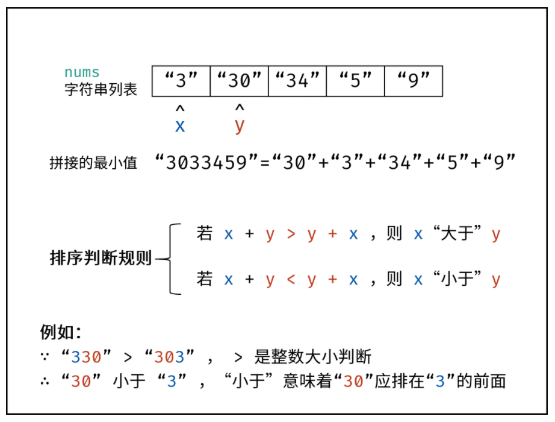

字符串的主要解决问题方法有：

:one: 双指针

:two: 滑动窗口

:three: KMP算法

## 一.双指针

分析见：[双指针]()

#### [541. 反转字符串 II](https://leetcode-cn.com/problems/reverse-string-ii/)

> 给定一个字符串 s 和一个整数 k，你需要对从字符串开头算起的每隔 2k 个字符的前 k 个字符进行反转。
>
> + 如果剩余字符少于 k 个，则将剩余字符全部反转。
> + 如果剩余字符小于 2k 但大于或等于 k 个，则反转前 k 个字符，其余字符保持原样。

:one: 遍历字符串的过程中，只要让 `i += (2 * k)` ，i  每次移动 2 * k 就可以了，然后判断是否需要有反转的区间。

:two: 如果 `i + k <= s.size()` ，则将 `[i, i + k - 1]` 范围的字符串进行反转

:three: 最后反转 `[i, s.size() - 1]` 范围的字符串

```c++
void reverse(string& s, int left, int right) {
    while(left <= right ) {
        swap(s[left], s[right]);
        ++ left;  -- right;
    }
}
string reverseStr(string s, int k) {
        for (int i = 0; i < s.size(); i += (2 * k)) {
        // 1. 每隔 2k 个字符的前 k 个字符进行反转
        // 2. 剩余字符小于 2k 但大于或等于 k 个，则反转前 k 个字符
        if (i + k <= s.size()) {
            reverse(s, i, i + k - 1);
            continue;
        }
        // 3. 剩余字符少于 k 个，则将剩余字符全部反转。
        reverse(s, i, s.size() - 1);
    }    
    return s;
}
```

#### [剑指 Offer 58 - II. 左旋转字符串](https://leetcode-cn.com/problems/zuo-xuan-zhuan-zi-fu-chuan-lcof/)

> 字符串的左旋转操作是把字符串前面的若干个字符转移到字符串的尾部。请定义一个函数实现字符串左旋转操作的功能。比如，输入字符串"abcdefg"和数字2，该函数将返回左旋转两位得到的结果"cdefgab"。

:one: 反转区间为前n的子串

:two: 反转区间为n到末尾的子串

:three: 反转这个字符串

<div align = center></div>

---

## 二.滑动窗口

分析见：[滑动窗口]()

---


## 三.KMP算法

### 1.暴力匹配

以往匹配字符串的方法都是暴力匹配，模拟 Brute-Force 算法，对主串 “AAAAAABC” 和模式串 “AAAB” 做匹配：

<div align = center></div>

考虑“字符串比较”这个小任务的复杂度。最坏情况发生在：两个字符串唯一的差别在最后一个字符。这种情况下，字符串比较必须走完整个字符串，才能给出结果，因此复杂度是 O(len) 的。　

由此，不难想到 Brute-Force 算法所面对的最坏情况： Brute-Force 的复杂度是 O(|P| * |S|) ，也就是 O(nm)的。这太慢了！

### 2.优化线索

从图中可以看出：

+ P(a) != P(b) 且 P(b) == S(b) 

+ 所以 P(a) != S(b) ，所以右移一位的意义不大

所以要思考的就是右移几位，使得效率更高

### 3.优化规律

<div align = center></div>

:one: 匹配失败时右移位数 **与子串本身有关** ，与目标串无关

:two:  **移动位数 = 已匹配的字符串数 - 对应的部分匹配值**

:three:  任意子串都存在一个 **唯一的部分匹配表**

部分匹配表示例：

<div align = center></div>

可以看出：

+ 子串第七位匹配失败——> 前六位匹配成功
+ 差PMT表，PMT[6] = 2
+ 右移位数： 已匹配的字符串数  - PMT[6] = 6 - 2 = 4

### 4.部分匹配表的求解

:large_orange_diamond: 前缀

+ 除最后一个字符以外，一个字符串的全部头部组合

:large_orange_diamond: 后缀

+ 除第一个字符以外，一个字符串的全部尾部组合

:large_blue_diamond: 部分匹配值

+ 前缀和后缀最长共有元素的长度

<div align = center></div>


### 5.部分匹配表实现关键

:one: PMT[1] = 0

:two: 从第2个字符开始递推

:three: 假设PMT[n] = PMT[n - 1] + 1 (最长共有元素的长度)

:four: 当假设不成立，PMT[n] 在 PMT[n-1] 的基础上减

:large_blue_diamond: **代码实现：**

```c++
std::vector<int> PMT(std::string p) {
  	//创建pmt表
    std::vector<int> pmt (p.size(), 0);
    int ll = 0;
    
    for(int i = 1; i < p.size(); ++i) {
        //非理想情况下
        while (ll > 0 && p[ll] != p[i]) 
            ll = pmt[ll - 1];
        
        //理想情况下：直接在前一个共有元素长度上 + 1
        if(p[ll] == p[i]) 
            ++ll;
        
        //部分匹配表存储对应长度
        pmt[i] = ll;
    }
    return pmt;
}
```

### 6.KMP算法实现

<div align = center></div>

<div align = center>在下标 j 处匹配失败 ——> 前 j 位匹配成功 ——> 查表 PMT[j-1] ——> 右移位数= j - PMT[j-1]</div>

:one: 因为 s[i] != p[j]

:two: 所以，查表， LL = PMT[j - 1]

:three: 右移， i 值不变， j 值改变， j = j - (j - LL) = LL = PMT[j - 1]

:large_blue_diamond: **代码实现**

```c++
int KMP(const std::string& s, const std::string& p) {
    int ret = -1;
    int s_len = s.size();
    int p_len = p.size();
  
    //求出子串的部分匹配表
    std::vector<int> pmt = PMT(p);
  
    //子串长度>0 且 子串长度小于目标串,这样才有查找的意义
    if(0 < p_len && p_len <= s_len) {
        //i 遍历 s, j 遍历 p
        for(int i = 0, j = 0; i < s_len; ++i) {
          
            while(j > 0 && s[i] != p[j])//2.比对不成功
                j = pmt[j - 1]; //j的位置进行改变
            
            if(s[i] == p[j])//1.如果比对成功
                ++j;

            if(j == p_len) //结束比对的条件 
            {
              	ret = i - p_len + 1;//成功查找的位置
              	break;
            }
                
        }
    }
    return ret;
}
```

:diamond_shape_with_a_dot_inside: 算法复杂度 O(p_len + s_len).


## 四.典型例题分析

#### [剑指 Offer 58 - I. 翻转单词顺序](https://leetcode-cn.com/problems/fan-zhuan-dan-ci-shun-xu-lcof/)

> 输入一个英文句子，翻转句子中单词的顺序，但单词内字符的顺序不变。为简单起见，标点符号和普通字母一样处理。例如输入字符串"I am a student. "，则输出"student. a am I"。

+ 首先取出多余的空格
+ 其次整体进行反转
+ 最后单个单词进行反转

```c++
string reverseWords(string s) {
    for (int i = s.size() - 1; i > 0; i--) {
        if (s[i] == s[i - 1] && s[i] == ' ') {
            s.erase(s.begin() + i);
        }
    }
    // 删除字符串最后面的空格
    if (s.size() > 0 && s[s.size() - 1] == ' ') {
        s.erase(s.begin() + s.size() - 1);
    }
    // 删除字符串最前面的空格
    if (s.size() > 0 && s[0] == ' ') {
        s.erase(s.begin());
    }
    //2.反转字符串
    reverse(s.begin(), s.end());
    //3.单个单词进行反转
    int j = 0;
    int i;
    for(i = 0; i < s.size(); ++i) {
        if(s[i] == ' ') {
            reverse(s.begin() + j, s.begin() + i);
            j = i + 1;
        }
    }
    reverse(s.begin() + j, s.end());
    return s;
}
```

#### [剑指 Offer 48. 最长不含重复字符的子字符串](https://leetcode-cn.com/problems/zui-chang-bu-han-zhong-fu-zi-fu-de-zi-zi-fu-chuan-lcof/)

> 请从字符串中找出一个最长的不包含重复字符的子字符串，计算该最长子字符串的长度。

+ 哈希表 dic 统计： 指针 j 遍历字符 s ，哈希表统计字符 s[j] 最后一次出现的索引 。

+ 更新左指针 i ： 根据上轮左指针 i 和 dic[s[j]] ，每轮更新左边界 i ，保证区间 [i+1,j] 内无重复字符且最大。

  <div align = center>i = max(dic[s[j]], i)</div>

+ 更新结果 res ： 取上轮 res 和本轮双指针区间 [i+1,j] 的宽度（即 j−i ）中的最大值。

<div align = center>res = max(res, j − i)</div>

```c++
int lengthOfLongestSubstring(string s) {
    unordered_map<char,int> dir;
    int i = -1, res = 0;

    for(int j = 0;j<s.size();++j){
        if(dir.count(s[j])){
            i = max(dir[s[j]],i);
        }
        dir[s[j]]=j ;
        res = max(res, j-i);
    }
    return res;
}
```


#### [剑指 Offer 45. 把数组排成最小的数](https://leetcode-cn.com/problems/ba-shu-zu-pai-cheng-zui-xiao-de-shu-lcof/)

此题求拼接起来的最小数字，本质上是一个排序问题。设数组 nums 中任意两数字的字符串为 xx 和 yy ，则规定 排序判断规则 为：

+ 若拼接字符串 x + y > y + x ，则 x “大于” y ；
+ 反之，若 x + y < y + x ，则 x “小于” y ；

> x “小于” y 代表：排序完成后，数组中 x 应在 y 左边；“大于” 则反之。
>
>  **这个想法很好，利用了字符串比较大小的规则，可以记下来，很容易不经意间遇到。**

根据以上规则，套用任何排序方法对 nums 执行排序即可。

<div align = center></div>

算法流程：

1. 初始化： 字符串列表 str ，保存各数字的字符串格式；
2. 列表排序： 应用以上 “排序判断规则” ，对 str 执行排序；
3. 返回值： 拼接 strs 中的所有字符串，并返回。

```c++
string minNumber(vector<int>& nums) {
    string res;
  	// 字符串列表 str ，保存各数字的字符串格式；
    vector<string> str;
    for(auto i : nums) 
        str.push_back(to_string(i));

  	//应用以上 “排序判断规则” ，对 str 执行排序
    sort(str.begin(), str.end(), 
         [](string &str1, string& str2) 
         { return str1 + str2 < str2 + str1;});

    for(auto i : str)
        res.append(i);
    return res;
}
```

#### [剑指 Offer 67. 把字符串转换成整数](https://leetcode-cn.com/problems/ba-zi-fu-chuan-zhuan-huan-cheng-zheng-shu-lcof/)

>  写一个函数 StrToInt，实现把字符串转换成整数这个功能。不能使用 atoi 或者其他类似的库函数。

+ 首部空格： 删除之即可；
+ 符号位： 三种情况，即 ''+'' , ''−'' , ''无符号" ；新建一个变量保存符号位，返回前判断正负即可。
+ 非数字字符： 遇到首个非数字的字符时，应立即返回。
+ 数字字符：
  + 字符转数字： “此数字的 ASCII 码” 与 “ 0 的 ASCII 码” 相减即可；
  + 数字拼接： 若从左向右遍历数字，设当前位字符为 c ，当前位数字为 x ，数字结果为 res ，则数字拼接公式为：

<div align = center>res=10×res+x </div>
  <div align = center>x=ascii(c)−ascii(′0′)</div>

```c++
int strToInt(string str) {
    int flag = 1;
    int i = 0;
    int len = str.length();
  	
 		//跳过空格 	
    while(str[i] == ' '){
        i++;
    }
  	//如果有不满足要求的字符串，直接返回0
    if(len == i || (!isdigit(str[i]) && str[i] != '+' && str[i] != '-')){
        return 0;
    }
    //处理正负数
    if(str[i] == '-' || str[i] == '+'){  
        if(str[i] == '-'){
            flag = -1;
        }
        i++;   
    }
  	//将字符转换为数字
    long num = 0;
    while(i<len && isdigit(str[i])){
      	//转换为数字
        num = num*10+(str[i]-'0');
        i++;
      	//如果超过最大值，则返回int最大值
        if(num > INT_MAX && flag == 1)
            return INT_MAX;
      	//如果超过最大值，并且是负数，。则返回int最大值
        if(num >INT_MAX && flag == -1)
            return INT_MIN; 
    }
    return num*flag;
}
```

